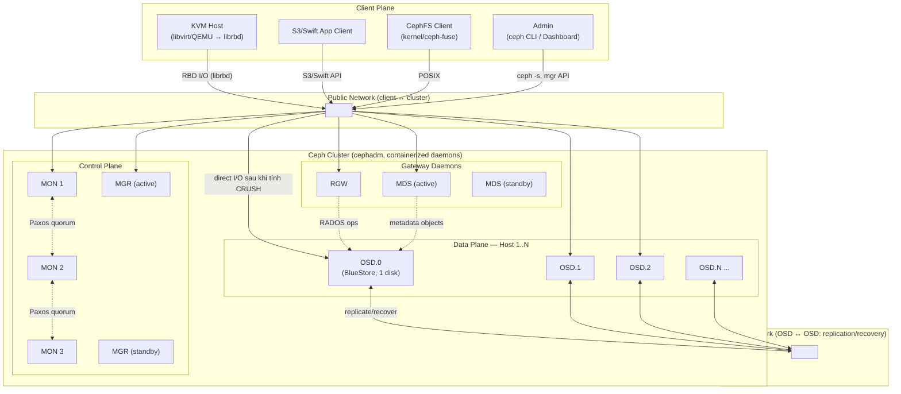

---
tags:
  - cloud
  - ceph
  - storage
  - overview
aliases:
  - Ceph Overview
  - Ceph Index
---

# Ceph

Ceph là **distributed storage system** mã nguồn mở, cung cấp đồng thời cả 3 loại storage — **block (RBD)**, **file (CephFS)**, và **object (RGW/S3)** — từ cùng một cluster nền tảng duy nhất gọi là **RADOS**. Ban đầu là luận án tiến sĩ của Sage Weil (2006), sau này được Red Hat mua lại (2014), hiện phát triển bởi cộng đồng + IBM/Red Hat, và là backend storage phổ biến nhất cho OpenStack lẫn Apache CloudStack ở quy mô production tự vận hành.

> [!tip] Nếu bạn quen VMware vSAN — hãy hình dung thế này
> Ceph **không phải** "vSAN mã nguồn mở". Điểm khác biệt lớn nhất về tư duy: vSAN là một tính năng tích hợp sẵn trong ESXi/vCenter, còn Ceph là **một cluster hoàn toàn độc lập, tách rời khỏi hypervisor** — CloudStack (hay OpenStack, hay bất kỳ ai) chỉ là một **client** kết nối vào Ceph qua giao thức riêng (`librbd`/`librados`), không sở hữu hay quản lý vòng đời của Ceph. Một khác biệt kỹ thuật sâu hơn: vSAN dùng cơ chế tập trung (CLOM/DOM) để theo dõi vị trí từng "component" dữ liệu; Ceph dùng thuật toán **CRUSH** để mỗi client **tự tính toán** vị trí dữ liệu, không cần tra cứu bảng metadata tập trung — đây là lý do Ceph scale tốt nhưng cũng là khái niệm mới nhất cần nắm khi chuyển từ vSAN sang. Xem chi tiết so sánh đầy đủ ở [[Ceph vs VMware vSAN & Alternatives]].

## Bản đồ kiến thức

```mermaid
graph TD
    C[Ceph] --> PRE[Prerequisites]
    C --> CC[Core Components]
    C --> SI[Storage Interfaces]
    C --> DP[Data Protection]
    C --> DEP[Deployment]
    C --> HA[HA & Scalability]
    C --> OPS[Operations]
    C --> SEC[Security]
    C --> INT[Integration]
    C --> CMP[Comparison]

    CC --> RADOS[RADOS & Cluster Architecture]
    CC --> CRUSH[CRUSH Algorithm & CRUSH Map]
    CC --> PG[Placement Groups PG]
    CC --> MON[MON - Monitor]
    CC --> MGR[MGR - Manager]
    CC --> OSD[OSD - Object Storage Daemon]

    SI --> RBD[RBD - Block Storage]
    SI --> CEPHFS[CephFS - File Storage]
    SI --> RGW[RGW - Object Storage Gateway]

    DP --> POOL[Pools, Replication & Erasure Coding]
    DP --> REC[Recovery, Backfill & Self-healing]

    DEP --> DM[Deployment Models]
    DEP --> HW[Hardware & Network Design]
    DEP --> SZ[Sizing & Capacity Planning]

    HA --> HAA[HA Architecture]
    HA --> SCALE[Scaling the Cluster]
    HA --> MS[Multi-site RGW & Stretch Cluster]

    OPS --> CLI[CLI Cheatsheet]
    OPS --> D2[Day 2 Operations]
    OPS --> MONI[Monitoring & Alerting]
    OPS --> TB[Troubleshooting]
    OPS --> UP[Upgrade Procedure]
    OPS --> PERF[Performance Tuning]
    OPS --> KEY[Key Configuration Reference]
    OPS --> LL[Lessons Learned & Common Pitfalls]

    SEC --> SECC[Security Considerations]

    INT --> CS[Ceph with CloudStack]

    CMP --> VSAN[Ceph vs VMware vSAN & Alternatives]
```



## Sơ đồ triển khai thực tế

Sơ đồ dưới thể hiện một Ceph cluster điển hình dùng **cephadm** (orchestrator chuẩn hiện nay), phục vụ Apache CloudStack (KVM) làm Primary Storage qua RBD — đây là mô hình gần nhất với hệ thống bạn sắp nhận bàn giao:



> [!info] Đọc sơ đồ này thế nào
> - **Client không đi qua một "gateway" trung tâm để I/O dữ liệu** (khác NFS/SAN truyền thống, và khác cả vSAN — nơi ESXi tự lo phần này nội bộ). KVM host tính toán CRUSH để biết chính xác OSD nào giữ object cần đọc/ghi, rồi **nói chuyện thẳng với OSD đó** — MON/MGR không nằm trên đường I/O.
> - **MON/MGR là control plane** (giữ cluster map, quyết định "ai giữ dữ liệu gì"), **OSD là data plane** (giữ dữ liệu thật). Mất MON quorum chặn các thay đổi cluster (tạo pool, thay CRUSH map...) nhưng I/O đang chạy trên OSD hiện có vẫn tiếp tục — khác hẳn việc mất control plane trong nhiều hệ SAN truyền thống.
> - **Public network** và **cluster network** nên tách VLAN/NIC riêng — traffic replication/recovery giữa các OSD (cluster network) rất nặng khi có sự cố, không nên tranh băng thông với traffic client (public network). Xem [[Ceph Hardware & Network Design]].
> - RGW và MDS **không giữ dữ liệu** — chúng là daemon "không trạng thái" (RGW) hoặc chỉ giữ metadata (MDS), dữ liệu thật luôn nằm trên OSD dưới dạng RADOS object.

## Thành phần cốt lõi

| Thành phần | Vai trò | Số lượng khuyến nghị (production) |
|---|---|---|
| [[MON - Monitor\|MON]] | Giữ cluster map (monmap/osdmap/pgmap/crushmap), quorum qua Paxos | 3 hoặc 5 (số lẻ) |
| [[MGR - Manager\|MGR]] | Metrics, dashboard, orchestrator backend, các module (balancer, prometheus...) | 2 (active + standby) |
| [[OSD - Object Storage Daemon\|OSD]] | Daemon giữ dữ liệu thật, **1 daemon/1 ổ đĩa vật lý** | Tối thiểu 3, thực tế production thường ≥ 6-10+ |
| [[CephFS - File Storage\|MDS]] | Metadata server, chỉ cần nếu dùng CephFS | 1 active + 1 standby (nếu dùng CephFS) |
| [[RGW - Object Storage Gateway\|RGW]] | Gateway S3/Swift, stateless | 1+ (thường ≥2 sau load balancer) |

## Core Concepts

- [[RADOS & Cluster Architecture]] — nền tảng object store bên dưới mọi thứ, client-to-OSD trực tiếp
- [[CRUSH Algorithm & CRUSH Map]] — thuật toán quyết định vị trí dữ liệu, không cần lookup tập trung
- [[Placement Groups (PG)]] — lớp sharding trung gian giữa object và OSD
- [[Pools, Replication & Erasure Coding]] — namespace, chính sách bảo vệ dữ liệu
- [[Recovery, Backfill & Self-healing]] — cơ chế tự phục hồi khi có sự cố

## Storage Interfaces

- [[RBD - Block Storage]] — block device, dùng làm Primary Storage cho CloudStack/OpenStack
- [[CephFS - File Storage]] — POSIX file system phân tán
- [[RGW - Object Storage Gateway]] — S3/Swift compatible object storage

## Deployment

- [[Ceph Deployment Models (cephadm, Rook, ceph-ansible)]] — cephadm (chuẩn hiện nay), Rook, ceph-ansible
- [[Ceph Hardware & Network Design]] — sizing phần cứng, thiết kế network public/cluster
- [[Ceph Sizing & Capacity Planning]] — usable capacity, ngưỡng nearfull/full

## HA & Scalability

- [[Ceph HA Architecture]] — HA ở từng tầng: MON, MGR, OSD, RGW, MDS, client
- [[Scaling the Cluster - Add-Remove Node & OSD]] — mở rộng/thu hẹp cluster an toàn
- [[Multi-site RGW & Stretch Cluster]] — DR đa site

## Operations

- [[Ceph CLI Cheatsheet]] — tra cứu lệnh nhanh theo nhóm
- [[Ceph Day 2 Operations]] — vận hành thường ngày, maintenance mode
- [[Ceph Monitoring & Alerting]] — Prometheus, Dashboard, alert quan trọng
- [[Ceph Troubleshooting]] — log, symptom-based debug flow
- [[Ceph Upgrade Procedure]] — rolling upgrade qua cephadm
- [[Ceph Performance Tuning]] — các đòn bẩy hiệu năng theo thứ tự ưu tiên
- [[Key Configuration Reference (Ceph)]] — file/config/port hay phải đụng tới
- [[Lessons Learned & Common Pitfalls (Ceph)]] — kinh nghiệm xương máu tổng hợp

## Security

- [[Ceph Security Considerations]] — attack surface, misconfiguration, hardening checklist

## Integration

- [[Ceph with CloudStack]] — Ceph làm Primary Storage cho CloudStack qua RBD

## Comparison

- [[Ceph vs VMware vSAN & Alternatives]] — ưu/nhược điểm, khi nào chọn Ceph

## Prerequisites

[[Ceph Prerequisites]] — kiến thức nền cần có trước khi nhận bàn giao/vận hành Ceph

## Phiên bản

Ghi chú này viết dựa trên dòng **Ceph Squid (19.x) / Tentacle (20.x)** — thế hệ mới nhất tính đến thời điểm viết, dùng **cephadm** làm orchestrator chuẩn (`ceph-deploy` đã bị loại bỏ từ lâu, không còn dùng). Luôn kiểm tra đúng version đang chạy trong môi trường bàn giao bằng:

```bash
ceph version
ceph versions        # version của từng daemon — phát hiện daemon nào chưa upgrade đồng bộ
ceph -s | head -5
```

> [!warning] Đọc trước khi làm bất cứ điều gì trên hệ thống bàn giao
> Trước khi chạm vào bất kỳ config nào, hãy xác nhận: (1) version chính xác và công cụ deploy (cephadm/ceph-ansible/Rook), (2) cluster đang `HEALTH_OK` hay có WARN/ERR tồn đọng, (3) replication scheme của từng pool (size=3? erasure coding?) và pool nào đang phục vụ CloudStack, (4) thiết kế network public/cluster network. Bốn thông tin này quyết định gần như toàn bộ cách bạn debug và thao tác an toàn — xem thêm [[Lessons Learned & Common Pitfalls (Ceph)]] và [[Ceph Prerequisites]].
