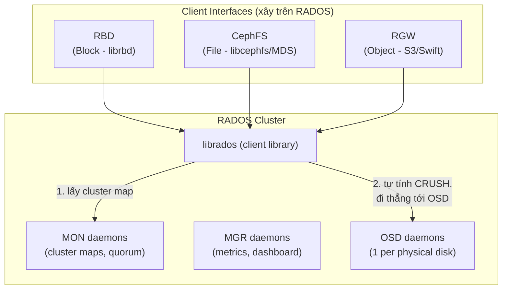

---
tags:
  - ceph
  - architecture
  - rados
---

# RADOS & Cluster Architecture

**RADOS (Reliable Autonomic Distributed Object Store)** là nền tảng lõi của toàn bộ Ceph — mọi thứ bạn dùng hàng ngày (RBD, CephFS, RGW) đều chỉ là một lớp client/gateway được xây **trên** RADOS, không phải 3 sản phẩm tách biệt. Hiểu RADOS là hiểu bản chất của Ceph: một cluster lưu **object** (không phải block, không phải file — object là đơn vị lưu trữ nguyên thủy nhất) phân tán trên nhiều daemon, tự phát hiện lỗi và tự phục hồi (self-healing) mà không cần một "bộ não trung tâm" nào theo dõi từng object.

> [!tip] So với VMware vSAN
> vSAN có một stack duy nhất: object (VM disk) nằm trực tiếp trên vSAN datastore, được CLOM/DOM quản lý tập trung. Ceph tách bạch rõ ràng: **RADOS** là tầng object storage thuần túy ở dưới cùng, còn RBD/CephFS/RGW là 3 "giao diện" khác nhau nói chuyện với cùng một RADOS cluster. Vì vậy một cụm Ceph vật lý duy nhất có thể vừa cấp block storage cho CloudStack (qua RBD), vừa cấp file share (CephFS), vừa cấp S3 API (RGW) — cùng lúc, dùng chung phần cứng.

## Kiến trúc tổng quan



Client (kể cả CloudStack qua `librbd`) **không** đi qua một gateway/controller trung tâm để đọc/ghi dữ liệu. Nó chỉ hỏi MON một lần để lấy **cluster map**, sau đó tự chạy thuật toán CRUSH để tính ra chính xác OSD nào giữ object cần tìm, rồi nói chuyện **trực tiếp** với OSD đó. Đây là khác biệt kiến trúc lớn nhất so với SAN truyền thống (mọi I/O qua controller) và cũng khác cách vSAN's DOM (Distributed Object Manager) điều phối I/O.

## Đường đi của một I/O request

```
Client ghi object "foo" vào pool "rbd-pool"
   │
   ├─ 1. Client hỏi MON (1 lần, cache lại) → nhận cluster map (osdmap, crushmap...)
   │
   ├─ 2. Client tự hash tên object → PG ID (băm object vào 1 trong các Placement Group của pool)
   │
   ├─ 3. Client chạy CRUSH(PG ID, crushmap, rule) → danh sách OSD (primary + replicas)
   │
   └─ 4. Client gửi thẳng I/O tới OSD primary
          OSD primary tự replicate/EC-encode sang các OSD phụ trong cùng PG
          → ACK về client khi đủ số bản ghi an toàn (theo policy pool)
```

Không có bước "hỏi metadata server xem file/object nằm ở đâu" như HDFS NameNode hay các hệ có single lookup point — vị trí được **tính ra**, không phải **tra cứu**. Đây chính là ý nghĩa của CRUSH, xem chi tiết ở [[CRUSH Algorithm & CRUSH Map]].

## Các loại cluster map

Ceph giữ trạng thái toàn cụm qua một tập "map" — mỗi map có epoch (số version tăng dần), được MON quản lý và phân phối tới toàn bộ daemon/client.

| Map | Nội dung | Ai giữ/phát hành | Khi nào đổi |
|---|---|---|---|
| **monmap** | Danh sách MON, địa chỉ, epoch | MON | Khi thêm/bớt MON |
| **osdmap** | Danh sách OSD, trạng thái up/down/in/out, weight, pool config | MON (do MGR/OSD report lên) | Mỗi khi OSD lên/xuống, pool thay đổi, reweight |
| **pgmap** | Trạng thái từng PG (active/degraded/backfilling...), usage thống kê | MGR (không còn do MON giữ từ Luminous+) | Liên tục, theo peering/recovery |
| **crushmap** | Cây phân cấp bucket (root/rack/host/osd), rule đặt dữ liệu | MON | Khi sửa topology/rule thủ công |
| **mgrmap** | MGR nào đang active, standby nào sẵn sàng, module nào bật | MON | Khi MGR failover |

Client chỉ cần **monmap + osdmap + crushmap** để tự tính toán placement — không cần pgmap (đó là dữ liệu vận hành, dùng để giám sát chứ không cần cho I/O).

## Đọc anatomy của `ceph -s` / `ceph status`

Đây là lệnh đầu tiên bất kỳ ai cũng nên chạy để nắm sức khỏe cluster:

```bash
$ ceph -s
  cluster:
    id:     3f2504e0-4f89-11d3-9a0c-0305e82c3301
    health: HEALTH_OK

  services:
    mon: 3 daemons, quorum mon-a,mon-b,mon-c (age 12d)
    mgr: mon-a.xkqzst(active, since 12d), standbys: mon-b.yhqwer
    osd: 24 osds: 24 up (since 2h), 24 in (since 2h)

  data:
    pools:   4 pools, 289 pgs
    objects: 1.42M objects, 5.3 TiB
    usage:   16 TiB used, 44 TiB / 60 TiB avail
    pgs:     289 active+clean

  io:
    client:   12 MiB/s rd, 45 MiB/s wr, 320 op/s rd, 610 op/s wr
```

| Dòng | Ý nghĩa | Cần chú ý gì |
|---|---|---|
| `health` | `HEALTH_OK` / `HEALTH_WARN` / `HEALTH_ERR` | WARN/ERR luôn kèm chi tiết ở `ceph health detail` |
| `mon: ... quorum ...` | Số MON đang trong quorum và tên | Nếu số quorum < tổng số MON → đang mất 1+ MON, vẫn hoạt động nhưng giảm tolerance |
| `mgr: active/standby` | MGR nào đang phục vụ dashboard/orchestrator | Không có standby = rủi ro mất dashboard tạm thời khi active chết |
| `osd: X up, Y in` | Tổng OSD, bao nhiêu đang chạy (up), bao nhiêu được tính vào CRUSH (in) | up ≠ in, xem [[OSD - Object Storage Daemon]] |
| `pools/pgs` | Số pool, tổng PG, tổng object/dung lượng | |
| `pgs: N active+clean` | Trạng thái PG — active+clean 100% là lý tưởng | Bất kỳ trạng thái nào khác active+clean cần tra ở [[Placement Groups (PG)]] |
| `io:` | Throughput/IOPS hiện tại (client traffic) | Chỉ hiện khi có I/O đang chạy |

> [!warning] Lesson learned: HEALTH_OK không có nghĩa là "không có gì đáng lo"
> `HEALTH_OK` chỉ phản ánh các cảnh báo đã được Ceph định nghĩa sẵn (PG degraded, OSD near-full, clock skew...). Nó **không** cảnh báo những thứ như: capacity sắp cạn trong 2 tuần tới theo xu hướng tăng trưởng, một pool đang dùng replication size=2 (rủi ro split-brain khi 1 OSD chết giữa lúc recovery), hay firmware disk đang lỗi thời. Đừng chỉ chạy `ceph -s` mỗi sáng rồi yên tâm — kết hợp thêm `ceph osd df`, `ceph df detail`, và alerting ở tầng Prometheus (xem [[Ceph Monitoring & Alerting]]) để có bức tranh đầy đủ.

## Vì sao kiến trúc "no gateway" quan trọng

- **Không có single point of I/O bottleneck**: một SAN controller hay vSAN's DOM đều là điểm hội tụ I/O; RADOS phân tán hoàn toàn — throughput cluster tăng gần tuyến tính khi thêm OSD.
- **Scale ngang thật sự**: thêm node/OSD mới chỉ cần cập nhật crushmap, client tự học map mới, không cần "đăng ký" thủ công từng object.
- **Đánh đổi**: vì client tự tính toán và tự nói chuyện trực tiếp với OSD, một crushmap sai (rule sai, failure domain sai) ảnh hưởng **toàn bộ cluster ngay lập tức**, không có lớp trung gian nào chặn lại — đây là lý do CRUSH map cần cẩn trọng tuyệt đối, xem [[CRUSH Algorithm & CRUSH Map]].

---
*Xem thêm: [[CRUSH Algorithm & CRUSH Map]] | [[Placement Groups (PG)]] | [[MON - Monitor]] | [[Ceph|Ceph]]*
