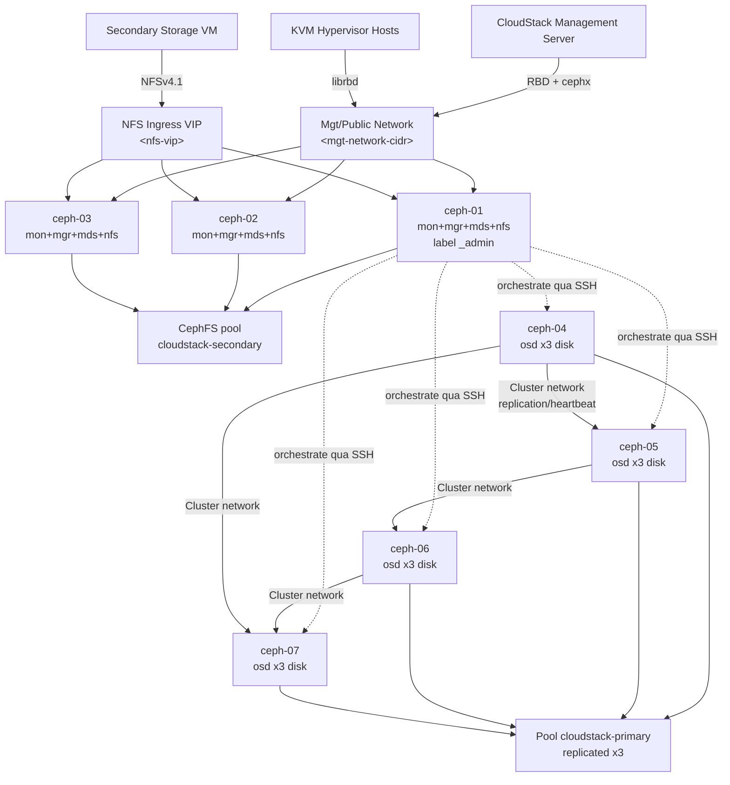

# Ceph Cluster - Triển khai Primary và Secondary Storage cho CloudStack

- **Bối cảnh và vấn đề**: CloudStack cần Primary Storage (nơi lưu volume/disk của VM, đòi hỏi performance và low-latency) và Secondary Storage (nơi lưu template, ISO, snapshot). Dựng hai storage system riêng biệt cho hai mục đích này tốn gấp đôi hạ tầng, trong khi một cụm Ceph production-grade có thể phục vụ tốt cả hai vai trò nếu tách pool/service và giới hạn quyền truy cập đúng cách.
- **Cách giải quyết**: Dùng `cephadm` triển khai một cụm Ceph 7 node trên Ubuntu 24.04, tách vai trò rõ ràng: 3 node (ceph-01/02/03) làm **control-plane + gateway** (mon + mgr + mds + nfs), 4 node (ceph-04..07) làm **storage node** thuần (chỉ chạy osd). Tạo pool RBD riêng (`cloudstack-primary`) làm Primary Storage cho KVM/CloudStack qua giao thức RBD. Triển khai CephFS + NFS-Ganesha (Ceph `nfs` module, có ingress VIP để HA trên 3 node gateway) export ra làm Secondary Storage qua NFS.
- **Kết quả sau khi hoàn thành**: CloudStack có một Primary Storage Pool chạy trên RBD và một Secondary Storage Pool chạy trên NFS, cùng share hạ tầng vật lý của một cụm Ceph 7 node. Admin thao tác OSD/pool qua `ceph orch`, không cần quản lý daemon thủ công.

> [!NOTE]
> Lab này là một phần của series dựng cụm CloudStack production hoàn chỉnh — xem [[CloudStack Production Cluster - Lab Series Overview]] để biết thứ tự triển khai đầy đủ cùng các lab Control Plane, Compute Node, Tungsten Fabric SDN, Advanced Zone.

> [!NOTE]
> Lab này tách riêng node chạy daemon điều phối cụm (mon/mgr/mds/nfs) khỏi node chạy OSD ngay từ đầu, thay vì kiến trúc converged (mọi daemon dùng chung node) như ở cụm 3-node. Vì đã có đủ 7 node, việc tách này tránh cho control-plane bị cạnh tranh CPU/RAM với tải I/O của OSD lúc rebalance/scrub, đồng thời giúp scale storage (thêm node ceph-0N chỉ chạy osd) độc lập với scale control-plane.

## Prerequisites

- **Hạ tầng**: CloudStack Management Server và ít nhất 1 KVM Cluster/Host đã cài đặt, add vào zone, đang ở trạng thái Up. DNS/NTP nội bộ hoạt động, các node Ceph resolve được lẫn nhau (qua DNS nội bộ hoặc `/etc/hosts`).
- **Máy chủ / VM**: 7 server Ubuntu 24.04 riêng biệt, không chạy service nào khác ngoài Ceph. Disk dùng cho OSD trong bài lab là disk ảo VMware; trên hạ tầng thật cần cấu hình passthrough (JBOD), không dùng RAID, để tối ưu hiệu năng và giữ đúng mô hình 1 OSD : 1 disk vật lý mà Ceph kỳ vọng.

  | Host name | Vai trò | CPU - RAM - DISK |
  | --- | --- | --- |
  | ceph-01 | control-plane + gateway (mon, mgr, mds, nfs), label `_admin` | 4 vCPU - 8 GB - (OS 50GB) |
  | ceph-02 | control-plane + gateway (mon, mgr, mds, nfs) | 4 vCPU - 8 GB - (OS 50GB) |
  | ceph-03 | control-plane + gateway (mon, mgr, mds, nfs) | 4 vCPU - 8 GB - (OS 50GB) |
  | ceph-04 | storage node (osd) | 4 vCPU - 8 GB - (OS 50GB, data 200GB x3) |
  | ceph-05 | storage node (osd) | 4 vCPU - 8 GB - (OS 50GB, data 200GB x3) |
  | ceph-06 | storage node (osd) | 4 vCPU - 8 GB - (OS 50GB, data 200GB x3) |
  | ceph-07 | storage node (osd) | 4 vCPU - 8 GB - (OS 50GB, data 200GB x3) |

- **Tài khoản và quyền**: user sudo trên cả 7 node để cài đặt và cho `cephadm` SSH vào orchestrate.
- **Mạng**: tách 2 dải mạng riêng biệt — mgt/user access network (SSH, cephadm orchestration, Dashboard, client RBD/NFS) và storage network (OSD replication/heartbeat). Storage network cần switch hỗ trợ Jumbo Frame, bật MTU 9000 để giảm CPU overhead và tránh phân mảnh gói tin khi replicate dữ liệu giữa các OSD. Chỉ 4 node storage (ceph-04..07) cần có interface trên storage network; 3 node control-plane/gateway chỉ cần mgt/user access network.
- **NTP**: cần có NTP source nội bộ để đồng bộ thời gian giữa các node — cephx dùng timestamp chống replay attack, lệch giờ sẽ khiến node bị đá khỏi quorum (xem Bước 1).
- **Kiến thức nền**: runbook này giả định người đọc đã biết Linux administration cơ bản, khái niệm TCP/IP, khái niệm Ceph (OSD/MON/MGR/PG/CRUSH) và khái niệm Zone/Pod/Cluster/Primary-Secondary Storage trong CloudStack — không giải thích lại từ đầu.

> [!NOTE]
> Lab giả định đây là Primary/Secondary Storage **mới hoàn toàn** được add thêm vào zone, không phải migrate dữ liệu từ storage hiện có. Việc di chuyển volume/template từ storage cũ sang Ceph nằm ngoài phạm vi runbook này.

## Thông tin Planning liên quan

<!-- Network để trống theo yêu cầu — điền lại sau khi có kết quả planning với team Network. -->

| Thành phần | Giá trị | Ghi chú |
| --- | --- | --- |
| ceph-01 hostname/IP | `<ip-node01>` | mon + mgr + mds + nfs, label `_admin` (node bootstrap) |
| ceph-02 hostname/IP | `<ip-node02>` | mon + mgr + mds + nfs |
| ceph-03 hostname/IP | `<ip-node03>` | mon + mgr + mds + nfs |
| ceph-04 hostname/IP | `<ip-node04>` | osd, cluster-network IP `<cluster-ip-node04>` |
| ceph-05 hostname/IP | `<ip-node05>` | osd, cluster-network IP `<cluster-ip-node05>` |
| ceph-06 hostname/IP | `<ip-node06>` | osd, cluster-network IP `<cluster-ip-node06>` |
| ceph-07 hostname/IP | `<ip-node07>` | osd, cluster-network IP `<cluster-ip-node07>` |
| Mgt/Public network CIDR | `<mgt-network-cidr>` | SSH, cephadm orchestration, Dashboard HTTPS, client RBD/NFS |
| Cluster/Storage network CIDR | `<cluster-network-cidr>` | Riêng biệt, không route ra ngoài — OSD replication/heartbeat, chỉ cấu hình trên ceph-04..07 |
| MTU Cluster network | `9000` | Jumbo frame, giảm CPU overhead khi replicate giữa các OSD |
| NTP server | `172.29.70.254` | Nguồn đồng bộ thời gian nội bộ, có thể thêm pool dự phòng nếu tổ chức có |
| Harbor registry (image mirror) | `<harbor-registry>` | Mirror nội bộ cho image Ceph/Prometheus/Grafana, dùng khi node không ra được internet tới quay.io |
| Ceph release | `20.2.4` (codename `tentacle`) | Pin version cụ thể trước khi bootstrap, không dùng bản dev/rc cho production |
| VIP NFS-Ganesha ingress | `<nfs-vip>` | VIP HA cho Secondary Storage (NFS), chạy trên ceph-01/02/03 |
| cephx client Primary Storage | `client.cloudstack-rbd` | caps giới hạn trong pool `cloudstack-primary` |
| Pool Primary Storage | `cloudstack-primary` | replicated x3, min_size 2 |
| CephFS volume Secondary Storage | `cloudstack-secondary` | data + metadata pool, replicated x3 |
| NFS export path | `/cloudstack-secondary` | pseudo path export cho CloudStack Secondary Storage VM (SSVM) |
| Secondary Storage client CIDR | `<secondary-storage-client-cidr>` | Dải IP của SSVM + KVM host, dùng để giới hạn NFS export |
| Dashboard admin user | `<dashboard-admin-user>` | Role `administrator`, không dùng chung tài khoản `admin` mặc định |
| SSH orchestration user | `ceph-adm` | User riêng cho `cephadm` SSH, không dùng `root` |

## Diagram



---

## Installation

### Bước 1 - Chuẩn bị hệ điều hành Ubuntu 24.04 trên 7 node

Bước này đưa 7 node về cùng baseline trước khi cephadm bắt đầu quản lý — sai NTP hoặc thiếu resolve hostname là hai nguyên nhân phổ biến nhất khiến bootstrap hoặc cephx auth thất bại.

- Đặt hostname đúng theo Planning table (thực hiện trên từng node):

```bash
sudo hostnamectl set-hostname <ceph-XX>
```

- Khai báo resolve giữa các node. Chỉnh sửa file `/etc/hosts` trên cả 7 node, thêm IP mgt/public network của cả 7 node:

```text
<ip-node01>  ceph-01
<ip-node02>  ceph-02
<ip-node03>  ceph-03
<ip-node04>  ceph-04
<ip-node05>  ceph-05
<ip-node06>  ceph-06
<ip-node07>  ceph-07
```

- Với 4 node storage (ceph-04..07), cấu hình thêm interface/IP trên storage network (`<cluster-network-cidr>`, MTU 9000) ở tầng OS trước khi bootstrap — đây là interface Ceph sẽ tự dò để bind traffic replication.

- Cài đặt và đồng bộ NTP bằng `chrony`. Cephx dùng timestamp để chống replay attack — lệch giờ quá `mon_clock_drift_allowed` (mặc định 50ms) sẽ khiến node bị đá khỏi quorum:

```bash
sudo apt update
sudo apt install -y chrony
echo "pool 172.29.70.254 iburst" | sudo tee /etc/chrony/conf.d/local.conf
sudo systemctl enable chrony --now
chronyc tracking
```

- Tạo user riêng cho `cephadm` orchestrate qua SSH, không dùng `root`:

```bash
sudo adduser --disabled-password --gecos "" ceph-adm
sudo usermod -aG sudo ceph-adm
echo "ceph-adm ALL=(ALL) NOPASSWD:ALL" | sudo tee /etc/sudoers.d/ceph-adm
```

> [!NOTE]
> `NOPASSWD:ALL` ở đây để `cephadm` tự động chạy lệnh qua SSH không cần nhập password tương tác. Nếu tổ chức yêu cầu chặt hơn, có thể giới hạn danh sách lệnh cụ thể trong sudoers, nhưng cần test kỹ vì `cephadm` gọi khá nhiều binary khác nhau (`systemctl`, container runtime, `mkdir`...).

- Sinh SSH keypair trên node bootstrap (ceph-01) và copy public key vào chính ceph-01 cho user `ceph-adm` — đây là keypair sẽ được truyền cho `cephadm bootstrap` làm định danh SSH của cả cụm, nên chỉ cần tự-authorize trên node01 lúc này; các node còn lại sẽ nhận key này ở Bước 3 qua `ceph cephadm get-pub-key`:

```bash
sudo -u ceph-adm ssh-keygen -t ed25519 -f /home/ceph-adm/.ssh/ceph-adm-key -N ""
sudo -u ceph-adm ssh-copy-id -i /home/ceph-adm/.ssh/ceph-adm-key.pub ceph-adm@ceph-01
```

- Cài đặt Podman làm container runtime cho `cephadm` (thực hiện trên cả 7 node):

```bash
sudo apt install -y podman
```

- Thiết lập firewall baseline bằng `ufw`, mặc định deny toàn bộ inbound rồi mở dần theo từng service ở các bước sau:

```bash
sudo ufw default deny incoming
sudo ufw default allow outgoing
sudo ufw allow from <mgt-network-cidr> to any port 22 proto tcp
sudo ufw enable
```

> [!WARNING]
> Chạy `ufw enable` qua kết nối SSH từ xa có thể tự khoá bản thân nếu rule allow port 22 sai dải mạng. Luôn kiểm tra lại rule `allow ... port 22` trỏ đúng `<mgt-network-cidr>` trước khi enable.

- Kiểm tra kết quả bước này trên cả 7 node:

```bash
chronyc tracking | grep "Leap status"
getent hosts ceph-04
```

Kết quả mong đợi: `Leap status: Normal` trên mọi node, và mỗi node resolve được hostname của 6 node còn lại qua `/etc/hosts`.

### Bước 2 - Cài đặt cephadm và Bootstrap Ceph Cluster

Bootstrap khởi tạo mon/mgr đầu tiên trên ceph-01 và sinh ra cephx admin keyring — đây là node giữ label `_admin`.

- Cài đặt `cephadm` trên ceph-01, dùng đúng release đã xác nhận ở Planning table:

```bash
CEPH_RELEASE=20.2.4

curl --silent --remote-name --location https://download.ceph.com/rpm-${CEPH_RELEASE}/el9/noarch/cephadm
chmod +x cephadm

sudo ./cephadm add-repo --release tentacle
sudo ./cephadm install

which cephadm
```

- Login vào Harbor nội bộ và pull trước image Ceph để bootstrap không phải kéo trực tiếp từ quay.io:

```bash
sudo podman login https://<harbor-registry>/
sudo podman pull <harbor-registry>/quay.io/ceph/ceph:v20.2.4
```

- Bootstrap cluster, trỏ image về Harbor mirror và dùng network/ssh-user đã chuẩn bị:

```bash
sudo cephadm bootstrap \
  --image <harbor-registry>/quay.io/ceph/ceph:v20.2.4 \
  --mon-ip <ip-node01> \
  --cluster-network <cluster-network-cidr> \
  --ssh-user ceph-adm \
  --ssh-private-key /home/ceph-adm/.ssh/ceph-adm-key \
  --ssh-public-key /home/ceph-adm/.ssh/ceph-adm-key.pub \
  --initial-dashboard-user <dashboard-admin-user> \
  --initial-dashboard-password "$(cat /root/ceph-dashboard.pass)"
```

> [!WARNING]
> Không gõ password trực tiếp trên command line — nó sẽ lưu lại trong `~/.bash_history` và trong output của `ps aux` lúc lệnh đang chạy. Tạo password trước bằng `openssl rand -base64 20 | sudo tee /root/ceph-dashboard.pass && sudo chmod 600 /root/ceph-dashboard.pass` rồi đọc lại qua `$(cat ...)` như trên, và xoá file này ngay sau khi bootstrap xong.

- Cài thêm gói `ceph-common` để có sẵn lệnh `ceph` CLI ngay trên host, không cần vào `cephadm shell` mỗi lần — các bước sau của lab đều chạy `ceph ...` trực tiếp trên host bootstrap:

```bash
sudo cephadm install ceph-common
```

- Giới hạn quyền truy cập keyring admin, chỉ giữ trên node bootstrap:

```bash
sudo cp /etc/ceph/ceph.client.admin.keyring /etc/ceph/ceph.client.admin.keyring.bak
sudo chmod 600 /etc/ceph/ceph.client.admin.keyring
```

> [!WARNING]
> `/etc/ceph/ceph.client.admin.keyring` cấp full quyền lên toàn cụm. Chỉ giữ file này trên node có label `_admin` (mặc định là node bootstrap), không copy sang node khác hay sang máy CloudStack Management Server.

- Kiểm tra kết quả bước này:

```bash
sudo ceph -s
```

![[Pasted image 20260915173737.png]]

Kết quả: `health: HEALTH_WARN` với cảnh báo "1 mon" là bình thường ở giai đoạn này vì chưa thêm node và OSD.

### Bước 3 - Thêm node vào cluster và gán label

Label quyết định `cephadm` sẽ deploy daemon gì lên node nào ở các bước `orch apply` sau này — 3 node gateway nhận `mon,mgr,mds,nfs`, 4 node storage chỉ nhận `osd`.

- Lấy public key do `cephadm` dùng cho cluster (chính là `ceph-adm-key.pub` đã khai báo lúc bootstrap) và copy sang 6 node còn lại:

```bash
sudo ceph cephadm get-pub-key > /etc/ceph/ceph.pub

for h in ceph-02 ceph-03 ceph-04 ceph-05 ceph-06 ceph-07; do
  sudo ssh-copy-id -f -i /etc/ceph/ceph.pub ceph-adm@$h
done
```

- Thêm 2 node gateway còn lại, gán label `mon,mgr,mds,nfs`:

```bash
sudo ceph orch host add ceph-02 <ip-node02> --labels mon,mgr,mds,nfs
sudo ceph orch host add ceph-03 <ip-node03> --labels mon,mgr,mds,nfs
```

- Thêm 4 node storage, gán label `osd`:

```bash
sudo ceph orch host add ceph-04 <ip-node04> --labels osd
sudo ceph orch host add ceph-05 <ip-node05> --labels osd
sudo ceph orch host add ceph-06 <ip-node06> --labels osd
sudo ceph orch host add ceph-07 <ip-node07> --labels osd
```

- Gán label cho ceph-01 (đã có sẵn label `_admin` từ lúc bootstrap):

```bash
sudo ceph orch host label add ceph-01 mon
sudo ceph orch host label add ceph-01 mgr
sudo ceph orch host label add ceph-01 mds
sudo ceph orch host label add ceph-01 nfs
```

- Áp dụng placement cho mon/mgr theo label — cả 3 node gateway đều khớp label `mon`/`mgr`, đảm bảo đúng 3 mon để có quorum chịu được 1 node down:

```bash
sudo ceph orch apply mon --placement="label:mon"
sudo ceph orch apply mgr --placement="label:mgr"
```

- Kiểm tra kết quả bước này:

```bash
sudo ceph orch host ls
sudo ceph -s
```

> [!NOTE]
> Nếu gặp lỗi pull image (do node không ra được internet tới `quay.io`), kiểm tra và trỏ lại các image phụ trợ (`node-exporter`, `prometheus`, `alertmanager`, `grafana`) về Harbor mirror thay vì repo mặc định:
>
> ```bash
> # Check config hiện tại đang trỏ đâu
> sudo ceph config get mgr mgr/cephadm/container_image_node_exporter
>
> # Set lại về harbor mirror
> sudo ceph config set mgr mgr/cephadm/container_image_node_exporter \
>   <harbor-registry>/quay.io/prometheus/node-exporter:v1.9.1
> sudo podman pull <harbor-registry>/quay.io/prometheus/node-exporter:v1.9.1
>
> # Tương tự cho các image còn lại
> sudo ceph config set mgr mgr/cephadm/container_image_prometheus \
>   <harbor-registry>/quay.io/prometheus/prometheus:v3.6.0
> sudo ceph config set mgr mgr/cephadm/container_image_alertmanager \
>   <harbor-registry>/quay.io/prometheus/alertmanager:v0.28.1
> sudo ceph config set mgr mgr/cephadm/container_image_grafana \
>   <harbor-registry>/quay.io/ceph/grafana:12.3.1
> ```

Kết quả mong đợi: 7 host hiển thị đủ label (3 node `mon,mgr,mds,nfs`, 4 node `osd`), `ceph -s` báo `3 mons, quorum ceph-01,ceph-02,ceph-03`.

![[Pasted image 20260918011527.png]]

### Bước 4 - Triển khai OSD với mã hoá dữ liệu tại chỗ (dmcrypt)

Bước này đưa toàn bộ disk trống trên 4 node storage (ceph-04..07) vào cụm dưới dạng OSD bluestore, mã hoá bằng LUKS ngay từ lúc tạo — mất chi phí CPU không đáng kể nhưng bảo vệ dữ liệu nếu disk vật lý bị tháo trộm khỏi node.

- Xem danh sách disk đang có trong cụm:

```bash
sudo ceph orch device ls
```

- Tạo file spec `osd-spec.yaml` trên ceph-01. Placement theo label `osd` nên spec này tự động chỉ áp dụng cho ceph-04..07, không đụng tới 3 node gateway:

```yaml
service_type: osd
service_id: cloudstack-osds
placement:
  label: "osd"
spec:
  data_devices:
    rotational: 1
  encrypted: true
```

> [!NOTE]
> `rotational: 1` chọn mọi device HDD đang ở trạng thái "available" (chưa có filesystem/partition) trên host có label `osd` (dùng `rotational: 0` nếu disk là SSD/NVMe). OS disk không bị chọn nhầm vì nó đã có filesystem từ lúc cài Ubuntu. `encrypted: true` bật dmcrypt full-disk — key LUKS được `cephadm`/`ceph-volume` tự sinh và lưu trong Monitor config-key store, không cần quản lý key thủ công.

> [!NOTE]
> Trong bài lab này chỉ có disk HDD nên chỉ dùng data device. Nếu có disk SSD/NVMe mix với disk HDD, có thể tách 1 OSD gồm disk SSD/NVMe làm DB/WAL trong khi disk HDD chứa data — giúp tăng **performance** của cụm:
>
> ```yaml
> service_type: osd
> service_id: cloudstack-osds
> placement:
>   label: "osd"
> spec:
>   data_devices:
>     rotational: 1        # HDD → data
>   db_devices:
>     rotational: 0        # SSD/NVMe → WAL+DB riêng
>   db_slots: 4             # 1 SSD share cho tối đa 4 HDD (tùy dung lượng SSD)
>   encrypted: true
> ```

- Áp dụng spec:

```bash
sudo ceph orch apply -i osd-spec.yaml
```

> [!WARNING]
> Lệnh này format mọi disk "available" khớp filter — chạy `ceph orch device ls` trước để xác nhận đúng danh sách disk dự kiến, tránh format nhầm disk đang chứa dữ liệu khác.

- Kiểm tra kết quả bước này:

```bash
sudo ceph orch device ls
sudo ceph osd tree
```

Kết quả mong đợi: mỗi node ceph-04..07 hiển thị 3 OSD `up`, tổng 12 OSD trên 4 node storage, `ceph -s` chuyển dần về `HEALTH_OK` sau khi PG rebalance xong.

![[Pasted image 20260916011221.png]]

Cụm ở trạng thái healthy:

![[Pasted image 20260919095343.png]]

### Bước 5 - Hardening authentication và network ở tầng cluster

Các cấu hình này nên bật ngay sau khi cụm healthy, trước khi tạo pool phục vụ production traffic.

- Bật mã hoá đường truyền nội bộ giữa các daemon (msgr v2 secure mode):

```bash
sudo ceph config set global ms_cluster_mode secure
sudo ceph config set global ms_service_mode secure
sudo ceph config set global ms_client_mode secure
```

> [!NOTE]
> Mặc định msgr v2 chỉ bật `crc` mode (kiểm tra toàn vẹn, không mã hoá). `secure` mode mã hoá toàn bộ traffic giữa mon/osd/mds/client bằng AES-GCM — cần thiết vì traffic giữa 3 node gateway và 4 node storage đi qua mgt/public network dùng chung với các workload khác.

- Vô hiệu hoá cơ chế `insecure global id reclaim` (cho phép client giả mạo global_id sau khi mất kết nối mon):

```bash
sudo ceph health detail | grep -i "insecure global id"
sudo ceph config set mon auth_allow_insecure_global_id_reclaim false
```

> [!WARNING]
> Chỉ set `false` sau khi xác nhận không còn client nào (kể cả KVM host, CloudStack Management Server) đang dùng thư viện `librados`/`librbd` cũ chưa hỗ trợ reclaim an toàn — nếu còn, client đó sẽ mất kết nối tới cụm. Kiểm tra bằng lệnh `ceph health detail` ở trên trước khi set.

- Chặn thao tác xoá pool ngoài ý muốn — một `rm pool` sai tay có thể xoá sạch dữ liệu Primary/Secondary Storage đang phục vụ CloudStack:

```bash
sudo ceph config set mon mon_allow_pool_delete false
```

- Mở firewall cho các port cần thiết của Ceph daemon trên mgt/public network. Trên 3 node gateway (ceph-01/02/03, chạy mon/mgr/mds):

```bash
sudo ufw allow from <mgt-network-cidr> to any port 3300,6789 proto tcp comment 'ceph mon'
sudo ufw allow from <mgt-network-cidr> to any port 6800:7300 proto tcp comment 'ceph mgr/mds'
sudo ufw allow from <mgt-network-cidr> to any port 8443 proto tcp comment 'ceph dashboard'
sudo ufw allow from <mgt-network-cidr> to any port 9283 proto tcp comment 'ceph prometheus exporter'
```

Trên 4 node storage (ceph-04..07, chạy osd):

```bash
sudo ufw allow from <mgt-network-cidr> to any port 6800:7300 proto tcp comment 'ceph osd'
```

> [!NOTE]
> Port 6789 (msgr v1) vẫn cần mở song song với 3300 (msgr v2) vì một số client librbd cũ (tuỳ version QEMU trên KVM host) vẫn kết nối qua v1. Chỉ tắt bind v1 (`ms_bind_msgr1 false`) sau khi xác nhận toàn bộ KVM host đã dùng QEMU/librbd bản hỗ trợ msgr v2.

- Kiểm tra kết quả bước này:

```bash
sudo ceph config get global ms_cluster_mode
sudo ceph health detail
```

Kết quả mong đợi: `ms_cluster_mode` trả về `secure`, `ceph health detail` không còn cảnh báo `AUTH_INSECURE_GLOBAL_ID_RECLAIM`.

### Bước 6 - Tạo Pool RBD và cephx key cho CloudStack Primary Storage

- Tạo pool riêng cho Primary Storage, không dùng chung pool với dữ liệu khác để giới hạn blast radius nếu cephx key của CloudStack bị lộ:

```bash
sudo ceph osd pool create cloudstack-primary 128 128 replicated
sudo ceph osd pool set cloudstack-primary size 3
sudo ceph osd pool set cloudstack-primary min_size 2
sudo ceph osd pool application enable cloudstack-primary rbd
sudo rbd pool init cloudstack-primary
```

> [!NOTE]
> `min_size 2` nghĩa là pool vẫn nhận write khi 1 trong 3 replica down (ví dụ đang bảo trì 1 node storage), nhưng sẽ block write nếu chỉ còn 1 bản sao — tránh write vào trạng thái không đủ redundancy. Số PG 128 phù hợp cho 12 OSD ở quy mô lab này; công thức và PG calculator tham khảo ở phần Reference khi scale cụm lớn hơn.

- Tạo cephx client riêng cho CloudStack, dùng `profile rbd` — caps chuẩn được Ceph khuyến nghị cho tích hợp RBD với hypervisor, chỉ cho phép thao tác trong đúng pool `cloudstack-primary`:

```bash
sudo ceph auth get-or-create client.cloudstack-rbd \
  mon 'profile rbd' \
  osd 'profile rbd pool=cloudstack-primary'
```

> [!WARNING]
> Không dùng `client.admin` cho CloudStack. Nếu key `client.cloudstack-rbd` bị lộ, kẻ tấn công chỉ thao tác được trong pool `cloudstack-primary`, không đọc/xoá được pool khác hay thay đổi cấu hình cụm.

- Lấy secret key để khai báo vào CloudStack ở phần Kiểm tra kết quả (không in ra terminal log tồn tại lâu dài):

```bash
sudo ceph auth print-key client.cloudstack-rbd
```

- Kiểm tra kết quả bước này:

```bash
sudo ceph auth get client.cloudstack-rbd
sudo rbd -p cloudstack-primary --id cloudstack-rbd ls
```

Kết quả mong đợi: lệnh `rbd ls` chạy được (trả về danh sách rỗng vì pool mới tạo) mà không bị lỗi permission denied — xác nhận cephx caps hoạt động đúng.

### Bước 7 - Triển khai CephFS + NFS-Ganesha cho CloudStack Secondary Storage

- Tạo CephFS volume, `cephadm` tự tạo data pool + metadata pool và deploy MDS theo label — 3 MDS trên ceph-01/02/03 (1 active, các node còn lại standby):

```bash
sudo ceph fs volume create cloudstack-secondary --placement="label:mds"
```

- Đặt replication cho 2 pool vừa tạo (mặc định kế thừa `osd_pool_default_size`, khai báo tường minh cho rõ ràng). Dữ liệu và metadata vẫn nằm trên 4 node storage dù MDS chạy ở node gateway — CRUSH đặt OSD theo label `osd`, không liên quan tới node chạy MDS:

```bash
sudo ceph osd pool set cephfs.cloudstack-secondary.data size 3
sudo ceph osd pool set cephfs.cloudstack-secondary.data min_size 2
sudo ceph osd pool set cephfs.cloudstack-secondary.meta size 3
sudo ceph osd pool set cephfs.cloudstack-secondary.meta min_size 2
```

- Tạo NFS cluster (Ceph `nfs` module quản lý NFS-Ganesha như một service của orchestrator), đặt trên cả 3 node gateway để tối đa HA:

```bash
sudo ceph nfs cluster create cloudstack-nfs --placement="label:nfs"
```

- Tạo export, giới hạn client theo CIDR của SSVM/KVM host thay vì mở cho toàn bộ mgt/public network:

```bash
sudo ceph nfs export create cephfs \
  --cluster-id cloudstack-nfs \
  --pseudo-path /cloudstack-secondary \
  --fsname cloudstack-secondary \
  --path / \
  --client_addr <secondary-storage-client-cidr>
```

> [!NOTE]
> Cú pháp `ceph nfs export create` có thể thay đổi nhẹ giữa các minor release — chạy `ceph nfs export create cephfs --help` để xác nhận tham số đúng với version đang cài trước khi apply.

> [!WARNING]
> Nếu bỏ trống `--client_addr`, export mặc định mở cho mọi client trên mgt/public network đọc/ghi được toàn bộ Secondary Storage — luôn giới hạn rõ dải IP của SSVM và KVM host.

- Triển khai ingress (haproxy + keepalived do `cephadm` quản lý) để có 1 VIP HA cho NFS, trải trên cả 3 node gateway thay vì trỏ thẳng vào IP của 1 node:

```yaml
service_type: ingress
service_id: nfs.cloudstack-nfs
placement:
  label: "nfs"
spec:
  backend_service: nfs.cloudstack-nfs
  frontend_port: 2049
  monitor_port: 9049
  virtual_ip: <nfs-vip>/<prefix>
  virtual_interface_networks:
    - <mgt-network-cidr>
```

```bash
sudo ceph orch apply -i ingress-nfs.yaml
```

- Mở firewall cho NFS trên mgt/public network, chỉ cho phép từ dải client Secondary Storage, thực hiện trên cả 3 node gateway:

```bash
sudo ufw allow from <secondary-storage-client-cidr> to any port 2049 proto tcp comment 'nfs-ganesha'
```

- Kiểm tra kết quả bước này (thực hiện từ một máy nằm trong `<secondary-storage-client-cidr>`, ví dụ SSVM hoặc KVM host):

```bash
showmount -e <nfs-vip>
sudo mount -t nfs4 -o vers=4.1 <nfs-vip>:/cloudstack-secondary /mnt
touch /mnt/test-file && ls -la /mnt/test-file
sudo umount /mnt
```

Kết quả mong đợi: mount thành công, tạo/xoá file test không lỗi permission.

### Bước 8 - Bảo mật Ceph Dashboard

- Cài certificate TLS thật từ internal CA thay vì self-signed mặc định:

```bash
sudo ceph dashboard set-ssl-certificate -i dashboard.crt
sudo ceph dashboard set-ssl-certificate-key -i dashboard.key
```

- Tạo tài khoản Dashboard theo đúng role, tách biệt tài khoản admin toàn quyền và tài khoản chỉ xem (audit):

```bash
openssl rand -base64 20 | sudo tee /root/dashboard-admin.pass
sudo ceph dashboard ac-user-create <dashboard-admin-user> -i /root/dashboard-admin.pass administrator

openssl rand -base64 20 | sudo tee /root/dashboard-readonly.pass
sudo ceph dashboard ac-user-create <dashboard-readonly-user> -i /root/dashboard-readonly.pass read-only
```

- Xoá tài khoản `admin` mặc định được sinh lúc bootstrap sau khi đã có tài khoản administrator riêng:

```bash
sudo ceph dashboard ac-user-delete admin
```

> [!WARNING]
> Chỉ xoá `admin` sau khi xác nhận tài khoản administrator mới đăng nhập được — nếu xoá nhầm trước khi có tài khoản thay thế, sẽ mất quyền truy cập Dashboard qua UI và phải xử lý lại qua CLI.

- Giảm thời gian session timeout để giảm rủi ro session bị chiếm dụng khi quên logout:

```bash
sudo ceph config set mgr mgr/dashboard/session-expire 900
```

- Kiểm tra kết quả bước này:

```bash
sudo ceph dashboard ac-user-show
curl -Iv https://<ip-node01>:8443 2>&1 | grep -i "subject\|issuer"
```

Kết quả mong đợi: danh sách user gồm tài khoản administrator + read-only, không còn `admin` mặc định; certificate hiển thị đúng issuer là internal CA thay vì self-signed.

### Khai báo thông tin nhạy cảm

- Các giá trị nhạy cảm trong lab này gồm: Dashboard admin password, cephx secret key của `client.cloudstack-rbd`. Toàn bộ được sinh bằng `openssl rand`, lưu tạm ở `/root/*.pass` với quyền `600`, và phải được chuyển vào secret store của tổ chức (Vault, hoặc biến bí mật trong hệ thống CI/CD nếu về sau tự động hoá bằng Ansible/Terraform) rồi xoá file tạm:

```bash
sudo shred -u /root/ceph-dashboard.pass /root/dashboard-admin.pass /root/dashboard-readonly.pass
```

- cephx keyring `client.admin` (`/etc/ceph/ceph.client.admin.keyring`) chỉ tồn tại trên node có label `_admin` (ceph-01), quyền `600`, không đồng bộ ra ngoài cụm. Việc rotate key định kỳ nằm ngoài phạm vi lab này, tham khảo thêm ở [Reference](#reference).

## Kiểm tra kết quả

- Trạng thái tổng thể cụm phải `HEALTH_OK` trước khi tích hợp CloudStack:

```bash
sudo ceph -s
```

### Tích hợp Primary Storage vào CloudStack

- Trong CloudStack UI: **Infrastructure → Primary Storage → Add Primary Storage**, khai báo:

  | Trường | Giá trị |
  | --- | --- |
  | Protocol | `RBD` |
  | Server | `<ip-node01>,<ip-node02>,<ip-node03>` |
  | Port | `6789` |
  | Path (pool) | `cloudstack-primary` |
  | CephX username | `cloudstack-rbd` |
  | CephX secret | `<secret-key-lấy-ở-bước-6>` |

> [!NOTE]
> Server khai báo là 3 mon (ceph-01/02/03) — client librbd tự chọn mon còn quorum để kết nối, không phụ thuộc 1 node duy nhất. CloudStack Agent trên KVM host tự động tạo libvirt secret từ username/secret khai báo ở trên (`virsh secret-define`) — admin không cần thao tác `virsh` thủ công.

- Tạo thử một volume trên Primary Storage vừa add (qua UI: Storage → Volumes → Create Volume, chọn pool vừa thêm), sau đó xác nhận volume xuất hiện dưới dạng RBD image:

```bash
sudo rbd -p cloudstack-primary --id cloudstack-rbd ls
```

Kết quả mong đợi: thấy image tương ứng với volume vừa tạo trên UI.

### Tích hợp Secondary Storage vào CloudStack

- Trong CloudStack UI: **Infrastructure → Secondary Storage → Add Secondary Storage**, khai báo:

  | Trường | Giá trị |
  | --- | --- |
  | Provider | `NFS` |
  | Server | `<nfs-vip>` |
  | Path | `/cloudstack-secondary` |

- Upload thử 1 template hoặc ISO nhỏ, xác nhận SSVM ghi được vào NFS export:

```bash
ssh <ssvm-ip> "df -h | grep cloudstack-secondary"
```

  | Hạng mục cần kiểm tra | Cách kiểm tra | Kết quả đúng |
  | --- | --- | --- |
  | Cụm Ceph healthy | `ceph -s` | `HEALTH_OK` |
  | Primary Storage nhận volume | `rbd -p cloudstack-primary --id cloudstack-rbd ls` | Thấy RBD image mới tạo từ UI |
  | Secondary Storage mount trên SSVM | `df -h` trên SSVM | Thấy mount point trỏ `<nfs-vip>:/cloudstack-secondary` |
  | Upload template thành công | UI CloudStack → Templates | Trạng thái `Ready` |

## Troubleshooting

Không áp dụng - lab dựng mới theo hướng dẫn triển khai chuẩn, chưa có log lỗi thực tế phát sinh trong quá trình build để ghi nhận. Riêng lỗi pull image từ `quay.io` do node không ra internet đã có hướng xử lý trong ghi chú ở Bước 3.

## Rollback

- Gỡ Secondary/Primary Storage khỏi CloudStack trước (UI → Delete Secondary Storage / Primary Storage), tránh để CloudStack còn tham chiếu tới pool sắp xoá.
- Gỡ export, ingress và NFS cluster:

```bash
sudo ceph nfs export delete cloudstack-nfs /cloudstack-secondary
sudo ceph orch rm nfs.cloudstack-nfs
sudo ceph orch rm ingress.nfs.cloudstack-nfs
```

- Xoá CephFS volume (đồng thời xoá data + metadata pool):

```bash
sudo ceph fs volume rm cloudstack-secondary --yes-i-really-mean-it
```

- Xoá pool Primary Storage (đã set `mon_allow_pool_delete false` ở Bước 5 nên cần bật lại trước khi xoá):

```bash
sudo ceph config set mon mon_allow_pool_delete true
sudo ceph osd pool rm cloudstack-primary cloudstack-primary --yes-i-really-really-mean-it
sudo ceph config set mon mon_allow_pool_delete false
```

> [!CAUTION]
> Hai lệnh xoá pool và xoá CephFS volume ở trên **không thể hoàn tác** — toàn bộ volume/template/ISO đang lưu trong pool bị mất vĩnh viễn. Chỉ chạy sau khi đã xác nhận CloudStack không còn tham chiếu và dữ liệu đã được backup nếu cần giữ lại.

- Nếu cần gỡ toàn bộ cụm (chỉ dùng khi phá bỏ lab, không áp dụng khi chỉ muốn xoá một phần) — chạy trên node `_admin` (ceph-01), `--zap-osds` sẽ zap disk trên cả 4 node storage:

```bash
sudo cephadm rm-cluster --fsid <fsid> --force --zap-osds
```

> [!CAUTION]
> `--zap-osds` xoá sạch dữ liệu trên toàn bộ disk OSD của cụm (ceph-04..07), không thể khôi phục. Không chạy lệnh này nếu chỉ muốn rollback một phần (ví dụ chỉ gỡ Secondary Storage).

## Reference

- [Cephadm - Deploying a new Ceph cluster](https://docs.ceph.com/en/latest/cephadm/install/)
- [Ceph - OSD Service Specification (encrypted, drive groups)](https://docs.ceph.com/en/latest/cephadm/services/osd/)
- [Ceph - CephX authentication and capabilities](https://docs.ceph.com/en/latest/rados/operations/user-management/)
- [Ceph - Messenger v2 protocol (secure mode)](https://docs.ceph.com/en/latest/rados/configuration/msgr2/)
- [Ceph - NFS module / NFS-Ganesha via cephadm](https://docs.ceph.com/en/latest/cephadm/services/nfs/)
- [Ceph - Ingress service (HA VIP for RGW/NFS)](https://docs.ceph.com/en/latest/cephadm/services/ingress/)
- [Ceph Dashboard - Security and hardening](https://docs.ceph.com/en/latest/mgr/dashboard/)
- [Ceph - Placement Group (PG) count calculator](https://docs.ceph.com/en/latest/rados/operations/placement-groups/)
- [Apache CloudStack - KVM Hypervisor Host Installation](https://docs.cloudstack.apache.org/en/latest/installguide/hypervisor/kvm.html)
- [Apache CloudStack - Add Primary Storage](https://docs.cloudstack.apache.org/en/latest/adminguide/storage.html)
- [Apache CloudStack - Add Secondary Storage](https://docs.cloudstack.apache.org/en/latest/adminguide/storage.html)
