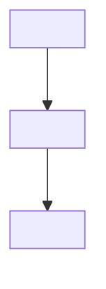

<!--
TEMPLATE: incident / failure reproduction / root cause analysis runbook.
Use this when the document answers "the system broke, how do I find and fix it" rather than
"how do I stand it up".
Usage: copy this whole file, fill in everything inside <...>, delete every HTML comment.
Section headings and prose are Vietnamese because they land in the output document verbatim.
-->

# <Hệ thống bị ảnh hưởng> - <Triệu chứng chính>

<!--
The title states the symptom, not the root cause — during an incident the reader only knows the symptom.
Good : "Gitea Runner - Job treo ở trạng thái Waiting không có runner nhận"
Bad  : "Lỗi thiếu label trong config.yaml"
-->

- **Triệu chứng**: <hiện tượng quan sát được, ai/cái gì báo lỗi, phát hiện lúc nào>
- **Mức độ ảnh hưởng**: <dịch vụ nào ngừng, bao nhiêu người dùng, có mất dữ liệu không>
- **Root cause**: <nguyên nhân gốc, một câu — nếu chưa xác định được thì ghi rõ "Chưa xác định">
- **Cách xử lý**: <tóm tắt hướng fix trong một câu>

> [!IMPORTANT]
> **Xử lý nhanh (nếu đang có sự cố):** <lệnh hoặc thao tác khôi phục dịch vụ ngay>.
> Đây là biện pháp tạm thời, xử lý triệt để xem phần [Khắc phục](#khắc-phục).

<!-- Delete the callout above if there is no fast recovery action. -->

## Môi trường xảy ra lỗi

<!-- A failure only means something in a specific environment. Give enough for someone to rebuild the context. -->

| Thành phần         | Giá trị            |
| ------------------ | ------------------ |
| Hệ thống           | <tên, IP>          |
| OS                 | <distro x.y>       |
| Phần mềm           | <name x.y.z>       |
| Cấu hình liên quan | `<đường/dẫn/file>` |
| Thời điểm xảy ra   | <YYYY-MM-DD HH:MM> |

## Triệu chứng và bằng chứng

<!--
Paste REAL log/output, trimmed of noise. Bold or annotate the decisive line.
Do not paraphrase the log instead of pasting it — readers find this document by matching the error string.
-->

- <Nơi quan sát được triệu chứng: log file, UI, metric, kết quả lệnh>

```text
<log gốc, đã rút gọn>
```

- Dòng đáng chú ý: `<chuỗi lỗi quyết định>` — <ý nghĩa của nó>.

## Các bước tái hiện lỗi

<!--
Goal: someone following these steps hits the exact same failure.
Numbered, one action each, ending with the observable failure.
If it reproduces, state the rate (always / intermittently ~x%). If it does not reproduce, say so explicitly.
-->

1. <Hành động 1>

```bash
<lệnh>
```

2. <Hành động 2>

3. Quan sát: <hiện tượng lỗi xuất hiện>.

**Tỉ lệ tái hiện**: <luôn luôn / ~x% số lần / chỉ khi có điều kiện Y>

## Quá trình điều tra

<!--
The most valuable part of this document: record the path of reasoning, INCLUDING the dead ends.
Knowing which direction was a dead end saves the next person a lot of time.
Each step: hypothesis -> how it was tested -> result -> keep or discard the hypothesis.
-->

### Giả thuyết 1 - <phát biểu giả thuyết>

- **Cách kiểm chứng**:

```bash
<lệnh chẩn đoán>
```

- **Kết quả**:

```text
<output>
```

- **Kết luận**: <loại bỏ vì .../ xác nhận đúng vì ...>

### Giả thuyết 2 - <phát biểu giả thuyết>

<!-- Repeat the structure above until you reach the confirmed hypothesis. -->

## Root cause

<!--
Explain the mechanism: why this cause produces exactly the symptom observed.
The causal chain must be unbroken, with no skipped links. A diagram helps.
-->

<Mô tả cơ chế gây lỗi, dẫn chiếu tới bằng chứng ở các phần trên.>



## Khắc phục

<!-- The permanent fix. State the impact: does it need a service restart, is there downtime. -->

- <Bước sửa 1>

```bash
<lệnh>
```

> [!WARNING]
> <Impact of the operation: downtime, restart, effect on users currently online. Write it in Vietnamese.>

- Xác nhận đã hết lỗi:

```bash
<lệnh verify>
```

Kết quả mong đợi: <output đúng>.

## Phòng ngừa tái diễn

<!--
Without this section the document is just an incident log, not a runbook.
Prefer automated measures (alerts, health checks, CI validation) over "remember to be careful".
-->

- **Giám sát**: <metric/log cần theo dõi, ngưỡng cảnh báo>
- **Kiểm tra tự động**: <check thêm vào CI/pipeline/health check>
- **Thay đổi cấu hình hoặc quy trình**: <điều chỉnh để lỗi không xảy ra lại>

## Reference

- [<Tiêu đề tài liệu>](<url>)
- <Runbook liên quan: [[tên-runbook]]>
