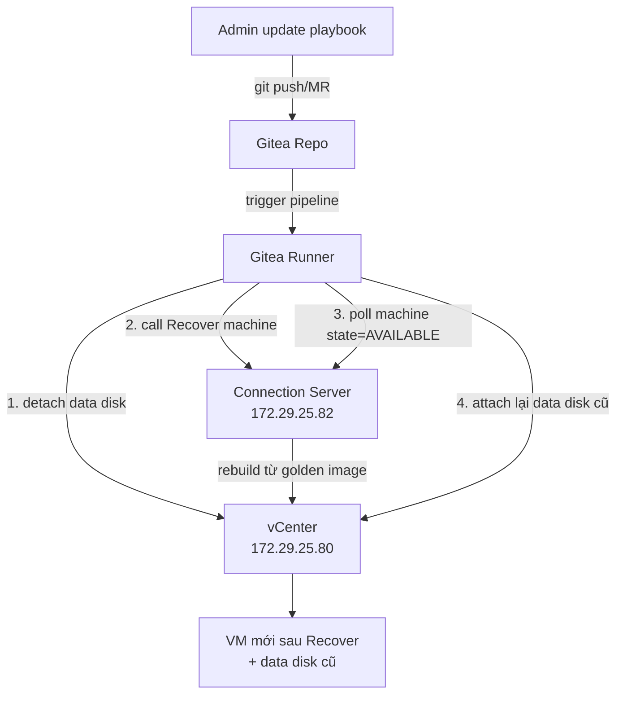

# Ansible GitOps - Recover VDI Machine kèm Persistent Data Disk
- VDI machine dùng data disk riêng gắn thêm ngoài OS disk để lưu dữ liệu user tách biệt khỏi golden image. Khi machine bị lỗi (Agent unreachable, corrupt, cần rebuild lại từ golden image), Horizon Connection Server có chức năng Recover để tạo lại VM từ golden image của pool, nhưng thao tác này chỉ tác động tới OS disk theo golden image, không tự biết xử lý data disk gắn thêm ngoài luồng provisioning chuẩn
- Lab này dùng Ansible gọi module `Vmware.Vmware` để gỡ data disk ra trước khi Recover, gọi Horizon REST API để trigger Recover, rồi gắn lại đúng data disk cũ vào VM mới sau khi Horizon dựng xong, toàn bộ playbook quản lý theo GitOps trên GitLab nội bộ.
- Kết thúc lab, admin chỉ cần update playbook/inventory trên Gitea (chỉ định machine hoặc pool cần recover) và chạy pipeline, không thao tác tay qua vSphere Client hay Horizon Console, và user sau khi máy được recover vẫn thấy đúng data disk cũ với dữ liệu nguyên vẹn

> [!Note]
> Horizon có sẵn một tính năng gọi là **Persistent Disk** , với chính API `attach-persistent-disk`/`detach-persistent-disk` do Horizon tự quản lý vòng đời disk khi recover. Nếu data disk được tạo qua chính Horizon Console lúc tạo pool (không phải gắn tay qua vCenter như hiện tại), Horizon sẽ tự động detach/reattach disk này khi Recover mà không cần playbook riêng. Lab này viết cho trường hợp data disk gắn tay ngoài luồng Horizon, nên vẫn cần Ansible tự động cấu hình.

# Prerequisites
- Hạ tầng cần thiết cho hệ thống VDI bao gồm Active Directory và Connection Server đang hoạt động bình thường.
- VM Gitea nội bộ đã có sẵn truy cập được từ network management (coresvc)
- Gitea Action được cài trực tiếp trên Gitea VM, chạy trực tiếp trên host thay vì docker (dùng để giảm số bước cài đặt, không khuyến khích trong môi trường production)
- Service account riêng cho vCenter API (quyền tối thiểu: attach/detach virtual disk, không cần quyền tạo/xoá VM) và service account riêng cho Horizon REST API (quyền tối thiểu `MACHINE_MANAGEMENT` trên access group của pool, không dùng chung tài khoản Horizon Administrator toàn quyền)

# Thông tin Planning liên quan

| Thành phần            | Giá trị      |
| --------------------- | ------------ |
| Gitea Server + Runner | 172.29.25.84 |
| vCenter API           | 172.29.25.80 |
| Horizon REST API      | 172.29.25.82 |

# Diagram



---
# Installation

### Cấu trúc repo Ansible trên Gitea

- Tạo repo mới trên Gitea, và chuẩn bị source code ansible với cấu trúc thư mục như sau:

```shell
.
├── ansible.cfg
├── inventories
│   ├── group_vars
│   └── hosts.yml
├── Makefile
├── playbooks
│   ├── attach_persistent_disk.yml
│   ├── check_connectivity.yml
│   ├── detach_persistent_disk.yml
│   ├── horizon_recover.yml
│   └── verify_recovery.yml
├── README.md
├── requirements.yml
├── roles
│   ├── attach_persistent_disk
│   ├── check_connectivity
│   ├── detach_persistent_disk
│   ├── horizon_recover
│   └── verify_recovery
├── site.yml
└── vars
    └── vdi_pools
```

### Cấu hình Gitea Server và Gitea Action
#### Cài đặt CSDL PostgreSQL
- Thêm repository key
```shell
sudo apt install curl ca-certificates  
sudo install -d /usr/share/postgresql-common/pgdg  
sudo curl -o /usr/share/postgresql-common/pgdg/apt.postgresql.org.asc --fail https://www.postgresql.org/media/keys/ACCC4CF8.asc
```

Tạo thư mục **/etc/apt/sources.list.d/pgdg.sources** và thêm nội dung sau đây. Lưu ý hướng dẫn này cài đặt trên ubuntu 22.04 với tên phiên bản là jammi. Nếu sử dụng phiên bản khác cần đổi tên lại cho đúng

```shell
Types: deb deb-src  
URIs: https://apt.postgresql.org/pub/repos/apt  
Suites: jammy-pgdg  
Architectures: amd64  
Components: main  
Signed-By: /usr/share/postgresql-common/pgdg/apt.postgresql.org.asc
```

- Cài đặt PostgreSQL và khởi động chương trình
```shell
sudo apt update
sudo apt install postgresql-18
sudo systemctl enable postgresql --now
```

- Truy cập file cấu hình postgresql `/etc/postgresql/18/main/postgresql.conf` và thêm các cấu hình sau:
```shell
password_encryption = scram-sha-256 # Dùng để tăng mức độ mã hoá mật khẩu
```

- Đăng nhập vào database với quyền supper user và tao role/user dùng để kết nối đến gitea

```shell
CREATE ROLE gitea WITH LOGIN PASSWORD 'gitea';
CREATE DATABASE giteadb WITH OWNER gitea TEMPLATE template0 ENCODING UTF8 LC_COLLATE 'en_US.UTF-8' LC_CTYPE 'en_US.UTF-8';
```

- Cho phép database user vừa tạo ở bước trên có quyền truy cập vào database giteadb vừa tạo ở trên, ta chỉnh sửa file `/etc/postgresql/18/main/pg_hba.conf` và thêm dòng sau:
```shell
local    giteadb    gitea    scram-sha-256
```

- Thực hiện kiểm tra lại đảm bảo user có quyền kết nối đến database
```shell
psql "postgres://gitea@127.0.0.1/giteadb"
```

#### Cài đặt Gitea Server

- Thực hiện tải file binary cài đạt Gitea:
```shell
wget -O gitea https://dl.gitea.com/gitea/1.27.1/gitea-1.27.1-linux-amd64
chmod +x gitea
```

- Verify lại đảm bảo đã tải đúng file cài đăt, không bị thay đổi chỉnh sửa hoặc tấn công MITM
```shell
cosign verify-blob gitea-1.27.1-linux-amd64 --bundle gitea-1.27.1-linux-amd64.sigstore.json --certificate-oidc-issuer=https://token.actions.githubusercontent.com --certificate-identity-regexp="https://github.com/go-gitea/gitea/.github/workflows/release-.*"
```

- Tạo user dành cho Gitea

```shell
adduser \
   --system \
   --shell /bin/bash \
   --gecos 'Git Version Control' \
   --group \
   --disabled-password \
   --home /home/git \
   git
```

- Tạo các thư mục cần thiết

```shell
mkdir -p /var/lib/gitea/{custom,data,log}
chown -R git:git /var/lib/gitea/
chmod -R 750 /var/lib/gitea/
mkdir /etc/gitea
chown root:git /etc/gitea
chmod 770 /etc/gitea
```

- Cấu hình working directory cho Gitea
```shell
echo "export GITEA_WORK_DIR=/var/lib/gitea/" > ~/.bashrc
```

- Copy Gitea binary tới thư mục cài đặt
```shell
cp gitea /usr/local/bin/gitea
```

- Tạo systemd service để khởi động Gitea: [Tham khảo tài liệu sau](https://docs.gitea.com/installation/linux-service/)
- Thêm vào file cấu hình của Gitea `/etc/gitea/app.ini` cấu hình sau:
```shell
[actions]
DEFAULT_ACTIONS_URL = self
```

- Sau đó ta truy cập portal Gitea tại địa chỉ: http://<gitea-ip/>:3000, review lại các thông tin cài  đặt và bấm Install để hoàn tất quá trình cài đặt.
### Cài đặt Gitea Runner
- Tải Gitea runner tại: https://dl.gitea.com/gitea-runner
- Truy cập portal Gitea > Site Administration > Actions > Runner > Create new Runner để lấy token đăng kí Gitea Runner
- Chạy lệnh sau với thông tin token và thông tin instance của Gitea Server

```shell
./runner register --no-interactive --instance <instance> --token <token>
```

![[Pasted image 20260806111651.png]]

- Tạo file systemd service để runner có thể khởi chạy cùng hệ thống

```c
[Unit]
Description=Gitea Actions runner
Documentation=https://gitea.com/gitea/runner
After=docker.service

[Service]
ExecStart=/usr/local/bin/gitea-runner daemon --config /etc/gitea-runner/config.yaml
ExecReload=/bin/kill -s HUP $MAINPID
WorkingDirectory=/root
TimeoutSec=0
RestartSec=10
Restart=always
User=root

[Install]
WantedBy=multi-user.target
```

### Role 1 - Kiểm tra kết nối tới Horizon Connection và vCenter và lấy Horizon Access Token

`roles/check_connectivity/tasks/main.yml`

```yaml
---
- name: Check HTTPS reachability to vCenter (443) via proxy
  ansible.builtin.uri:
    url: "https://{{ vcenter_hostname }}/"
    method: GET
    validate_certs: false
    timeout: "{{ connectivity_tcp_timeout }}"
  register: vcenter_check
  failed_when: false

- name: Fail if vCenter unreachable
  ansible.builtin.fail:
    msg: "Cannot reach vCenter {{ vcenter_hostname }}:443 - {{ vcenter_check.msg | default('no response') }}"
  when: vcenter_check.status is not defined or vcenter_check.status | int < 0

- name: Check HTTPS reachability to Horizon Connection Server (443) via proxy
  ansible.builtin.uri:
    url: "https://{{ horizon_hostname }}/"
    method: GET
    validate_certs: false
    timeout: "{{ connectivity_tcp_timeout }}"
  register: horizon_check
  failed_when: false

- name: Fail if Horizon Connection Server unreachable
  ansible.builtin.fail:
    msg: "Cannot reach Horizon {{ horizon_hostname }}:443 - {{ horizon_check.msg | default('no response') }}"
  when: horizon_check.status is not defined or horizon_check.status | int < 0

- name: Login to Horizon REST API
  ansible.builtin.uri:
    url: "{{ horizon_api_base }}/login"
    method: POST
    body_format: json
    headers:
      accept: "*/*"
      Accept-Language: "en"
      Content-Type: "application/json"
    body:
      domain: "{{ horizon_domain }}"
      username: "{{ horizon_username }}"
      password: "{{ horizon_password }}"
    validate_certs: "{{ horizon_validate_certs }}"
    status_code: 200
  register: horizon_login
  no_log: false

- name: Extract token from login response
  set_fact:
    horizon_access_token: "{{ horizon_login.json.access_token }}"
    horizon_refesh_token: "{{ horizon_login.json.refresh_token }}"
```

> [!Warning]
> no_log: false cần phải set là false. Nếu set là true thì log bao gồm access token sẽ hiện thị trong log pineline dẫn tới lộ thông tin đăng nhập

### Role 2 - Gỡ disk đính kèm chứa dữ liệu user ra khỏi VDI VM

`roles/detach_persistent_disk/tasks/main.yml`

```yaml
---
- name: Detach persistent disk from each VDI desktop
  community.vmware.vmware_guest_disk:
    hostname: "{{ vcenter_hostname }}"
    username: "{{ vcenter_username }}"
    password: "{{ vcenter_password }}"
    validate_certs: "{{ vcenter_validate_certs }}"
    datacenter: "{{ vcenter_datacenter }}"
    name: "{{ item.vm_name }}"
    disk:
      - state: absent
        filename: "[{{ vcenter_datastore }}] {{ item.disk_path }}"
        unit_number: 1
        scsi_controller: 0
        scsi_type: "paravirtual"
        destroy: false
  loop: "{{ vdi_desktops }}"
  loop_control:
    label: "{{ item.vm_name }} ({{ item.disk_path }})"
  register: detach_result
```

> [!Warning]
> Giá trị destroy: false trong phần disk/vmware_guest_disk để khi gỡ disk ra khỏi VDI Machine sẽ chỉ thao tác gỡ disk ra và không xoá dữ liệu của User mặc dù thực tế disk đã set giá trị ddb.deletable=false để ngăn người dùng vô tình xoá disk từ vCenter
### Role 3 - Gọi Horizon Rest API để gỡ disk ra khỏi VDI VM

`roles/horizon_recover/tasks/main.yml`

```yaml
---
- name: Look up Horizon machine IDs for the pool's desktops
  ansible.builtin.uri:
    url: "{{ horizon_api_base }}/inventory/v1/machines?dns_name={{ item.vm_name }}"
    method: GET
    headers:
      Authorization: "Bearer {{ horizon_access_token }}"
    validate_certs: "{{ horizon_validate_certs }}"
    status_code: 200
  loop: "{{ vdi_desktops }}"
  loop_control:
    label: "{{ item.vm_name }}"
  register: horizon_machine_lookup

# - debug:
#     var: horizon_machine_lookup

- name: Extract VM id from response
  set_fact:
    horizon_vm_id: "{{ horizon_machine_lookup.results | map(attribute='json') | flatten | map(attribute='id') | list }}"

# - debug:
#     var: horizon_vm_id

- name: Trigger recover on each Horizon machine
  ansible.builtin.uri:
    url: "{{ horizon_api_base }}/inventory/v1/machines/action/recover"
    method: POST
    headers:
      Authorization: "Bearer {{ horizon_access_token }}"
    body_format: json
    body:
      - "{{ item }}"
    validate_certs: "{{ horizon_validate_certs }}"
    status_code: [200, 204]
  loop: "{{ horizon_vm_id }}"
  register: horizon_recover_result
```

### Role 4 - Đảm bảo các VM VDI đã ở trạng thái AVAILABLE trước khi thực hiện gắn lại disk cho VDI VM

`roles/verify_recovery/tasks/main.yml`

```yaml
---
- name: Poll Horizon machine status until ready
  ansible.builtin.uri:
    url: "{{ horizon_api_base }}/inventory/v1/machines?dns_name={{ item.vm_name }}"
    method: GET
    headers:
      Authorization: "Bearer {{ horizon_access_token }}"
    validate_certs: "{{ horizon_validate_certs }}"
    status_code: 200
  loop: "{{ vdi_desktops }}"
  loop_control:
    label: "{{ item.vm_name }}"
  register: verify_status
  until: >-
    verify_status.json is defined and
    verify_status.json[0].state is defined and
    verify_status.json[0].state in horizon_ready_states
  retries: "{{ recovery_poll_retries }}"
  delay: "{{ recovery_poll_delay }}"

# - debug:
#     var: verify_status

- name: Report desktops that failed to reach a ready state
  ansible.builtin.debug:
    msg: >-
      {{ item.item.vm_name }} did not reach a ready state:
      {{ item.json[0].base_status | default('unknown') }}
  loop: "{{ verify_status.results }}"
  loop_control:
    label: "{{ item.item.vm_name }}"
  when: item.attempts is defined and item.attempts >= recovery_poll_retries
```

### Role 5 - Gắn lại disk chứa dữ liệu cá nhân của user vào đúng máy VDI theo tên

`roles/attach_persistent_disk/tasks/main.yml`

```yaml
---
- name: Re-attach persistent disk to each VDI desktop
  community.vmware.vmware_guest_disk:
    hostname: "{{ vcenter_hostname }}"
    username: "{{ vcenter_username }}"
    password: "{{ vcenter_password }}"
    validate_certs: "{{ vcenter_validate_certs }}"
    datacenter: "{{ vcenter_datacenter }}"
    name: "{{ item.vm_name }}"
    disk:
      - state: present
        filename: "[{{ vcenter_datastore }}] {{ item.disk_path }}"
        type: "{{ attach_disk_type }}"
        unit_number: 1
        scsi_controller: 0
        scsi_type: "paravirtual"
  loop: "{{ vdi_desktops }}"
  loop_control:
    label: "{{ item.vm_name }} ({{ item.disk_path }})"
  register: attach_result
```
### Playbook chính

`site.yml`:

```yaml
#   1. check_connectivity     -> validate vCenter + Horizon reachability/auth
#   2. detach_persistent_disk -> remove persistent/<user>-pers.vmdk from each VM
#   3. horizon_recover        -> call Horizon REST API to recover the machines
#   4. verify_recovery        -> poll until machines are back to READY/OK
#   5. attach_persistent_disk -> re-attach persistent/<user>-pers.vmdk

- import_playbook: playbooks/check_connectivity.yml
  tags: [always, check]

- import_playbook: playbooks/detach_persistent_disk.yml
  tags: [detach_disk]

- import_playbook: playbooks/horizon_recover.yml
  tags: [recover]

- import_playbook: playbooks/verify_recovery.yml
  tags: [verify]

- import_playbook: playbooks/attach_persistent_disk.yml
  tags: [attach_disk]
```

### Cấu hình workflows cho Gitea Runner

`.gitea/workflows/workflows.yml`:

```yaml
# .gitea/workflows/workflows.yml
name: VDI Pool Recovery

on:
  push:
    branches: [main]
  workflow_dispatch:

jobs:
  recover:
    runs-on: ubuntu-latest
    steps:
      - name: Checkout repository (manual, no actions/checkout)
        run: |
          git clone --depth 1 --branch ${{ github.ref_name }} \
            http://x-access-token:${{ secrets.GITHUB_TOKEN }}@172.29.70.81:3000/${{ github.repository }}.git .

      - name: Check Python availability
        run: python3 --version

      - name: Install Ansible tooling
        run: python3 -m pip install ansible-core ansible-lint yamllint

      - name: Install required collections
        run: make install

      - name: Lint playbooks
        run: |
          yamllint .

      - name: Syntax check
        run: make syntax-check

      - name: Create vault password
        run: |
          echo "${{ secrets.ANSIBLE_VAULT }}" > .vault-pass
          chmod 600 .vault-pass

      - name: Run VDI pool recovery
        run: make run

      - name: Remove vault password
        if: always()
        run: rm -f .vault-pass
```


- `.vault-pass` và các credential trong `vault.yml` khai báo dưới dạng Gitea CI/CD variable

![[Pasted image 20260806142457.png]]

### Khai báo mật khẩu truy cập vào vCenter và Horizon Connection Server
- Khai báo password dùng cho vCenter và Horizon trong file `inventories/group_vars/vault.yml` 
```shell
vault_vcenter_password: <StrongPassword>
vault_horizon_password: <StrongPassword>
```

- Chạy lệnh sau để sử dụng ansible vault để mã hoá mật khẩu

```shell
ansible-vault encrypt inventories/group_vars/vault.yml
```

- Khi cần chỉnh sửa mật khẩu có thể dùng lênh:

```shell
ansible-vault edit inventories/group_vars/vault.yml
```

### Kiểm tra kết quả

- Thực hiện thay đổi source và push lên main branch. Kết quả pipeline chạy thành công, không phát sinh lỗi.

![[Pasted image 20260806143535.png]]

- Login vào máy VDI tự động thấy persistent disk đã được đính kèm, dữ liệu user vẫn còn đầy đủ, không bị lỗi

![[Pasted image 20260806144837.png]]

![[Pasted image 20260806144858.png]]

# Reference
- [Install Gitea from binary](https://docs.gitea.com/installation/install-from-binary/)
- [Install Gitea Action](https://docs.gitea.com/next/usage/actions)
- [community.vmware.vmware_guest_disk module](https://docs.ansible.com/projects/ansible/latest/collections/community/vmware/vmware_guest_disk_module.html)
- [API documentation for the Horizon Server version 2306](https://developer.omnissa.com/horizon-apis/horizon-server/versions/2306/)
- [VMware Horizon Server API - Recover Machines](https://developer.broadcom.com/xapis/vmware-horizon-server-api/latest/rest/inventory/v1/machines/action/recover/post/)
- [VMware Horizon Server API - Login](https://developer.broadcom.com/xapis/vmware-horizon-server-api/latest/rest/login/post/)
- [VMware Horizon Server API - Attach/Detach Persistent Disk](https://developer.broadcom.com/xapis/vmware-horizon-server-api/latest/Inventory/)

