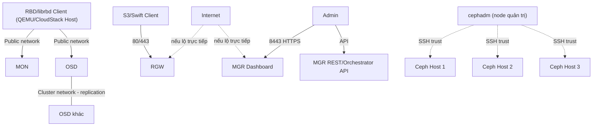

---
tags:
  - ceph
  - security
  - hardening
---

# Ceph Security Considerations

## Attack Surface — các mặt tấn công chính

| Bề mặt | Rủi ro chính |
|---|---|
| **MON/OSD trên public network** | Nếu network không được cô lập, client compromised có thể thao tác trực tiếp RADOS nếu có key hợp lệ, hoặc DoS bằng cách spam kết nối |
| **cephx keyring trên đĩa** | Keyring file bị copy = **giả mạo hoàn toàn danh tính đó** (không có forward secrecy nếu không rotate key — key bị lộ có giá trị vô thời hạn cho tới khi chủ động xoay vòng) |
| **RGW S3/Swift API** | Nếu expose ra internet, là bề mặt tấn công quen thuộc kiểu S3 (bucket policy sai, brute-force credential, object public đọc được) |
| **Ceph Dashboard (MGR)** | Nếu thiếu auth mạnh/TLS đúng cách, trở thành cổng quản trị toàn cluster dễ bị brute-force hoặc MITM |
| **cephadm SSH trust giữa các host** | 1 host bị compromise + có SSH key cephadm = bàn đạp **lateral movement** sang toàn bộ host khác trong cluster |
| **Dữ liệu at-rest không mã hóa mặc định** | BlueStore hỗ trợ encryption nhưng là **opt-in per-OSD lúc deploy**, không tự động bật — disk bị lấy cắp vật lý có thể đọc trực tiếp nếu không bật |
| **Traffic network không mã hóa mặc định** | msgr2 hỗ trợ mode `secure` (encrypt), nhưng default thường chỉ là `crc` (chỉ checksum, không mã hóa) — dữ liệu đi qua network ở dạng đọc được nếu ai đó sniff được |
| **Backup/snapshot data** | RBD snapshot, RGW versioned object vẫn chứa dữ liệu gốc — nếu backup lưu ở nơi kiểm soát access lỏng lẻo hơn cluster chính, đây là đường vòng để đọc trộm dữ liệu |

> [!tip] So với VMware vSAN
> vSAN encryption at-rest (khi bật) là cấu hình cluster-wide đơn giản qua vCenter, và network vSAN thường được coi là "trusted" theo mặc định trong thiết kế nhiều nơi. Ceph đòi hỏi bạn **chủ động bật từng lớp**: encryption at-rest per-OSD lúc tạo OSD, msgr2 `secure` mode cho network — không có 1 công tắc "bật hết" duy nhất, và nếu bỏ qua bước nào lúc deploy ban đầu, thêm vào sau thường tốn công hơn nhiều (phải rebuild OSD để bật encryption).

## Các misconfiguration thường gây breach nhất

> [!warning] 1. cephx keyring world-readable hoặc bị commit vào git/config-management repo
> Keyring file (VD: `ceph.client.admin.keyring`) mặc định nên có quyền hạn chế (0600, chỉ root/user cần thiết đọc được). Nếu để permission lỏng, hoặc tệ hơn — commit thẳng vào git repo cấu hình (Ansible, Terraform...) — bất kỳ ai đọc được file này có được **toàn quyền tương đương danh tính đó** ngay lập tức, không cần khai thác gì thêm.

> [!warning] 2. Dùng `client.admin` key cho routine application access thay vì key least-privilege riêng
> Tương tự việc dùng Root Admin account của CloudStack cho automation — nếu CloudStack (hoặc bất kỳ ứng dụng nào) kết nối Ceph bằng `client.admin`, một khi key đó bị lộ ở đâu đó (log, config file share nhầm), kẻ tấn công có **toàn quyền quản trị cluster**, không chỉ quyền đọc/ghi pool cần thiết. Luôn tạo cephx key riêng, scope đúng theo pool/capability cần dùng — xem [[Ceph with CloudStack]] để biết CloudStack cần capability gì.

> [!warning] 3. Dashboard/RGW expose thẳng ra internet không qua reverse proxy/VPN/bastion
> Port 8443 (Dashboard) hoặc RGW 80/443 mở trực tiếp ra internet biến chúng thành mục tiêu brute-force hoặc quét lỗ hổng trực tiếp. Nên đặt sau VPN, bastion, hoặc tối thiểu reverse proxy có rate-limiting + WAF, và giới hạn theo IP allowlist ở tầng hạ tầng.

> [!warning] 4. `insecure_global_id_reclaim` để bật lâu hơn cần thiết
> Đây là setting compatibility liên quan tới lỗ hổng cephx global_id reclaim đã từng được công bố (client có thể reclaim global_id mà không xác thực lại đầy đủ trong một số điều kiện). Setting này tồn tại để tương thích ngược với client cũ, nhưng để bật kéo dài trên cluster production hiện đại là giữ lại rủi ro không cần thiết. Nên rà soát: nếu toàn bộ client (bao gồm KVM host chạy CloudStack) đã dùng version đủ mới, hãy tắt compat mode này.

> [!warning] 5. Không bật msgr2 `secure` mode cho network đi qua segment không tin cậy
> msgr2 hỗ trợ mode `secure` (mã hóa traffic giữa daemon và client), nhưng mode mặc định phổ biến chỉ là `crc` — **không mã hóa nội dung**, chỉ checksum toàn vẹn. Nếu public network hoặc cluster network đi qua đoạn hạ tầng không hoàn toàn tin cậy (VD: chia sẻ switch với network khác, WAN link giữa site trong stretch cluster), dữ liệu đi qua ở dạng đọc được nếu bị sniff. Đây là gotcha thực tế nhiều người không biết vì mặc định "không bật sẵn".

> [!warning] 6. cephadm SSH key có quyền truy cập quá rộng hoặc dùng chung giữa nhiều môi trường
> cephadm dùng 1 SSH keypair để quản lý mọi host trong cluster (`/etc/ceph/ceph.pub` được đẩy tới `authorized_keys` từng node). Nếu key này bị dùng chung giữa cluster production và staging, hoặc account SSH có quyền vượt quá mức cephadm cần, một host bị compromise có thể lan sang toàn bộ cluster khác qua đường này.

> [!warning] 7. Quên xoay vòng cephx key sau khi nhân sự nghỉ việc hoặc nghi ngờ bị lộ
> Không như password có thể force-reset hàng loạt dễ dàng, cephx key thường được cấp theo từng client/application và ít khi có quy trình xoay vòng định kỳ rõ ràng. Sau khi nhân sự có quyền truy cập cluster nghỉ việc, hoặc nghi ngờ 1 key bị lộ, cần chủ động `ceph auth caps`/tạo lại key và cập nhật đồng bộ mọi consumer (bao gồm libvirt secret trên KVM host nếu dùng cho CloudStack — xem lesson learned liên quan ở [[Lessons Learned & Common Pitfalls (Ceph)]]).

> [!warning] 8. RGW bucket ACL/policy để quá lỏng lẻo
> Tương tự lỗi kinh điển "S3 bucket public" trên các cloud khác — bucket RGW với ACL `public-read`/`public-read-write` hoặc bucket policy quá rộng có thể vô tình public hóa dữ liệu nội bộ ra ngoài nếu RGW có endpoint truy cập được từ internet. Luôn rà soát ACL/policy mặc định khi tạo bucket mới, đặc biệt nếu có tự động hóa provisioning bucket.

## Hardening Checklist

### Control Plane / MON-MGR

- [ ] MON chỉ lắng nghe trên network quản trị/nội bộ, không expose ra internet
- [ ] Dashboard (MGR) bắt buộc HTTPS, dùng chứng chỉ hợp lệ (không self-signed mặc định lâu dài)
- [ ] Đặt Dashboard/MGR API sau VPN hoặc bastion, không expose thẳng ra internet
- [ ] Giới hạn số lượng account có quyền admin Dashboard, dùng RBAC theo role của Dashboard nếu có nhiều nhóm người dùng

### Data Plane / OSD

- [ ] Đánh giá bật encryption at-rest (BlueStore encryption) cho OSD chứa dữ liệu nhạy cảm — quyết định **ngay lúc deploy**, không dễ thêm sau
- [ ] Cluster network và public network tách VLAN/subnet riêng biệt vật lý hoặc logic rõ ràng
- [ ] Không cho phép SSH trực tiếp vào host OSD từ ngoài mạng quản trị

### Network

- [ ] Đánh giá bật msgr2 `secure` mode nếu network đi qua segment không hoàn toàn tin cậy
- [ ] Firewall/security group chỉ mở đúng port cần thiết theo bảng port ở [[Key Configuration Reference (Ceph)]]
- [ ] Giới hạn truy cập SSH cephadm chỉ từ node quản trị được chỉ định, key-based auth, không dùng chung key với môi trường khác

### Auth / cephx

- [ ] `auth_cluster_required`, `auth_service_required`, `auth_client_required` đều là `cephx`, không bao giờ `none`
- [ ] Không dùng `client.admin` cho ứng dụng/CloudStack — tạo key riêng least-privilege theo pool/capability
- [ ] Rà soát và tắt `insecure_global_id_reclaim` nếu toàn bộ client đã đủ mới
- [ ] Có quy trình xoay vòng cephx key định kỳ và sau sự kiện nhân sự/nghi ngờ compromise
- [ ] Keyring file permission 0600, không commit vào git/config-management repo dạng plaintext

### RGW

- [ ] Rà soát bucket ACL/policy mặc định, tránh `public-read`/`public-read-write` không chủ đích
- [ ] Đặt RGW sau reverse proxy/WAF nếu expose S3 API ra internet
- [ ] Bật logging truy cập RGW, giám sát pattern bất thường (nhiều request 403/404 liên tục = có thể đang bị dò quét)

### Vận hành liên tục

- [ ] Cập nhật daemon Ceph theo lịch vá lỗi bảo mật, không trì hoãn quá lâu sau khi có CVE công bố
- [ ] Định kỳ review danh sách cephx key đang tồn tại (`ceph auth ls`), xóa key không còn dùng
- [ ] Test khôi phục từ backup/snapshot định kỳ, không chỉ tin tưởng job backup "đang chạy"
- [ ] Export config baseline định kỳ để phát hiện thay đổi ngoài ý muốn (xem [[Key Configuration Reference (Ceph)]])

---
*Xem thêm: [[Key Configuration Reference (Ceph)]] | [[Ceph with CloudStack]] | [[Lessons Learned & Common Pitfalls (Ceph)]] | [[Ceph|Ceph]]*
