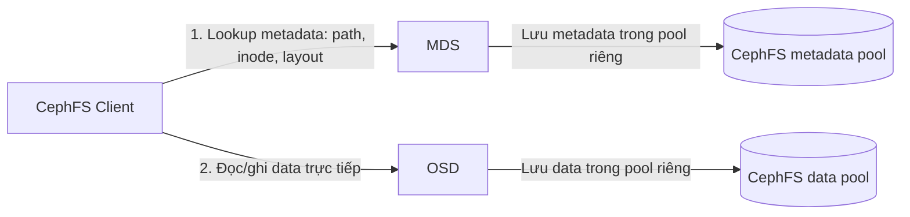

---
tags:
  - ceph
  - cephfs
  - storage-interfaces
  - file-storage
---

# CephFS - File Storage

CephFS là interface **file storage POSIX-native** của Ceph — cho phép mount như một filesystem thông thường (`mount -t ceph`), phù hợp cho shared config, home directory, NFS-like general file share. **Không phải** interface CloudStack dùng cho VM disk (đó là việc của [[RBD - Block Storage]]) — hiểu rõ ranh giới này ngay từ đầu để tránh dùng sai công cụ.

> [!tip] So với VMware vSAN
> Gần nhất bên VMware là **vSAN File Services** (share NFS/SMB dựng trên vSAN datastore qua các file-service VM/container). Khác biệt cốt lõi: vSAN File Services là 1 lớp gateway (container chạy trên vSAN) phục vụ giao thức NFS/SMB, còn CephFS là **native distributed filesystem** — client nói thẳng protocol Ceph (qua kernel module hoặc FUSE) tới MDS + OSD, không có "VM gateway" ở giữa. Muốn có NFS thật với CephFS, Ceph cung cấp `nfs-ganesha` re-export như một lớp tùy chọn, không bắt buộc.

## MDS — Metadata Server, không đụng vào data path

Điểm hay bị hiểu nhầm nhất: **MDS (Metadata Server) không lưu trữ và không phục vụ dữ liệu file**. Toàn bộ nội dung file vẫn được lưu như RADOS object trên OSD (giống RBD, cũng chia object 4MB mặc định). MDS chỉ quản lý **metadata**: cây thư mục, tên file, permission, layout — khi client cần đọc/ghi data thật, nó lấy thông tin object mapping từ MDS rồi **nói chuyện thẳng với OSD**, MDS không nằm trên đường I/O của dữ liệu.



| MDS state | Ý nghĩa |
|---|---|
| **active** | Đang phục vụ metadata cho 1 filesystem (hoặc 1 rank nếu multi-MDS) |
| **standby** | Chờ sẵn, chưa load metadata, sẽ nhận rank khi active chết |
| **standby-replay** | Chờ sẵn NHƯNG liên tục tail journal của active tương ứng → failover nhanh hơn standby thường vì đã "nóng" sẵn cache |

```bash
# Tạo filesystem CephFS (cần 2 pool: metadata + data)
ceph osd pool create cephfs_metadata 32
ceph osd pool create cephfs_data 128
ceph fs new myfs cephfs_metadata cephfs_data

# Xem trạng thái MDS
ceph fs status myfs
ceph mds stat

# Deploy thêm MDS qua cephadm (nên có ít nhất 1 active + 1 standby)
ceph orch apply mds myfs --placement="2"
```

> [!warning] Luôn có ít nhất 1 standby MDS
> Với 1 MDS active duy nhất và không có standby, khi MDS đó chết (crash, OOM, host down), **toàn bộ filesystem "đứng hình"** cho tới khi có MDS khác nhận rank — có thể là vài chục giây tới vài phút tùy kích thước metadata cần replay từ journal. Với khối lượng nhỏ điều này chấp nhận được, nhưng production luôn nên có ít nhất 1 `standby` (tốt hơn là `standby-replay`) để failover nhanh và không phụ thuộc vào việc cephadm kịp spawn MDS mới.

## Multi-MDS & Subtree Pinning (mở rộng khi cần)

CephFS hỗ trợ nhiều MDS active đồng thời, mỗi MDS phụ trách 1 phần cây thư mục (rank), giúp scale metadata throughput khi 1 MDS trở thành nghẽn cổ chai. Có thể **pin** thủ công 1 thư mục vào 1 rank cụ thể (`ceph.dir.pin` xattr) để tránh việc rebalance tự động gây rung lắc hiệu năng.

```bash
# Tăng số MDS active lên 2 (multi-MDS)
ceph fs set myfs max_mds 2

# Pin 1 thư mục vào rank 0 cụ thể
setfattr -n ceph.dir.pin -v 0 /mnt/cephfs/project-a
```

Trong thực tế, **phần lớn triển khai vừa/nhỏ chỉ chạy 1 MDS active + 1-2 standby** — multi-MDS chỉ thực sự cần khi số lượng client/file/thao tác metadata (tạo/xóa/rename) đủ lớn để 1 MDS bão hòa CPU. Đừng bật multi-MDS "phòng hờ" nếu chưa có triệu chứng nghẽn thật.

## Client types

| Client | Cách dùng | Ưu điểm | Nhược điểm |
|---|---|---|---|
| **Kernel client** | `mount -t ceph mon1,mon2,mon3:/ /mnt/cephfs -o name=user,secret=...` | Nhanh nhất, ổn định, chạy trong kernel | Cần kernel đủ mới để có feature mới nhất của Ceph |
| **ceph-fuse** | `ceph-fuse /mnt/cephfs` | Không phụ thuộc kernel version, dễ nâng cấp độc lập | Chậm hơn kernel client (context switch userspace) |
| **nfs-ganesha re-export** | Ganesha dùng libcephfs, expose ra NFSv4 | Cho client không hỗ trợ CephFS native (VD: Windows, appliance cũ) | Thêm 1 tầng gateway, thêm điểm cần HA riêng |

## Quota & Directory Layout

```bash
# Tạo subvolume (đơn vị quản lý cấp phát tách biệt, tương tự "share" độc lập)
ceph fs subvolume create myfs shared-config --size 107374182400  # 100GB

# Set quota trực tiếp bằng xattr trên 1 thư mục bất kỳ
setfattr -n ceph.quota.max_bytes -v 107374182400 /mnt/cephfs/shared-config
setfattr -n ceph.quota.max_files -v 1000000 /mnt/cephfs/shared-config

# Kiểm tra layout (pool nào, object size nào) của 1 thư mục
getfattr -n ceph.dir.layout /mnt/cephfs/shared-config
```

`ceph fs subvolume` là cách quản lý hiện đại (dùng nhiều trong tích hợp OpenStack Manila / Kubernetes CSI), còn `setfattr`/`getfattr` trực tiếp là cách thao tác thấp cấp hơn — cả hai đều dùng được tùy nhu cầu tự động hóa.

## Khi nào dùng CephFS, khi nào dùng RBD

| Nhu cầu | Chọn |
|---|---|
| Disk cho VM (CloudStack primary storage) | **RBD** — mỗi VM 1 block device riêng, không chia sẻ |
| Shared config, script, dữ liệu cần nhiều host/VM cùng đọc/ghi 1 lúc | **CephFS** |
| Home directory, general file share kiểu NFS truyền thống | **CephFS** (trực tiếp hoặc qua nfs-ganesha) |
| Ứng dụng cần POSIX filesystem semantics (locking, nhiều writer) | **CephFS** |
| Cần throughput cao, latency thấp, single-writer | **RBD** |

> [!warning] Lesson learned: MDS nghẽn cổ chai với workload nhiều file nhỏ, nhiều client
> CephFS không "scale vô hạn" theo số client/số file như nhiều người kỳ vọng khi mới chuyển từ NAS truyền thống. Workload kiểu build server (hàng trăm nghìn file nhỏ, tạo/xóa liên tục), hoặc hàng trăm client cùng `ls`/`stat` một thư mục lớn, dồn tải trực tiếp lên **1 MDS active** — CPU MDS bão hòa trước khi OSD kịp nghẽn, biểu hiện là thao tác filesystem (không phải I/O data) trở nên chậm bất thường dù `ceph -s` báo cluster `HEALTH_OK`. Theo dõi `ceph fs status` (đặc biệt cột request latency, cache size) và cân nhắc multi-MDS + subtree pinning sớm nếu workload thuộc dạng này — đừng đợi tới lúc người dùng report "share bị đơ" mới bắt đầu tìm hiểu MDS là gì.

---
*Xem thêm: [[RBD - Block Storage]] | [[MGR - Manager]] | [[Ceph Sizing & Capacity Planning]] | [[Ceph|Ceph]]*
