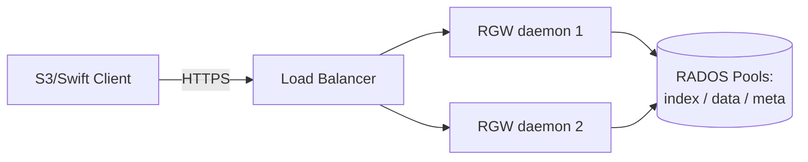

---
tags:
  - ceph
  - rgw
  - storage-interfaces
  - object-storage
---

# RGW - Object Storage Gateway

RGW (**RADOS Gateway**) là interface **object storage** của Ceph — expose dữ liệu qua HTTP API tương thích **Amazon S3** và **OpenStack Swift**. Đây là interface **không có tương đương trực tiếp** trong thế giới VMware/vSAN thuần túy — gần nhất về mặt tư duy là tự vận hành một dịch vụ kiểu S3/MinIO nội bộ.

> [!tip] So với VMware vSAN
> vSAN không có khái niệm object storage kiểu S3 — không có gì để so sánh 1-1. Nếu bạn từng dùng AWS S3, MinIO, hoặc Azure Blob Storage, RGW gần với nhóm đó hơn nhiều: application gọi HTTP API (`PUT`/`GET`/`DELETE` object trong bucket) thay vì mount block device hay filesystem.

## Kiến trúc: daemon HTTP stateless đứng trước RADOS

RGW là 1 daemon HTTP **stateless** — không tự lưu trữ gì, mọi object/metadata cuối cùng đều nằm trong các RADOS pool phía sau (`.rgw.root`, `<zone>.rgw.buckets.index`, `<zone>.rgw.buckets.data`, ...). Vì stateless, RGW scale ngang dễ dàng — chạy nhiều instance RGW sau load balancer, instance nào chết cũng không mất trạng thái.



```bash
# Deploy RGW qua cephadm, gắn vào 1 zone cụ thể
ceph orch apply rgw myorg --realm=default --zone=default --placement="3"

# Kiểm tra RGW daemon đang chạy
ceph orch ps --daemon-type rgw
```

## Realm / Zonegroup / Zone — nền tảng cho multi-site

RGW tổ chức namespace theo 3 lớp phân cấp, thiết kế sẵn để hỗ trợ multi-site replication:

| Cấp | Ý nghĩa |
|---|---|
| **Realm** | Container cao nhất, chứa toàn bộ cấu hình namespace (dùng khi cần multi-site hoàn toàn tách biệt) |
| **Zonegroup** | Nhóm các zone (thường ứng với 1 khu vực địa lý), định nghĩa zone nào là master |
| **Zone** | 1 cụm RGW cụ thể + pool RADOS cụ thể (thường = 1 Ceph cluster hoặc 1 site) |

Với triển khai single-site (phổ biến nhất khi mới bắt đầu), bạn vẫn có 1 realm/zonegroup/zone mặc định dù không cấu hình gì thêm — chúng chỉ "vô hình" cho tới khi cần bật multi-site. Chi tiết đầy đủ về replication giữa các zone, failover, và stretch cluster nằm ở [[Multi-site RGW & Stretch Cluster]] — note này chỉ giới thiệu khái niệm nền.

## Bucket Index Sharding — điểm dễ vấp nhất khi vận hành RGW

Mỗi bucket có 1 **bucket index** — cấu trúc omap lưu danh sách object trong bucket đó, dùng để phục vụ `LIST` nhanh. Mặc định, bucket index của 1 bucket nằm trên **1 object RADOS duy nhất** (1 shard) trừ khi được sharding. Khi bucket có hàng triệu object, hoặc chịu tải PUT/DELETE cao, thao tác cập nhật index (mỗi PUT/DELETE đều phải update index) dồn hết vào 1 object → **1 OSD (hoặc 1 PG) trở thành hotspot**, latency tăng vọt dù cluster tổng thể còn dư tài nguyên.

```bash
# Kiểm tra số shard hiện tại của 1 bucket
radosgw-admin bucket stats --bucket=mybucket | grep num_shards

# Reshard thủ công (offline với bản cũ, online với dynamic resharding bản mới)
radosgw-admin bucket reshard --bucket=mybucket --num-shards=16

# Bật dynamic resharding tự động (mặc định đã bật từ Luminous trở đi)
ceph config set client.rgw rgw_dynamic_resharding true
ceph config set client.rgw rgw_max_objs_per_shard 100000
```

| Cấu hình | Ý nghĩa |
|---|---|
| `rgw_dynamic_resharding` | Tự động tăng số shard khi bucket vượt ngưỡng object/shard |
| `rgw_max_objs_per_shard` | Ngưỡng object trên mỗi shard trước khi kích hoạt reshard (mặc định ~100,000) |
| `rgw_reshard_num_logs` | Số log shard dùng trong quá trình reshard |

## Quản lý user & quota

```bash
# Tạo user S3
radosgw-admin user create --uid=app-01 --display-name="App 01" --email=app01@example.com

# Xem access key / secret key vừa tạo
radosgw-admin user info --uid=app-01

# Set quota theo user (giới hạn dung lượng + số object)
radosgw-admin quota set --uid=app-01 --quota-scope=user --max-size=1T --max-objects=1000000
radosgw-admin quota enable --uid=app-01 --quota-scope=user

# Thống kê 1 bucket
radosgw-admin bucket stats --bucket=mybucket
```

## Placement Targets & Storage Class — tiering

RGW cho phép định nghĩa nhiều **placement target**, mỗi target trỏ tới 1 pool RADOS khác nhau (VD: pool replicated cho dữ liệu "hot", pool erasure-coded cho dữ liệu "cold/archive") — tương tự khái niệm S3 Storage Class (Standard vs Infrequent Access vs Glacier), nhưng tự vận hành trên hạ tầng của chính bạn.

```bash
# Thêm storage class mới trỏ tới pool erasure-coded (cold storage)
radosgw-admin zonegroup placement add --rgw-zonegroup=default \
  --placement-id=default-placement --storage-class=COLD

radosgw-admin zone placement add --rgw-zone=default \
  --placement-id=default-placement --storage-class=COLD \
  --data-pool=default.rgw.buckets.data.ec
```

> [!warning] Lesson learned: bucket index thành hotspot vì thiếu sharding cho workload churn cao
> Một bucket dùng làm "landing zone" cho workload ghi/xóa liên tục (VD: log ingestion, temp upload pipeline) mà không được reshard kịp thời sẽ khiến 1-2 OSD chứa index shard bị bão hòa IOPS trong khi các OSD khác của cluster gần như rảnh — triệu chứng dễ gây nhầm lẫn vì `ceph df`/`ceph osd df` tổng thể vẫn trông "bình thường", chỉ latency PUT/DELETE của riêng bucket đó tăng bất thường. `rgw_dynamic_resharding` có giúp, nhưng **không phải phép màu**: nó chỉ kích hoạt khi vượt ngưỡng object/shard (chứ không phải theo tốc độ ghi), và bản thân quá trình reshard cũng tốn I/O, có thể gây gián đoạn ngắn cho chính bucket đang được reshard. Với bucket biết trước sẽ chịu tải cao, nên set `--num-shards` hợp lý ngay từ lúc tạo thay vì trông chờ hoàn toàn vào cơ chế tự động.

---
*Xem thêm: [[Multi-site RGW & Stretch Cluster]] | [[Pools, Replication & Erasure Coding]] | [[RBD - Block Storage]] | [[Ceph|Ceph]]*
