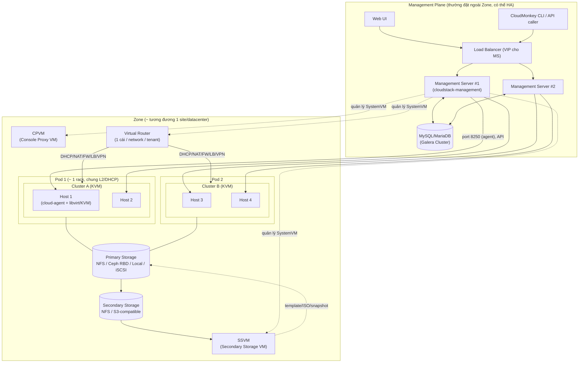

---
tags:
  - cloud
  - cloudstack
  - overview
aliases:
  - CloudStack Overview
  - CloudStack Index
  - Apache CloudStack
---

# Apache CloudStack

Apache CloudStack là nền tảng **IaaS (Infrastructure-as-a-Service)** mã nguồn mở, cho phép triển khai và quản lý datacenter cloud với nhiều hypervisor (KVM, VMware vSphere, XenServer/XCP-ng, Hyper-V). Ban đầu do Cloud.com phát triển, được Citrix mua lại, sau đó donate cho Apache Software Foundation (2012) — hiện là **Apache Top-Level Project**.

> [!tip] Nếu bạn quen VMware — hãy hình dung thế này
> CloudStack **không phải** là "vCenter mã nguồn mở". Nó gần với **vCloud Director + vCenter gộp lại** hơn: vừa quản lý hạ tầng hypervisor (như vCenter), vừa có sẵn multi-tenancy, self-service portal, billing/usage, network-as-a-service (như vCD/NSX) ngay từ lõi. Với KVM, CloudStack **là** lớp quản lý hypervisor luôn (không có "vCenter" ở giữa) — đây là khác biệt tư duy lớn nhất khi chuyển từ VMware sang.

## Bản đồ kiến thức

```mermaid
graph TD
    CS[CloudStack] --> CC[Core Components]
    CS --> NET[Networking]
    CS --> STG[Storage]
    CS --> IDN[Identity & Multi-tenancy]
    CS --> DEP[Deployment]
    CS --> HA[HA & Scalability]
    CS --> OPS[Operations]
    CS --> SEC[Security]
    CS --> CMP[Comparison]
    CS --> PRE[Prerequisites]

    CC --> ZPC[Zones, Pods, Clusters, Hosts]
    CC --> MS[Management Server]
    CC --> SVM[System VMs: SSVM/CPVM/VR]
    CC --> HV[Hypervisor Support]

    NET --> NAO[Network Architecture Overview]
    NET --> BAV[Basic vs Advanced Networking]
    NET --> VPC[VPC & Isolated Networks]
    NET --> VR2[Virtual Router Deep Dive]
    NET --> SG[Security Groups & ACLs]

    STG --> SO[Storage Overview]
    STG --> PS[Primary Storage Backends]
    STG --> SS[Secondary Storage, Snapshots & Backups]

    IDN --> ADP[Accounts, Domains & Projects]
    IDN --> RBAC[RBAC & Roles]
    IDN --> OFF[Service/Disk/Network Offerings]

    DEP --> DM[Deployment Models]
    DEP --> IM[Installation Methods]

    HA --> HAA[HA Architecture]
    HA --> DBHA[Database HA - MySQL Galera]
    HA --> SCALE[Scaling the Infrastructure]

    OPS --> CLI[CLI & API - CloudMonkey]
    OPS --> D2[Day 2 Operations]
    OPS --> MON[Monitoring & Alerting]
    OPS --> TB[Troubleshooting]
    OPS --> UP[Upgrade Procedure]
    OPS --> KEY[Key Configuration Reference]
    OPS --> LL[Lessons Learned & Common Pitfalls]

    SEC --> SECC[Security Considerations]

    CMP --> CMPD[CloudStack vs VMware vs OpenStack]
```



## Sơ đồ triển khai thực tế

Sơ đồ dưới thể hiện một triển khai CloudStack điển hình với hypervisor KVM (mô hình phổ biến nhất trong production self-hosted):



> [!info] Đọc sơ đồ này thế nào
> - **Management Server** không nằm trong đường dữ liệu (data path) của VM — nó chỉ điều phối (control plane). Nếu MS chết, **VM đang chạy vẫn sống bình thường**, chỉ là không tạo/sửa/xóa được gì mới. Đây là khác biệt quan trọng so với vCenter (ESXi cũng vậy — VM sống độc lập với vCenter — nên tư duy này không xa lạ với dân VMware).
> - **System VM** (SSVM, CPVM, VR) là các VM đặc biệt do CloudStack tự tạo/quản lý, chạy trên chính hạ tầng KVM/hypervisor đó — không phải "external appliance".

## Phân cấp tổ chức tài nguyên

| CloudStack | Vai trò | Tương đương bên VMware (gần đúng) |
|---|---|---|
| **Zone** | Đơn vị lớn nhất, thường = 1 datacenter/site. Chứa Pod(s), Secondary Storage, Public IP range | 1 vCenter Datacenter (hoặc 1 vCenter instance) |
| **Pod** | Nhóm host chung 1 dải mạng quản lý/L2 (thường = 1 rack) | Không có khái niệm 1-1; gần giống 1 nhóm rack chung TOR switch |
| **Cluster** | Nhóm host chia sẻ chung Primary Storage, hỗ trợ live migration trong cluster | vSphere Cluster (giống nhất — cùng khái niệm shared-storage + migration domain) |
| **Host** | Máy vật lý chạy hypervisor (KVM/ESXi/XenServer) | ESXi Host |
| **Primary Storage** | Nơi chứa disk của VM đang chạy | Datastore |
| **Secondary Storage** | Nơi chứa template, ISO, snapshot | Gần giống Content Library + kho backup gộp lại |

> [!warning] Nhầm lẫn thường gặp: Pod ≠ Cluster
> Dân mới hay nhầm Pod với Cluster. **Pod là ranh giới mạng** (DHCP cho system VM, management network), **Cluster là ranh giới storage + migration**. Một Pod có thể chứa nhiều Cluster, nhưng một Cluster không thể trải nhiều Pod. Thiết kế sai layer này ở giai đoạn đầu rất khó sửa sau khi đã có VM chạy.

## Core Components

| Thành phần | Chức năng | Ghi chú |
|---|---|---|
| [[CloudStack Management Server\|Management Server]] | Control plane: API, scheduler, orchestration | Java (Spring), stateless — HA bằng cách chạy nhiều instance sau LB |
| [[Zones, Pods, Clusters & Hosts]] | Mô hình phân cấp hạ tầng vật lý/logic | Xem bảng trên |
| [[System VMs - SSVM, CPVM & Virtual Router\|System VMs]] | SSVM, CPVM, Virtual Router — các VM hệ thống tự động | Tự "hồi sinh" (recreate) nếu chết |
| [[Hypervisor Support - KVM, VMware & Others\|Hypervisor Support]] | KVM, VMware, XenServer/XCP-ng, Hyper-V | Đa số production self-hosted dùng **KVM** |

## Networking

- [[CloudStack Network Architecture Overview]] — traffic types, physical network, isolation method
- [[Basic vs Advanced Networking]] — 2 mô hình mạng nền tảng, khác biệt căn bản
- [[VPC & Isolated Networks]] — multi-tier network, tier, ACL
- [[Virtual Router Deep Dive]] — trái tim của networking trong CloudStack
- [[Security Groups & Network ACLs]] — firewall ở 2 lớp khác nhau

## Storage

- [[CloudStack Storage Overview]] — phân loại storage, storage tags
- [[Primary Storage Backends]] — NFS, Ceph/RBD, local, SAN/iSCSI, so sánh
- [[Secondary Storage, Snapshots & Backups]] — template, ISO, snapshot, backup

> [!note] Vault riêng cho Ceph
> Nếu Primary Storage đang dùng Ceph/RBD, xem vault chi tiết [[Ceph|Ceph]] — kiến trúc, vận hành, debug, security, và [[Ceph with CloudStack]] cho phần tích hợp cụ thể với CloudStack.

## Identity & Multi-tenancy

- [[Accounts, Domains & Projects (CloudStack)]] — mô hình multi-tenant
- [[RBAC & Roles (CloudStack)]] — role-based access control
- [[Service, Disk & Network Offerings]] — "flavor" của CloudStack

## Deployment

- [[CloudStack Deployment Models]] — POC, single-node, multi-node, multi-zone
- [[CloudStack Installation Methods]] — package-based, ACS-KVM automation, Terraform/Ansible

## HA & Scalability

- [[CloudStack HA Architecture]] — HA ở từng tầng: MS, DB, host, VM, network
- [[Database HA - MySQL Galera]] — MySQL/MariaDB Galera cluster cho CloudStack DB
- [[Scaling the Infrastructure]] — mở rộng zone/pod/cluster/host

## Operations

- [[CLI & API - CloudMonkey]] — cmk, REST API, signature
- [[CloudStack Day 2 Operations]] — vận hành thường ngày, maintenance mode, backup
- [[CloudStack Monitoring & Alerting]] — Prometheus exporter, usage server, alert
- [[CloudStack Troubleshooting]] — log files, common issues, debug flow
- [[CloudStack Upgrade Procedure]] — quy trình nâng cấp an toàn
- [[Key Configuration Reference]] — các config/setting hay dùng, phải nhớ
- [[Lessons Learned & Common Pitfalls]] — kinh nghiệm xương máu khi vận hành

## Security

- [[CloudStack Security Considerations]] — attack surface, misconfiguration, hardening checklist

## So sánh

- [[CloudStack vs VMware vs OpenStack]] — ưu/nhược điểm, khi nào chọn cái gì

## Prerequisites

[[CloudStack Prerequisites]] — kiến thức nền cần có trước khi nhận bàn giao/vận hành CloudStack

## Phiên bản

Ghi chú này viết dựa trên dòng **Apache CloudStack 4.19.x / 4.20.x** (thế hệ mới nhất tính đến thời điểm viết). CloudStack không theo lịch release cố định chặt như OpenStack; luôn kiểm tra đúng version đang chạy trong môi trường bàn giao bằng:

```bash
cloudmonkey list infos filter=cloudstackversion   # hoặc
mysql -u cloud -p -e "SELECT version FROM cloud.version ORDER BY id DESC LIMIT 5;"
# hoặc trong UI: Infrastructure > About
```

> [!warning] Đọc trước khi làm bất cứ điều gì trên hệ thống bàn giao
> Trước khi chạm vào bất kỳ config nào, hãy xác nhận: (1) version chính xác, (2) hypervisor đang dùng (KVM/VMware/khác), (3) networking mode (Basic hay Advanced/VPC), (4) có bao nhiêu Management Server và có HA DB không. Bốn thông tin này quyết định gần như toàn bộ cách bạn debug và thao tác an toàn — xem thêm [[Lessons Learned & Common Pitfalls]].
