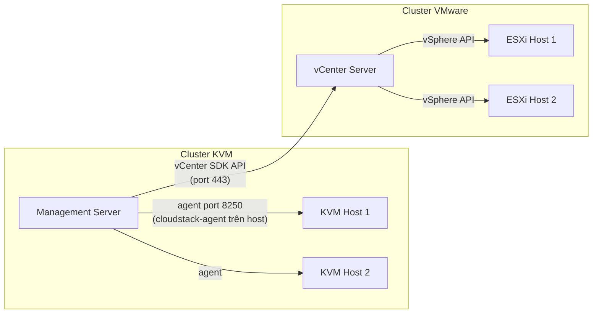

---
tags:
  - cloudstack
  - core-components
  - hypervisor
---

# Hypervisor Support — KVM, VMware & Others

CloudStack là **orchestration layer đa hypervisor** — hỗ trợ KVM, VMware vSphere, XenServer/XCP-ng, Hyper-V (mức hỗ trợ khác nhau tùy version). Đây là điều quan trọng nhất cần hiểu khi chuyển tư duy từ dân VMware thuần sang: **cách CloudStack "nói chuyện" với hypervisor khác hẳn nhau tùy loại.**

## Điểm mấu chốt: CloudStack quản lý KVM trực tiếp, nhưng quản lý VMware gián tiếp qua vCenter



> [!warning] Nhầm lẫn nguy hiểm nhất khi mới chuyển sang CloudStack
> Nếu hạ tầng dùng **hypervisor VMware**, CloudStack **KHÔNG thay thế vCenter** — nó vẫn cần vCenter tồn tại và hoạt động, chỉ orchestrate ở tầng trên (giống một "vRealize Automation" gọi vào vCenter). Ngược lại, nếu hạ tầng dùng **KVM**, CloudStack chính là lớp quản lý duy nhất — không có gì ở giữa. Xác định rõ hypervisor đang dùng **trước khi** giả định bất kỳ hành vi nào giống/khác VMware.

## So sánh nhanh các hypervisor được hỗ trợ

| Hypervisor | Cơ chế quản lý | Live Migration | Phổ biến trong production self-hosted | Ghi chú |
|---|---|---|---|---|
| **KVM** | `cloudstack-agent` cài trực tiếp trên host, giao tiếp qua libvirt | Có (cùng cluster, cần shared storage hoặc NFS) | **Phổ biến nhất** — free, ổn định, cộng đồng lớn | Cần hiểu libvirt/qemu để debug sâu |
| **VMware vSphere** | Qua vCenter API, không cài gì lên ESXi | Có (dùng vMotion thật sự qua vCenter) | Phổ biến khi công ty đã có sẵn license VMware, muốn thêm self-service layer | Vẫn tốn license VMware; CloudStack chỉ là lớp orchestration thêm vào |
| **XenServer/XCP-ng** | Qua XenAPI | Có | Giảm dần, nhưng vẫn có (đặc biệt XCP-ng vì free) | Lịch sử: CloudStack bắt nguồn từ Cloud.com/Citrix nên hỗ trợ Xen rất sâu |
| **Hyper-V** | Qua WinRM/System Center | Có (giới hạn hơn) | Hiếm trong self-hosted Linux-first shop | Ít tài liệu/cộng đồng hơn |

> [!info] Vì sao đa số triển khai self-hosted chọn KVM
> Không tốn license, hiệu năng gần bằng bare-metal, và **CloudStack + KVM là tổ hợp được cộng đồng test/patch nhiều nhất**. Nếu hệ thống bạn sắp nhận bàn giao chạy production nghiêm túc không phải trên VMware sẵn có, nhiều khả năng cao là **KVM**.

## Đặc thù khi hypervisor là KVM

### Agent & giao tiếp

```bash
# Trên KVM host — kiểm tra agent
systemctl status cloudstack-agent
tail -f /var/log/cloudstack/agent/agent.log

# File cấu hình chính
/etc/cloudstack/agent/agent.properties
```

```properties
# agent.properties — các key hay cần kiểm tra
guid=<uuid định danh host, KHÔNG được trùng, KHÔNG tự đổi tay>
host=<IP management server hoặc VIP của LB>
resource=com.cloud.hypervisor.kvm.resource.LibvirtComputingResource
private.network.device=cloudbr0
public.network.device=cloudbr0
```

> [!warning] Lesson learned: đừng bao giờ tự sửa `guid` trong agent.properties
> `guid` là định danh duy nhất của host trong DB CloudStack. Nếu bị đổi (kể cả vô tình khi clone VM template làm host, hoặc restore file cấu hình từ host khác), Management Server sẽ **nhận nhầm host này là 1 host hoàn toàn khác** hoặc từ chối kết nối. Khi build host mới, luôn để CloudStack tự sinh `guid`, không copy nguyên file `agent.properties` từ host cũ sang.

### Networking trên KVM host

- CloudStack yêu cầu **Linux bridge** hoặc **OpenVSwitch** đã cấu hình sẵn trên host trước khi add vào CloudStack (`cloudbr0` là tên quy ước phổ biến, không bắt buộc).
- CloudStack **không tự tạo bridge vật lý** — bạn (hoặc automation/Ansible) phải chuẩn bị network trước; CloudStack chỉ tạo VLAN sub-interface/tap device gắn vào bridge có sẵn.

> [!tip] So với vSphere Distributed Switch
> vDS được quản lý hoàn toàn qua vCenter UI/API, không cần đụng OS. Với KVM, bridge là **thuần Linux networking** (`brctl`, `ip link`, netplan/ifcfg) — nếu ai đó sửa network config trực tiếp trên OS host (ngoài tầm kiểm soát CloudStack), CloudStack sẽ không biết và có thể gây mismatch giữa state DB và thực tế.

### Storage trên KVM

KVM host truy cập Primary Storage qua NFS mount trực tiếp, hoặc qua libvirt storage pool (RBD cho Ceph, iSCSI/SAN). Xem chi tiết ở [[Primary Storage Backends]].

## Trộn nhiều hypervisor trong 1 Zone có được không?

**Có** — 1 Zone có thể chứa nhiều Cluster, mỗi Cluster là 1 loại hypervisor khác nhau (VD: Cluster A là KVM, Cluster B là VMware). CloudStack sẽ tự lọc offering/template phù hợp hypervisor khi deploy VM. Đây là điểm hữu ích khi **di dân dần dần** từ VMware sang KVM mà không cần big-bang migration.

> [!tip] Chiến lược thường gặp khi công ty đang muốn thoát VMware
> Giữ Cluster VMware hiện tại chạy qua CloudStack (tận dụng license còn hạn), đồng thời build Cluster KVM mới song song trong cùng Zone, rồi di chuyển VM dần bằng cách tạo lại (không live-migrate được **giữa 2 hypervisor khác nhau** — phải qua bước export/import template hoặc dùng volume migration có hỗ trợ).

---
*Xem thêm: [[Zones, Pods, Clusters & Hosts]] | [[Primary Storage Backends]] | [[CloudStack vs VMware vs OpenStack]] | [[Cloudstack|CloudStack]]*
