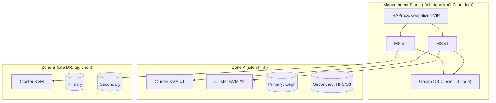

---
tags:
  - cloudstack
  - deployment
---

# CloudStack Deployment Models

## Các mô hình phổ biến

| Mô hình | Đặc điểm | Khi nào dùng |
|---|---|---|
| **All-in-One (POC)** | 1 máy chạy cả Management Server + KVM host + Primary/Secondary Storage local | Lab, test, học |
| **Single Zone, Multi-node** | 1+ Management Server, nhiều Pod/Cluster/Host, storage tách riêng | Production quy mô vừa — mô hình phổ biến nhất |
| **Multi-Zone** | Nhiều Zone (nhiều site vật lý/datacenter), 1 tập Management Server điều phối chung (hoặc theo region) | Doanh nghiệp nhiều site, cần DR giữa các site |
| **Multi-Zone with Region** (nâng cao) | Nhiều "Region" độc lập gần như hoàn toàn, chỉ chia sẻ 1 phần identity | Rất lớn, hiếm gặp ngoài các nhà cung cấp cloud public quy mô lớn |

> [!tip] So với VMware
> Single Zone Multi-node gần giống 1 **vCenter quản lý nhiều Cluster ESXi** trong 1 Datacenter object. Multi-Zone gần giống **Linked Mode giữa nhiều vCenter** ở các site khác nhau — nhưng CloudStack quản lý tập trung chặt hơn (1 control plane logic, không rời rạc như Linked Mode chỉ chia sẻ view).

## Kiến trúc production khuyến nghị (thực tế thường gặp)

> [!warning] Lesson learned: Management Server đặt trong cùng Zone nó quản lý = rủi ro vòng lặp phụ thuộc
> Nhiều triển khai nhỏ đặt luôn Management Server dưới dạng VM **bên trong chính Zone** mà nó quản lý (tiết kiệm hạ tầng). Rủi ro: nếu Zone gặp sự cố nghiêm trọng (network/storage) ảnh hưởng đúng host chứa MS, bạn **mất luôn khả năng điều khiển để khắc phục** — vừa là nạn nhân vừa là công cụ cứu hộ. Khuyến nghị (nếu hạ tầng cho phép): đặt Management Server + DB trên hạ tầng **độc lập** với Zone nó quản lý, hoặc ít nhất khác Cluster/khác nguồn điện-network.

## Chọn số lượng Zone/Pod/Cluster — nguyên tắc thiết kế

- **Zone**: theo ranh giới vật lý thật (site/datacenter), không tách zone chỉ vì lý do logic/tổ chức (dùng Domain/Account cho việc đó).
- **Pod**: theo ranh giới L2/rack thật — đừng vẽ pod theo mong muốn tổ chức nếu thực tế switch không cho phép.
- **Cluster**: theo ranh giới shared storage + cùng hypervisor. Cluster nhỏ (4-8 host) dễ vận hành, dễ tính toán capacity dự phòng cho maintenance/HA hơn cluster khổng lồ.

> [!tip] Kinh nghiệm cỡ cluster
> Cluster quá nhỏ (2-3 host) khiến việc đưa 1 host vào maintenance rất khó (không đủ chỗ chứa VM di dời). Cluster quá lớn (>32 host) làm tăng blast radius nếu Primary Storage dùng chung gặp sự cố, và một số thao tác quản trị (rolling upgrade agent) mất nhiều thời gian hơn. Cỡ phổ biến trong thực tế: **6-16 host/cluster** tùy tải.

---
*Xem thêm: [[Zones, Pods, Clusters & Hosts]] | [[CloudStack Installation Methods]] | [[CloudStack HA Architecture]] | [[Cloudstack|CloudStack]]*
