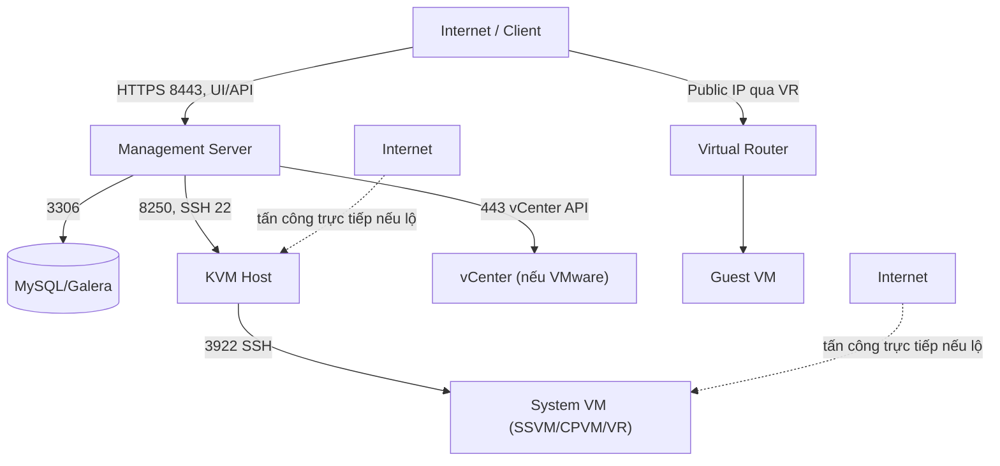

---
tags:
  - cloudstack
  - security
  - hardening
---

# CloudStack Security Considerations

## Attack Surface — các mặt tấn công chính

| Bề mặt | Rủi ro chính |
|---|---|
| **Management Server UI/API** | Brute-force login, API key/secret bị lộ, session hijacking nếu không dùng HTTPS |
| **API signature (HMAC)** | Secret key bị lộ (log, code commit, script chia sẻ) = toàn quyền theo scope account đó |
| **Database (MySQL/Galera)** | Chứa toàn bộ credential/config hệ thống — là mục tiêu giá trị cao nhất nếu bị truy cập trái phép |
| **KVM Host (SSH, agent port 8250)** | Nếu bị chiếm quyền = chiếm luôn mọi VM chạy trên đó (đọc trực tiếp disk qua libvirt) |
| **System VM (SSVM/CPVM/VR)** | Nếu lộ ra ngoài internet trực tiếp (thiếu firewall) = có thể bị khai thác làm bàn đạp vào mạng nội bộ |
| **Virtual Router / Guest Network** | Cấu hình Security Group/ACL/Firewall Rule sai = mở toang network nội bộ tenant ra internet |
| **Secondary Storage (NFS/S3)** | Nếu NFS export quá lỏng lẻo (`no_root_squash`, mở cho mọi IP) = có thể đọc/ghi template, snapshot của toàn hệ thống |
| **LDAP/SAML integration** | Cấu hình sai có thể cho phép bypass hoặc leak thông tin thư mục nội bộ |

## Các misconfiguration thường gây breach nhất

> [!warning] 1. NFS export cho Primary/Secondary Storage quá lỏng lẻo
> `no_root_squash` + export cho `*` (mọi IP) thay vì giới hạn đúng dải IP host/SSVM là lỗi phổ biến nhất. Hậu quả: bất kỳ máy nào truy cập được vào mạng storage đều có thể **đọc trực tiếp disk image của mọi VM** (bao gồm cả VM chứa dữ liệu nhạy cảm) mà không cần qua CloudStack API/RBAC nào cả — hoàn toàn bỏ qua lớp kiểm soát truy cập của CloudStack.

> [!warning] 2. Secret Key/API Key nhúng thẳng trong script, commit vào git, hoặc share qua chat
> Vì secret key dùng để ký HMAC cho **mọi API call với quyền của account đó**, lộ secret key tương đương lộ toàn bộ quyền hạn account (có thể là Domain Admin hoặc Root Admin nếu dùng nhầm account mạnh cho automation). Không bao giờ dùng account Root Admin cho script tự động — luôn tạo account/role riêng với quyền tối thiểu cần thiết (xem [[RBAC & Roles (CloudStack)]]).

> [!warning] 3. Management Server UI/API expose thẳng ra internet không qua VPN/bastion
> Port 8080/8443 mở trực tiếp ra internet biến MS thành mục tiêu brute-force trực tiếp. Nên đặt sau VPN, bastion host, hoặc ít nhất giới hạn theo IP allowlist (firewall/security group ở tầng hạ tầng vật lý, không phải CloudStack).

> [!warning] 4. Dùng chung 1 Account/Role cho nhiều mục đích khác nhau (con người + automation)
> Khi 1 account vừa được người vận hành đăng nhập UI hàng ngày, vừa được dùng làm API key cho Terraform/CI, việc audit "ai đã làm gì" trở nên bất khả thi (mọi hành động đều gắn chung 1 identity), và xoay vòng credential trở nên rủi ro cao hơn (ảnh hưởng cả 2 use case cùng lúc).

> [!warning] 5. Security Group/Network ACL để default quá lỏng ("Allow all" từ 0.0.0.0/0)
> Đặc biệt dễ xảy ra khi copy rule mẫu từ tài liệu/community mà không siết lại CIDR nguồn cho môi trường production thật. Luôn rà soát rule ingress cho phép SSH/RDP/DB port từ `0.0.0.0/0` — đây là nguyên nhân breach phổ biến nhất trên mọi nền tảng cloud, không riêng CloudStack.

> [!warning] 6. System VM template cũ, không được vá lỗi định kỳ
> SSVM/CPVM/VR chạy trên Debian-based template — nếu Zone dùng template quá cũ (từ lúc setup ban đầu, chưa từng update) có thể tồn tại lỗ hổng OS đã biết công khai. Cần theo dõi và cập nhật system VM template theo khuyến nghị mỗi khi upgrade CloudStack.

> [!warning] 7. Không tách biệt Management traffic và Guest traffic
> Nếu traffic quản lý (giữa MS và Host Agent, port 8250) đi chung VLAN/mạng với Guest traffic của tenant, một VM tenant bị compromise có khả năng **tấn công trực tiếp vào control plane** (scan port 8250, thử khai thác agent) thay vì bị giới hạn hoàn toàn trong Guest Network cô lập.

## Hardening Checklist tối thiểu

### Control Plane

- [ ] MS UI/API chỉ truy cập qua HTTPS (tắt HTTP thuần port 8080 ra ngoài nếu có thể, hoặc giới hạn firewall)
- [ ] Đặt MS/API sau VPN hoặc bastion, không expose thẳng ra internet
- [ ] Bật/verify audit log (`cmk list events`) và lưu trữ tập trung (SIEM/log server ngoài MS)
- [ ] Root Admin account: đổi password mặc định, hạn chế số người có quyền này tối đa
- [ ] Tạo Role riêng theo nguyên tắc least-privilege cho từng nhóm người dùng/automation (xem [[RBAC & Roles (CloudStack)]])
- [ ] Không tái sử dụng 1 Account cho cả người dùng thật và automation script

### Database

- [ ] MySQL/Galera chỉ lắng nghe trên mạng nội bộ, không expose port 3306 ra ngoài
- [ ] Password DB đủ mạnh, không dùng chung với password khác trong hạ tầng
- [ ] Backup DB được mã hóa khi lưu trữ, đặc biệt nếu lưu ngoài datacenter chính

### Network

- [ ] Tách VLAN/mạng riêng cho Management, Guest, Storage, Public traffic (xem [[CloudStack Network Architecture Overview]])
- [ ] Rà soát toàn bộ Security Group/Network ACL/Firewall Rule đang có, loại bỏ rule `0.0.0.0/0` không thực sự cần thiết
- [ ] Giới hạn truy cập SSH vào KVM Host chỉ từ mạng quản trị/bastion, dùng key-based auth, tắt password auth
- [ ] Giới hạn truy cập SSH vào System VM chỉ từ Management Server (mặc định qua Link Local, nhưng verify lại)

### Storage

- [ ] NFS export Primary/Secondary Storage giới hạn đúng dải IP cần thiết, tránh `no_root_squash` nếu không bắt buộc
- [ ] Ceph cephx key theo nguyên tắc least-privilege (pool riêng cho CloudStack, không dùng key admin toàn quyền)
- [ ] Mã hóa dữ liệu tại tầng lưu trữ nếu yêu cầu compliance (LUKS cho local disk, encryption at rest cho Ceph/SAN nếu hỗ trợ)

### Vận hành liên tục

- [ ] Xoay vòng API Key/Secret Key định kỳ theo policy, có quy trình cập nhật đồng bộ cho mọi consumer (script/CI)
- [ ] Cập nhật System VM Template và package agent/management theo lịch vá lỗi bảo mật
- [ ] Định kỳ review danh sách Account/Domain/Role — xóa account không còn dùng (đặc biệt sau khi nhân sự nghỉ việc)
- [ ] Test khôi phục từ backup DB định kỳ, không chỉ tin tưởng job backup "đang chạy"

---
*Xem thêm: [[Security Groups & Network ACLs]] | [[RBAC & Roles (CloudStack)]] | [[Key Configuration Reference]] | [[Lessons Learned & Common Pitfalls]] | [[Cloudstack|CloudStack]]*
