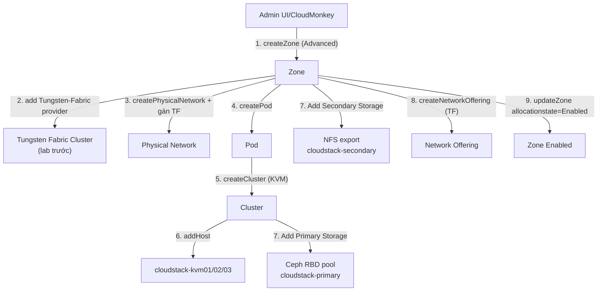

---
tags:
  - cloudstack
  - lab
  - networking
  - zone
---

# CloudStack Advanced Zone - Triển khai Network SDN và Storage

- **Bối cảnh và vấn đề**: Đây là lab "ráp nối" toàn bộ hạ tầng đã dựng ở các lab trước (Control Plane, Ceph Storage, Compute Node, Tungsten Fabric) thành một Zone CloudStack hoàn chỉnh. Zone/Physical Network/Isolation method **không đổi được sau khi tạo** — sai một quyết định ở đây đồng nghĩa phải tạo lại Zone mới từ đầu.
- **Cách giải quyết**: Tạo Zone kiểu **Advanced**, đăng ký Tungsten Fabric làm Network Service Provider ngay từ Physical Network đầu tiên, tạo Pod + Cluster (KVM), add 3 host đã chuẩn bị, cấu hình Public IP range, gắn Primary/Secondary Storage vào Ceph cluster đã dựng, tạo Network Offering dùng Tungsten Fabric, rồi mới Enable Zone.
- **Kết quả sau khi hoàn thành**: Một Zone Advanced hoàn chỉnh, đủ điều kiện deploy VM — network do Tungsten Fabric SDN quản lý, storage chạy trên Ceph, compute chạy trên 3 KVM host HA. Bước cuối cùng của series là [[CloudStack Template - Import Guest OS Template và Deploy VM đầu tiên]].

> [!NOTE]
> Lab này đi theo đúng checklist thứ tự dựng Zone đã ghi trong [[CloudStack Installation Methods]] của vault (bước 3-10 trong checklist đó). Không đổi thứ tự các milestone bên dưới — Add Host cần bridge/vRouter đã sẵn sàng trước, Add Storage cần Pod/Cluster đã tồn tại trước.

## Prerequisites

- **Hạ tầng**: Cả 4 lab trước trong series đã hoàn tất và healthy:
  - [[CloudStack Control Plane - Triển khai Management Server HA và Galera Database]] — UI/API reachable qua VIP.
  - [[Ceph Cluster - Triển khai Primary và Secondary Storage cho CloudStack]] — `ceph -s` = `HEALTH_OK`, đã có pool `cloudstack-primary` và NFS export `cloudstack-secondary`.
  - [[CloudStack Compute Node - Chuẩn bị KVM Hypervisor Host]] — 3 host sẵn sàng.
  - [[Tungsten Fabric - Triển khai SDN Controller cho CloudStack]] — `contrail-status` toàn bộ `active`, vRouter đã peer XMPP.
- **Máy chủ / VM**: không thêm node mới ở lab này — chỉ cấu hình logic trên hạ tầng đã có.
- **Tài khoản và quyền**: tài khoản `admin` trên CloudStack UI (đã đổi password ở lab Control Plane).
- **Mạng**: dải Public IP range cho Zone, dải Pod (system VM), dải Guest network mặc định — placeholder ở Planning table.
- **Kiến thức nền**: giả định đã đọc [[Zones, Pods, Clusters & Hosts]] và [[VPC & Isolated Networks]] trong vault này.

> [!WARNING]
> Loại networking (Advanced) và Physical Network isolation method **không thể đổi sau khi Zone đã tạo**. Xác nhận lại toàn bộ giá trị ở Planning table trước khi chạy Bước 1 — sai sót ở đây buộc phải xoá Zone và làm lại từ đầu.

## Thông tin Planning liên quan

| Thành phần | Giá trị | Ghi chú |
| --- | --- | --- |
| Tên Zone | `<TBD>` | Networking mode `Advanced` |
| DNS1/DNS2 | `<TBD>` | DNS Zone cấp cho System VM và Guest VM |
| Internal DNS1/DNS2 | `<TBD>` | DNS nội bộ cho System VM |
| Physical Network name | `<TBD>` | 1 physical network duy nhất cho lab này (Management+Public+Guest gộp theo NIC đã chuẩn bị ở lab Compute Node) |
| Tungsten Fabric Provider name | `<TBD>` | Đăng ký trong CloudStack, trỏ vào cụm TF |
| TF Config API endpoint | `https://<tf-controller-vip-hoặc-danh-sách-ip>:8082` | Tham chiếu [[Tungsten Fabric - Triển khai SDN Controller cho CloudStack]] |
| Pod name + CIDR | `<TBD>` | Dải IP cho System VM (SSVM/CPVM/VR) |
| Cluster name | `<TBD>` | Hypervisor `KVM`, `clustertype=CloudManaged` |
| Public IP range | `<TBD>` | Dải Public IP cấp cho Virtual Router SNAT/Static NAT |
| Primary Storage | Pool `cloudstack-primary` | Tham chiếu [[Ceph Cluster - Triển khai Primary và Secondary Storage cho CloudStack]] |
| Secondary Storage | NFS export `cloudstack-secondary` | Tham chiếu [[Ceph Cluster - Triển khai Primary và Secondary Storage cho CloudStack]] |
| Network Offering | `<TBD>` | Provider Tungsten-Fabric, isolated network |

## Diagram



---

## Installation

### Bước 1 - Tạo Zone kiểu Advanced

- Trên UI: **Infrastructure → Zones → Add Zone**, chọn **Advanced**. Tương đương qua CloudMonkey:

```bash
cmk create zone \
  name=<tên-zone> \
  dns1=<dns1> dns2=<dns2> \
  internaldns1=<internal-dns1> internaldns2=<internal-dns2> \
  networktype=Advanced \
  securitygroupenabled=false
```

> [!NOTE]
> `securitygroupenabled=false` vì cô lập Guest network được Tungsten Fabric đảm nhiệm qua overlay + policy riêng, không cần lớp Security Group truyền thống của CloudStack chồng lên trên (tránh 2 lớp cô lập khác cơ chế gây khó debug — xem [[Security Groups & Network ACLs]]).

- Kiểm tra kết quả bước này:

```bash
cmk list zones name=<tên-zone>
```

Kết quả mong đợi: zone xuất hiện, `networktype=Advanced`, `allocationstate=Disabled` (đúng như thiết kế — chỉ enable ở bước cuối).

### Bước 2 - Đăng ký Tungsten Fabric làm Network Service Provider

> [!TODO]
> Tên field chính xác trên UI/API cho phần đăng ký Tungsten Fabric Provider có thể khác nhau giữa các minor version CloudStack — đối chiếu lại với UI thực tế (**Infrastructure → Tungsten-Fabric**) hoặc `cmk sync` để lấy đúng danh sách API/param của version đang cài trước khi chạy.

- Trên UI: **Infrastructure → Tungsten-Fabric → Providers → Add Tungsten-Fabric Provider**, khai báo:

  | Trường | Giá trị |
  | --- | --- |
  | Provider Name | `<TBD>` |
  | Tungsten-Fabric Config API IP(s) | `<ip-tf-controller01>,<ip-tf-controller02>,<ip-tf-controller03>` |
  | Config API Port | `8082` |
  | Introspect Port | `<TBD - xác nhận theo tài liệu TF>` |

- Kiểm tra kết quả bước này: UI hiển thị Provider ở trạng thái kết nối được tới Config API (không báo lỗi timeout).

### Bước 3 - Tạo Physical Network và gán Tungsten Fabric

- Tạo Physical Network cho Zone:

```bash
cmk create physicalnetwork \
  zoneid=<zone-id> \
  name=<physical-network-name>
```

> [!TODO]
> Giá trị `isolationmethods` cho Physical Network dùng Tungsten Fabric cần xác nhận lại đúng theo tài liệu plugin của version CloudStack đang cài (một số bản dùng cờ riêng khi enable TF provider thay vì khai `isolationmethods` như VLAN/VXLAN thông thường) — không đoán giá trị này, tra cứu `docs.cloudstack.apache.org` mục Tungsten-Fabric plugin đúng version trước khi áp dụng production.

- Gán traffic label khớp với interface/bridge đã cấu hình ở [[CloudStack Compute Node - Chuẩn bị KVM Hypervisor Host]] cho từng traffic type trên Physical Network vừa tạo — bước này hay bị bỏ sót vì `create physicalnetwork` ở trên **không** tự gán label, thiếu bước này thì host add vào sau sẽ không biết bridge nào phục vụ traffic nào:

```bash
cmk add traffictype physicalnetworkid=<physical-network-id> traffictype=Management kvmnetworklabel=<bridge-management>
cmk add traffictype physicalnetworkid=<physical-network-id> traffictype=Public kvmnetworklabel=<bridge-public>
cmk add traffictype physicalnetworkid=<physical-network-id> traffictype=Guest kvmnetworklabel=<bridge-guest>
```

> [!NOTE]
> Nếu Management/Public/Guest đều gộp chung 1 NIC/bridge như ghi ở Planning table (`cloudbr0`), cả 3 lệnh trên dùng cùng 1 giá trị `kvmnetworklabel` — vẫn phải khai đủ 3 traffic type, CloudStack không tự suy ra traffic type còn thiếu.

- Riêng traffic type `Guest` cần đăng ký thêm Tungsten Fabric làm Network Service Provider **trên đúng Physical Network này** (khác với việc đăng ký kết nối TF Config API ở Bước 2, vốn chỉ khai báo cụm TF tồn tại ở mức Zone) — CloudStack không cho `update physicalnetwork state=Enabled` thành công nếu các service provider bắt buộc chưa được cấu hình trên physical network:

```bash
cmk list networkserviceproviders physicalnetworkid=<physical-network-id>
cmk update networkserviceprovider id=<tungsten-fabric-provider-id-trên-physical-network-này> state=Enabled
```

> [!TODO]
> Tên chính xác của service provider TF trong `listNetworkServiceProviders` (`TungstenFabric`? `Tungsten-Fabric`?) và việc nó có tự xuất hiện sau khi đăng ký ở Bước 2 hay cần `cmk add networkserviceprovider` thủ công — cần đối chiếu UI **Infrastructure → Zones → \<zone\> → Physical Network → Network Service Providers** thực tế trên version đang cài, vì đây là phần khác biệt nhiều nhất giữa các plugin SDN (NSX/Nuage/TF) qua từng bản CloudStack.

- Bật Physical Network sau khi cấu hình xong:

```bash
cmk update physicalnetwork id=<physical-network-id> state=Enabled
```

- Kiểm tra kết quả bước này:

```bash
cmk list physicalnetworks zoneid=<zone-id>
```

Kết quả mong đợi: `state=Enabled`.

### Bước 4 - Tạo Pod

- Pod xác định dải IP quản lý cho System VM:

```bash
cmk create pod \
  zoneid=<zone-id> \
  name=<pod-name> \
  gateway=<pod-gateway> \
  netmask=<pod-netmask> \
  startip=<pod-start-ip> \
  endip=<pod-end-ip>
```

- Kiểm tra kết quả bước này:

```bash
cmk list pods zoneid=<zone-id>
```

### Bước 5 - Tạo Cluster (KVM)

```bash
cmk create cluster \
  zoneid=<zone-id> \
  podid=<pod-id> \
  clustername=<cluster-name> \
  hypervisor=KVM \
  clustertype=CloudManaged
```

- Kiểm tra kết quả bước này:

```bash
cmk list clusters zoneid=<zone-id>
```

### Bước 6 - Add Host (3 KVM Compute Node)

- Add từng host đã chuẩn bị ở [[CloudStack Compute Node - Chuẩn bị KVM Hypervisor Host]] và đã cài vRouter agent ở [[Tungsten Fabric - Triển khai SDN Controller cho CloudStack]]:

```bash
cmk add host \
  zoneid=<zone-id> podid=<pod-id> clusterid=<cluster-id> \
  hypervisor=KVM \
  url=http://<ip-cloudstack-kvm01> \
  username=root password=<password-hoặc-xác-thực-qua-ssh-key-đã-cấu-hình>
```

Lặp lại cho `cloudstack-kvm02` và `cloudstack-kvm03`.

> [!WARNING]
> Nếu bước này fail giữa chừng, kiểm tra lại đúng thứ tự: bridge Management/Public (`cloudbr0`) phải đã tồn tại, vRouter agent phải đã chạy (`contrail-status` active) trước khi Add Host — Add Host vào một node thiếu 1 trong 2 điều kiện này thường "thành công giả" (host lên `Up` nhưng VM không chạy được).

- Kiểm tra kết quả bước này:

```bash
cmk list hosts zoneid=<zone-id> clusterid=<cluster-id>
```

Kết quả mong đợi: cả 3 host ở trạng thái `Up`, `resourcestate=Enabled`.

### Bước 7 - Add Primary Storage và Secondary Storage

- Thực hiện đúng theo hướng dẫn đã viết chi tiết ở [[Ceph Cluster - Triển khai Primary và Secondary Storage cho CloudStack]] (mục "Tích hợp Primary Storage vào CloudStack" và "Tích hợp Secondary Storage vào CloudStack") — không lặp lại ở đây, chỉ khác là lúc này Zone/Pod/Cluster đã tồn tại thật để chọn trong UI (trước đây các bước đó giả định sẵn hạ tầng).

- Kiểm tra kết quả bước này:

```bash
cmk list storagepools zoneid=<zone-id>
cmk list imagestores zoneid=<zone-id>
```

Kết quả mong đợi: Primary Storage `state=Up`, Secondary Storage (NFS) xuất hiện trong danh sách image store.

### Bước 8 - Cấu hình Public IP range

- Trên UI: **Infrastructure → Zones → \<zone\> → Physical Network → Public → Add Public IP Range**, khai báo dải Public IP theo Planning table.

```bash
cmk create vlaniprange \
  zoneid=<zone-id> \
  physicalnetworkid=<physical-network-id> \
  forvirtualnetwork=true \
  vlan=untagged \
  gateway=<public-gateway> netmask=<public-netmask> \
  startip=<public-start-ip> endip=<public-end-ip>
```

> [!TODO]
> `physicalnetworkid` và `vlan` thêm vào đây vì lab này chỉ có 1 Physical Network dùng chung 1 bridge cho Management/Public/Guest (không tách VLAN riêng cho Public) — `vlan=untagged` giả định đúng trường hợp đó. Nếu Public network của bạn có VLAN tag riêng trên switch vật lý, đổi `vlan=untagged` thành đúng VLAN ID và xác nhận lại `physicalnetworkid` có bắt buộc hay CloudStack tự suy ra khi Zone chỉ có 1 physical network — hành vi này có thể khác giữa các minor version.

- Kiểm tra kết quả bước này:

```bash
cmk list vlaniprange zoneid=<zone-id> forvirtualnetwork=true
```

### Bước 9 - Tạo Network Offering dùng Tungsten Fabric

- Tạo Network Offering cho Isolated Network, provider chọn Tungsten Fabric thay vì Virtual Router mặc định:

```bash
cmk create networkoffering \
  name=<network-offering-name> \
  displaytext="Isolated network - Tungsten Fabric" \
  guestiptype=Isolated \
  traffictype=Guest \
  supportedservices=Dhcp,Dns,SourceNat,StaticNat,Firewall,PortForwarding,Lb \
  serviceproviderlist=Dhcp:TungstenFabric,Dns:TungstenFabric,SourceNat:TungstenFabric,StaticNat:TungstenFabric,Firewall:TungstenFabric,PortForwarding:TungstenFabric,Lb:TungstenFabric
```

> [!TODO]
> Chuỗi `TungstenFabric` trong `serviceproviderlist` là tên suy đoán theo quy ước đặt tên provider của CloudStack (giống `VirtualRouter`, `Netscaler`...) — **chưa xác minh lại đúng chuỗi này với version đang cài**. Lấy tên chính xác từ kết quả `cmk list networkserviceproviders physicalnetworkid=<physical-network-id>` ở Bước 3 rồi mới điền vào đây, sai tên provider khiến lệnh `create networkoffering` fail hoặc tạo ra offering không gắn được với TF.

> [!NOTE]
> `serviceproviderlist` liệt kê Tungsten Fabric thay vì `VirtualRouter` cho từng service — đây là điểm khác biệt cốt lõi so với Zone dùng VR truyền thống: routing/NAT/firewall của Guest network giờ do TF xử lý qua overlay, không sinh VM Virtual Router riêng cho từng network nữa.

```bash
cmk update networkoffering id=<network-offering-id> state=Enabled
```

- Kiểm tra kết quả bước này:

```bash
cmk list networkofferings name=<network-offering-name>
```

Kết quả mong đợi: `state=Enabled`.

### Bước 10 - Enable Zone

- Chỉ enable sau khi đã xác nhận toàn bộ hạng mục ở phần Kiểm tra kết quả bên dưới:

```bash
cmk update zone id=<zone-id> allocationstate=Enabled
```

> [!TIP]
> Giữ Zone ở trạng thái `Disabled` trong suốt quá trình cấu hình (mặc định khi tạo) giúp không ai vô tình deploy VM vào hạ tầng chưa hoàn chỉnh. Chỉ enable sau khi test xong toàn bộ luồng — thói quen này áp dụng cho mọi Zone mới về sau, không riêng lab này.

## Kiểm tra kết quả

  | Hạng mục cần kiểm tra | Cách kiểm tra | Kết quả đúng |
  | --- | --- | --- |
  | Zone | `cmk list zones name=<tên-zone>` | `allocationstate=Enabled` |
  | Physical Network + TF | `cmk list physicalnetworks zoneid=<zone-id>` | `state=Enabled` |
  | Cluster/Host | `cmk list hosts zoneid=<zone-id>` | Cả 3 host `Up` |
  | Primary Storage | `cmk list storagepools zoneid=<zone-id>` | `state=Up` |
  | Secondary Storage | `cmk list imagestores zoneid=<zone-id>` | Xuất hiện, reachable |
  | System VM tự khởi tạo | UI → Infrastructure → System VMs | SSVM và CPVM ở trạng thái `Running` sau vài phút kể từ khi Enable Zone |

- Xác nhận SSVM/CPVM tự tạo thành công sau khi enable — đây là bằng chứng end-to-end rằng Secondary Storage, Pod network, và hypervisor đã thông suốt:

```bash
cmk list systemvms zoneid=<zone-id>
```

Kết quả mong đợi: 1 SSVM và 1 CPVM, `state=Running`.

## Troubleshooting

Không áp dụng - lab dựng mới theo hướng dẫn triển khai chuẩn, chưa có log lỗi thực tế phát sinh trong quá trình build để ghi nhận.

## Rollback

- Disable Zone trước khi tháo gỡ bất kỳ thành phần nào:

```bash
cmk update zone id=<zone-id> allocationstate=Disabled
```

- Gỡ theo thứ tự ngược với Installation: xoá Network Offering → gỡ Primary/Secondary Storage (theo Rollback đã mô tả ở [[Ceph Cluster - Triển khai Primary và Secondary Storage cho CloudStack]]) → remove Host → xoá Cluster → xoá Pod → xoá Physical Network → xoá Zone:

```bash
cmk delete networkoffering id=<network-offering-id>
cmk delete host id=<host-id> forced=true
cmk delete cluster id=<cluster-id>
cmk delete pod id=<pod-id>
cmk delete physicalnetwork id=<physical-network-id>
cmk delete zone id=<zone-id>
```

> [!CAUTION]
> `delete zone` chỉ thành công khi Zone không còn VM/network nào đang tồn tại — và không thể hoàn tác. Nếu Zone đã có VM thật của người dùng, không dùng đường rollback này; xử lý di dời/xoá VM theo quy trình vận hành riêng trước.

## Reference

- [Apache CloudStack - Zone Configuration](https://docs.cloudstack.apache.org/en/latest/adminguide/hosts.html)
- [Apache CloudStack - Tungsten-Fabric Integration Guide](https://docs.cloudstack.apache.org/en/latest/plugins/tungsten.html)
- [Apache CloudStack - Network Offerings](https://docs.cloudstack.apache.org/en/latest/adminguide/networking/network_offerings.html)
- Ghi chú liên quan trong vault: [[Zones, Pods, Clusters & Hosts]] | [[CloudStack Installation Methods]] | [[VPC & Isolated Networks]]
