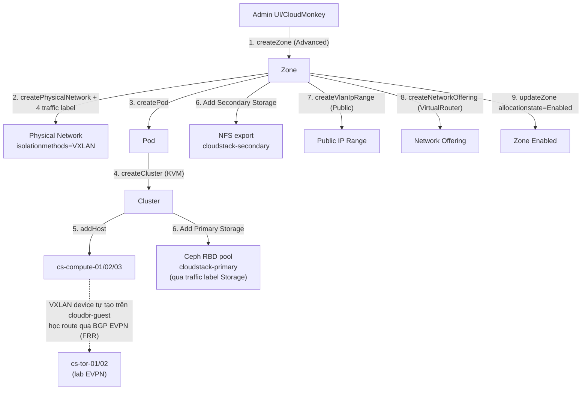

---
tags:
  - cloudstack
  - lab
  - networking
  - zone
  - vxlan
  - evpn
---

# CloudStack Advanced Zone - Triển khai Network VXLAN (EVPN) và Storage

- **Bối cảnh và vấn đề**: Đây là lab "ráp nối" toàn bộ hạ tầng đã dựng ở các lab trước (Control Plane, Ceph Storage, Compute Node, VXLAN EVPN) thành một Zone CloudStack hoàn chỉnh. Zone/Physical Network/Isolation method **không đổi được sau khi tạo** — sai một quyết định ở đây đồng nghĩa phải tạo lại Zone mới từ đầu.
- **Cách giải quyết**: Tạo Zone kiểu **Advanced**, tạo 1 Physical Network với **4 traffic label riêng biệt** khớp đúng 4 NIC/bridge đã chuẩn bị ở [[CloudStack Compute Node - Chuẩn bị KVM Hypervisor Host]] (Management/Storage/Guest/Public), đặt isolation method Guest traffic là **VXLAN** (đúng plugin gốc của CloudStack, ở chế độ EVPN đã kích hoạt bằng symlink script ở [[CloudStack VXLAN EVPN - Triển khai Guest Network Isolation với FRRouting]]). Sau đó tạo Pod + Cluster (KVM), add 3 host, cấu hình Public IP range, gắn Primary/Secondary Storage vào Ceph cluster, tạo Network Offering Isolated dùng Virtual Router chuẩn, rồi mới Enable Zone.
- **Kết quả sau khi hoàn thành**: Một Zone Advanced hoàn chỉnh, đủ điều kiện deploy VM — network cô lập bằng VXLAN (namespace 24-bit VNI), học BUM/MAC qua BGP EVPN thay vì multicast, storage chạy trên Ceph qua NIC Storage riêng, compute chạy trên 3 KVM host HA. Bước cuối cùng của series là [[CloudStack Template - Import Guest OS Template và Deploy VM đầu tiên]].

> [!NOTE]
> Lab này đi theo đúng checklist thứ tự dựng Zone đã ghi trong [[CloudStack Installation Methods]] của vault (bước 3-10 trong checklist đó). Không đổi thứ tự các milestone bên dưới — Add Host cần bridge đã sẵn sàng trước, Add Storage cần Pod/Cluster đã tồn tại trước.

> [!WARNING]
> `isolationmethods=VXLAN` là plugin gốc của CloudStack — **không** phải một hack/bypass. CloudStack biết đây là network VXLAN bình thường, tự tạo VXLAN device cho từng Guest network. Điều duy nhất khác biệt với hành vi mặc định là chế độ **EVPN** (thay vì Multicast) đã được kích hoạt qua symlink `modifyvxlan.sh` trên từng KVM host ở lab trước — đây là yêu cầu **tiên quyết**, phải làm xong trước khi Enable Zone/tạo Guest network đầu tiên, vì đổi chế độ sau khi đã có network đang chạy không hồi tố được (xem cảnh báo ở lab EVPN).

## Prerequisites

- **Hạ tầng**: Cả 4 lab trước trong series đã hoàn tất và healthy:
  - [[CloudStack Control Plane - Triển khai Management Server HA và Galera Database]] + [[CloudStack & Ceph - Shared Load Balancer HAProxy Keepalived]] — UI/API reachable qua VIP.
  - [[Ceph Cluster - Triển khai Primary và Secondary Storage cho CloudStack]] — `ceph -s` = `HEALTH_OK`, đã có pool `cloudstack-primary` và NFS export `cloudstack-secondary`.
  - [[CloudStack Compute Node - Chuẩn bị KVM Hypervisor Host]] — 3 host sẵn sàng, đủ 4 NIC/bridge theo traffic type, `cloudbr-guest` đã có IPv4.
  - [[CloudStack VXLAN EVPN - Triển khai Guest Network Isolation với FRRouting]] — symlink EVPN đã áp trên cả 3 compute node, FRR chạy, BGP EVPN `Established` với `cs-tor-01/02`.
- **Máy chủ / VM**: không thêm node mới ở lab này — chỉ cấu hình logic trên hạ tầng đã có.
- **Tài khoản và quyền**: tài khoản `admin` trên CloudStack UI (đã đổi password ở lab Control Plane).
- **Mạng**: dải Public IP range cho Zone, dải Pod (system VM), dải VNI Guest network — placeholder ở Planning table.
- **Kiến thức nền**: giả định đã đọc [[Zones, Pods, Clusters & Hosts]] và [[VPC & Isolated Networks]] trong vault này.

> [!WARNING]
> Loại networking (Advanced) và isolation method của Physical Network **không thể đổi sau khi Zone đã tạo**. Xác nhận lại toàn bộ giá trị ở Planning table trước khi chạy Bước 1 — sai sót ở đây buộc phải xoá Zone và làm lại từ đầu.

## Thông tin Planning liên quan

| Thành phần | Giá trị | Ghi chú |
| --- | --- | --- |
| Tên Zone | `<TBD>` | Networking mode `Advanced` |
| DNS1/DNS2 | `<TBD>` | DNS Zone cấp cho System VM và Guest VM |
| Internal DNS1/DNS2 | `<TBD>` | DNS nội bộ cho System VM |
| Physical Network name | `<TBD>` | 1 physical network duy nhất, 4 traffic label riêng biệt |
| Isolation method Guest traffic | `VXLAN` | Plugin gốc CloudStack, chế độ EVPN đã kích hoạt ở [[CloudStack VXLAN EVPN - Triển khai Guest Network Isolation với FRRouting]] |
| VNI range | `<TBD, ví dụ 10000-10100>` | CloudStack tự cấp phát VNI trong range này cho từng Guest network mới — không cần mapping tay |
| Traffic label Management | `cloudbr-mgmt` | Khớp bridge đã tạo ở lab Compute Node |
| Traffic label Storage | `<nic-storage>` | Interface trần, không bridge — xem ghi chú Bước 2 về vai trò thực tế của traffic type Storage với Primary Storage RBD |
| Traffic label Guest | `cloudbr-guest` | Tên bridge **có IPv4** đã tạo ở lab Compute Node — CloudStack dùng chính IP này làm VTEP source, tự tạo VXLAN device + bridge phụ trên đây cho từng Guest network |
| Traffic label Public | `cloudbr-public` | Khớp bridge đã tạo ở lab Compute Node |
| Pod name + CIDR | `<TBD>` | Dải IP cho System VM (SSVM/CPVM/VR), đi qua traffic label Management |
| Cluster name | `<TBD>` | Hypervisor `KVM`, `clustertype=CloudManaged` |
| Public IP range | `<TBD>` | Dải Public IP cấp cho Virtual Router SNAT/Static NAT, đi qua traffic label Public |
| Primary Storage | Pool `cloudstack-primary` | Tham chiếu [[Ceph Cluster - Triển khai Primary và Secondary Storage cho CloudStack]] |
| Secondary Storage | NFS export `cloudstack-secondary` | Tham chiếu [[Ceph Cluster - Triển khai Primary và Secondary Storage cho CloudStack]] |
| Network Offering | `<TBD>` | Isolated network, provider chuẩn `VirtualRouter` |

## Diagram



---

## Installation

### Bước 1 - Tạo Zone kiểu Advanced

- Trên UI: **Infrastructure → Zones → Add Zone**, chọn **Advanced**. Tương đương qua CloudMonkey:

```bash
cmk create zone \
  name=<tên-zone> \
  dns1=<dns1> dns2=<dns2> \
  internaldns1=<internal-dns1> internaldns2=<internal-dns2> \
  networktype=Advanced \
  securitygroupenabled=false
```

> [!NOTE]
> `securitygroupenabled=false` vì Zone này dùng Isolated Network với Virtual Router (Network ACL trên VR đảm nhiệm security) — đúng mô hình chuẩn phổ biến nhất của Advanced Zone. Security Group là cơ chế cô lập riêng, chỉ áp dụng cho Shared network không cần VR, và không kết hợp được cùng lúc với Isolated network trong cùng Zone (xem [[Security Groups & Network ACLs]]).

- Kiểm tra kết quả bước này:

```bash
cmk list zones name=<tên-zone>
```

Kết quả mong đợi: zone xuất hiện, `networktype=Advanced`, `allocationstate=Disabled` (đúng như thiết kế — chỉ enable ở bước cuối).

### Bước 2 - Tạo Physical Network và khai báo 4 traffic label (VXLAN)

- Tạo Physical Network cho Zone, khai `isolationmethods=VXLAN` ngay từ đầu — giá trị này không đổi được sau khi Physical Network đã Enable:

```bash
cmk create physicalnetwork \
  zoneid=<zone-id> \
  name=<physical-network-name> \
  isolationmethods=VXLAN
```

- Khai dải VNI CloudStack được phép cấp phát cho Guest network — trên UI: **Infrastructure → Zones → \<zone\> → Physical Network → Guest → Edit**, nhập range VNI theo Planning table:

```bash
cmk update physicalnetwork id=<physical-network-id> vlan=<vni-range-theo-planning-table>
```

> [!TODO]
> Tham số `vlan` ở trên dùng đúng tên field lịch sử của API `updatePhysicalNetwork` (kế thừa từ thời chỉ có VLAN) — tài liệu VXLAN Plugin không nêu tên tham số CLI/API cụ thể cho việc khai range VNI, chỉ nói "Specify a range of VNIs". Xác nhận lại đúng tên field trên version CloudStack đang cài (`cmk sync` rồi `cmk create physicalnetwork -h` / `cmk update physicalnetwork -h`) trước khi áp dụng — nếu field `vlan` không nhận giá trị dạng VNI, thử qua UI để xem CloudStack tự map sang API call nào.

> [!WARNING]
> VNI **phải duy nhất trong toàn Zone**, không được trùng — đây là yêu cầu tường minh trong tài liệu chính thức ("VNI must be unique per zone and no duplicate VNIs can exist in the zone").

- Gán traffic label khớp với 4 NIC/bridge đã cấu hình ở [[CloudStack Compute Node - Chuẩn bị KVM Hypervisor Host]] cho từng traffic type — bước này hay bị bỏ sót vì `create physicalnetwork` ở trên **không** tự gán label, thiếu bước này thì host add vào sau sẽ không biết bridge/interface nào phục vụ traffic nào:

```bash
cmk add traffictype physicalnetworkid=<physical-network-id> traffictype=Management kvmnetworklabel=cloudbr-mgmt
cmk add traffictype physicalnetworkid=<physical-network-id> traffictype=Storage    kvmnetworklabel=<nic-storage>
cmk add traffictype physicalnetworkid=<physical-network-id> traffictype=Guest      kvmnetworklabel=cloudbr-guest
cmk add traffictype physicalnetworkid=<physical-network-id> traffictype=Public     kvmnetworklabel=cloudbr-public
```

> [!NOTE]
> Traffic label `Guest` trỏ vào **tên bridge** `cloudbr-guest` — đúng yêu cầu của plugin VXLAN: *"Guest Network traffic label should be the name of the physical interface or the name of the bridge interface... and they should have an IPv4 address"*. CloudStack dùng chính IP đã gán trên bridge này (ở [[CloudStack Compute Node - Chuẩn bị KVM Hypervisor Host]]) làm VTEP source, tự tạo VXLAN device + bridge phụ cho từng Guest network — không cần chuẩn bị gì thêm ở tầng bridge.

> [!NOTE]
> Vai trò thực tế của traffic label `Storage` với KVM + RBD Primary Storage: QEMU/`librbd` kết nối trực tiếp tới Ceph mon theo **routing table của host OS**, không đi qua traffic label này — traffic label `Storage` trong CloudStack chủ yếu chi phối traffic Secondary Storage (SSVM tải template/snapshot) và một số luồng nội bộ khác giữa Agent và storage network khi cluster có "dedicated storage network". Việc khai đúng label + NIC riêng ở đây vẫn cần thiết cho đúng ngữ nghĩa cấu hình Zone và để CloudStack không mặc định gộp traffic Storage vào Management, nhưng **isolation thật của traffic RBD** đến từ việc NIC Storage nằm trên subnet riêng đã cấu hình ở lab Compute Node, không phải từ khai báo traffic label này.

- Bật Physical Network sau khi cấu hình xong:

```bash
cmk update physicalnetwork id=<physical-network-id> state=Enabled
```

- Kiểm tra kết quả bước này:

```bash
cmk list physicalnetworks zoneid=<zone-id>
cmk list traffictypes physicalnetworkid=<physical-network-id>
```

Kết quả mong đợi: `state=Enabled`, `isolationmethods=VXLAN`, đúng range VNI đã khai, đủ 4 traffic type với đúng `kvmnetworklabel` (`cloudbr-guest` cho Guest).

### Bước 3 - Tạo Pod

- Pod xác định dải IP quản lý cho System VM, đi qua traffic label Management:

```bash
cmk create pod \
  zoneid=<zone-id> \
  name=<pod-name> \
  gateway=<pod-gateway> \
  netmask=<pod-netmask> \
  startip=<pod-start-ip> \
  endip=<pod-end-ip>
```

- Kiểm tra kết quả bước này:

```bash
cmk list pods zoneid=<zone-id>
```

### Bước 4 - Tạo Cluster (KVM)

```bash
cmk create cluster \
  zoneid=<zone-id> \
  podid=<pod-id> \
  clustername=<cluster-name> \
  hypervisor=KVM \
  clustertype=CloudManaged
```

- Kiểm tra kết quả bước này:

```bash
cmk list clusters zoneid=<zone-id>
```

### Bước 5 - Add Host (3 KVM Compute Node)

- Add từng host đã chuẩn bị ở [[CloudStack Compute Node - Chuẩn bị KVM Hypervisor Host]]:

```bash
cmk add host \
  zoneid=<zone-id> podid=<pod-id> clusterid=<cluster-id> \
  hypervisor=KVM \
  url=http://<ip-cs-compute-01> \
  username=root password=<password-hoặc-xác-thực-qua-ssh-key-đã-cấu-hình>
```

Lặp lại cho `cs-compute-02` và `cs-compute-03`.

> [!WARNING]
> Nếu bước này fail giữa chừng, kiểm tra lại đúng thứ tự: cả 4 bridge/interface (`cloudbr-mgmt`, NIC Storage, `cloudbr-guest`, `cloudbr-public`) phải đã tồn tại đúng như [[CloudStack Compute Node - Chuẩn bị KVM Hypervisor Host]], symlink `modifyvxlan.sh` phải đã trỏ đúng script EVPN, và BGP EVPN phải đã `Established` ở [[CloudStack VXLAN EVPN - Triển khai Guest Network Isolation với FRRouting]] — Add Host vào một node thiếu 1 trong các điều kiện này thường "thành công giả" (host lên `Up` nhưng VM không chạy được hoặc network VXLAN không thông giữa các host).

- Kiểm tra kết quả bước này:

```bash
cmk list hosts zoneid=<zone-id> clusterid=<cluster-id>
```

Kết quả mong đợi: cả 3 host ở trạng thái `Up`, `resourcestate=Enabled`.

### Bước 6 - Add Primary Storage và Secondary Storage

- Thực hiện đúng theo hướng dẫn đã viết chi tiết ở [[Ceph Cluster - Triển khai Primary và Secondary Storage cho CloudStack]] (mục "Tích hợp Primary Storage vào CloudStack" và "Tích hợp Secondary Storage vào CloudStack") — không lặp lại ở đây, chỉ khác là lúc này Zone/Pod/Cluster đã tồn tại thật để chọn trong UI (trước đây các bước đó giả định sẵn hạ tầng).

- Kiểm tra kết quả bước này:

```bash
cmk list storagepools zoneid=<zone-id>
cmk list imagestores zoneid=<zone-id>
```

Kết quả mong đợi: Primary Storage `state=Up`, Secondary Storage (NFS) xuất hiện trong danh sách image store.

### Bước 7 - Cấu hình Public IP range

- Trên UI: **Infrastructure → Zones → \<zone\> → Physical Network → Public → Add Public IP Range**, khai báo dải Public IP theo Planning table — dải này đi qua traffic label Public (`cloudbr-public`).

```bash
cmk create vlaniprange \
  zoneid=<zone-id> \
  physicalnetworkid=<physical-network-id> \
  forvirtualnetwork=true \
  vlan=untagged \
  gateway=<public-gateway> netmask=<public-netmask> \
  startip=<public-start-ip> endip=<public-end-ip>
```

> [!NOTE]
> `vlan=untagged` vì `cloudbr-public` là bridge riêng trên NIC vật lý riêng (không chia sẻ VLAN tag với traffic khác trên cùng NIC như thiết kế 1-NIC-nhiều-mục-đích trước đây). Nếu Public network của bạn có VLAN tag riêng trên switch vật lý, đổi thành đúng VLAN ID.

- Kiểm tra kết quả bước này:

```bash
cmk list vlaniprange zoneid=<zone-id> forvirtualnetwork=true
```

### Bước 8 - Tạo Network Offering (Isolated, VXLAN, Virtual Router chuẩn)

- Isolation method của Physical Network là `VXLAN` nên Network Offering dùng thẳng `VirtualRouter` (mặc định của CloudStack) cho toàn bộ service — không cần khai `serviceproviderlist` trỏ tới provider bên thứ ba:

```bash
cmk create networkoffering \
  name=<network-offering-name> \
  displaytext="Isolated network - VXLAN (EVPN)" \
  guestiptype=Isolated \
  traffictype=Guest \
  supportedservices=Dhcp,Dns,SourceNat,StaticNat,Firewall,PortForwarding,Lb \
  serviceproviderlist=Dhcp:VirtualRouter,Dns:VirtualRouter,SourceNat:VirtualRouter,StaticNat:VirtualRouter,Firewall:VirtualRouter,PortForwarding:VirtualRouter,Lb:VirtualRouter
```

> [!NOTE]
> Mỗi network tạo từ offering này sẽ tự động nhận 1 VNI từ range đã khai ở Bước 2 — CloudStack tạo VXLAN device tương ứng trên `cloudbr-guest` của từng compute host khi cần (lúc VM đầu tiên trên network đó được deploy tại host nào). FRR (đã chạy sẵn từ lab EVPN, `advertise-all-vni`) tự phát hiện device mới này và quảng bá vào BGP EVPN — không cần thao tác gì thêm ở tầng FRR mỗi khi có network mới.

```bash
cmk update networkoffering id=<network-offering-id> state=Enabled
```

- Kiểm tra kết quả bước này:

```bash
cmk list networkofferings name=<network-offering-name>
```

Kết quả mong đợi: `state=Enabled`.

### Bước 9 - Enable Zone

- Chỉ enable sau khi đã xác nhận toàn bộ hạng mục ở phần Kiểm tra kết quả bên dưới:

```bash
cmk update zone id=<zone-id> allocationstate=Enabled
```

> [!TIP]
> Giữ Zone ở trạng thái `Disabled` trong suốt quá trình cấu hình (mặc định khi tạo) giúp không ai vô tình deploy VM vào hạ tầng chưa hoàn chỉnh. Chỉ enable sau khi test xong toàn bộ luồng — thói quen này áp dụng cho mọi Zone mới về sau, không riêng lab này.

## Kiểm tra kết quả

| Hạng mục cần kiểm tra | Cách kiểm tra | Kết quả đúng |
| --- | --- | --- |
| Zone | `cmk list zones name=<tên-zone>` | `allocationstate=Enabled` |
| Physical Network VXLAN | `cmk list physicalnetworks zoneid=<zone-id>` | `state=Enabled`, `isolationmethods=VXLAN`, đúng range VNI |
| 4 traffic label | `cmk list traffictypes physicalnetworkid=<physical-network-id>` | Đủ Management/Storage/Guest/Public, `kvmnetworklabel` Guest = `cloudbr-guest` |
| Cluster/Host | `cmk list hosts zoneid=<zone-id>` | Cả 3 host `Up` |
| Primary Storage | `cmk list storagepools zoneid=<zone-id>` | `state=Up` |
| Secondary Storage | `cmk list imagestores zoneid=<zone-id>` | Xuất hiện, reachable |
| System VM tự khởi tạo | UI → Infrastructure → System VMs | SSVM và CPVM ở trạng thái `Running` sau vài phút kể từ khi Enable Zone |
| VXLAN device xuất hiện đúng trên FRR | Sau khi SSVM/CPVM lên, chạy `vtysh -c "show bgp l2vpn evpn summary"` trên compute node đang chạy SSVM/CPVM | Thấy route mới xuất hiện — xác nhận `advertise-all-vni` đã bắt được VXLAN device do CloudStack tự tạo |

- Xác nhận SSVM/CPVM tự tạo thành công sau khi enable — đây là bằng chứng end-to-end rằng Secondary Storage, Pod network, và hypervisor đã thông suốt:

```bash
cmk list systemvms zoneid=<zone-id>
```

Kết quả mong đợi: 1 SSVM và 1 CPVM, `state=Running`.

## Troubleshooting

Không áp dụng - lab dựng mới theo hướng dẫn triển khai chuẩn, chưa có log lỗi thực tế phát sinh trong quá trình build để ghi nhận.

## Rollback

- Disable Zone trước khi tháo gỡ bất kỳ thành phần nào:

```bash
cmk update zone id=<zone-id> allocationstate=Disabled
```

- Gỡ theo thứ tự ngược với Installation: xoá Network Offering → gỡ Primary/Secondary Storage (theo Rollback đã mô tả ở [[Ceph Cluster - Triển khai Primary và Secondary Storage cho CloudStack]]) → xoá Public IP range → remove Host → xoá Cluster → xoá Pod → xoá Physical Network → xoá Zone:

```bash
cmk delete networkoffering id=<network-offering-id>
cmk delete host id=<host-id> forced=true
cmk delete cluster id=<cluster-id>
cmk delete pod id=<pod-id>
cmk delete physicalnetwork id=<physical-network-id>
cmk delete zone id=<zone-id>
```

> [!CAUTION]
> `delete zone` chỉ thành công khi Zone không còn VM/network nào đang tồn tại — và không thể hoàn tác. Nếu Zone đã có VM thật của người dùng, không dùng đường rollback này; xử lý di dời/xoá VM theo quy trình vận hành riêng trước.

## Reference

- [Apache CloudStack - Zone Configuration](https://docs.cloudstack.apache.org/en/latest/adminguide/hosts.html)
- [Apache CloudStack - VXLAN Plugin](https://docs.cloudstack.apache.org/en/4.23.0.0/plugins/vxlan.html)
- [Apache CloudStack - Network Offerings](https://docs.cloudstack.apache.org/en/latest/adminguide/networking/network_offerings.html)
- Ghi chú liên quan trong vault: [[Zones, Pods, Clusters & Hosts]] | [[CloudStack Installation Methods]] | [[VPC & Isolated Networks]] | [[CloudStack VXLAN EVPN - Triển khai Guest Network Isolation với FRRouting]]
