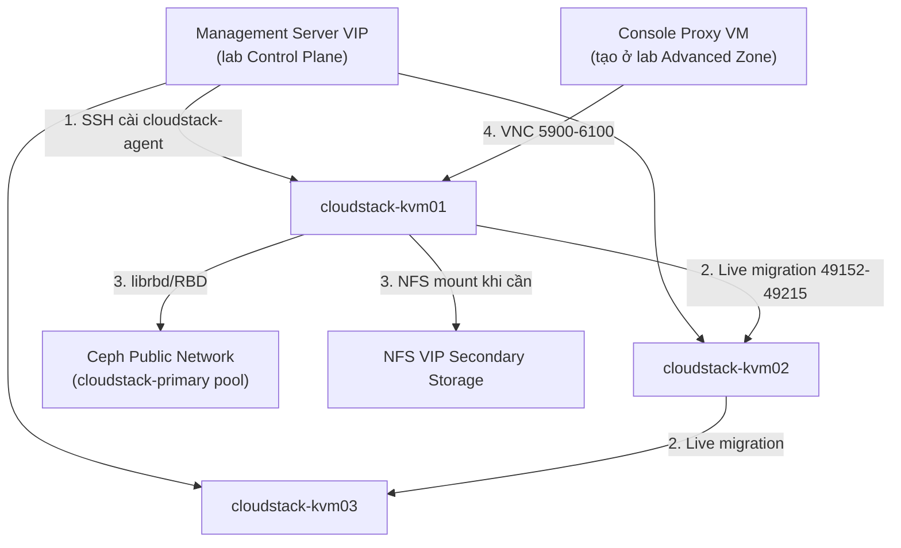

---
tags:
  - cloudstack
  - lab
  - compute
  - kvm
---

# CloudStack Compute Node - Chuẩn bị KVM Hypervisor Host

- **Bối cảnh và vấn đề**: Khi "Add Host" trong CloudStack, Management Server SSH vào host và tự cài `cloudstack-agent`, nhưng chỉ khi host đã ở đúng trạng thái sẵn sàng: đã bật virtualization, đã cài `qemu-kvm`/`libvirt`, đã có bridge mạng đúng traffic label, và firewall cho phép đúng luồng MS↔Agent, Host↔Host (live migration), Host↔Storage. Add Host vào một node chưa chuẩn bị đúng sẽ fail giữa chừng hoặc "thành công giả" (host lên Up nhưng VM không chạy được).
- **Cách giải quyết**: Chuẩn hoá 3 node Ubuntu 24.04 làm KVM Hypervisor Host: cài `qemu-kvm`/`libvirt`, tạo bridge `cloudbr0` cho Management/Public traffic, để dành riêng 1 interface cho Guest overlay traffic (Tungsten Fabric vRouter sẽ chiếm và tự tạo `vhost0` ở lab sau, không tạo bridge Linux truyền thống ở đây), hardening libvirt (chỉ nghe local socket, không mở TCP), giới hạn VNC console theo network, và cài sẵn client cho Ceph (RBD) + NFS.
- **Kết quả sau khi hoàn thành**: 3 host ở trạng thái sẵn sàng để Management Server "Add Host" thành công ngay lần đầu ở lab tạo Zone/Cluster tiếp theo — không cần quay lại sửa OS giữa chừng.

> [!NOTE]
> Lab này **không** thực hiện "Add Host" qua CloudStack UI — thao tác đó nằm trong [[CloudStack Advanced Zone - Triển khai Network SDN và Storage]] vì Add Host là một bước trong quy trình tạo Cluster, cần Zone/Pod đã tồn tại. Lab này chỉ đưa OS về đúng trạng thái để bước đó chạy suôn sẻ.

> [!NOTE]
> Interface dành cho Guest traffic được để trống, chưa gắn bridge, vì ở [[Tungsten Fabric - Triển khai SDN Controller cho CloudStack]] vRouter agent sẽ tự tạo interface `vhost0` và chiếm quyền quản lý interface vật lý này — tạo bridge Linux truyền thống trước sẽ xung đột với vRouter sau này.

## Prerequisites

- **Hạ tầng**: [[CloudStack Control Plane - Triển khai Management Server HA và Galera Database]] đã hoàn tất (Management Server reachable qua VIP). Ceph cluster ở [[Ceph Cluster - Triển khai Primary và Secondary Storage cho CloudStack]] đã `HEALTH_OK`.
- **Máy chủ / VM**: 3 host vật lý (không ảo hoá lồng nhau — cần hỗ trợ nested/hardware virtualization thật). Cấu hình ví dụ dùng trong lab:

  | Node | CPU | RAM | Local disk | NIC |
  | --- | --- | --- | --- | --- |
  | cloudstack-kvm01/02/03 | 32 vCPU (hỗ trợ VT-x/AMD-V) | 128 GB | 240 GB SSD (OS only, VM disk nằm trên Ceph RBD) | 2x NIC cho Management/Public (bond LACP), 1x NIC riêng cho Guest overlay |

- **Tài khoản và quyền**: sudo trên cả 3 host; SSH public key của Management Server (đã sinh ở lab Control Plane) cần được chấp nhận trên host để MS tự động cài agent.
- **Mạng**: dải Management/Public network và Guest overlay network đã xin từ team Network — placeholder ở Planning table. VNC console range cần biết dải IP System VM (Pod CIDR) để giới hạn firewall.
- **Kiến thức nền**: giả định đã đọc [[Hypervisor Support - KVM, VMware & Others]] và [[Zones, Pods, Clusters & Hosts]] trong vault này.

> [!WARNING]
> Host phải hỗ trợ virtualization phần cứng thật (VT-x/AMD-V) — chạy trên VM lồng (nested virtualization) thường có performance kém và một số tính năng KVM không hoạt động đúng. Kiểm tra ngay ở Bước 1 trước khi đi tiếp.

## Thông tin Planning liên quan

| Thành phần | Giá trị | Ghi chú |
| --- | --- | --- |
| cloudstack-kvm01/02/03 hostname | `<TBD>` | |
| Management/Public network CIDR | `<TBD>` | Bridge `cloudbr0`, dùng chung Management + Public theo thiết kế nhỏ, tách riêng nếu băng thông cho phép |
| Guest overlay network CIDR | `<TBD>` | Interface riêng, do Tungsten Fabric vRouter quản lý ở lab sau |
| Bond mode Management/Public | `802.3ad (LACP)` | Cần switch hỗ trợ LACP, xác nhận với team Network |
| Pod/System VM CIDR | `<TBD>` | Dùng để giới hạn firewall VNC console (CPVM truy cập host) |
| SSH user cho MS agent install | `root` hoặc user sudo riêng — xác nhận theo chính sách tổ chức | CloudStack yêu cầu quyền cài package + cấu hình network khi Add Host |
| Ceph Public network CIDR | Tham chiếu [[Ceph Cluster - Triển khai Primary và Secondary Storage cho CloudStack]] | Host cần reach mon/osd port của Ceph |
| NFS VIP Secondary Storage | Tham chiếu [[Ceph Cluster - Triển khai Primary và Secondary Storage cho CloudStack]] | Agent tự mount khi cần |

## Diagram



---

## Installation

### Bước 1 - Kiểm tra phần cứng và chuẩn bị hệ điều hành Ubuntu 24.04

- Xác nhận CPU hỗ trợ hardware virtualization trước khi cài bất kỳ gói nào:

```bash
egrep -c '(vmx|svm)' /proc/cpuinfo
```

Kết quả mong đợi: số lớn hơn `0`. Nếu trả về `0`, dừng lại — host này không dùng được cho KVM.

- Đặt hostname, `/etc/hosts`, NTP, firewall baseline — thực hiện trên cả 3 node:

```bash
sudo hostnamectl set-hostname <hostname-theo-planning-table>
sudo apt update && sudo apt install -y chrony ufw
sudo systemctl enable chrony --now
sudo ufw default deny incoming
sudo ufw default allow outgoing
sudo ufw allow from <management-cidr> to any port 22 proto tcp
sudo ufw enable
```

> [!NOTE]
> NTP đồng bộ giữa các KVM host quan trọng không kém MS/DB — lệch giờ giữa các host gây lỗi khó hiểu khi live migration hoặc khi Agent heartbeat bị tính sai khoảng cách thời gian.

- Chấp nhận SSH public key của Management Server (đã sinh ở lab Control Plane) để MS tự động cài `cloudstack-agent` khi Add Host:

```bash
sudo mkdir -p /root/.ssh
echo "<public-key-management-server>" | sudo tee -a /root/.ssh/authorized_keys
sudo chmod 600 /root/.ssh/authorized_keys
```

> [!WARNING]
> CloudStack truyền thống cần quyền root (hoặc sudo đầy đủ) trên host để cài package và chỉnh network lúc Add Host. Nếu chính sách tổ chức không cho phép SSH key root trực tiếp, cân nhắc tạo sudo user riêng và cấu hình `AllowUsers`/`sudoers` tương ứng — nhưng phải test kỹ vì quy trình Add Host gọi khá nhiều thao tác hệ thống khác nhau.

- Kiểm tra kết quả bước này:

```bash
chronyc tracking | grep "Leap status"
ssh -i <management-server-private-key> root@cloudstack-kvm01 hostname
```

Kết quả mong đợi: `Leap status: Normal`, SSH từ MS vào host chạy được không hỏi password.

### Bước 2 - Cài đặt QEMU/KVM và libvirt

- Cài package hypervisor:

```bash
sudo apt install -y qemu-kvm libvirt-daemon-system libvirt-clients bridge-utils
```

- Kiểm tra KVM hoạt động đúng:

```bash
kvm-ok
sudo systemctl enable libvirtd --now
sudo virsh list --all
```

Kết quả mong đợi: `kvm-ok` báo "KVM acceleration can be used", `virsh list --all` chạy không lỗi permission.

### Bước 3 - Hardening libvirt: chỉ nghe local socket, không mở TCP

`cloudstack-agent` chạy trực tiếp trên host và gọi libvirt qua unix socket cục bộ (`qemu:///system`) — không cần libvirtd lắng nghe TCP ra ngoài, nên tắt hẳn để giảm attack surface.

- Xác nhận `/etc/libvirt/libvirtd.conf` **không** bật nghe TCP (giá trị mặc định trên Ubuntu 24.04 đã tắt, kiểm tra lại cho chắc):

```bash
grep -E "^listen_tls|^listen_tcp" /etc/libvirt/libvirtd.conf
```

Kết quả mong đợi: không có dòng nào set `= 1`, hoặc cả 2 đều comment/absent — nghĩa là libvirtd chỉ phục vụ qua unix socket local.

> [!NOTE]
> Nếu tổ chức có nhu cầu quản trị `virsh` từ xa ngoài luồng CloudStack, chỉ bật `listen_tls = 1` kèm client certificate, tuyệt đối không bật `listen_tcp` (plaintext) ra ngoài Management network.

- Giới hạn VNC console của các VM chỉ lắng nghe trên Management/Pod network, không phải `0.0.0.0`. Chỉnh `/etc/libvirt/qemu.conf`:

```ini
vnc_listen = "<management-ip-của-chính-host-này>"
```

```bash
sudo systemctl restart libvirtd
```

- Mở firewall cho dải VNC console, chỉ từ network nơi Console Proxy VM (CPVM) sẽ chạy:

```bash
sudo ufw allow from <pod-system-vm-cidr> to any port 5900:6100 proto tcp comment 'VNC console tu CPVM'
```

> [!WARNING]
> Nếu để `vnc_listen = "0.0.0.0"` và không giới hạn firewall, bất kỳ ai reach được host qua Management network đều có thể xem console (kể cả gõ được lệnh) của mọi VM đang chạy trên host đó — console VNC mặc định của QEMU không có mã hoá và có thể không yêu cầu password nếu chưa cấu hình.

- Kiểm tra kết quả bước này:

```bash
sudo ss -tlnp | grep -E ':16509|:16514'
```

Kết quả mong đợi: không có process nào lắng nghe port TCP libvirt (16509/16514) — xác nhận libvirtd chỉ chạy qua unix socket.

### Bước 4 - Cấu hình bridge `cloudbr0` cho Management/Public traffic

- Tạo bond LACP từ 2 NIC dành cho Management/Public, rồi gắn bridge `cloudbr0` lên trên bond — cấu hình qua netplan (`/etc/netplan/01-cloudstack.yaml`):

```yaml
network:
  version: 2
  bonds:
    bond0:
      interfaces: [<nic-1>, <nic-2>]
      parameters:
        mode: 802.3ad
        lacp-rate: fast
        mii-monitor-interval: 100
  bridges:
    cloudbr0:
      interfaces: [bond0]
      addresses: [<ip-host-này>/<prefix>]
      routes:
        - to: default
          via: <gateway-management-network>
      parameters:
        stp: false
        forward-delay: 0
```

```bash
sudo netplan apply
```

> [!WARNING]
> Áp dụng netplan qua kết nối SSH từ xa có thể làm mất kết nối nếu sai cấu hình interface/gateway. Luôn có console/IPMI dự phòng trước khi `netplan apply` trên host đang quản lý từ xa.

- Kiểm tra kết quả bước này:

```bash
ip -br addr show cloudbr0
ping -c1 <gateway-management-network>
```

Kết quả mong đợi: `cloudbr0` có đúng IP đã khai báo, ping gateway thành công.

### Bước 5 - Dành riêng interface cho Guest overlay traffic

- Xác nhận interface dành cho Guest overlay tồn tại nhưng **chưa** cấu hình IP hay bridge — để nguyên trạng "up, no IP" cho Tungsten Fabric vRouter chiếm dụng ở lab sau:

```bash
sudo ip link set <nic-guest-overlay> up
ip -br link show <nic-guest-overlay>
```

Kết quả mong đợi: interface ở trạng thái `UP`, không có địa chỉ IP nào gán.

### Bước 6 - Cài client cho Primary/Secondary Storage

- Cài `ceph-common` để host có `librbd`/công cụ `rbd` (QEMU dùng `librbd` trực tiếp, không cần mount filesystem, nhưng gói này cũng cấp keyring/tooling cần thiết):

```bash
sudo apt install -y ceph-common nfs-common
```

- Copy cephx keyring `client.cloudstack-rbd` (secret key đã tạo ở [[Ceph Cluster - Triển khai Primary và Secondary Storage cho CloudStack]]) vào host — thực tế CloudStack Agent sẽ tự tạo libvirt secret từ username/secret khai báo lúc Add Primary Storage trên UI, bước này chỉ cần đảm bảo gói `ceph-common` đã có sẵn để `librbd` hoạt động, không cần đặt keyring file thủ công.

- Mở firewall cho Ceph Public network (mon + osd) và NFS VIP:

```bash
sudo ufw allow from <ceph-public-cidr> to any port 3300,6789,6800:7300 proto tcp comment 'ceph client'
sudo ufw allow from <nfs-vip>/32 to any port 2049 proto tcp comment 'nfs secondary storage'
```

- Kiểm tra kết quả bước này:

```bash
sudo rbd -p cloudstack-primary --id cloudstack-rbd ls -m <ceph-mon-ip>
```

Kết quả mong đợi: chạy được, không lỗi kết nối (danh sách có thể rỗng nếu chưa có volume nào).

### Bước 7 - Firewall cho luồng Host↔Host và Host↔Management Server

- Mở port cho live migration giữa các host trong cùng Cluster (chỉ trong Management/Public network):

```bash
sudo ufw allow from <management-cidr> to any port 49152:49215 proto tcp comment 'kvm live migration'
```

- Mở port Agent để Management Server điều khiển host (agent lắng nghe, MS kết nối tới):

```bash
sudo ufw allow from <ms-vip-hoặc-ip-ms01-ms02> to any port 8250 proto tcp comment 'cloudstack agent'
```

- Kiểm tra kết quả bước này:

```bash
sudo ufw status numbered
```

Kết quả mong đợi: đầy đủ rule cho SSH, VNC, live migration, agent, Ceph, NFS — không còn rule "allow any" nào ngoài các dòng đã khai báo có chủ đích.

## Kiểm tra kết quả

- Toàn bộ 3 host đạt trạng thái sẵn sàng để Add Host thành công ở lab tiếp theo:

  | Hạng mục cần kiểm tra | Cách kiểm tra | Kết quả đúng |
  | --- | --- | --- |
  | Hardware virtualization | `kvm-ok` | "KVM acceleration can be used" |
  | libvirtd chạy, không mở TCP | `sudo ss -tlnp \| grep 1651` | Không có kết quả |
  | Bridge Management/Public | `ip -br addr show cloudbr0` | Có IP đúng |
  | Interface Guest overlay sẵn sàng | `ip -br link show <nic-guest-overlay>` | `UP`, không IP |
  | Reach Ceph Public network | `rbd -p cloudstack-primary --id cloudstack-rbd ls -m <mon-ip>` | Không lỗi kết nối |
  | SSH từ MS vào host | `ssh root@<kvm-host> hostname` từ MS | Không hỏi password |

## Troubleshooting

Không áp dụng - lab dựng mới theo hướng dẫn triển khai chuẩn, chưa có log lỗi thực tế phát sinh trong quá trình build để ghi nhận.

## Rollback

- Gỡ bridge/bond, khôi phục cấu hình network trước đó (chuẩn bị sẵn file netplan cũ trước khi thay đổi ở Bước 4 để phục hồi nhanh):

```bash
sudo cp /etc/netplan/01-cloudstack.yaml /etc/netplan/01-cloudstack.yaml.bak
```

```bash
sudo rm /etc/netplan/01-cloudstack.yaml
sudo netplan apply
```

- Gỡ package hypervisor nếu cần bỏ hẳn host khỏi vai trò KVM Compute Node:

```bash
sudo apt remove --purge -y qemu-kvm libvirt-daemon-system libvirt-clients
```

> [!CAUTION]
> Chỉ gỡ package hypervisor sau khi chắc chắn host không còn VM nào đang chạy — kiểm tra `virsh list --all` trước, và nếu host đã được Add vào CloudStack, phải đưa host vào Maintenance Mode + di dời VM trước khi động vào OS.

## Reference

- [Apache CloudStack - KVM Hypervisor Host Installation](https://docs.cloudstack.apache.org/en/latest/installguide/hypervisor/kvm.html)
- [libvirt - Remote access and TLS](https://libvirt.org/remote.html)
- [QEMU - VNC security](https://www.qemu.org/docs/master/system/vnc-security.html)
- [Netplan - Bonding and bridging](https://netplan.readthedocs.io/en/stable/netplan-yaml/)
- Ghi chú liên quan trong vault: [[Hypervisor Support - KVM, VMware & Others]] | [[Zones, Pods, Clusters & Hosts]] | [[CloudStack Security Considerations]]
