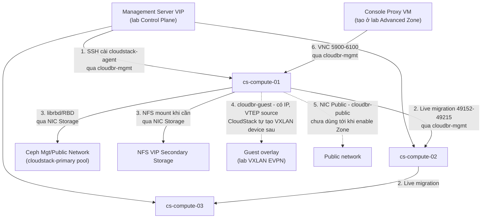

---
tags:
  - cloudstack
  - lab
  - compute
  - kvm
---

# CloudStack Compute Node - Chuẩn bị KVM Hypervisor Host

- **Bối cảnh và vấn đề**: Khi "Add Host" trong CloudStack, Management Server SSH vào host và tự cài `cloudstack-agent`, nhưng chỉ khi host đã ở đúng trạng thái sẵn sàng: đã bật virtualization, đã cài `qemu-kvm`/`libvirt`, đã có bridge mạng đúng traffic label cho từng loại traffic, và firewall cho phép đúng luồng MS↔Agent, Host↔Host (live migration), Host↔Storage. Add Host vào một node chưa chuẩn bị đúng sẽ fail giữa chừng hoặc "thành công giả" (host lên Up nhưng VM không chạy được).
- **Cách giải quyết**: Chuẩn hoá 3 node Ubuntu 24.04 (**cs-compute-01/02/03**) làm KVM Hypervisor Host, mỗi node dùng **4 NIC vật lý riêng biệt cho 4 traffic type** của CloudStack — đúng 1 NIC : 1 mục đích, không gộp chung như thiết kế cũ:

| NIC | Traffic type CloudStack | Cấu hình OS | Mục đích |
| --- | --- | --- | --- |
| NIC1 | Management | Bridge `cloudbr-mgmt` | SSH, Agent↔MS, live migration, VNC console |
| NIC2 | Storage | Interface trần, có IP, **không** bridge | Client RBD (Primary Storage) + NFS (mount khi cần) tới Ceph |
| NIC3 | Guest | Bridge `cloudbr-guest`, **có IPv4** (bắt buộc — dùng làm VTEP source) | Traffic label VXLAN của CloudStack — plugin VXLAN yêu cầu chính interface này có IP để terminate/originate VXLAN traffic (theo [Apache CloudStack - VXLAN Plugin](https://docs.cloudstack.apache.org/en/latest/plugins/vxlan.html)); CloudStack tự tạo VXLAN device + bridge phụ cho từng Guest network trên đây, học route qua BGP EVPN (FRRouting) thay vì multicast — xem [[CloudStack VXLAN EVPN - Triển khai Guest Network Isolation với FRRouting]] |
| NIC4 | Public | Bridge `cloudbr-public` | SNAT/Static NAT của Virtual Router, Public IP |

  Cài `qemu-kvm`/`libvirt`, hardening libvirt (chỉ nghe local socket, không mở TCP), giới hạn VNC console theo network, và cài sẵn client cho Ceph (RBD) + NFS trên NIC Storage.
- **Kết quả sau khi hoàn thành**: 3 host ở trạng thái sẵn sàng để Management Server "Add Host" thành công ngay lần đầu ở lab tạo Zone/Cluster tiếp theo — không cần quay lại sửa OS giữa chừng.

> [!NOTE]
> Lab này **không** thực hiện "Add Host" qua CloudStack UI — thao tác đó nằm trong [[CloudStack Advanced Zone - Triển khai Network SDN và Storage]] vì Add Host là một bước trong quy trình tạo Cluster, cần Zone/Pod đã tồn tại. Lab này chỉ đưa OS về đúng trạng thái để bước đó chạy suôn sẻ.

> [!NOTE]
> Thiết kế 4-NIC này khác bản nháp trước (2 NIC bond LACP cho Management+Public gộp chung, 1 NIC riêng cho Guest, không có NIC Storage riêng — dùng chung băng thông với Management). Tách thêm NIC Storage vì traffic RBD (đọc/ghi disk VM liên tục) là loại traffic nhạy độ trễ và chiếm băng thông cao nhất trên KVM host — để chung với Management/Agent control traffic dễ gây nghẽn chéo (RBD saturate băng thông làm heartbeat Agent↔MS chậm, host bị đánh dấu `Disconnected` giả). Đánh đổi là cần thêm 2 NIC vật lý/switch port trên mỗi host so với thiết kế cũ.

## Prerequisites

- **Hạ tầng**: [[CloudStack Control Plane - Triển khai Management Server HA và Galera Database]] đã hoàn tất (Management Server reachable qua VIP ở [[CloudStack & Ceph - Shared Load Balancer HAProxy Keepalived]]). Ceph cluster ở [[Ceph Cluster - Triển khai Primary và Secondary Storage cho CloudStack]] đã `HEALTH_OK`.
- **Máy chủ / VM**: 3 host vật lý (không ảo hoá lồng nhau — cần hỗ trợ nested/hardware virtualization thật), mỗi host 4 NIC vật lý. Cấu hình ví dụ dùng trong lab:

| Node | CPU | RAM | Local disk | NIC |
| --- | --- | --- | --- | --- |
| cs-compute-01/02/03 | 32 vCPU (hỗ trợ VT-x/AMD-V) | 128 GB | 240 GB SSD (OS only, VM disk nằm trên Ceph RBD) | 4x NIC riêng: Management, Storage, Guest, Public |

- **Tài khoản và quyền**: sudo trên cả 3 host; SSH public key của Management Server (đã sinh ở lab Control Plane) cần được chấp nhận trên host để MS tự động cài agent.
- **Mạng**: 4 dải mạng riêng biệt (Management, Storage, Guest, Public) đã xin từ team Network — placeholder ở Planning table. VNC console range cần biết dải IP System VM (Pod CIDR) để giới hạn firewall trên NIC Management.
- **Kiến thức nền**: giả định đã đọc [[Hypervisor Support - KVM, VMware & Others]] và [[Zones, Pods, Clusters & Hosts]] trong vault này.

> [!WARNING]
> Host phải hỗ trợ virtualization phần cứng thật (VT-x/AMD-V) — chạy trên VM lồng (nested virtualization) thường có performance kém và một số tính năng KVM không hoạt động đúng. Kiểm tra ngay ở Bước 1 trước khi đi tiếp.

## Thông tin Planning liên quan

| Thành phần | Giá trị | Ghi chú |
| --- | --- | --- |
| cs-compute-01/02/03 hostname | `<TBD>` | |
| Management network CIDR | `<TBD>` | Bridge `cloudbr-mgmt` — SSH, Agent↔MS, live migration, VNC. Cùng dải với `cs-mgt-01/02`/`cs-db-01/02/03` ở lab Control Plane |
| Storage network CIDR | `<TBD>` | Interface trần (không bridge) — client RBD/NFS tới Ceph. Nên cùng dải Mgt/Public network của Ceph ở [[Ceph Cluster - Triển khai Primary và Secondary Storage cho CloudStack]] để librbd/NFS client reach được mon/mgr/nfs-vip |
| Guest network - bridge | `cloudbr-guest`, có IPv4 | Traffic label VXLAN, IP dùng làm VTEP source. CloudStack tự tạo VXLAN device/bridge phụ cho từng Guest network; EVPN mode (FRRouting) thay cho multicast mặc định, xem [[CloudStack VXLAN EVPN - Triển khai Guest Network Isolation với FRRouting]]. Không cần multicast/PIM ở switch underlay khi dùng EVPN mode |
| Public network CIDR | `<TBD>` | Bridge `cloudbr-public` — SNAT/Static NAT của Virtual Router |
| MTU NIC Guest | `1550` tối thiểu (VXLAN overhead 50 byte so với MTU 1500 gốc) hoặc `9000` nếu switch hỗ trợ jumbo frame | Theo đúng khuyến nghị chính thức của plugin VXLAN CloudStack, áp dụng cho cả 2 mode multicast và EVPN |
| Pod/System VM CIDR | `<TBD>` | Dùng để giới hạn firewall VNC console (CPVM truy cập host qua NIC Management) |
| SSH user cho MS agent install | `root` hoặc user sudo riêng — xác nhận theo chính sách tổ chức | CloudStack yêu cầu quyền cài package + cấu hình network khi Add Host |
| Ceph Public network CIDR | Tham chiếu [[Ceph Cluster - Triển khai Primary và Secondary Storage cho CloudStack]] | Host reach mon/osd port của Ceph qua NIC Storage |
| NFS VIP Secondary Storage | Tham chiếu [[Ceph Cluster - Triển khai Primary và Secondary Storage cho CloudStack]] | Agent tự mount khi cần, qua NIC Storage |

## Diagram



---

## Installation

### Bước 1 - Kiểm tra phần cứng và chuẩn bị hệ điều hành Ubuntu 24.04

- Xác nhận CPU hỗ trợ hardware virtualization trước khi cài bất kỳ gói nào:

```bash
egrep -c '(vmx|svm)' /proc/cpuinfo
```

Kết quả mong đợi: số lớn hơn `0`. Nếu trả về `0`, dừng lại — host này không dùng được cho KVM.

- Đặt hostname, `/etc/hosts`, NTP, firewall baseline — thực hiện trên cả 3 node:

```bash
sudo hostnamectl set-hostname <hostname-theo-planning-table>
sudo apt update && sudo apt install -y chrony ufw
sudo systemctl enable chrony --now
sudo ufw default deny incoming
sudo ufw default allow outgoing
sudo ufw allow from <management-cidr> to any port 22 proto tcp
sudo ufw enable
```

> [!NOTE]
> NTP đồng bộ giữa các KVM host quan trọng không kém MS/DB — lệch giờ giữa các host gây lỗi khó hiểu khi live migration hoặc khi Agent heartbeat bị tính sai khoảng cách thời gian.

- Chấp nhận SSH public key của Management Server (đã sinh ở lab Control Plane) để MS tự động cài `cloudstack-agent` khi Add Host:

```bash
sudo mkdir -p /root/.ssh
echo "<public-key-management-server>" | sudo tee -a /root/.ssh/authorized_keys
sudo chmod 600 /root/.ssh/authorized_keys
```

> [!WARNING]
> CloudStack truyền thống cần quyền root (hoặc sudo đầy đủ) trên host để cài package và chỉnh network lúc Add Host. Nếu chính sách tổ chức không cho phép SSH key root trực tiếp, cân nhắc tạo sudo user riêng và cấu hình `AllowUsers`/`sudoers` tương ứng — nhưng phải test kỹ vì quy trình Add Host gọi khá nhiều thao tác hệ thống khác nhau.

- Kiểm tra kết quả bước này:

```bash
chronyc tracking | grep "Leap status"
ssh -i <management-server-private-key> root@cs-compute-01 hostname
```

Kết quả mong đợi: `Leap status: Normal`, SSH từ MS vào host chạy được không hỏi password.

### Bước 2 - Cài đặt QEMU/KVM và libvirt

- Cài package hypervisor:

```bash
sudo apt install -y qemu-kvm libvirt-daemon-system libvirt-clients bridge-utils
```

- Kiểm tra KVM hoạt động đúng:

```bash
kvm-ok
sudo systemctl enable libvirtd --now
sudo virsh list --all
```

Kết quả mong đợi: `kvm-ok` báo "KVM acceleration can be used", `virsh list --all` chạy không lỗi permission.

### Bước 3 - Hardening libvirt: chỉ nghe local socket, không mở TCP

`cloudstack-agent` chạy trực tiếp trên host và gọi libvirt qua unix socket cục bộ (`qemu:///system`) — không cần libvirtd lắng nghe TCP ra ngoài, nên tắt hẳn để giảm attack surface.

- Xác nhận `/etc/libvirt/libvirtd.conf` **không** bật nghe TCP (giá trị mặc định trên Ubuntu 24.04 đã tắt, kiểm tra lại cho chắc):

```bash
grep -E "^listen_tls|^listen_tcp" /etc/libvirt/libvirtd.conf
```

Kết quả mong đợi: không có dòng nào set `= 1`, hoặc cả 2 đều comment/absent — nghĩa là libvirtd chỉ phục vụ qua unix socket local.

> [!NOTE]
> Nếu tổ chức có nhu cầu quản trị `virsh` từ xa ngoài luồng CloudStack, chỉ bật `listen_tls = 1` kèm client certificate, tuyệt đối không bật `listen_tcp` (plaintext) ra ngoài Management network.

- Giới hạn VNC console của các VM chỉ lắng nghe trên IP của bridge `cloudbr-mgmt`, không phải `0.0.0.0`. Chỉnh `/etc/libvirt/qemu.conf`:

```ini
vnc_listen = "<ip-cloudbr-mgmt-của-chính-host-này>"
```

```bash
sudo systemctl restart libvirtd
```

- Mở firewall cho dải VNC console trên NIC Management, chỉ từ network nơi Console Proxy VM (CPVM) sẽ chạy:

```bash
sudo ufw allow from <pod-system-vm-cidr> to any port 5900:6100 proto tcp comment 'VNC console tu CPVM'
```

> [!WARNING]
> Nếu để `vnc_listen = "0.0.0.0"` và không giới hạn firewall, bất kỳ ai reach được host qua Management network đều có thể xem console (kể cả gõ được lệnh) của mọi VM đang chạy trên host đó — console VNC mặc định của QEMU không có mã hoá và có thể không yêu cầu password nếu chưa cấu hình.

- Kiểm tra kết quả bước này:

```bash
sudo ss -tlnp | grep -E ':16509|:16514'
```

Kết quả mong đợi: không có process nào lắng nghe port TCP libvirt (16509/16514) — xác nhận libvirtd chỉ chạy qua unix socket.

### Bước 4 - Cấu hình bridge `cloudbr-mgmt` (Management), `cloudbr-public` (Public), và `cloudbr-guest` (Guest, VXLAN VTEP source)

- Gán IP tĩnh cho NIC Management, bắc bridge `cloudbr-mgmt` lên trên (không bond — mỗi traffic type đã có NIC vật lý riêng, không cần LACP để gộp băng thông như thiết kế cũ); bridge `cloudbr-public` cho NIC Public; và bridge `cloudbr-guest` cho NIC Guest — **`cloudbr-guest` bắt buộc phải có IPv4** (IP private hoặc public đều được), vì plugin VXLAN của CloudStack dùng chính IP này để terminate/originate VXLAN traffic (VTEP source), theo đúng yêu cầu ghi trong [Apache CloudStack - VXLAN Plugin](https://docs.cloudstack.apache.org/en/latest/plugins/vxlan.html). Cấu hình qua netplan (`/etc/netplan/01-cloudstack.yaml`):

```yaml
network:
  version: 2
  ethernets:
    <nic-mgmt>: {}
    <nic-storage>: {}
    <nic-guest>: {}
    <nic-public>: {}
  bridges:
    cloudbr-mgmt:
      interfaces: [<nic-mgmt>]
      addresses: [<ip-host-mgmt>/<prefix>]
      routes:
        - to: default
          via: <gateway-management-network>
      parameters:
        stp: false
        forward-delay: 0
    cloudbr-public:
      interfaces: [<nic-public>]
      addresses: [<ip-host-public>/<prefix>]
      parameters:
        stp: false
        forward-delay: 0
    cloudbr-guest:
      interfaces: [<nic-guest>]
      addresses: [<ip-host-guest>/<prefix>]
      parameters:
        stp: false
        forward-delay: 0
```

```bash
sudo netplan apply
```

> [!WARNING]
> Áp dụng netplan qua kết nối SSH từ xa có thể làm mất kết nối nếu sai cấu hình interface/gateway. Luôn có console/IPMI dự phòng trước khi `netplan apply` trên host đang quản lý từ xa.

> [!NOTE]
> `cloudbr-public` chỉ cần route ra ngoài khi Virtual Router thật sự cần SNAT/Static NAT — ở lab này chưa có VM/Zone nào dùng tới, nên có thể để `cloudbr-public` không khai `routes` (chỉ cần bridge + IP tồn tại đúng traffic label), tuỳ theo việc gateway Public network của tổ chức có được quản lý riêng hay không. `cloudbr-guest` không cần route ra ngoài — IP trên bridge này chỉ dùng làm VTEP source, không phải interface quản trị.

- Kiểm tra kết quả bước này:

```bash
ip -br addr show cloudbr-mgmt
ip -br addr show cloudbr-public
ip -br addr show cloudbr-guest
ping -c1 <gateway-management-network>
```

Kết quả mong đợi: cả 3 bridge đều có đúng IP đã khai báo; ping gateway Management thành công.

> [!NOTE]
> `cloudbr-guest` ở trạng thái "bridge trần, có IP, chưa có VXLAN device nào" tại thời điểm này — CloudStack sẽ dùng chính tên bridge này làm traffic label Guest ở [[CloudStack Advanced Zone - Triển khai Network SDN và Storage]], tự tạo VXLAN device + bridge phụ cho từng Guest network mới ngay trên đây (không cần tạo tay). FRRouting ở [[CloudStack VXLAN EVPN - Triển khai Guest Network Isolation với FRRouting]] chỉ chạy `zebra`/`bgpd` để cung cấp control plane BGP EVPN cho các VXLAN device đó — không tự tạo thêm bridge/VXLAN device nào, không cần chia sẻ quản lý bridge với CloudStack như bản nháp trước.

### Bước 5 - Gán IP cho NIC Storage

- NIC Storage cần IP nhưng **không** cần bridge (không có VM nào gắn trực tiếp vào network này — chỉ host tự làm client RBD/NFS), khai báo tiếp trong cùng file netplan ở Bước 4:

```yaml
  # Thêm vào cùng network.ethernets ở Bước 4
  ethernets:
    <nic-storage>:
      addresses: [<ip-host-storage>/<prefix>]
```

```bash
sudo netplan apply
```

- Kiểm tra kết quả bước này:

```bash
ip -br addr show <nic-storage>
```

Kết quả mong đợi: `<ip-host-storage>` xuất hiện đúng trên `<nic-storage>` (không có bridge kèm theo).

### Bước 6 - Cài client cho Primary/Secondary Storage (qua NIC Storage)

- Cài `ceph-common` để host có `librbd`/công cụ `rbd` (QEMU dùng `librbd` trực tiếp, không cần mount filesystem, nhưng gói này cũng cấp keyring/tooling cần thiết):

```bash
sudo apt install -y ceph-common nfs-common
```

- Copy cephx keyring `client.cloudstack-rbd` (secret key đã tạo ở [[Ceph Cluster - Triển khai Primary và Secondary Storage cho CloudStack]]) vào host — thực tế CloudStack Agent sẽ tự tạo libvirt secret từ username/secret khai báo lúc Add Primary Storage trên UI, bước này chỉ cần đảm bảo gói `ceph-common` đã có sẵn để `librbd` hoạt động, không cần đặt keyring file thủ công.

- Mở firewall trên NIC Storage cho Ceph Public network (mon + osd) và NFS VIP — thu hẹp đúng dải Storage network, không còn dùng chung Management network như thiết kế cũ:

```bash
sudo ufw allow from <ceph-public-cidr> to any port 3300,6789,6800:7300 proto tcp comment 'ceph client via storage nic'
sudo ufw allow from <nfs-vip>/32 to any port 2049 proto tcp comment 'nfs secondary storage via storage nic'
```

- Kiểm tra kết quả bước này (chạy từ chính host, qua IP trên NIC Storage):

```bash
sudo rbd -p cloudstack-primary --id cloudstack-rbd ls -m <ceph-mon-ip>
```

Kết quả mong đợi: chạy được, không lỗi kết nối (danh sách có thể rỗng nếu chưa có volume nào).

### Bước 7 - Firewall cho luồng Host↔Host và Host↔Management Server (qua NIC Management)

- Mở port cho live migration giữa các host trong cùng Cluster (qua `cloudbr-mgmt`):

```bash
sudo ufw allow from <management-cidr> to any port 49152:49215 proto tcp comment 'kvm live migration'
```

- Mở port Agent để Management Server điều khiển host (agent lắng nghe, MS kết nối tới qua VIP ở lab Shared Load Balancer):

```bash
sudo ufw allow from <ip-cs-mgt-01>,<ip-cs-mgt-02> to any port 8250 proto tcp comment 'cloudstack agent'
```

- Kiểm tra kết quả bước này:

```bash
sudo ufw status numbered
```

Kết quả mong đợi: đầy đủ rule cho SSH, VNC, live migration, agent (trên NIC Management), Ceph/NFS (trên NIC Storage) — không còn rule "allow any" nào ngoài các dòng đã khai báo có chủ đích.

## Kiểm tra kết quả

- Toàn bộ 3 host đạt trạng thái sẵn sàng để Add Host thành công ở lab tiếp theo:

| Hạng mục cần kiểm tra | Cách kiểm tra | Kết quả đúng |
| --- | --- | --- |
| Hardware virtualization | `kvm-ok` | "KVM acceleration can be used" |
| libvirtd chạy, không mở TCP | `sudo ss -tlnp \| grep 1651` | Không có kết quả |
| Bridge Management | `ip -br addr show cloudbr-mgmt` | Có IP đúng |
| Bridge Public | `ip -br addr show cloudbr-public` | Có IP đúng |
| NIC Storage có IP, không bridge | `ip -br addr show <nic-storage>` | Có IP, không xuất hiện trong `brctl show`/`ip link` dạng bridge |
| Bridge Guest có IP (VTEP source) | `ip -br addr show cloudbr-guest` | Có IP đúng, chưa có VXLAN device nào (CloudStack tự tạo sau) |
| Reach Ceph qua NIC Storage | `rbd -p cloudstack-primary --id cloudstack-rbd ls -m <mon-ip>` | Không lỗi kết nối |
| SSH từ MS vào host qua NIC Management | `ssh root@<kvm-host> hostname` từ MS | Không hỏi password |

## Troubleshooting

Không áp dụng - lab dựng mới theo hướng dẫn triển khai chuẩn, chưa có log lỗi thực tế phát sinh trong quá trình build để ghi nhận.

## Rollback

- Gỡ bridge, khôi phục cấu hình network trước đó (chuẩn bị sẵn file netplan cũ trước khi thay đổi ở Bước 4-5 để phục hồi nhanh):

```bash
sudo cp /etc/netplan/01-cloudstack.yaml /etc/netplan/01-cloudstack.yaml.bak
```

```bash
sudo rm /etc/netplan/01-cloudstack.yaml
sudo netplan apply
```

- Gỡ package hypervisor nếu cần bỏ hẳn host khỏi vai trò KVM Compute Node:

```bash
sudo apt remove --purge -y qemu-kvm libvirt-daemon-system libvirt-clients
```

> [!CAUTION]
> Chỉ gỡ package hypervisor sau khi chắc chắn host không còn VM nào đang chạy — kiểm tra `virsh list --all` trước, và nếu host đã được Add vào CloudStack, phải đưa host vào Maintenance Mode + di dời VM trước khi động vào OS.

## Reference

- [Apache CloudStack - KVM Hypervisor Host Installation](https://docs.cloudstack.apache.org/en/latest/installguide/hypervisor/kvm.html)
- [libvirt - Remote access and TLS](https://libvirt.org/remote.html)
- [QEMU - VNC security](https://www.qemu.org/docs/master/system/vnc-security.html)
- [Netplan - Bonding and bridging](https://netplan.readthedocs.io/en/stable/netplan-yaml/)
- Ghi chú liên quan trong vault: [[Hypervisor Support - KVM, VMware & Others]] | [[Zones, Pods, Clusters & Hosts]] | [[CloudStack Security Considerations]] | [[CloudStack VXLAN EVPN - Triển khai Guest Network Isolation với FRRouting]]
