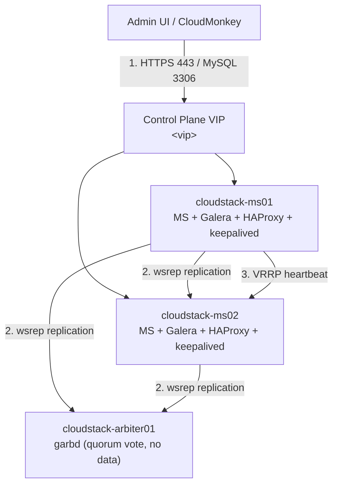

---
tags:
  - cloudstack
  - lab
  - control-plane
---

# CloudStack Control Plane - Triển khai Management Server HA và Galera Database

- **Bối cảnh và vấn đề**: Control plane của CloudStack (Management Server + Database) là "bộ não" của toàn bộ cụm — chết Management Server thì VM đang chạy vẫn sống, nhưng chết Database thì mọi API call fail hoàn toàn, không quản trị được gì. Một Management Server đơn + một MySQL đơn là single point of failure không chấp nhận được cho production dù nhỏ.
- **Cách giải quyết**: Triển khai 2 node vừa đóng vai trò Management Server vừa đóng vai trò MariaDB Galera node (converged, tiết kiệm hạ tầng), cộng thêm 1 node nhẹ chạy `garbd` (Galera Arbitrator) để có quorum 3 thành viên mà không cần node DB đầy đủ thứ ba. HAProxy + keepalived chạy ngay trên 2 node MS, đứng trước bằng 1 VIP chung cho cả API/UI (443) lẫn MySQL (3306). Import System VM Template và hardening API/DB/firewall theo checklist bảo mật.
- **Kết quả sau khi hoàn thành**: Truy cập UI/API CloudStack qua 1 VIP HA, tắt 1 trong 2 Management Server không mất khả năng quản trị. Galera Cluster đồng bộ đa hướng, DB không còn là single point of failure. Đây là nền cho các lab tiếp theo trong series (xem [[CloudStack Production Cluster - Lab Series Overview]]).

> [!NOTE]
> Lab này giả định dòng **Apache CloudStack 4.19.x/4.20.x** trên **Ubuntu 24.04 (noble)** theo đúng phạm vi ghi chú [[Cloudstack|CloudStack Overview]] trong vault này. Luôn xác nhận lại version chính xác và tên codename repo tại `download.cloudstack.org` trước khi cài — số version có thể đã tiến thêm kể từ lúc viết lab.

> [!NOTE]
> Thiết kế Galera 2 node + `garbd` khác với khuyến nghị "≥ 3 node đầy đủ" trong [[Database HA - MySQL Galera]]. `garbd` không lưu dữ liệu, chỉ tham gia vote quorum — phù hợp khi muốn tránh chi phí 1 node DB đầy đủ thứ ba nhưng vẫn cần số thành viên lẻ để chống split-brain. Nếu ngân sách cho phép, thay `garbd` bằng 1 Galera node đầy đủ thứ ba sẽ chịu tải tốt hơn khi cả 2 node MS đều bận.

## Prerequisites

- **Hạ tầng**: DNS nội bộ và NTP hoạt động; các node resolve được lẫn nhau. Chưa có Zone/Pod/Cluster nào được tạo trên CloudStack (lab này dừng lại trước bước tạo Zone).
- **Máy chủ / VM**: 3 node — cấu hình ví dụ dùng trong lab:

  | Node | Vai trò | CPU | RAM | Disk |
  | --- | --- | --- | --- | --- |
  | cloudstack-ms01 | Management Server + Galera node 1 + HAProxy + keepalived | 8 vCPU | 16 GB | 100 GB SSD |
  | cloudstack-ms02 | Management Server + Galera node 2 + HAProxy + keepalived | 8 vCPU | 16 GB | 100 GB SSD |
  | cloudstack-arbiter01 | `garbd` arbitrator (không lưu dữ liệu) | 2 vCPU | 2 GB | 20 GB SSD |

- **Tài khoản và quyền**: sudo trên cả 3 node.
- **Mạng**: dải Management network dùng chung cho MS/DB/VIP đã xin từ team Network — xem placeholder ở Planning table.
- **Kiến thức nền**: giả định đã đọc [[CloudStack Management Server]], [[Database HA - MySQL Galera]], và [[CloudStack HA Architecture]] trong vault này — lab không giải thích lại khái niệm nền.

> [!WARNING]
> Việc tắt 1 node MS hoặc failover VIP trong bước Kiểm tra kết quả không ảnh hưởng VM đang chạy (MS không nằm trong data path), nhưng nếu đây là control plane đang phục vụ user thật, hãy làm ở cửa sổ bảo trì đã thông báo trước.

## Thông tin Planning liên quan

| Thành phần | Giá trị | Ghi chú |
| --- | --- | --- |
| cloudstack-ms01 hostname/IP | `<TBD>` | Management Server + Galera node 1 |
| cloudstack-ms02 hostname/IP | `<TBD>` | Management Server + Galera node 2 |
| cloudstack-arbiter01 hostname/IP | `<TBD>` | `garbd` arbitrator |
| Management network CIDR | `<TBD>` | SSH, Galera replication, API/UI backend |
| VIP control plane | `<TBD>` | keepalived VIP, dùng chung cho HTTPS API/UI (443) và MySQL (3306) |
| VRRP `auth_pass` | `<sinh bằng openssl rand -hex 16>` | Xác thực giữa 2 node keepalived, không dùng giá trị mặc định trong ví dụ tài liệu |
| CloudStack release | `<xác nhận bản mới nhất tại download.cloudstack.org, tham khảo 4.19.x/4.20.x>` | Pin version cụ thể trước khi thêm apt repo |
| Galera cluster name | `cloudstack_galera` | |
| DB user CloudStack | `cloud` | Least privilege, chỉ thao tác trên DB `cloud`/`cloud_usage` |
| DB root password | `<secret store>` | Chỉ dùng lúc `cloudstack-setup-databases`, không dùng lại về sau |
| Dashboard/API admin user | `admin` | Đổi password ngay sau lần đăng nhập đầu tiên |

## Diagram



---

## Installation

### Bước 1 - Chuẩn bị hệ điều hành Ubuntu 24.04 trên 3 node

- Đặt hostname, khai báo `/etc/hosts`, cài NTP, tạo firewall baseline — thực hiện trên cả 3 node:

```bash
sudo hostnamectl set-hostname <hostname-theo-planning-table>
sudo apt update && sudo apt install -y chrony ufw
sudo systemctl enable chrony --now
sudo ufw default deny incoming
sudo ufw default allow outgoing
sudo ufw allow from <management-cidr> to any port 22 proto tcp
sudo ufw enable
```

- Thêm resolve giữa 3 node vào `/etc/hosts` trên từng node:

```text
<ip-ms01>       cloudstack-ms01
<ip-ms02>       cloudstack-ms02
<ip-arbiter01>  cloudstack-arbiter01
```

- Kiểm tra kết quả bước này:

```bash
chronyc tracking | grep "Leap status"
ping -c1 cloudstack-ms02
```

Kết quả mong đợi: `Leap status: Normal`, ping resolve đúng IP.

### Bước 2 - Cài đặt MariaDB Galera trên cloudstack-ms01 và cloudstack-ms02

Milestone này dựng xong tầng DB trước — Management Server ở Bước 4 cần Galera đã chạy để `cloudstack-setup-databases` kết nối vào.

- Cài package trên cả 2 node MS:

```bash
sudo apt install -y mariadb-server galera-4 mariadb-backup
sudo systemctl stop mariadb
```

- Chỉnh sửa `/etc/mysql/mariadb.conf.d/60-galera.cnf` trên **cả 2 node**, chỉ khác `wsrep_node_address`:

```ini
[galera]
wsrep_on = ON
wsrep_provider = /usr/lib/galera/libgalera_smm.so
wsrep_cluster_address = "gcomm://<ip-ms01>,<ip-ms02>,<ip-arbiter01>"
wsrep_cluster_name = "cloudstack_galera"
wsrep_node_address = "<ip-của-chính-node-này>"
wsrep_sst_method = mariabackup
binlog_format = ROW
default_storage_engine = InnoDB
innodb_autoinc_lock_mode = 2
bind-address = 0.0.0.0
```

> [!WARNING]
> `innodb_autoinc_lock_mode = 2` bắt buộc phải set — CloudStack DB dùng nhiều bảng `AUTO_INCREMENT`, thiếu dòng này gây certification conflict/deadlock ngẫu nhiên trên Galera (xem lesson learned trong [[Database HA - MySQL Galera]]).

- Bật mã hoá cho replication traffic giữa các node Galera bằng TLS (nội bộ, dùng self-signed hoặc internal CA vì traffic không rời khỏi Management network):

```bash
sudo mariadb-secure-installation
sudo mysql_install_db --user=mysql
```

```ini
# Thêm vào cùng file 60-galera.cnf, dùng cert internal CA đã chuẩn bị sẵn
wsrep_provider_options = "socket.ssl_key=/etc/mysql/ssl/galera-key.pem;socket.ssl_cert=/etc/mysql/ssl/galera-cert.pem;socket.ssl_ca=/etc/mysql/ssl/ca.pem"
```

- Bootstrap cluster **chỉ trên node đầu tiên (cloudstack-ms01)**:

```bash
sudo galera_new_cluster
```

> [!WARNING]
> `galera_new_cluster` chỉ chạy đúng 1 lần trên node đầu tiên khi cụm chưa có dữ liệu. Nếu sau này toàn bộ cụm cùng down và cần bootstrap lại, phải xác định đúng node có `seqno` cao nhất trong `/var/lib/mysql/grastate.dat` — xem chi tiết cảnh báo trong [[Database HA - MySQL Galera]], bootstrap sai node gây mất dữ liệu mới nhất.

- Khởi động node thứ hai để join cluster:

```bash
# Trên cloudstack-ms02
sudo systemctl start mariadb
```

- Kiểm tra kết quả bước này (chạy trên cả 2 node):

```bash
sudo mysql -e "SHOW STATUS LIKE 'wsrep_cluster_size';"
sudo mysql -e "SHOW STATUS LIKE 'wsrep_local_state_comment';"
```

Kết quả mong đợi: `wsrep_cluster_size` = `2` (chưa tính garbd), `wsrep_local_state_comment` = `Synced` trên cả 2 node.

### Bước 3 - Triển khai garbd arbitrator trên cloudstack-arbiter01

- Cài package arbitrator (không cài `mariadb-server` đầy đủ — `garbd` không lưu dữ liệu):

```bash
sudo apt install -y galera-arbitrator-4
```

- Cấu hình `/etc/default/garb`:

```ini
GALERA_NODES="<ip-ms01>:4567 <ip-ms02>:4567"
GALERA_GROUP="cloudstack_galera"
GALERA_OPTIONS=""
GALERA_LOG_FILE="/var/log/garb.log"
```

```bash
sudo systemctl enable garb --now
```

- Mở firewall cho Galera replication (áp dụng trên cả 3 node, chỉ trong Management network):

```bash
sudo ufw allow from <management-cidr> to any port 3306,4567,4568,4444 proto tcp comment 'galera'
```

- Kiểm tra kết quả bước này:

```bash
sudo mysql -h <ip-ms01> -e "SHOW STATUS LIKE 'wsrep_cluster_size';"
```

Kết quả mong đợi: `wsrep_cluster_size` = `3` (2 node dữ liệu + 1 garbd tham gia quorum vote).

### Bước 4 - Cài đặt CloudStack Management Server trên cloudstack-ms01 và cloudstack-ms02

- Thêm apt repo chính thức của CloudStack (thực hiện trên cả 2 node MS):

```bash
CS_CODENAME=<xác-nhận-tại-download.cloudstack.org>   # ví dụ: noble
CS_VERSION=<xác-nhận-bản-cụ-thể>                      # ví dụ: 4.19
sudo install -d -m 0755 /etc/apt/keyrings
curl -fsSL http://download.cloudstack.org/release.asc | sudo gpg --dearmor -o /etc/apt/keyrings/cloudstack.gpg
echo "deb [signed-by=/etc/apt/keyrings/cloudstack.gpg] http://download.cloudstack.org/deb $CS_CODENAME $CS_VERSION main" \
  | sudo tee /etc/apt/sources.list.d/cloudstack.list
sudo apt update
```

- Cài package Management Server:

```bash
sudo apt install -y cloudstack-management
```

- Setup database — chỉ chạy trên **cloudstack-ms01** (khởi tạo schema `cloud`/`cloud_usage` một lần):

```bash
sudo cloudstack-setup-databases cloud:<db-cloud-password>@<ip-ms01>:3306 \
  --deploy-as=root:<db-root-password>
```

> [!NOTE]
> Trỏ thẳng vào `<ip-ms01>` chỉ dùng cho bước khởi tạo schema một lần. Sau khi setup xong, `db.properties` ở Bước 5 sẽ trỏ qua VIP HAProxy để có failover — không trỏ cứng vào 1 node như cảnh báo trong [[Database HA - MySQL Galera]].

- Kiểm tra kết quả bước này:

```bash
sudo mysql -e "SHOW DATABASES;" | grep -E "cloud|cloud_usage"
```

Kết quả mong đợi: thấy cả 2 database `cloud` và `cloud_usage`.

### Bước 5 - Cấu hình `server.properties`/`db.properties` đúng cho từng node

- Trên **cloudstack-ms01**, chạy setup management (sinh keystore, cấu hình mặc định):

```bash
sudo cloudstack-setup-management
```

- Trên **cloudstack-ms02**, cài package rồi copy `db.properties` từ ms01 sang (schema đã tồn tại, không chạy lại `cloudstack-setup-databases`):

```bash
sudo scp cloudstack-ms01:/etc/cloudstack/management/db.properties /etc/cloudstack/management/db.properties
sudo cloudstack-setup-management
```

- Sửa `db.cloud.host` trong `/etc/cloudstack/management/db.properties` trên **cả 2 node**, trỏ qua VIP thay vì IP cố định (VIP sẽ có ở Bước 7):

```properties
db.cloud.host=<vip-control-plane>
db.cloud.port=3306
db.cloud.autoReconnect=true
```

- Sửa `cluster.node.IP` trong `/etc/cloudstack/management/server.properties` — **giá trị này phải khác nhau giữa 2 node**, đúng bằng IP của chính node đó:

```properties
# Trên cloudstack-ms01
cluster.node.IP=<ip-ms01>
```

```properties
# Trên cloudstack-ms02
cluster.node.IP=<ip-ms02>
```

> [!WARNING]
> Copy nguyên `server.properties` từ node này sang node kia mà quên sửa `cluster.node.IP` khiến cả 2 MS đăng ký nhầm địa chỉ trong bảng `mshost` — job bị "kẹt" ở trạng thái pending một cách khó hiểu. Đây là lesson learned đã ghi trong [[CloudStack Management Server]]. Luôn kiểm tra `SELECT * FROM cloud.mshost;` sau bước này.

- Kiểm tra kết quả bước này:

```bash
sudo mysql -e "SELECT id, name, service_ip, state FROM cloud.mshost;"
```

Kết quả mong đợi: 2 dòng, mỗi dòng `service_ip` đúng IP tương ứng của từng node.

### Bước 6 - Import System VM Template

Bắt buộc trước khi tạo Zone ở lab sau — thiếu bước này, SSVM/CPVM/VR không bao giờ khởi tạo được dù Zone đã cấu hình xong.

- Chạy trên **cloudstack-ms01**, trỏ vào NFS Secondary Storage đã dựng ở [[Ceph Cluster - Triển khai Primary và Secondary Storage cho CloudStack]] (mount tạm để import, không cần giữ mount sau khi xong):

```bash
sudo mkdir -p /mnt/secondary
sudo mount -t nfs4 <nfs-vip>:/cloudstack-secondary /mnt/secondary

/usr/share/cloudstack-common/scripts/storage/secondary/cloud-install-sys-tmplt \
  -m /mnt/secondary \
  -u <url-systemvm-template-kvm-đúng-version-CloudStack> \
  -h kvm -F

sudo umount /mnt/secondary
```

> [!NOTE]
> URL system VM template phải khớp đúng dòng version CloudStack đang cài — lấy từ trang release notes chính thức tương ứng với `$CS_VERSION` ở Bước 4, không dùng URL của version khác.

- Kiểm tra kết quả bước này:

```bash
sudo mysql -u cloud -p -e "SELECT name, state FROM cloud.vm_template WHERE type='SYSTEM';"
```

Kết quả mong đợi: có ít nhất 1 dòng template `state = Ready`.

### Bước 7 - Triển khai HAProxy + keepalived cho VIP control plane

- Cài đặt trên cả 2 node MS:

```bash
sudo apt install -y haproxy keepalived
```

- Cấu hình `/etc/haproxy/haproxy.cfg` (giống nhau trên cả 2 node) — HTTPS terminate tại HAProxy rồi re-encrypt xuống backend 8443 để giữ mã hoá end-to-end, và passthrough MySQL với healthcheck theo trạng thái Galera:

```ini
frontend cloudstack_api
    bind *:443 ssl crt /etc/haproxy/certs/control-plane.pem
    default_backend cloudstack_ms

backend cloudstack_ms
    balance roundrobin
    option httpchk GET /client/api?command=listCapabilities
    server ms01 <ip-ms01>:8443 check ssl verify none
    server ms02 <ip-ms02>:8443 check ssl verify none

frontend galera_mysql
    bind *:3306
    default_backend galera_nodes
    mode tcp

backend galera_nodes
    mode tcp
    balance leastconn
    option httpchk
    server ms01 <ip-ms01>:3306 check port 9200
    server ms02 <ip-ms02>:3306 check port 9200
```

> [!NOTE]
> Healthcheck port `9200` là script `clustercheck` (chạy qua `xinetd`) trả về HTTP 200 khi node Galera ở trạng thái `Synced`, HTTP 503 khi không — nhờ đó HAProxy tự loại node đang desync khỏi backend mà không cần can thiệp tay. Cài qua `apt install percona-xtradb-cluster-client` hoặc lấy script `clustercheck` tương đương cho MariaDB.

- Cấu hình `/etc/keepalived/keepalived.conf` trên **cloudstack-ms01** (MASTER):

```ini
vrrp_instance CS_VIP {
    state MASTER
    interface <management-nic>
    virtual_router_id 51
    priority 150
    advert_int 1
    authentication {
        auth_type PASS
        auth_pass <vrrp-auth-pass-theo-planning-table>
    }
    virtual_ipaddress {
        <vip-control-plane>/<prefix>
    }
}
```

- Trên **cloudstack-ms02** (BACKUP), giống hệt nhưng `state BACKUP` và `priority 100`.

> [!WARNING]
> `auth_pass` VRRP chỉ dài tối đa 8 ký tự theo giới hạn giao thức VRRPv2 — không phải nơi lưu secret mạnh, chỉ chống thiết bị lạ vô tình tham gia nhóm VRRP cùng VLAN. Không dùng lại giá trị này cho mục đích bảo mật khác.

- Khởi động và kiểm tra kết quả bước này:

```bash
sudo systemctl enable haproxy keepalived --now
ip addr show <management-nic> | grep <vip-control-plane>
curl -k https://<vip-control-plane>/client/api?command=listCapabilities
```

Kết quả mong đợi: VIP xuất hiện trên node MASTER, `curl` trả về JSON capabilities thay vì connection refused.

### Bước 8 - Hardening API, UI và firewall

- Chặn truy cập trực tiếp vào từng MS (8080/8443), chỉ cho phép từ chính cặp HAProxy và Management network — traffic thật phải luôn đi qua VIP:

```bash
sudo ufw allow from <ip-ms01>,<ip-ms02> to any port 8080,8443 proto tcp comment 'internal LB healthcheck only'
sudo ufw deny 8080,8443 proto tcp comment 'block direct access, force via VIP'
```

- Vô hiệu hoá Integration API port — đây là cổng API không cần chữ ký HMAC, chỉ nên bật tạm thời khi cần debug/script nội bộ đáng tin cậy, không để mặc định mở:

```bash
cmk -u https://<vip-control-plane>/client/api list configurations name=integration.api.port
cmk -u https://<vip-control-plane>/client/api updateConfiguration name=integration.api.port value=
sudo systemctl restart cloudstack-management
```

> [!WARNING]
> `integration.api.port` khi bật cho phép gọi API **không cần ký HMAC** — bất kỳ ai reach được port này trên Management network đều có thể gọi API với quyền admin. Chỉ bật tạm thời khi thật sự cần, và luôn tắt lại (để trống) ngay sau khi dùng xong.

- Đổi password tài khoản `admin` mặc định ngay lần đăng nhập đầu, và rà soát các Global Setting liên quan tới giới hạn số lần đăng nhập sai/session timeout trước khi mở UI cho người dùng khác:

```bash
cmk -u https://<vip-control-plane>/client/api list configurations keyword=login
cmk -u https://<vip-control-plane>/client/api list configurations keyword=session
```

> [!NOTE]
> Tên chính xác của từng Global Setting có thể khác nhau giữa các minor version — dùng 2 lệnh `list configurations keyword=...` ở trên để xác nhận key hiện có trên đúng version đang chạy thay vì đoán tên, rồi set giá trị phù hợp với chính sách bảo mật của tổ chức (số lần đăng nhập sai tối đa, thời gian khoá, session timeout).

- Kiểm tra kết quả bước này:

```bash
curl -k https://<ip-ms01>:8443/client/api?command=listCapabilities
```

Kết quả mong đợi: connection bị từ chối/timeout khi gọi trực tiếp vào IP node (không qua VIP), xác nhận firewall đã chặn đúng.

### Khai báo thông tin nhạy cảm

- Các giá trị nhạy cảm trong lab này: `<db-cloud-password>`, `<db-root-password>`, `<vrrp-auth-pass>`, password tài khoản `admin` trên UI. Toàn bộ được sinh bằng `openssl rand -base64 20` (riêng `auth_pass` giới hạn 8 ký tự theo giao thức VRRP), lưu vào secret store của tổ chức, không hardcode trong file cấu hình public hay script tự động hoá:

```bash
openssl rand -base64 20 > /root/db-cloud.pass
openssl rand -base64 20 > /root/db-root.pass
chmod 600 /root/db-cloud.pass /root/db-root.pass
```

- `db.properties` chứa password DB dạng plaintext trên cả 2 node MS — quyền file phải là `600`, chỉ user chạy `cloudstack-management` đọc được:

```bash
sudo chmod 600 /etc/cloudstack/management/db.properties
```

## Kiểm tra kết quả

- Login UI qua VIP, xác nhận version đúng dòng đã pin:

```bash
cmk -u https://<vip-control-plane>/client/api list infos filter=cloudstackversion
```

- Test failover: dừng `cloudstack-management` trên node đang giữ VIP, xác nhận UI vẫn truy cập được qua VIP (đã chuyển sang node còn lại):

```bash
sudo systemctl stop cloudstack-management   # chạy trên node đang là keepalived MASTER
curl -k https://<vip-control-plane>/client/api?command=listCapabilities
sudo systemctl start cloudstack-management  # khôi phục lại sau khi xác nhận
```

  | Hạng mục cần kiểm tra | Cách kiểm tra | Kết quả đúng |
  | --- | --- | --- |
  | Galera cluster quorum | `SHOW STATUS LIKE 'wsrep_cluster_size';` | `3` |
  | Cả 2 MS đăng ký đúng IP | `SELECT * FROM cloud.mshost;` | 2 dòng, `service_ip` đúng từng node |
  | System VM template sẵn sàng | `SELECT name,state FROM cloud.vm_template WHERE type='SYSTEM';` | `state = Ready` |
  | VIP hoạt động khi 1 MS down | `curl -k https://<vip>/client/api?command=listCapabilities` sau khi stop 1 MS | Vẫn trả JSON, không lỗi |

## Troubleshooting

Không áp dụng - lab dựng mới theo hướng dẫn triển khai chuẩn, chưa có log lỗi thực tế phát sinh trong quá trình build để ghi nhận.

## Rollback

- Gỡ HAProxy/keepalived (VIP biến mất, mất khả năng truy cập control plane qua 1 địa chỉ duy nhất):

```bash
sudo systemctl disable --now haproxy keepalived
```

- Gỡ Management Server (không ảnh hưởng dữ liệu DB):

```bash
sudo systemctl stop cloudstack-management
sudo apt remove --purge -y cloudstack-management
```

- Gỡ Galera/garbd — chỉ thực hiện nếu chắc chắn không còn cần dữ liệu:

```bash
sudo systemctl stop mariadb   # trên ms01, ms02
sudo systemctl stop garb      # trên arbiter01
```

> [!CAUTION]
> Xoá dữ liệu MySQL (`/var/lib/mysql`) trên cả 2 node cùng lúc làm mất toàn bộ state của CloudStack (Zone, VM, network, account...) không thể khôi phục nếu chưa backup. Chỉ xoá sau khi đã `mariabackup` đầy đủ, theo hướng dẫn backup trong [[Database HA - MySQL Galera]].

## Reference

- [Apache CloudStack - Installation Guide](https://docs.cloudstack.apache.org/en/latest/installguide/index.html)
- [Apache CloudStack - Management Server package repository](https://docs.cloudstack.apache.org/en/latest/installguide/management-server/index.html)
- [MariaDB - Galera Cluster with garbd (Galera Arbitrator)](https://mariadb.com/kb/en/galera-cluster-arbitrator-garbd/)
- [HAProxy - Configuration Manual](https://docs.haproxy.org/)
- [Keepalived - VRRP configuration](https://www.keepalived.org/manpage.html)
- Ghi chú liên quan trong vault: [[CloudStack Management Server]] | [[Database HA - MySQL Galera]] | [[CloudStack HA Architecture]] | [[Key Configuration Reference]]
