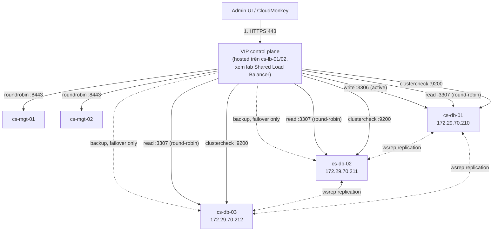

---
tags:
  - cloudstack
  - lab
  - control-plane
---

# CloudStack Control Plane - Triển khai Management Server HA và Galera Database

- **Bối cảnh và vấn đề**: Control plane của CloudStack (Management Server + Database) là "bộ não" của toàn bộ cụm — chết Management Server thì VM đang chạy vẫn sống, nhưng chết Database thì mọi API call fail hoàn toàn, không quản trị được gì. Một Management Server đơn + một MySQL đơn là single point of failure không chấp nhận được cho production dù nhỏ.
- **Cách giải quyết**: Triển khai 2 node Management Server (**cs-mgt-01/02**, chạy thuần `cloudstack-management`, không converged HAProxy/keepalived) đứng trước một cụm MariaDB Galera **3 node độc lập** (**cs-db-01/02/03** — không cần `garbd`, đủ 3 node dữ liệu thật cho quorum). Việc cân bằng tải/VIP cho cả 2 tầng này (API/UI của MS, write/read của Galera) được tách hẳn ra một cặp HAProxy + keepalived **dùng chung cho toàn platform** ở [[CloudStack & Ceph - Shared Load Balancer HAProxy Keepalived]] — cặp LB đó còn phục vụ luôn Ceph Dashboard, tiết kiệm một tầng hạ tầng so với việc converge HAProxy riêng trên từng nhóm node. HAProxy proxy vào cụm DB theo mô hình **single-writer**: 1 node Galera nhận toàn bộ write qua port riêng, 2 node còn lại chỉ là `backup` (failover tự động khi node write chết) — tránh certification conflict nếu để CloudStack ghi đồng thời vào nhiều node Galera cùng lúc. Một port HAProxy riêng round-robin read qua cả 3 node cho các công cụ đọc/báo cáo khác ngoài CloudStack. Healthcheck dùng script `clustercheck` (qua `xinetd`) để HAProxy biết chính xác node nào đang `Synced`, không route nhầm vào node đang SST/IST giữa chừng. Import System VM Template và hardening API/DB/firewall theo checklist bảo mật.
- **Kết quả sau khi hoàn thành**: Truy cập UI/API CloudStack qua 1 VIP HA (hosted trên cặp LB dùng chung), tắt 1 trong 2 Management Server không mất khả năng quản trị. Galera Cluster 3 node đồng bộ đa hướng với quorum thật (2/3 vote), DB không còn là single point of failure. Đây là nền cho các lab tiếp theo trong series (xem [[CloudStack Production Cluster - Lab Series Overview]]).

> [!NOTE]
> Lab này giả định dòng **Apache CloudStack 4.19.x/4.20.x** trên **Ubuntu 24.04 (noble)** theo đúng phạm vi ghi chú [[Cloudstack|CloudStack Overview]] trong vault này. Luôn xác nhận lại version chính xác và tên codename repo tại `download.cloudstack.org` trước khi cài — số version có thể đã tiến thêm kể từ lúc viết lab.

> [!NOTE]
> Thiết kế này khác 2 bản nháp trước: (1) bản đầu tiên converged 2 node MS + Galera + `garbd`; (2) bản kế tiếp tách Galera ra 3 node riêng nhưng vẫn converge HAProxy/keepalived ngay trên 2 node MS. Bản hiện tại tách tiếp HAProxy/keepalived ra khỏi MS, đưa vào một cặp LB dùng chung cho toàn bộ platform (CloudStack UI/API + Galera + Ceph Dashboard) — lý do: (a) MS không phải lo cạnh tranh CPU/RAM với tiến trình HAProxy lúc tải API cao, (b) một cặp LB duy nhất khấu hao cho nhiều dịch vụ thay vì mỗi cụm tự converge LB riêng, đúng tinh thần cost-conscious của cả series. Đánh đổi là thêm 1 điểm hạ tầng cần quản lý (2 node `cs-lb-01/02`), nhưng đó là chi phí cố định dùng chung cho cả CloudStack lẫn Ceph, không tăng theo số cụm.

> [!NOTE]
> Galera cho phép ghi vào bất kỳ node nào (multi-master), nhưng CloudStack không idempotent-safe với ghi đồng thời đa hướng — ghi cùng lúc vào 2 node khác nhau trên cùng row dễ gây certification conflict, transaction bị Galera rollback ngẫu nhiên phía client mà CloudStack không retry đúng cách. Vì vậy HAProxy ở [[CloudStack & Ceph - Shared Load Balancer HAProxy Keepalived]] luôn ép **toàn bộ write qua đúng 1 node** (`server ... check backup` cho 2 node còn lại), không bao giờ round-robin write qua cả 3 node.

## Prerequisites

- **Hạ tầng**: DNS nội bộ và NTP hoạt động; các node resolve được lẫn nhau. Chưa có Zone/Pod/Cluster nào được tạo trên CloudStack (lab này dừng lại trước bước tạo Zone). Cặp LB dùng chung ở [[CloudStack & Ceph - Shared Load Balancer HAProxy Keepalived]] nên triển khai song song — lab này chỉ cần biết trước giá trị VIP đã chốt ở Planning table của lab đó.
- **Máy chủ / VM**: 5 node — cấu hình ví dụ dùng trong lab, điều chỉnh lại theo capacity thực tế:

| Node      | Vai trò                     | CPU    | RAM   | Disk       |
| --------- | ---------------------------- | ------ | ----- | ---------- |
| cs-mgt-01 | Management Server            | 8 vCPU | 16 GB | 100 GB SSD |
| cs-mgt-02 | Management Server            | 8 vCPU | 16 GB | 100 GB SSD |
| cs-db-01  | MariaDB + Galera node 1       | 8 vCPU | 16 GB | 100 GB SSD |
| cs-db-02  | MariaDB + Galera node 2       | 8 vCPU | 16 GB | 100 GB SSD |
| cs-db-03  | MariaDB + Galera node 3       | 8 vCPU | 16 GB | 100 GB SSD |

- **Tài khoản và quyền**: sudo trên cả 5 node.
- **Mạng**: dải Management network dùng chung cho MS/DB đã xin từ team Network — xem placeholder ở Planning table. Đây chính là NIC "mgt" trong thiết kế 4-NIC của [[CloudStack Compute Node - Chuẩn bị KVM Hypervisor Host]] — control plane và compute node dùng cùng dải Management network.
- **Kiến thức nền**: giả định đã đọc [[CloudStack Management Server]], [[Database HA - MySQL Galera]], và [[CloudStack HA Architecture]] trong vault này — lab không giải thích lại khái niệm nền.

> [!WARNING]
> Việc tắt 1 node MS hoặc failover VIP trong bước Kiểm tra kết quả không ảnh hưởng VM đang chạy (MS không nằm trong data path), nhưng nếu đây là control plane đang phục vụ user thật, hãy làm ở cửa sổ bảo trì đã thông báo trước.

## Thông tin Planning liên quan

| Thành phần | Giá trị | Ghi chú |
| --- | --- | --- |
| cs-mgt-01 hostname/IP | `<TBD>` | Management Server |
| cs-mgt-02 hostname/IP | `<TBD>` | Management Server |
| cs-db-01 hostname/IP | `172.29.70.210` | MariaDB + Galera node 1 (bootstrap node) |
| cs-db-02 hostname/IP | `172.29.70.211` | MariaDB + Galera node 2 |
| cs-db-03 hostname/IP | `172.29.70.212` | MariaDB + Galera node 3 |
| Management network CIDR | `<TBD>` | SSH, Galera replication, API/UI backend |
| VIP control plane | `<TBD>` | Hosted trên `cs-lb-01/02`, xem [[CloudStack & Ceph - Shared Load Balancer HAProxy Keepalived]] — dùng chung cho HTTPS API/UI (443), MySQL write (3306) và read (3307) |
| Galera healthcheck port | `9200` | `clustercheck` qua `xinetd`, chạy trên cả 3 node DB, chỉ mở cho IP `cs-lb-01/02` (không phải MS như bản thiết kế cũ) |
| CloudStack release | `<xác nhận bản mới nhất tại download.cloudstack.org, tham khảo 4.19.x/4.20.x>` | Pin version cụ thể trước khi thêm apt repo |
| Galera cluster name | `cloudstack-mgt` | |
| SST user | `sstuser` | Dùng bởi `mariabackup` để đồng bộ dữ liệu lúc node join cluster, password sinh bằng `openssl rand` |
| Clustercheck user | `clustercheck` | Chỉ có quyền `PROCESS`, dùng riêng cho script healthcheck, không dùng chung với `sstuser` |
| DB user CloudStack | `cloud` | Least privilege, chỉ thao tác trên DB `cloud`/`cloud_usage` |
| DB root password | `<secret store>` | Chỉ dùng lúc `cloudstack-setup-databases`, không dùng lại về sau |
| Dashboard/API admin user | `admin` | Đổi password ngay sau lần đăng nhập đầu tiên |

## Diagram



---

## Installation

### Bước 1 - Chuẩn bị hệ điều hành Ubuntu 24.04 trên 5 node

`wsrep` (giao thức replication của Galera) rất nhạy với lệch giờ — clock drift là nguyên nhân phổ biến nhất gây lỗi IST/SST khó hiểu lúc join cluster ở Bước 2, nên NTP ở bước này quan trọng không kém gì ở lab Ceph.

- Đặt hostname, khai báo `/etc/hosts`, cài NTP, tạo firewall baseline — thực hiện trên cả 5 node:

```bash
sudo hostnamectl set-hostname <hostname-theo-planning-table>
sudo apt update && sudo apt install -y chrony ufw
sudo systemctl enable chrony --now
timedatectl status | grep "System clock synchronized"
sudo ufw default deny incoming
sudo ufw default allow outgoing
sudo ufw allow from <management-cidr> to any port 22 proto tcp
sudo ufw enable
```

- Thêm resolve giữa 5 node vào `/etc/hosts` trên từng node:

```text
<ip-cs-mgt-01>  cs-mgt-01
<ip-cs-mgt-02>  cs-mgt-02
172.29.70.210  cs-db-01
172.29.70.211  cs-db-02
172.29.70.212  cs-db-03
```

- Kiểm tra kết quả bước này:

```bash
chronyc tracking | grep "Leap status"
ping -c1 cs-mgt-02
```

Kết quả mong đợi: `Leap status: Normal`, ping resolve đúng IP.

### Bước 2 - Cài đặt cụm MariaDB Galera 3 node (cs-db-01/02/03)

Milestone này dựng xong tầng DB trước — Management Server ở Bước 4 cần Galera đã chạy để `cloudstack-setup-databases` kết nối vào. 3 node dữ liệu đầy đủ cho quorum thật (2/3 vote), không cần `garbd`.

- Cài package trên cả 3 node DB (tuyệt đối cùng version MariaDB giữa 3 node — mismatch version giữa các node là nguyên nhân khó debug nhất):

```bash
sudo apt install -y mariadb-server mariadb-client mariadb-backup galera-4
sudo systemctl stop mariadb
```

> [!NOTE]
> `mariadb-backup` bắt buộc cài — đây là engine SST (State Snapshot Transfer) mặc định dùng để đồng bộ full data khi 1 node join cluster, ổn định và không blocking như `rsync`.

- Chỉnh sửa `/etc/mysql/mariadb.conf.d/60-galera.cnf` trên **cả 3 node**, chỉ khác `wsrep_node_address`/`wsrep_node_name`:

```ini
[mysqld]
binlog_format = ROW
default_storage_engine = InnoDB
innodb_autoinc_lock_mode = 2
bind-address = 0.0.0.0

wsrep_on = ON
wsrep_provider = /usr/lib/galera/libgalera_smm.so
wsrep_cluster_name = "cloudstack-mgt"
wsrep_cluster_address = "gcomm://172.29.70.210,172.29.70.211,172.29.70.212"

# --- Đổi 2 dòng này theo từng node ---
wsrep_node_address = "<ip-của-chính-node-này>"
wsrep_node_name = "<hostname-của-chính-node-này>"
# ---------------------------------------

wsrep_sst_method = mariabackup
wsrep_sst_auth = "sstuser:<sst-password-theo-planning-table>"
```

> [!WARNING]
> `innodb_autoinc_lock_mode = 2` bắt buộc phải set — CloudStack DB dùng nhiều bảng `AUTO_INCREMENT`, thiếu dòng này gây certification conflict/deadlock ngẫu nhiên trên Galera (xem lesson learned trong [[Database HA - MySQL Galera]]).

> [!WARNING]
> `wsrep_sst_auth` chứa password dạng plaintext trong file config — `chmod 640` file này, owner `mysql:mysql`, không commit vào git. `bind-address = 0.0.0.0` khiến MariaDB nghe toàn bộ interface, nên bắt buộc phải mở firewall đúng scope ở bước dưới, không được để port lộ ra ngoài Management network.

- Mở firewall cho Galera replication (áp dụng trên cả 3 node DB, chỉ trong Management network) — 4567 (gcomm/replication, cả tcp lẫn udp), 4568 (IST), 4444 (SST), 3306 (client + SST auth):

```bash
sudo ufw allow from <management-cidr> to any port 3306,4567,4568,4444 proto tcp comment 'galera'
sudo ufw allow from <management-cidr> to any port 4567 proto udp comment 'galera gcomm'
```

- Bật mã hoá cho replication traffic giữa các node Galera bằng TLS (nội bộ, dùng self-signed hoặc internal CA vì traffic không rời khỏi Management network):

```ini
# Thêm vào cùng file 60-galera.cnf, dùng cert internal CA đã chuẩn bị sẵn
wsrep_provider_options = "socket.ssl_key=/etc/mysql/ssl/galera-key.pem;socket.ssl_cert=/etc/mysql/ssl/galera-cert.pem;socket.ssl_ca=/etc/mysql/ssl/ca.pem"
```

- Bootstrap cluster **chỉ trên node đầu tiên (cs-db-01)**:

```bash
sudo galera_new_cluster
```

> [!WARNING]
> `galera_new_cluster` chỉ chạy đúng 1 lần trên node đầu tiên khi cụm chưa có dữ liệu. Chạy nhầm trên node khác cùng lúc sẽ tạo ra 2 cluster riêng biệt (split-brain), dữ liệu diverge, rollback cực khổ. Nếu sau này toàn bộ cụm cùng down và cần bootstrap lại, phải xác định đúng node có `seqno` cao nhất trong `/var/lib/mysql/grastate.dat` — xem chi tiết cảnh báo trong [[Database HA - MySQL Galera]], bootstrap sai node gây mất dữ liệu mới nhất.

- Verify cluster size = 1, sau đó tạo user `sstuser` (dùng cho SST khi 2 node còn lại join) và `clustercheck` (dùng cho healthcheck ở Bước 3) — chỉ cần tạo 1 lần trên cs-db-01, Galera tự đồng bộ sang các node join sau:

```bash
sudo mysql -e "SHOW STATUS LIKE 'wsrep_cluster_size';"   # expect: 1

sudo mysql <<'EOF'
CREATE USER 'sstuser'@'localhost' IDENTIFIED BY '<sst-password-theo-planning-table>';
GRANT RELOAD, LOCK TABLES, PROCESS, REPLICATION CLIENT ON *.* TO 'sstuser'@'localhost';

CREATE USER 'clustercheck'@'127.0.0.1' IDENTIFIED BY '<clustercheck-password-theo-planning-table>';
GRANT PROCESS ON *.* TO 'clustercheck'@'127.0.0.1';
FLUSH PRIVILEGES;
EOF
```

- Khởi động node thứ hai và thứ ba để join cluster (**không** dùng `galera_new_cluster` — start bình thường, node tự SST/IST đồng bộ full data từ cluster hiện có):

```bash
# Trên cs-db-02 và cs-db-03
sudo systemctl start mariadb
```

> [!NOTE]
> Nếu data lớn, SST sẽ block write trên donor node tạm thời — nên join lần đầu vào cluster đang có traffic thật ở cửa sổ bảo trì off-peak.

- Kiểm tra kết quả bước này (chạy trên cả 3 node):

```bash
sudo mysql -e "SHOW STATUS LIKE 'wsrep_cluster_size';"
sudo mysql -e "SHOW STATUS LIKE 'wsrep_ready';"
sudo mysql -e "SHOW STATUS LIKE 'wsrep_local_state_comment';"
```

Kết quả mong đợi: `wsrep_cluster_size` = `3`, `wsrep_ready` = `ON`, `wsrep_local_state_comment` = `Synced` trên cả 3 node.

### Bước 3 - Cấu hình `clustercheck` healthcheck trên cs-db-01/02/03

HAProxy (chạy trên `cs-lb-01/02`, xem [[CloudStack & Ceph - Shared Load Balancer HAProxy Keepalived]]) cần biết chính xác node nào đang `Synced` để không route write/read vào node đang SST/IST giữa chừng (dữ liệu chưa đầy đủ) — chỉ check port 3306 sống/chết là không đủ, đây là bước hay bị bỏ qua nhất và gây outage âm thầm nhất trong vận hành Galera.

- Cài `xinetd` để expose 1 endpoint HTTP nhỏ cho HAProxy healthcheck (thực hiện trên cả 3 node DB):

```bash
sudo apt install -y xinetd
```

- Tạo script `/usr/local/bin/clustercheck.sh` (giống nhau trên cả 3 node), dùng user `clustercheck` đã tạo ở Bước 2:

```bash
#!/bin/bash
MYSQL_USER="clustercheck"
MYSQL_PASSWORD="<clustercheck-password-theo-planning-table>"

STATUS=$(mysql -u$MYSQL_USER -p$MYSQL_PASSWORD -h127.0.0.1 -e "SHOW STATUS LIKE 'wsrep_local_state_comment';" 2>/dev/null | awk 'NR==2{print $2}')

if [ "$STATUS" = "Synced" ]; then
    echo -e "HTTP/1.1 200 OK\r\n\r\nMariaDB Cluster Node is Synced."
else
    echo -e "HTTP/1.1 503 Service Unavailable\r\n\r\nMariaDB Cluster Node is $STATUS."
fi
```

```bash
sudo chmod 700 /usr/local/bin/clustercheck.sh
sudo chown mysql:mysql /usr/local/bin/clustercheck.sh
```

> [!WARNING]
> Password của `clustercheck` đang nằm plaintext trong script — quyền file phải là `700`, owner `mysql`. Không dùng chung password với `sstuser` hay `client.admin`-tương-đương nào khác, để nếu file này lộ thì blast radius chỉ giới hạn ở quyền `PROCESS` (không đọc/ghi được dữ liệu).

- Khai báo service cho `xinetd` tại `/etc/xinetd.d/mysqlchk`, giới hạn `only_from` chỉ 2 IP của cặp LB dùng chung `cs-lb-01/02` — **không phải** IP của MS như thiết kế cũ, vì HAProxy giờ chạy trên node LB riêng, không converge trên MS nữa:

```text
service mysqlchk
{
    disable         = no
    flags           = REUSE
    socket_type     = stream
    port            = 9200
    wait            = no
    user            = nobody
    server          = /usr/local/bin/clustercheck.sh
    log_on_failure  += USERID
    only_from       = <ip-cs-lb-01> <ip-cs-lb-02>
    per_source      = UNLIMITED
}
```

```bash
sudo systemctl enable --now xinetd
```

- Mở firewall cho port healthcheck, chỉ từ 2 node LB dùng chung:

```bash
sudo ufw allow from <ip-cs-lb-01> to any port 9200 proto tcp comment 'clustercheck from shared lb'
sudo ufw allow from <ip-cs-lb-02> to any port 9200 proto tcp comment 'clustercheck from shared lb'
```

- Kiểm tra kết quả bước này (chạy từ cs-lb-01/02, hoặc `curl` cục bộ trên từng node DB):

```bash
curl -s http://<ip-cs-db-01>:9200/
```

Kết quả mong đợi: `HTTP/1.1 200 OK` kèm nội dung `MariaDB Cluster Node is Synced.` trên cả 3 node.

### Bước 4 - Cài đặt CloudStack Management Server trên cs-mgt-01 và cs-mgt-02

- Thêm apt repo chính thức của CloudStack (thực hiện trên cả 2 node MS):

```bash
CS_CODENAME=<xác-nhận-tại-download.cloudstack.org>   # ví dụ: noble
CS_VERSION=<xác-nhận-bản-cụ-thể>                      # ví dụ: 4.19
sudo install -d -m 0755 /etc/apt/keyrings
curl -fsSL http://download.cloudstack.org/release.asc | sudo gpg --dearmor -o /etc/apt/keyrings/cloudstack.gpg
echo "deb [signed-by=/etc/apt/keyrings/cloudstack.gpg] http://download.cloudstack.org/deb $CS_CODENAME $CS_VERSION main" \
  | sudo tee /etc/apt/sources.list.d/cloudstack.list
sudo apt update
```

- Cài package Management Server:

```bash
sudo apt install -y cloudstack-management
```

- Setup database — chỉ chạy trên **cs-mgt-01** (khởi tạo schema `cloud`/`cloud_usage` một lần), trỏ thẳng vào node bootstrap của Galera (cs-db-01):

```bash
sudo cloudstack-setup-databases cloud:<db-cloud-password>@172.29.70.210:3306 \
  --deploy-as=root:<db-root-password>
```

> [!NOTE]
> Trỏ thẳng vào `cs-db-01` chỉ dùng cho bước khởi tạo schema một lần — Galera tự đồng bộ schema sang db02/db03 ngay sau khi tạo. Sau khi setup xong, `db.properties` ở Bước 5 sẽ trỏ qua VIP (hosted trên `cs-lb-01/02`, port write 3306) để có failover — không trỏ cứng vào 1 node như cảnh báo trong [[Database HA - MySQL Galera]].

- Kiểm tra kết quả bước này (chạy `mysql` client từ ms01, kết nối remote vào db01 vì DB không còn chạy local trên node MS):

```bash
sudo mysql -h 172.29.70.210 -ucloud -p -e "SHOW DATABASES;" | grep -E "cloud|cloud_usage"
```

Kết quả mong đợi: thấy cả 2 database `cloud` và `cloud_usage`.

### Bước 5 - Cấu hình `server.properties`/`db.properties` đúng cho từng node

- Trên **cs-mgt-01**, chạy setup management (sinh keystore, cấu hình mặc định):

```bash
sudo cloudstack-setup-management
```

- Trên **cs-mgt-02**, cài package rồi copy `db.properties` từ mgt-01 sang (schema đã tồn tại, không chạy lại `cloudstack-setup-databases`):

```bash
sudo scp cs-mgt-01:/etc/cloudstack/management/db.properties /etc/cloudstack/management/db.properties
sudo cloudstack-setup-management
```

- Sửa `db.cloud.host` trong `/etc/cloudstack/management/db.properties` trên **cả 2 node**, trỏ qua VIP (hosted trên `cs-lb-01/02`) thay vì IP cố định. Port `3306` ở đây là **write pool** của HAProxy (single-writer, xem [[CloudStack & Ceph - Shared Load Balancer HAProxy Keepalived]]) — CloudStack MS chỉ dùng 1 connection pool nên luôn đi qua port write, không dùng port read `3307`:

```properties
db.cloud.host=<vip-control-plane>
db.cloud.port=3306
db.cloud.autoReconnect=true
```

- Sửa `cluster.node.IP` trong `/etc/cloudstack/management/server.properties` — **giá trị này phải khác nhau giữa 2 node**, đúng bằng IP của chính node đó:

```properties
# Trên cs-mgt-01
cluster.node.IP=<ip-cs-mgt-01>
```

```properties
# Trên cs-mgt-02
cluster.node.IP=<ip-cs-mgt-02>
```

> [!WARNING]
> Copy nguyên `server.properties` từ node này sang node kia mà quên sửa `cluster.node.IP` khiến cả 2 MS đăng ký nhầm địa chỉ trong bảng `mshost` — job bị "kẹt" ở trạng thái pending một cách khó hiểu. Đây là lesson learned đã ghi trong [[CloudStack Management Server]]. Luôn kiểm tra `SELECT * FROM cloud.mshost;` sau bước này.

- Kiểm tra kết quả bước này:

```bash
sudo mysql -h 172.29.70.210 -ucloud -p -e "SELECT id, name, service_ip, state FROM cloud.mshost;"
```

Kết quả mong đợi: 2 dòng, mỗi dòng `service_ip` đúng IP tương ứng của từng node.

### Bước 6 - Import System VM Template

Bắt buộc trước khi tạo Zone ở lab sau — thiếu bước này, SSVM/CPVM/VR không bao giờ khởi tạo được dù Zone đã cấu hình xong.

- Chạy trên **cs-mgt-01**, trỏ vào NFS Secondary Storage đã dựng ở [[Ceph Cluster - Triển khai Primary và Secondary Storage cho CloudStack]] (mount tạm để import, không cần giữ mount sau khi xong):

```bash
sudo mkdir -p /mnt/secondary
sudo mount -t nfs4 <nfs-vip>:/cloudstack-secondary /mnt/secondary

/usr/share/cloudstack-common/scripts/storage/secondary/cloud-install-sys-tmplt \
  -m /mnt/secondary \
  -u <url-systemvm-template-kvm-đúng-version-CloudStack> \
  -h kvm -F

sudo umount /mnt/secondary
```

> [!NOTE]
> URL system VM template phải khớp đúng dòng version CloudStack đang cài — lấy từ trang release notes chính thức tương ứng với `$CS_VERSION` ở Bước 4, không dùng URL của version khác.

- Kiểm tra kết quả bước này:

```bash
sudo mysql -h 172.29.70.210 -u cloud -p -e "SELECT name, state FROM cloud.vm_template WHERE type='SYSTEM';"
```

Kết quả mong đợi: có ít nhất 1 dòng template `state = Ready`.

### Bước 7 - Hardening API, UI và firewall

- Chặn truy cập trực tiếp vào từng MS (8080/8443), chỉ cho phép từ chính cặp LB dùng chung `cs-lb-01/02` và Management network — traffic thật phải luôn đi qua VIP:

```bash
sudo ufw allow from <ip-cs-lb-01>,<ip-cs-lb-02> to any port 8080,8443 proto tcp comment 'shared lb healthcheck + traffic only'
sudo ufw deny 8080,8443 proto tcp comment 'block direct access, force via VIP'
```

- Vô hiệu hoá Integration API port — đây là cổng API không cần chữ ký HMAC, chỉ nên bật tạm thời khi cần debug/script nội bộ đáng tin cậy, không để mặc định mở:

```bash
cmk -u https://<vip-control-plane>/client/api list configurations name=integration.api.port
cmk -u https://<vip-control-plane>/client/api updateConfiguration name=integration.api.port value=
sudo systemctl restart cloudstack-management
```

> [!WARNING]
> `integration.api.port` khi bật cho phép gọi API **không cần ký HMAC** — bất kỳ ai reach được port này trên Management network đều có thể gọi API với quyền admin. Chỉ bật tạm thời khi thật sự cần, và luôn tắt lại (để trống) ngay sau khi dùng xong.

- Đổi password tài khoản `admin` mặc định ngay lần đăng nhập đầu, và rà soát các Global Setting liên quan tới giới hạn số lần đăng nhập sai/session timeout trước khi mở UI cho người dùng khác:

```bash
cmk -u https://<vip-control-plane>/client/api list configurations keyword=login
cmk -u https://<vip-control-plane>/client/api list configurations keyword=session
```

> [!NOTE]
> Tên chính xác của từng Global Setting có thể khác nhau giữa các minor version — dùng 2 lệnh `list configurations keyword=...` ở trên để xác nhận key hiện có trên đúng version đang chạy thay vì đoán tên, rồi set giá trị phù hợp với chính sách bảo mật của tổ chức (số lần đăng nhập sai tối đa, thời gian khoá, session timeout).

- Kiểm tra kết quả bước này:

```bash
curl -k https://<ip-cs-mgt-01>:8443/client/api?command=listCapabilities
```

Kết quả mong đợi: connection bị từ chối/timeout khi gọi trực tiếp vào IP node (không qua VIP), xác nhận firewall đã chặn đúng.

### Khai báo thông tin nhạy cảm

- Các giá trị nhạy cảm trong lab này: `<db-cloud-password>`, `<db-root-password>`, `<sst-password>`, `<clustercheck-password>`, password tài khoản `admin` trên UI. Toàn bộ được sinh bằng `openssl rand -base64 20`, lưu vào secret store của tổ chức, không hardcode trong file cấu hình public hay script tự động hoá:

```bash
openssl rand -base64 20 > /root/db-cloud.pass
openssl rand -base64 20 > /root/db-root.pass
openssl rand -base64 20 > /root/galera-sst.pass
openssl rand -base64 20 > /root/galera-clustercheck.pass
chmod 600 /root/db-cloud.pass /root/db-root.pass /root/galera-sst.pass /root/galera-clustercheck.pass
```

> [!WARNING]
> `sstuser` và `clustercheck` phải dùng 2 password khác nhau, và khác với `db-root-password`/`db-cloud-password` — mỗi user chỉ nên có blast radius đúng bằng quyền của nó (`clustercheck` chỉ có `PROCESS`, `sstuser` chỉ có quyền phục vụ SST). Dùng chung 1 password cho nhiều tài khoản khiến việc rotate về sau thành ác mộng và tăng blast radius nếu 1 file config bị lộ.

- `db.properties` chứa password DB dạng plaintext trên cả 2 node MS — quyền file phải là `600`, chỉ user chạy `cloudstack-management` đọc được. `60-galera.cnf` (chứa `wsrep_sst_auth`) và `clustercheck.sh` (chứa password `clustercheck`) trên 3 node DB cũng phải giới hạn quyền tương tự — đã nêu cụ thể ở Bước 2 và Bước 3:

```bash
sudo chmod 600 /etc/cloudstack/management/db.properties
```

## Kiểm tra kết quả

- Login UI qua VIP, xác nhận version đúng dòng đã pin:

```bash
cmk -u https://<vip-control-plane>/client/api list infos filter=cloudstackversion
```

- Test failover: dừng `cloudstack-management` trên 1 node MS, xác nhận UI vẫn truy cập được qua VIP (HAProxy đã loại node vừa dừng khỏi backend pool):

```bash
sudo systemctl stop cloudstack-management   # chạy trên 1 trong 2 node MS
curl -k https://<vip-control-plane>/client/api?command=listCapabilities
sudo systemctl start cloudstack-management  # khôi phục lại sau khi xác nhận
```

  | Hạng mục cần kiểm tra | Cách kiểm tra | Kết quả đúng |
  | --- | --- | --- |
  | Galera cluster quorum | `SHOW STATUS LIKE 'wsrep_cluster_size';` trên cả 3 node DB | `3` |
  | Cả 2 MS đăng ký đúng IP | `SELECT * FROM cloud.mshost;` | 2 dòng, `service_ip` đúng từng node |
  | System VM template sẵn sàng | `SELECT name,state FROM cloud.vm_template WHERE type='SYSTEM';` | `state = Ready` |
  | VIP hoạt động khi 1 MS down | `curl -k https://<vip>/client/api?command=listCapabilities` sau khi stop 1 MS | Vẫn trả JSON, không lỗi |
  | Write pool luôn đi đúng 1 node | `mysql -h <vip> -P3306 -e "SELECT @@hostname;"` lặp lại nhiều lần | Luôn cùng 1 hostname (node writer đang active) |
  | Read pool round-robin | `mysql -h <vip> -P3307 -e "SELECT @@hostname;"` lặp lại nhiều lần | Hostname xoay vòng qua cả 3 node |

> [!NOTE]
> Các phép test write/read pool và HAProxy stats page đầy đủ hơn nằm ở mục Kiểm tra kết quả của [[CloudStack & Ceph - Shared Load Balancer HAProxy Keepalived]] — lab đó là nơi trực tiếp cấu hình HAProxy.

## Troubleshooting

Không áp dụng - lab dựng mới theo hướng dẫn triển khai chuẩn, chưa có log lỗi thực tế phát sinh trong quá trình build để ghi nhận.

## Rollback

- Gỡ Management Server (không ảnh hưởng dữ liệu DB):

```bash
sudo systemctl stop cloudstack-management
sudo apt remove --purge -y cloudstack-management
```

- Gỡ `clustercheck`/`xinetd` trên 3 node DB (HAProxy ở lab Shared Load Balancer sẽ mark toàn bộ backend down ngay sau bước này, chỉ làm khi đã dừng hẳn):

```bash
sudo systemctl disable --now xinetd   # trên db01, db02, db03
```

- Gỡ Galera — chỉ thực hiện nếu chắc chắn không còn cần dữ liệu:

```bash
sudo systemctl stop mariadb   # trên db01, db02, db03
```

> [!CAUTION]
> Xoá dữ liệu MySQL (`/var/lib/mysql`) trên cả 3 node DB cùng lúc làm mất toàn bộ state của CloudStack (Zone, VM, network, account...) không thể khôi phục nếu chưa backup. Chỉ xoá sau khi đã `mariabackup` đầy đủ, theo hướng dẫn backup trong [[Database HA - MySQL Galera]].

## Reference

- [Apache CloudStack - Installation Guide](https://docs.cloudstack.apache.org/en/latest/installguide/index.html)
- [Apache CloudStack - Management Server package repository](https://docs.cloudstack.apache.org/en/latest/installguide/management-server/index.html)
- [MariaDB - Galera Cluster - Getting Started](https://mariadb.com/kb/en/getting-started-with-mariadb-galera-cluster/)
- [MariaDB - mariabackup SST method](https://mariadb.com/kb/en/mariabackup-sst-method/)
- [Percona/MariaDB - clustercheck script reference](https://github.com/olafz/percona-clustercheck)
- Ghi chú liên quan trong vault: [[CloudStack Management Server]] | [[Database HA - MySQL Galera]] | [[CloudStack HA Architecture]] | [[Key Configuration Reference]] | [[CloudStack & Ceph - Shared Load Balancer HAProxy Keepalived]]
