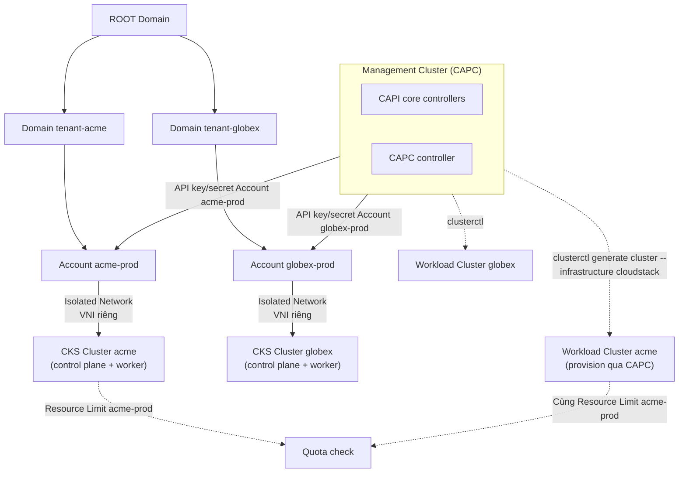

---
tags:
  - cloudstack
  - lab
  - kubernetes
  - cks
  - cluster-api
  - multi-tenant
---

# CloudStack Kubernetes Service & Cluster API Provider - KaaS Multi-tenant

- **Bối cảnh và vấn đề**: Zone ở [[CloudStack Template - Import Guest OS Template và Deploy VM đầu tiên]] đã chứng minh chạy được VM end-to-end, nhưng để bán ra ngoài như một dịch vụ Kubernetes-as-a-Service (KaaS) cho nhiều khách hàng/tenant khác nhau, cần 2 thứ VM đơn thuần chưa giải quyết: (1) lifecycle của cả một cluster K8s (control plane HA, join worker, upgrade version, xoá sạch) không thể lặp lại thủ công cho từng tenant, và (2) ranh giới cứng giữa tenant — quota tài nguyên, cô lập network, API credential riêng — để tenant A không thể thấy hay ảnh hưởng tới tenant B trên cùng hạ tầng vật lý.
- **Cách giải quyết**: Hai lớp bổ sung nhau, không loại trừ nhau:
  1. **CKS (CloudStack Kubernetes Service)** — feature dựng sẵn trong CloudStack, expose trực tiếp cho tenant tự tạo/xoá/scale cluster qua API mà không cần biết gì về hạ tầng bên dưới. CloudStack tự lo toàn bộ lifecycle (deploy control plane + worker VM, join node, HA control plane, upgrade version).
  2. **Cluster API Provider CloudStack (CAPC)** — provider chuẩn Kubernetes Cluster API (CAPI), dùng cho team platform/provider cần quản lý fleet nhiều cluster theo cách GitOps-hoá, hoặc cần lifecycle nâng cao hơn CKS cho phép (custom bootstrap, multi-cluster templating chuẩn hoá qua `clusterctl`). Chạy trên 1 management cluster riêng, mỗi workload cluster được provision vào đúng Account/Network của từng tenant bằng credential CloudStack riêng của tenant đó.

  Ranh giới multi-tenant dựa hoàn toàn vào mô hình **Domain → Account → Project** có sẵn của CloudStack: mỗi tenant là 1 Domain (hoặc Account trong domain chung, tuỳ mô hình kinh doanh), có Resource Limit riêng, Network/VPC riêng (VNI VXLAN riêng — cô lập L2/L3 thật, không chỉ logic), và API Key/Secret Key riêng.
- **Kết quả sau khi hoàn thành**: Tenant tự tạo được cluster K8s riêng qua CKS trong đúng quota/network của mình; team platform vận hành được fleet cluster qua CAPC dùng `clusterctl` chuẩn; cô lập tài nguyên và network giữa các tenant được kiểm chứng thực tế (không chỉ cấu hình).

> [!NOTE]
> Lab này giả định người đọc đã có kiến thức Kubernetes cơ bản (Node, Control Plane, kubeconfig) và đã đọc [[RBAC & Roles (CloudStack)]] cùng [[Accounts, Domains & Projects (CloudStack)]] trong vault — không giải thích lại khái niệm Domain/Account/Project từ đầu.

> [!TODO]
> CKS đổi khá nhiều giữa các minor version CloudStack (cách nạp Kubernetes-ready template/ISO, tên chính xác một số Global Setting, số CRD của CAPC). Các chỗ chưa chắc chắn được đánh dấu `[!TODO]` riêng ở từng bước — đối chiếu lại `docs.cloudstack.apache.org` mục **Kubernetes Service Guide** và repo [cluster-api-provider-cloudstack](https://github.com/kubernetes-sigs/cluster-api-provider-cloudstack) đúng version đang dùng trước khi áp dụng production.

## Quyết định kiến trúc - Vì sao dùng cả CKS lẫn CAPC, không chỉ 1 trong 2

- **CKS phù hợp cho tenant tự phục vụ (self-service), CAPC phù hợp cho team platform vận hành fleet.** CKS là API/UI đơn giản, đúng đối tượng là khách hàng cuối chỉ muốn "tạo 1 cluster 3 node, xong" mà không cần biết CloudStack. CAPC đúng đối tượng là đội ngũ vận hành nội bộ cần quản lý hàng chục/hàng trăm cluster theo cách chuẩn hoá, khai báo (declarative), tích hợp GitOps/CI-CD — thứ CKS không hướng tới.
- **CAPC không thay thế CKS về mặt tenant isolation — nó tận dụng lại chính hàng rào Account/Network của CloudStack.** Mỗi workload cluster CAPC provision vẫn là VM CloudStack thật, vẫn tính vào Resource Limit của đúng Account sở hữu credential được dùng, vẫn nằm trong Network/VPC của Account đó — CAPC chỉ là một cách khác để **gọi API CloudStack** (thay vì UI/CKS), không phải một lớp cô lập mới.
- **Đánh đổi cần chấp nhận**: vận hành CAPC cần thêm 1 management cluster K8s riêng (bootstrap cluster) và người vận hành phải quen thuộc với Cluster API (CRD, `clusterctl`) — chi phí học tập cao hơn CKS. Nếu chỉ cần phục vụ tenant tự tạo cluster đơn giản, CKS một mình là đủ; chỉ thêm CAPC khi thật sự cần fleet management chuẩn hoá.

## Prerequisites

- **Hạ tầng**: [[CloudStack Advanced Zone - Triển khai Network SDN và Storage]] và [[CloudStack Template - Import Guest OS Template và Deploy VM đầu tiên]] đã hoàn tất — Zone `Enabled`, đã kiểm chứng deploy VM + SSH thành công.
- **Máy chủ/VM**: không cần node vật lý mới cho CKS (CloudStack tự deploy VM control plane/worker vào Zone hiện có). Cần **1 management cluster K8s nhỏ** (3 node, có thể là VM riêng ngoài CloudStack hoặc chính 1 CKS cluster đầu tiên dùng làm bootstrap) cho phần CAPC ở Bước 6-7.
- **Tài khoản và quyền**: `admin` toàn cục để bật Global Setting và tạo Offering/Domain; sau đó tạo tài khoản riêng theo từng Domain cho phần multi-tenant.
- **Mạng**: đủ Public IP để mỗi tenant/cluster có ít nhất 1 IP cho Static NAT tới control plane API server (port 6443) nếu cần truy cập kubeconfig từ ngoài Zone.
- **Kiến thức nền**: giả định đã đọc [[RBAC & Roles (CloudStack)]], [[Accounts, Domains & Projects (CloudStack)]], và có kiến thức Kubernetes cơ bản.

> [!WARNING]
> `createKubernetesCluster`/CAPC đều deploy VM thật, tính vào Resource Limit và billing của Account sở hữu — không test ở tài khoản `admin` cho mục đích minh hoạ multi-tenant, luôn test bằng tài khoản tenant thật đã tạo ở Bước 4 để hành vi quota được kiểm chứng đúng.

## Thông tin Planning liên quan

| Thành phần | Giá trị | Ghi chú |
| --- | --- | --- |
| Global setting CKS | `cloud.kubernetes.service.enabled=true` | Bắt buộc bật trước khi bất kỳ API `*KubernetesCluster` nào hoạt động |
| Kubernetes Supported Version | `<TBD>` | Semantic version (ví dụ `1.30.x`), đăng ký qua `addKubernetesSupportedVersion` |
| Template/ISO Kubernetes-ready | `<TBD>` | Xem Bước 2 — cơ chế nạp thay đổi theo version, xác nhận lại tài liệu chính thức |
| Network Offering CKS | `<TBD>` | Isolated, `VXLAN`, dịch vụ `Dhcp,Dns,UserData,SourceNat,StaticNat,PortForwarding,Firewall,Lb` |
| Compute Offering control plane | `<TBD>` | Tối thiểu theo khuyến nghị Kubernetes Supported Version đã đăng ký (thường ≥ 2 vCPU/2GB, khuyến nghị 4GB+ cho control plane) |
| Compute Offering worker | `<TBD>` | Tối thiểu theo khuyến nghị tương tự, có thể thấp hơn control plane |
| Domain tenant mẫu | `tenant-acme`, `tenant-globex` | Ví dụ 2 tenant minh hoạ cô lập |
| Account trong mỗi Domain | `<TBD>` | 1 Account/tenant cho ví dụ đơn giản, có thể chia nhiều Account/Project nếu tenant có nhiều team |
| Resource Limit mẫu / tenant | VM: `20`, CPU: `80`, Memory: `160GB`, Primary Storage: `2TB`, Network: `5`, Public IP: `3` | Điều chỉnh theo gói dịch vụ thực tế bán cho tenant |
| API Key/Secret Key / tenant | `<TBD>` | Sinh riêng cho từng Account, dùng cho cả tenant tự gọi CKS API lẫn CAPC provision hộ |
| Management cluster (CAPC) | `<TBD>` | 3 node, có thể tận dụng 1 CKS cluster đầu tiên làm bootstrap |
| CAPC version | `<TBD - xác nhận tại github.com/kubernetes-sigs/cluster-api-provider-cloudstack releases>` | Pin version cụ thể, khớp CAPI core version tương thích |

## Diagram



---

## Installation

### Bước 1 - Bật CKS ở tầng Global Setting

```bash
cmk -u https://<vip-control-plane>/client/api updateConfiguration name=cloud.kubernetes.service.enabled value=true
sudo systemctl restart cloudstack-management   # trên cả cs-mgt-01 và cs-mgt-02
```

- Kiểm tra kết quả bước này:

```bash
cmk -u https://<vip-control-plane>/client/api list configurations name=cloud.kubernetes.service.enabled
```

Kết quả mong đợi: `value=true` trên cả 2 node MS sau khi restart.

### Bước 2 - Đăng ký Kubernetes Supported Version

> [!TODO]
> Cơ chế nạp "Kubernetes-ready" thay đổi giữa các version CloudStack: một số bản dùng template đã cài sẵn `kubeadm`/`containerd`/CNI plugin (build sẵn hoặc tự build bằng công cụ `cloud-images` của dự án), một số bản dùng kèm 1 ISO binaries mount vào lúc cluster init. Xác nhận đúng cơ chế của version đang cài tại trang chính thức trước khi chạy lệnh dưới, tham số `url`/`isoid` có thể khác nhau.

```bash
cmk -u https://<vip-control-plane>/client/api addKubernetesSupportedVersion \
  semanticversion=<k8s-version-theo-planning-table> \
  zoneid=<zone-id> \
  mincpunumber=<min-cpu-theo-tài-liệu-version> \
  minmemory=<min-memory-mb-theo-tài-liệu-version> \
  url=<url-template-hoặc-iso-kubernetes-ready>
```

- Kiểm tra kết quả bước này:

```bash
cmk -u https://<vip-control-plane>/client/api list kubernetessupportedversions zoneid=<zone-id>
```

Kết quả mong đợi: version xuất hiện, `state=Enabled` sau khi CloudStack tải/convert xong template.

### Bước 3 - Tạo Network Offering và Compute Offering dành riêng cho CKS

- Network Offering: dùng lại isolation VXLAN đã có ở [[CloudStack Advanced Zone - Triển khai Network SDN và Storage]], thêm dịch vụ `UserData` (bắt buộc cho CKS — node cần cloud-init/userdata để tự join cluster lúc boot) và `Lb` (Load Balancer cho control plane API server khi có nhiều master):

```bash
cmk create networkoffering \
  name=<network-offering-cks-name> \
  displaytext="Isolated network - CKS" \
  guestiptype=Isolated \
  traffictype=Guest \
  supportedservices=Dhcp,Dns,UserData,SourceNat,StaticNat,PortForwarding,Firewall,Lb \
  serviceproviderlist=Dhcp:VirtualRouter,Dns:VirtualRouter,UserData:VirtualRouter,SourceNat:VirtualRouter,StaticNat:VirtualRouter,PortForwarding:VirtualRouter,Firewall:VirtualRouter,Lb:VirtualRouter

cmk update networkoffering id=<network-offering-cks-id> state=Enabled
```

- Compute Offering cho control plane và worker (2 offering riêng, worker có thể rẻ hơn control plane):

```bash
cmk create serviceoffering \
  name=<offering-cks-control-name> \
  displaytext="CKS Control Plane - 4 vCPU/8GB" \
  cpunumber=4 cpuspeed=2000 memory=8192 \
  storagetype=shared offerha=true

cmk create serviceoffering \
  name=<offering-cks-worker-name> \
  displaytext="CKS Worker - 2 vCPU/4GB" \
  cpunumber=2 cpuspeed=2000 memory=4096 \
  storagetype=shared offerha=true
```

- Kiểm tra kết quả bước này:

```bash
cmk list networkofferings name=<network-offering-cks-name>
cmk list serviceofferings name=<offering-cks-control-name>
```

### Bước 4 - Thiết kế multi-tenant: Domain, Account, Resource Limit

- Tạo Domain riêng cho từng tenant (ví dụ minh hoạ 2 tenant `tenant-acme` và `tenant-globex`):

```bash
cmk create domain name=tenant-acme parentdomainid=<root-domain-id>
cmk create domain name=tenant-globex parentdomainid=<root-domain-id>
```

- Tạo Account trong mỗi Domain (role `User` — không cấp quyền quản trị hạ tầng):

```bash
cmk create account username=acme-prod password=<password> email=<email> \
  firstname=Acme lastname=Prod accounttype=0 \
  domainid=<tenant-acme-domain-id> \
  roleid=<user-role-id>
```

Lặp lại cho `globex-prod` trong domain `tenant-globex`.

- Set Resource Limit riêng cho mỗi Account — đây là ranh giới quota cứng, không phải gợi ý:

```bash
cmk update resourceLimit account=acme-prod resourcetype=0 max=20    # VM
cmk update resourceLimit account=acme-prod resourcetype=8 max=80    # CPU
cmk update resourceLimit account=acme-prod resourcetype=9 max=163840 # Memory (MB)
cmk update resourceLimit account=acme-prod resourcetype=10 max=2048  # Primary storage (GB)
cmk update resourceLimit account=acme-prod resourcetype=6 max=5      # Network
cmk update resourceLimit account=acme-prod resourcetype=7 max=3      # Public IP
```

> [!TODO]
> Số hiệu `resourcetype` (0=VM, 8=CPU, 9=Memory...) đúng theo tài liệu `updateResourceLimit` của Apache CloudStack tại thời điểm viết lab — xác nhận lại đúng bảng mapping này trong tài liệu chính thức đúng version đang cài trước khi áp dụng, vì đây là API dễ set sai type mà không báo lỗi rõ ràng.

- Sinh API Key/Secret Key riêng cho Account (dùng cho tenant tự gọi CKS API, và cho CAPC provision hộ ở Bước 7):

```bash
cmk register userkeys account=acme-prod
```

- Kiểm tra kết quả bước này:

```bash
cmk list resourceLimits account=acme-prod
cmk list users account=acme-prod
```

Kết quả mong đợi: Resource Limit hiển thị đúng giá trị đã set, API key/secret key đã sinh.

### Bước 5 - Tenant tự tạo CKS Cluster trong đúng Account/quota của mình

- Chạy bằng API key/secret key của `acme-prod` (không dùng `admin`) — CloudStack tự tạo Isolated Network riêng cho cluster nếu không truyền `networkid`:

```bash
cmk -u https://<vip-control-plane>/client/api createKubernetesCluster \
  name=acme-cluster-01 \
  zoneid=<zone-id> \
  kubernetesversionid=<k8s-version-id-tu-buoc-2> \
  serviceofferingid=<offering-cks-control-id> \
  size=3 \
  controlnodes=1 \
  account=acme-prod domainid=<tenant-acme-domain-id> \
  networkofferingid=<network-offering-cks-id> \
  keypair=<ssh-keypair-cua-tenant>
```

> [!NOTE]
> `controlnodes=1` cho ví dụ minh hoạ đơn giản — đặt `3` cho control plane HA thật ở production (CKS tự dựng Load Balancer nội bộ trước 3 control plane node nếu `controlnodes>1`).

- Kiểm tra kết quả bước này:

```bash
cmk -u https://<vip-control-plane>/client/api list kubernetesclusters account=acme-prod
```

Kết quả mong đợi: `state=Running` sau vài phút, số node đúng `size` đã khai.

- Lấy kubeconfig để tenant tự quản lý cluster bằng `kubectl`:

```bash
cmk -u https://<vip-control-plane>/client/api getKubernetesClusterConfig id=<cluster-id> account=acme-prod > acme-cluster-01.kubeconfig
kubectl --kubeconfig acme-cluster-01.kubeconfig get nodes
```

Kết quả mong đợi: đủ số node `Ready`, đúng bằng `size` đã khai (worker) + `controlnodes` (control plane).

### Bước 6 - Cài đặt Cluster API Provider CloudStack (CAPC) trên management cluster

- Trên management cluster (kubeconfig riêng, không phải cluster tenant vừa tạo), cài `clusterctl` và khởi tạo provider CloudStack:

```bash
curl -L https://github.com/kubernetes-sigs/cluster-api/releases/latest/download/clusterctl-linux-amd64 -o clusterctl
chmod +x clusterctl && sudo mv clusterctl /usr/local/bin/

clusterctl init --infrastructure cloudstack
```

> [!TODO]
> Xác nhận version CAPC tương thích với version CAPI core tại thời điểm triển khai (`clusterctl init --infrastructure cloudstack:<version>` để pin cụ thể) — không dùng version mặc nhiên mới nhất cho production, tham khảo compatibility matrix tại repo chính thức.

- Kiểm tra kết quả bước này:

```bash
kubectl get pods -n capc-system
kubectl get crds | grep cloudstack
```

Kết quả mong đợi: pod `capc-controller-manager` `Running`, các CRD `cloudstackclusters.infrastructure.cluster.x-k8s.io`, `cloudstackmachines...` xuất hiện.

### Bước 7 - Provision Workload Cluster qua CAPC vào đúng Account của tenant

- Tạo Secret chứa credential CloudStack của **đúng tenant** (`acme-prod`, không dùng `admin`) — đây là cơ chế đảm bảo VM do CAPC tạo ra tính đúng vào Resource Limit và Network của tenant đó:

```bash
kubectl create secret generic acme-cloudstack-credentials \
  --from-literal=api-key=<api-key-acme-prod> \
  --from-literal=secret-key=<secret-key-acme-prod> \
  --from-literal=api-url=https://<vip-control-plane>/client/api
```

- Sinh manifest cluster từ template CAPC, trỏ đúng Zone/Network/Domain của tenant:

```bash
clusterctl generate cluster acme-workload-01 \
  --infrastructure cloudstack \
  --kubernetes-version <k8s-version-theo-planning-table> \
  --control-plane-machine-count=3 \
  --worker-machine-count=3 \
  > acme-workload-01.yaml
```

> [!TODO]
> Field chính xác trong `CloudStackCluster`/`CloudStackFailureDomain` (zone, network, domain, account, offering) khác nhau giữa các minor version CAPC — chạy `kubectl explain cloudstackcluster.spec` và `kubectl explain cloudstackfailuredomain.spec` trên CRD đã cài ở Bước 6 để lấy đúng field, sửa `acme-workload-01.yaml` cho khớp trước khi apply, không suy đoán field name theo version cũ.

```bash
kubectl apply -f acme-workload-01.yaml
```

- Kiểm tra kết quả bước này:

```bash
kubectl get cluster acme-workload-01
kubectl get cloudstackmachines
cmk list virtualmachines account=acme-prod keyword=acme-workload-01
```

Kết quả mong đợi: `cluster` chuyển `Provisioned`, các VM control plane/worker xuất hiện đúng dưới Account `acme-prod` (không phải `admin`), tính đúng vào Resource Limit đã set ở Bước 4.

### Bước 8 - Kiểm chứng cô lập giữa tenant

- Tạo tương tự 1 cluster cho `globex-prod` (lặp lại Bước 4-7 với domain/account khác), sau đó xác nhận:

```bash
# Từ trong 1 VM của cluster acme-cluster-01, thử reach network của globex
ping -c3 <ip-node-cluster-globex>
```

Kết quả mong đợi: **không** reach được — 2 cluster nằm trên 2 Isolated Network khác nhau, mỗi network 1 VNI VXLAN riêng, cô lập ở tầng L2/L3 thật (không chỉ security group logic).

- Xác nhận quota tenant hoạt động — cố tạo cluster vượt Resource Limit của `acme-prod`:

```bash
cmk createKubernetesCluster name=acme-cluster-02 size=100 account=acme-prod ...
```

Kết quả mong đợi: API trả lỗi vượt Resource Limit, không deploy VM nào (chứng minh quota chặn đúng ở tầng CloudStack, không phụ thuộc CKS/CAPC tự giới hạn).

## Kiểm tra kết quả

  | Hạng mục cần kiểm tra | Cách kiểm tra | Kết quả đúng |
  | --- | --- | --- |
  | CKS enabled | `list configurations name=cloud.kubernetes.service.enabled` | `true` |
  | Kubernetes Supported Version | `list kubernetessupportedversions` | `state=Enabled` |
  | CKS cluster tenant A chạy | `list kubernetesclusters account=acme-prod` | `state=Running`, đủ node |
  | Resource Limit chặn đúng | Tạo cluster vượt quota | API trả lỗi, không tạo VM |
  | CAPC controller chạy | `kubectl get pods -n capc-system` | `Running` |
  | Workload cluster CAPC tính đúng Account | `cmk list virtualmachines account=acme-prod` | Thấy VM do CAPC tạo |
  | Cô lập network giữa 2 tenant | `ping` chéo giữa 2 cluster | Không reach được |

## Troubleshooting

Không áp dụng - lab dựng mới theo hướng dẫn triển khai chuẩn, chưa có log lỗi thực tế phát sinh trong quá trình build để ghi nhận.

## Rollback

- Xoá CKS cluster trước khi xoá Account/Domain (CloudStack không cho xoá Account còn resource):

```bash
cmk deleteKubernetesCluster id=<cluster-id> account=acme-prod
```

- Xoá workload cluster CAPC (xoá VM CloudStack tương ứng qua CAPC controller, không xoá tay qua `cmk` để tránh CAPC cố tạo lại VM đã bị xoá ngoài ý muốn):

```bash
kubectl delete -f acme-workload-01.yaml
```

- Gỡ CAPC khỏi management cluster:

```bash
clusterctl delete --infrastructure cloudstack
```

- Xoá Account/Domain tenant sau khi không còn resource nào:

```bash
cmk delete account id=<account-id>
cmk delete domain id=<domain-id> cleanup=true
```

> [!CAUTION]
> `delete domain cleanup=true` xoá toàn bộ Account/resource còn sót trong domain đó — chỉ dùng khi chắc chắn đây là domain lab/test, không dùng cho domain tenant thật đang có dữ liệu.

## Reference

- [Apache CloudStack - Kubernetes Service Guide](https://docs.cloudstack.apache.org/en/latest/plugins/cloudstack-kubernetes-service.html)
- [Cluster API Provider CloudStack (CAPC) - GitHub](https://github.com/kubernetes-sigs/cluster-api-provider-cloudstack)
- [Cluster API - The Cluster API Book](https://cluster-api.sigs.k8s.io/)
- [Apache CloudStack - Resource Limits](https://docs.cloudstack.apache.org/en/latest/adminguide/accounts.html)
- Ghi chú liên quan trong vault: [[RBAC & Roles (CloudStack)]] | [[Accounts, Domains & Projects (CloudStack)]] | [[CloudStack Advanced Zone - Triển khai Network SDN và Storage]]
