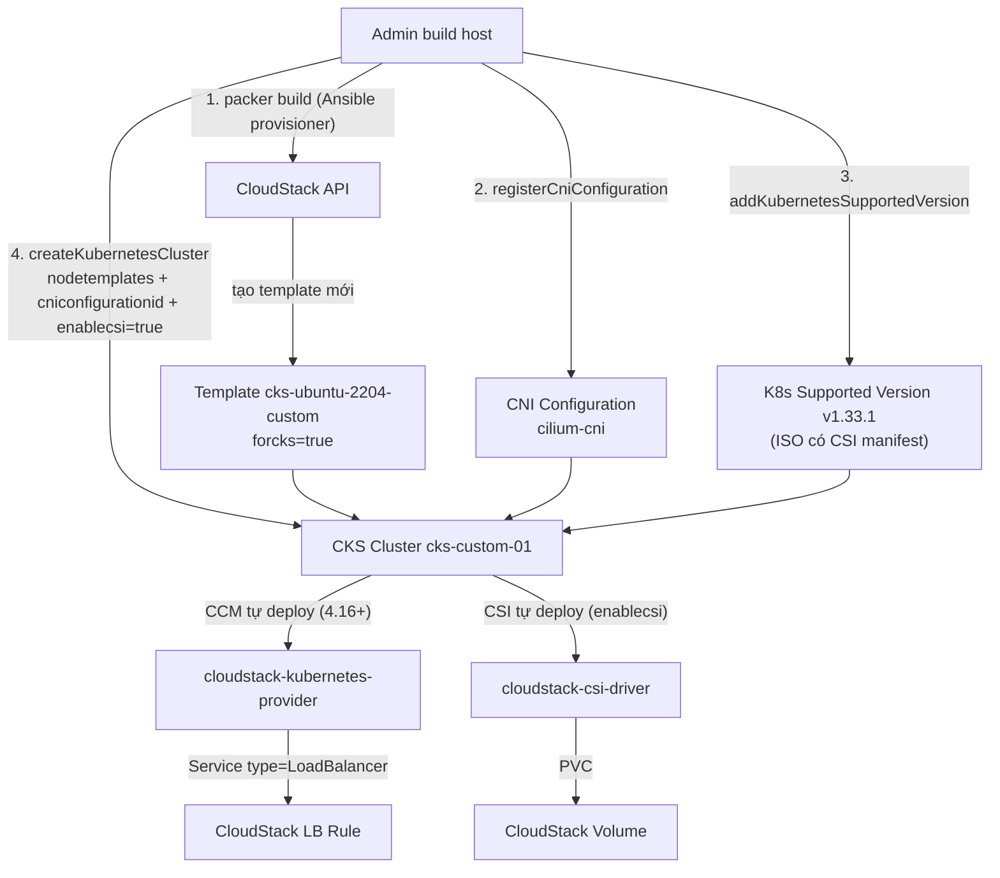

---
tags:
  - cloudstack
  - lab
  - kubernetes
  - cks
  - packer
  - ansible
  - cilium
  - csi
  - ccm
---

# CloudStack Kubernetes Service - Node Template Ubuntu 22.04, Cilium CNI và CSI/CCM LoadBalancer

- **Bối cảnh và vấn đề**: [[CloudStack Kubernetes Service & Cluster API Provider - KaaS Multi-tenant]] đã bật CKS và tạo cluster chạy được, nhưng dùng nguyên 3 thứ mặc định của CKS: node deploy từ **System VM template (Debian)** thay vì một OS có thể kiểm soát/patch/harden riêng, **CNI mặc định Calico**, và không có **CSI driver** (pod không tạo được PersistentVolume từ CloudStack) hay xác nhận **CCM** nào đang chạy để dùng `Service type=LoadBalancer`. Với mục tiêu vận hành CKS giống một dịch vụ production thật, cả 3 điểm này cần tự kiểm soát thay vì phụ thuộc hành vi mặc định.
- **Cách giải quyết**: 3 phần độc lập nhưng ráp vào cùng 1 cluster CKS mới, tất cả vẫn đi qua đúng API chuẩn `createKubernetesCluster` của CKS (không tự dựng kubeadm tay):
  1. Dùng **Packer** (builder `cloudstack`) gọi **Ansible** provisioner để build template Ubuntu 22.04 riêng, dựa trên chính base "CKS-ready" Ubuntu 22.04 mà CloudStack công bố (đảm bảo đủ điều kiện kỹ thuật bắt buộc của CKS), rồi mark cờ `forcks=true` để template xuất hiện như 1 lựa chọn ở `nodetemplates` lúc tạo cluster.
  2. Đăng ký **Cilium** làm CNI thông qua CNI Configuration framework của CKS (`registerCniConfiguration`) — cơ chế chính thức để thay Calico, không phải tự apply CNI tay sau khi cluster đã lên.
  3. Dùng cờ `enablecsi=true` có sẵn từ CloudStack 4.22 để CKS tự dựng **CSI driver** (`cloudstack/cloudstack-csi-driver`), và xác nhận **CCM** (`apache/cloudstack-kubernetes-provider`) — vốn CKS tự deploy cho mọi cluster từ 4.16 — hoạt động đúng cho `Service type=LoadBalancer`.
- **Kết quả sau khi hoàn thành**: 1 cluster CKS mới chạy node Ubuntu 22.04 tự build, dùng Cilium thay Calico, có StorageClass tự sync từ Disk Offering CloudStack (PVC tạo volume thật), và `Service type=LoadBalancer` tạo ra LB rule thật trên CloudStack — toàn bộ vẫn quản lý bằng đúng 1 API/UI CKS quen thuộc, không cần công cụ ngoài như Cluster API.

> [!NOTE]
> Lab này giả định đã đọc [[CloudStack Kubernetes Service & Cluster API Provider - KaaS Multi-tenant]] — không lặp lại phần bật Global Setting CKS hay tạo Network/Compute Offering đã làm ở đó. Toàn bộ API/tham số dưới đây đã xác nhận đúng với **CloudStack 4.23.0.0** (bản hạ tầng lab đang chạy) qua chính API Reference chính thức (`cloudstack.apache.org/api/apidocs-4.23/`) — không suy đoán theo version khác.

> [!WARNING]
> Driver CSI dùng ở Bước 9 (`cloudstack/cloudstack-csi-driver`) yêu cầu **node Kubernetes phải nằm trong Root Domain**, do chính account sở hữu credential trong `cloud-config` tạo ra. Nếu cluster CKS được tạo trong 1 Account/Domain con theo mô hình multi-tenant ở lab trước, xác nhận lại hành vi CSI trong domain con đó trước khi áp dụng cho tenant thật — tài liệu driver chỉ nêu rõ yêu cầu "Root domain", chưa xác nhận hành vi khi cluster nằm trong domain con.

## Prerequisites

- **Hạ tầng**: [[CloudStack Kubernetes Service & Cluster API Provider - KaaS Multi-tenant]] đã hoàn tất — CKS `enabled`, Zone `Enabled`, ít nhất 1 Network/Compute Offering CKS đã tạo.
- **Máy chủ / VM**: 1 **build host** (có thể là máy admin hoặc Gitea Runner có sẵn từ lab khác) cài `packer` ≥ 1.9, `ansible-core`, `cmk` (CloudMonkey), `curl`; có network tới CloudStack API endpoint. Không cần VM mới trong CloudStack — Packer tự launch/xoá VM tạm khi build template.
- **Tài khoản và quyền**: API Key/Secret Key của 1 account có quyền `registerTemplate`, `updateTemplate`, `addKubernetesSupportedVersion`, `registerCniConfiguration`, `createKubernetesCluster` (dùng `admin` cho lab, tách quyền tối thiểu khi lên production).
- **Mạng**: SSH public key của Management Server (`cs-mgt-01`/`cs-mgt-02`, thường tại `/root/.ssh/id_rsa.pub` hoặc keypair riêng cho CKS) — CloudStack SSH vào node bằng key này để đẩy lệnh bootstrap kubeadm, nên template phải có sẵn key này trong `authorized_keys` của user `cloud`.
- **Kiến thức nền**: giả định đã biết Helm, Kubernetes CNI/CSI/CCM cơ bản, và đã đọc toàn bộ Bước 1-5 (CKS) của [[CloudStack Kubernetes Service & Cluster API Provider - KaaS Multi-tenant]].

> [!WARNING]
> Driver CSI và cờ `enablecsi=true` chỉ hoạt động nếu ISO Kubernetes Binaries của Kubernetes Supported Version đang dùng **có chứa CSI manifest** — hiện chỉ 3 bản pre-built tại `download.cloudstack.org/cks/` có sẵn thứ này: `1.31.1`, `1.32.5`, `1.33.1`. Nếu Kubernetes Supported Version đã đăng ký ở lab trước không thuộc 3 bản này, phải đăng ký thêm 1 bản mới theo Bước 6 trước khi dùng `enablecsi=true`.

## Thông tin Planning liên quan

| Thành phần | Giá trị | Ghi chú |
| --- | --- | --- |
| Build host | `<TBD - IP/hostname>` | Chạy Packer + Ansible, không phải node CloudStack |
| CloudStack API URL/Key/Secret (build) | `<TBD>` | Set qua biến môi trường `CLOUDSTACK_API_URL`/`CLOUDSTACK_API_KEY`/`CLOUDSTACK_SECRET_KEY` cho Packer, không hardcode trong file `.pkr.hcl` |
| Base template nguồn | `cks-ubuntu-2204-kvm.qcow2.bz2` | Từ `https://download.cloudstack.org/testing/custom_templates/ubuntu/22.04/`, login mặc định `cloud:cloud` |
| Template mới (đích) | `cks-ubuntu-2204-custom` | `forcks=true` sau khi build, dùng cho `nodetemplates` |
| SSH public key Management Server | `<TBD - /root/.ssh/id_rsa.pub trên cs-mgt-01>` | Copy vào `authorized_keys` của user `cloud` trong template |
| Kubernetes Supported Version | `v1.33.1` | ISO `setup-v1.33.1-calico-x86_64.iso` tại `download.cloudstack.org/cks/` - 1 trong 3 bản có sẵn CSI manifest |
| CNI Configuration | `cilium-cni` | Đăng ký qua `registerCniConfiguration`, thay Calico mặc định trong ISO trên |
| Cilium Helm chart version | `<TBD - pin đúng version tại thời điểm deploy, xem cilium.io>` | Render qua `helm template` ngay trên control node, không cần `helm install` |
| Disk Offering cho CSI | `<TBD>` | Disk Offering `storagetype=shared`, custom size - Storage Class Syncer tự sync thành StorageClass |
| Cluster CKS mới | `cks-custom-01` | Dùng cả 3 tuỳ biến: `nodetemplates`, `cniconfigurationid`, `enablecsi=true` |

## Diagram



---

## Installation

### Bước 1 - Cấu trúc project Packer + Ansible

- Tạo repo/thư mục mới trên build host với cấu trúc sau — Packer orchestrate vòng đời VM tạm, Ansible lo toàn bộ nội dung provisioning:

```text
.
├── ansible
│   ├── files
│   │   └── mgmt-server.pub
│   ├── roles
│   │   └── cks_node_custom
│   │       └── tasks
│   │           └── main.yml
│   └── site.yml
└── packer
    └── cks-ubuntu2204.pkr.hcl
```

- Copy SSH public key của Management Server vào đúng vị trí Ansible sẽ đọc:

```bash
scp cs-mgt-01:/root/.ssh/id_rsa.pub ./ansible/files/mgmt-server.pub
```

### Bước 2 - Cài Packer, plugin cloudstack và Ansible trên build host

```bash
curl -fsSL https://apt.releases.hashicorp.com/gpg | sudo gpg --dearmor -o /usr/share/keyrings/hashicorp-archive-keyring.gpg
echo "deb [signed-by=/usr/share/keyrings/hashicorp-archive-keyring.gpg] https://apt.releases.hashicorp.com $(lsb_release -cs) main" | sudo tee /etc/apt/sources.list.d/hashicorp.list
sudo apt update && sudo apt install -y packer ansible

packer plugins install github.com/hashicorp/cloudstack
```

- Kiểm tra kết quả bước này:

```bash
packer plugins installed
ansible --version
```

Kết quả mong đợi: plugin `cloudstack` xuất hiện trong danh sách, `ansible-core` ≥ 2.14.

### Bước 3 - Đăng ký base template "CKS-ready" Ubuntu 22.04 làm nguồn cho Packer

- CloudStack công bố sẵn 1 template Ubuntu 22.04 đã đủ điều kiện kỹ thuật tối thiểu cho CKS (package, user `cloud`, `/opt/bin`) — dùng làm `source_template` cho Packer thay vì cài từ ISO Ubuntu trống, để không bỏ sót yêu cầu nào chưa được tài liệu hoá đầy đủ:

```bash
cmk register template \
  name=cks-ready-ubuntu-2204-base \
  displaytext="CKS-ready Ubuntu 22.04 base (CloudStack official)" \
  url=https://download.cloudstack.org/testing/custom_templates/ubuntu/22.04/cks-ubuntu-2204-kvm.qcow2.bz2 \
  zoneid=<zone-id> \
  hypervisor=KVM \
  format=QCOW2 \
  ostypeid=<ostype-id-ubuntu-2204> \
  passwordenabled=false \
  ispublic=false
```

> [!NOTE]
> Không cần tự cài `kubeadm`/`kubelet`/`containerd` phiên bản Kubernetes cụ thể vào template — CKS cấp các binary này qua **Kubernetes Binaries ISO** mount vào lúc tạo cluster (Bước 6), không phải từ template. Template chỉ cần đủ điều kiện "cloud user + sudoers NOPASSWD + `/opt/bin` + package nền (`containerd.io`, `cloud-init`...)" theo đúng checklist chính thức.

- Kiểm tra kết quả bước này:

```bash
cmk list templates templatefilter=all name=cks-ready-ubuntu-2204-base
```

Kết quả mong đợi: `isready=true` sau khi Secondary Storage tải và convert file `.qcow2.bz2` xong.

### Bước 4 - Viết Ansible role tuỳ biến node

`ansible/roles/cks_node_custom/tasks/main.yml`:

```yaml
---
- name: Cập nhật package index
  ansible.builtin.apt:
    update_cache: true
    cache_valid_time: 3600

- name: Đảm bảo đủ package bắt buộc theo checklist "For CKS" của CloudStack
  ansible.builtin.apt:
    name:
      - cloud-init
      - cloud-guest-utils
      - conntrack
      - apt-transport-https
      - ca-certificates
      - curl
      - gnupg
      - gnupg-agent
      - software-properties-common
      - lsb-release
      - python3-json-pointer
      - python3-jsonschema
      - containerd.io
    state: present

- name: Tạo thư mục /opt/bin bắt buộc theo checklist CKS
  ansible.builtin.file:
    path: /opt/bin
    state: directory
    mode: "0755"

- name: Đảm bảo user cloud tồn tại
  ansible.builtin.user:
    name: cloud
    shell: /bin/bash
    create_home: true

- name: Cho user cloud sudo không cần password
  ansible.builtin.copy:
    dest: /etc/sudoers.d/90-cloud-nopasswd
    content: "cloud ALL=(ALL) NOPASSWD:ALL\n"
    mode: "0440"
    validate: "visudo -cf %s"

- name: Đặt SSH public key của Management Server vào authorized_keys của user cloud
  ansible.posix.authorized_key:
    user: cloud
    key: "{{ lookup('file', 'files/mgmt-server.pub') }}"
    state: present

- name: Cài Helm binary - dùng để render manifest Cilium ở Bước 7, không cần tải helm lúc boot cluster
  ansible.builtin.unarchive:
    src: "https://get.helm.sh/helm-{{ helm_version }}-linux-amd64.tar.gz"
    dest: /tmp
    remote_src: true

- name: Copy helm binary vào /opt/bin
  ansible.builtin.copy:
    src: /tmp/linux-amd64/helm
    dest: /opt/bin/helm
    mode: "0755"
    remote_src: true

- name: Dọn sạch cloud-init state trước khi snapshot thành template
  ansible.builtin.command: cloud-init clean --logs
  changed_when: true
```

> [!WARNING]
> Bước dọn `cloud-init clean --logs` ở cuối **bắt buộc** — nếu không, template mới sẽ giữ lại machine-id/instance-id của VM tạm Packer dùng để build, khiến mọi VM deploy từ template này sau đó bị cloud-init coi là "đã từng boot", bỏ qua việc inject SSH key/userdata cho VM thật.

`ansible/site.yml`:

```yaml
---
- hosts: all
  become: true
  roles:
    - cks_node_custom
```

### Bước 5 - Build template bằng Packer và mark `forcks=true`

`packer/cks-ubuntu2204.pkr.hcl`:

```hcl
packer {
  required_plugins {
    cloudstack = {
      version = ">= 1.0.0"
      source  = "github.com/hashicorp/cloudstack"
    }
  }
}

source "cloudstack" "cks-ubuntu2204" {
  # api_url/api_key/secret_key đọc từ biến môi trường CLOUDSTACK_API_URL/CLOUDSTACK_API_KEY/CLOUDSTACK_SECRET_KEY
  zone                   = "<zone-name>"
  network                = "<network-name-dung-de-build>"
  service_offering       = "<service-offering-build>"
  source_template        = "cks-ready-ubuntu-2204-base"
  template_os            = "Ubuntu 22.04 LTS"
  ssh_username            = "cloud"
  template_name           = "cks-ubuntu-2204-custom"
  template_display_text   = "Ubuntu 22.04 - Custom CKS Node Template"
  template_public         = false
  expunge                 = true
}

build {
  sources = ["source.cloudstack.cks-ubuntu2204"]

  provisioner "ansible" {
    playbook_file   = "../ansible/site.yml"
    extra_arguments = ["--extra-vars", "helm_version=v3.15.0"]
  }
}
```

- Export credential dưới dạng biến môi trường (không hardcode vào file `.pkr.hcl`) rồi build:

```bash
export CLOUDSTACK_API_URL=https://<vip-control-plane>/client/api
export CLOUDSTACK_API_KEY=<api-key>
export CLOUDSTACK_SECRET_KEY=<secret-key>

packer init packer/cks-ubuntu2204.pkr.hcl
packer build packer/cks-ubuntu2204.pkr.hcl
```

- Sau khi Packer tạo xong template, mark cờ `forcks=true` — builder `cloudstack` của Packer không có field này, phải gọi API riêng:

```bash
cmk update template id=<cks-ubuntu-2204-custom-template-id> forcks=true
```

- Kiểm tra kết quả bước này:

```bash
cmk list templates templatefilter=all name=cks-ubuntu-2204-custom
```

Kết quả mong đợi: `isready=true`, `forcks=true` — template giờ xuất hiện như 1 lựa chọn template ở "Advanced Settings" khi tạo CKS cluster (UI) hoặc dùng được ở tham số `nodetemplates` (API, Bước 8).

### Bước 6 - Đăng ký Kubernetes Supported Version có sẵn CSI manifest

- Dùng ISO pre-built `v1.33.1` — 1 trong 3 bản CloudStack xác nhận có kèm CSI manifest/image (yêu cầu bắt buộc để `enablecsi=true` ở Bước 8 hoạt động):

```bash
cmk add kubernetessupportedversion \
  name=v1.33.1-custom \
  semanticversion=1.33.1 \
  zoneid=<zone-id> \
  url=http://download.cloudstack.org/cks/setup-v1.33.1-calico-x86_64.iso \
  mincpunumber=2 \
  minmemory=2048
```

> [!NOTE]
> Tên file ISO có chữ `calico` vì đây vẫn là CNI mặc định được bake sẵn trong ISO — chữ `calico` trong tên không có nghĩa ISO này không dùng được Cilium. CNI Configuration ở Bước 7 ghi đè hành vi apply CNI mặc định của chính ISO này, xem cảnh báo ở Bước 7.

- Kiểm tra kết quả bước này:

```bash
cmk list kubernetessupportedversion name=v1.33.1-custom zoneid=<zone-id>
```

Kết quả mong đợi: `isostate=Active` sau khi CloudStack tải xong ISO.

### Bước 7 - Đăng ký CNI Configuration cho Cilium

- Khung "CNI Configuration" của CKS hoạt động bằng cách nối thêm nội dung `cloud-config` (cloud-init) vào user data của control node — đúng cơ chế mà bản thân tài liệu CKS dùng để minh hoạ việc đổi sang Calico-tuỳ-biến, áp dụng lại cho Cilium bằng `helm template` (dùng chính binary `helm` đã bake vào template ở Bước 4) rồi `kubectl apply`:

`cilium-cni-userdata.yaml`:

```yaml
#cloud-config
runcmd:
  - until [ -f /home/cloud/success ]; do sleep 5; done
  - for i in {1..3}; do /opt/bin/helm repo add cilium https://helm.cilium.io/ && /opt/bin/helm repo update && break || sleep 5; done
  - for i in {1..3}; do /opt/bin/helm template cilium cilium/cilium --version {{ CILIUM_VERSION }} --namespace kube-system > /home/cloud/cilium.yaml && break || sleep 5; done
  - echo "Kubectl apply Cilium manifest"
  - for i in {1..3}; do sudo /opt/bin/kubectl apply -f /home/cloud/cilium.yaml && break || sleep 5; done
```

> [!TODO]
> Mẫu Calico chính thức trong tài liệu CKS hiển thị dưới dạng các dòng lệnh `#cloud-config` không rõ có nằm dưới key `runcmd:` hay không (bị mất định dạng khi trích xuất từ trang doc dạng HTML) — xác nhận lại đúng cấu trúc YAML qua UI "Advanced Settings" lúc tạo CNI Configuration trước khi đăng ký, đừng copy nguyên văn khối trên nếu CloudStack báo lỗi parse user data.

> [!WARNING]
> Chưa có xác nhận chính thức việc chọn CNI Configuration ở đây có **ghi đè hoàn toàn** bước apply Calico mặc định bên trong ISO (Bước 6), hay chỉ **thêm vào sau** (khiến cả Calico và Cilium cùng chạy, xung đột CNI). Sau khi tạo cluster test ở Bước 8, kiểm tra ngay `kubectl get pods -n kube-system | grep calico` — nếu còn pod `calico-node`/`calico-kube-controllers`, nghĩa là cơ chế là "thêm vào sau" và cần xoá tay DaemonSet Calico trước khi dùng Cilium làm CNI chính thức.

- Đăng ký CNI Configuration, tham số `params` khai báo tên biến `{{ CILIUM_VERSION }}` dùng trong file trên:

```bash
cmk register cniconfiguration \
  name=cilium-cni \
  cniconfig="$(cat cilium-cni-userdata.yaml)" \
  params=CILIUM_VERSION
```

- Kiểm tra kết quả bước này:

```bash
cmk list cniconfiguration name=cilium-cni
```

Kết quả mong đợi: CNI Configuration xuất hiện, `success=true`.

### Bước 8 - Tạo cluster CKS mới với cả 3 tuỳ biến

- Gộp cả 3 phần: template Ubuntu 22.04 tự build (`nodetemplates`), CNI Cilium (`cniconfigurationid` + `cniconfigdetails`), và CSI driver built-in (`enablecsi=true`):

```bash
cmk create kubernetescluster \
  name=cks-custom-01 \
  zoneid=<zone-id> \
  kubernetesversionid=<id-v1.33.1-custom-tu-buoc-6> \
  serviceofferingid=<offering-cks-worker-id> \
  size=3 \
  controlnodes=1 \
  networkid=<network-id> \
  keypair=<ssh-keypair> \
  nodetemplates[0].key=control \
  nodetemplates[0].value=<cks-ubuntu-2204-custom-template-id> \
  nodetemplates[1].key=worker \
  nodetemplates[1].value=<cks-ubuntu-2204-custom-template-id> \
  cniconfigurationid=<id-cilium-cni-tu-buoc-7> \
  cniconfigdetails[0].key=CILIUM_VERSION \
  cniconfigdetails[0].value=<cilium-helm-chart-version> \
  enablecsi=true
```

> [!TODO]
> Cú pháp `nodetemplates[0].key=...&nodetemplates[0].value=...` ở trên suy ra từ đúng cú pháp API Reference đã xác nhận cho `cniconfigdetails` (`cniconfigdetails[0].key=accesskey&cniconfigdetails[0].value=...`), vì tài liệu chính thức không đưa ví dụ cụ thể cho `nodetemplates`/`nodeofferings`. Xác nhận lại bằng `cmk sync && cmk create kubernetescluster -h` trên đúng bản CloudStack đang cài trước khi chạy — nếu cú pháp trên bị từ chối, thử qua UI (Advanced Settings khi tạo cluster) để xem request thật CloudStack gửi lên API.

- Kiểm tra kết quả bước này:

```bash
cmk list kubernetesclusters name=cks-custom-01
```

Kết quả mong đợi: `state=Running` sau vài phút, `templateid` khớp `cks-ubuntu-2204-custom`, `cniconfigurationid` khớp `cilium-cni`, `csienabled=true`.

- Lấy kubeconfig và xác nhận node chạy đúng template/CNI:

```bash
cmk getKubernetesClusterConfig id=<cluster-id> > cks-custom-01.kubeconfig
kubectl --kubeconfig cks-custom-01.kubeconfig get nodes -o wide
kubectl --kubeconfig cks-custom-01.kubeconfig get pods -n kube-system -l k8s-app=cilium
```

Kết quả mong đợi: cột OS-IMAGE của `get nodes` hiển thị Ubuntu 22.04 (không phải SystemVM Debian), pod `cilium` chạy `Running` trên mọi node (và theo cảnh báo ở Bước 7, **không** còn pod `calico-node`).

### Bước 9 - Xác nhận CSI driver và demo PersistentVolumeClaim

- `enablecsi=true` tự dựng CSI controller + node daemonset (`cloudstack/cloudstack-csi-driver`) và Storage Class Syncer tự đồng bộ Disk Offering CloudStack thành StorageClass — không cần tự `kubectl apply` manifest CSI:

```bash
kubectl --kubeconfig cks-custom-01.kubeconfig get pods -n kube-system -l app=cloudstack-csi-controller
kubectl --kubeconfig cks-custom-01.kubeconfig get storageclass
```

Kết quả mong đợi: pod `cloudstack-csi-controller`/`cloudstack-csi-node` `Running`; StorageClass tương ứng Disk Offering CloudStack đã tạo sẵn (planning table) xuất hiện, `provisioner=csi.cloudstack.apache.org`.

- Demo tạo PVC dùng đúng StorageClass vừa thấy:

```yaml
apiVersion: v1
kind: PersistentVolumeClaim
metadata:
  name: pvc-test
spec:
  accessModes: ["ReadWriteOnce"]
  storageClassName: <storageclass-ten-tu-sync-o-tren>
  resources:
    requests:
      storage: 5Gi
```

```bash
kubectl --kubeconfig cks-custom-01.kubeconfig apply -f pvc-test.yaml
```

> [!NOTE]
> `StorageClass` tạo từ Storage Class Syncer dùng `volumeBindingMode: WaitForFirstConsumer` — PVC ở trạng thái `Pending` là **bình thường** cho tới khi có 1 Pod thật sự dùng PVC này được schedule, lúc đó volume mới thật sự được tạo trên CloudStack.

- Kiểm tra kết quả bước này sau khi gắn PVC vào 1 Pod test:

```bash
kubectl --kubeconfig cks-custom-01.kubeconfig get pvc pvc-test
cmk list volumes keyword=pvc-test
```

Kết quả mong đợi: PVC `Bound`, volume CloudStack tương ứng xuất hiện với đúng dung lượng `5Gi`.

### Bước 10 - Xác nhận CCM và demo Service type=LoadBalancer

- CCM (`apache/cloudstack-kubernetes-provider`) được CKS tự deploy cho mọi cluster từ 4.16+, dùng service account riêng `kubeadmin` tạo trong Account sở hữu cluster — xác nhận đang chạy trước khi demo:

```bash
kubectl --kubeconfig cks-custom-01.kubeconfig get deploy cloud-controller-manager -n kube-system
```

Kết quả mong đợi: `READY 1/1`.

> [!WARNING]
> Tuyệt đối không tự ý regenerate API key của user `kubeadmin` mà CCM đang dùng — CCM mất quyền truy cập API ngay lập tức và toàn bộ `Service type=LoadBalancer` hiện có sẽ không còn sync được nữa.

- Demo 1 Service `LoadBalancer` với annotation giới hạn nguồn truy cập (annotation riêng của CCM này, không phải chuẩn Kubernetes):

```yaml
apiVersion: v1
kind: Service
metadata:
  name: demo-lb
  annotations:
    service.beta.kubernetes.io/cloudstack-load-balancer-source-cidrs: "10.0.0.0/8"
spec:
  type: LoadBalancer
  loadBalancerSourceRanges:
    - 10.0.0.0/8
  selector:
    app: demo
  ports:
    - port: 80
      protocol: TCP
```

```bash
kubectl --kubeconfig cks-custom-01.kubeconfig apply -f demo-lb.yaml
```

- Kiểm tra kết quả bước này:

```bash
kubectl --kubeconfig cks-custom-01.kubeconfig get svc demo-lb
cmk list loadbalancerrules keyword=demo-lb
```

Kết quả mong đợi: `EXTERNAL-IP` của Service chuyển từ `<pending>` sang 1 Public IP thật trong vài chục giây; `cmk list loadbalancerrules` thấy đúng LB rule CCM tự tạo trên IP đó.

### Khai báo thông tin nhạy cảm

- API Key/Secret Key dùng cho Packer khai báo qua biến môi trường `CLOUDSTACK_API_URL`/`CLOUDSTACK_API_KEY`/`CLOUDSTACK_SECRET_KEY` (Bước 5), không ghi vào file `.pkr.hcl` commit lên Git.
- `cloud-config` (`[Global] api-key/secret-key`) mà CKS tự sinh cho CCM/CSI driver là secret Kubernetes `cloudstack-secret` trong namespace `kube-system`, do CloudStack tự tạo — không tự tay export hay commit secret này vào repo.

## Kiểm tra kết quả

| Hạng mục cần kiểm tra | Cách kiểm tra | Kết quả đúng |
| --- | --- | --- |
| Template custom sẵn sàng + For CKS | `cmk list templates name=cks-ubuntu-2204-custom` | `isready=true`, `forcks=true` |
| Kubernetes Supported Version có CSI | `cmk list kubernetessupportedversion name=v1.33.1-custom` | `isostate=Active` |
| CNI Configuration Cilium đăng ký | `cmk list cniconfiguration name=cilium-cni` | `success=true` |
| Cluster dùng đúng node template | `kubectl get nodes -o wide` | OS-Image = Ubuntu 22.04, không phải Debian SystemVM |
| Cilium chạy, Calico không còn | `kubectl get pods -n kube-system` | Có `cilium-*` Running, không có `calico-*` |
| CSI driver + StorageClass | `kubectl get pods -n kube-system`, `kubectl get storageclass` | `cloudstack-csi-controller`/`-node` Running, StorageClass `provisioner=csi.cloudstack.apache.org` |
| PVC provision volume thật | `kubectl get pvc`, `cmk list volumes` | PVC `Bound`, volume CloudStack tương ứng xuất hiện |
| CCM chạy | `kubectl get deploy cloud-controller-manager -n kube-system` | `READY 1/1` |
| Service LoadBalancer tạo LB rule thật | `kubectl get svc`, `cmk list loadbalancerrules` | `EXTERNAL-IP` có giá trị, LB rule xuất hiện trên CloudStack |

## Troubleshooting

Không áp dụng - lab dựng mới theo hướng dẫn triển khai chuẩn, chưa có log lỗi thực tế phát sinh trong quá trình build để ghi nhận.

## Rollback

- Xoá cluster test trước (giải phóng VM/network/LB rule do cluster tạo):

```bash
cmk deleteKubernetesCluster id=<cluster-id>
```

- Gỡ Kubernetes Supported Version và CNI Configuration nếu không còn cluster nào dùng:

```bash
cmk delete kubernetessupportedversion id=<id-v1.33.1-custom>
cmk delete cniconfiguration id=<id-cilium-cni>
```

- Gỡ template custom sau khi không còn cluster/VM nào tham chiếu:

```bash
cmk delete template id=<cks-ubuntu-2204-custom-template-id>
cmk delete template id=<cks-ready-ubuntu-2204-base-template-id>
```

> [!CAUTION]
> `deleteKubernetesCluster` xoá toàn bộ VM control/worker và network do cluster tạo, không hồi phục được — xác nhận đã backup dữ liệu trong PVC (qua CloudStack Volume Snapshot nếu cần) trước khi xoá nếu cluster không chỉ dùng để test.

## Reference

- [Apache CloudStack - CloudStack Kubernetes Service (Flexible Kubernetes Clusters, CNI framework)](https://docs.cloudstack.apache.org/en/4.23.0.0/plugins/cloudstack-kubernetes-service.html)
- [Apache CloudStack - CloudStack CSI Driver](https://docs.cloudstack.apache.org/en/4.23.0.0/plugins/cloudstack-csi-driver.html)
- [Apache CloudStack API Reference 4.23 - createKubernetesCluster](https://cloudstack.apache.org/api/apidocs-4.23/apis/createKubernetesCluster.html)
- [Apache CloudStack API Reference 4.23 - registerTemplate / updateTemplate (`forcks`)](https://cloudstack.apache.org/api/apidocs-4.23/apis/updateTemplate.html)
- [Apache CloudStack API Reference 4.23 - registerCniConfiguration / listCniConfiguration](https://cloudstack.apache.org/api/apidocs-4.23/apis/registerCniConfiguration.html)
- [apache/cloudstack-kubernetes-provider (CCM) - README và Service Annotations](https://github.com/apache/cloudstack-kubernetes-provider)
- [cloudstack/cloudstack-csi-driver - README, StorageClass, Secret](https://github.com/cloudstack/cloudstack-csi-driver)
- [HashiCorp Packer - CloudStack Builder](https://github.com/hashicorp/packer-plugin-cloudstack/blob/main/docs/builders/cloudstack.mdx)
- [CloudStack CKS-ready Ubuntu 22.04 base template](https://download.cloudstack.org/testing/custom_templates/ubuntu/22.04/)
- [CloudStack Kubernetes Binaries ISO - download.cloudstack.org/cks](http://download.cloudstack.org/cks/)
- [Cilium - Installation using Helm](https://docs.cilium.io/en/stable/installation/k8s-install-helm/)
- Ghi chú liên quan trong vault: [[CloudStack Kubernetes Service & Cluster API Provider - KaaS Multi-tenant]] | [[CloudStack Production Cluster - Lab Series Overview]]
