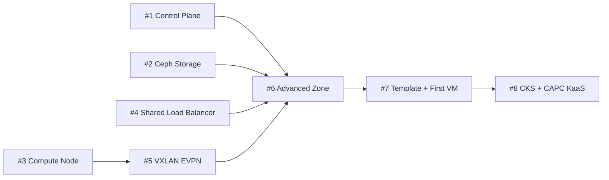
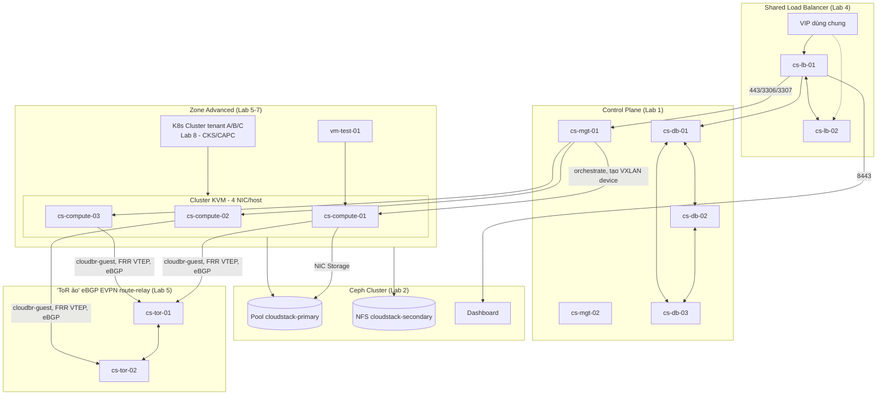

---
tags:
  - cloudstack
  - lab
  - overview
aliases:
  - CloudStack Lab Series
---

# CloudStack Production Cluster - Lab Series Overview

Bộ 8 lab dưới đây, gộp lại, dựng thành **một cụm Apache CloudStack production quy mô nhỏ** hoàn chỉnh: control plane HA, một cặp Load Balancer dùng chung cho toàn platform, Primary/Secondary Storage trên Ceph, Compute Node KVM với 4 NIC riêng theo traffic type, Guest network cô lập bằng VXLAN ở chế độ EVPN (BGP, qua FRRouting), một Zone đã kiểm chứng deploy VM thành công, và cuối cùng là dịch vụ Kubernetes-as-a-Service (KaaS) đa tenant trên nền hạ tầng đó. Mỗi lab độc lập chạy được và có thể đọc riêng, nhưng thứ tự bên dưới phản ánh đúng phụ thuộc thật giữa chúng — không đảo thứ tự khi triển khai lần đầu.

> [!NOTE]
> Toàn bộ series dùng **Ubuntu 24.04**, **CloudStack 4.19.x/4.20.x** (xác nhận lại bản mới nhất khi triển khai), và **Ceph** phiên bản LTS mới nhất — theo đúng các quyết định kiến trúc đã chốt khi viết series này. Guest network isolation dùng **plugin VXLAN gốc của CloudStack ở chế độ EVPN** (đổi từ chế độ Multicast mặc định bằng 1 symlink script trên KVM host) — CloudStack biết và quản lý đây là network VXLAN bình thường, chỉ khác cách agent học BUM/MAC (BGP EVPN qua FRRouting thay vì multicast flood-and-learn). Lý do và kiến trúc đầy đủ ở [[CloudStack VXLAN EVPN - Triển khai Guest Network Isolation với FRRouting]]. Xem [[Cloudstack|CloudStack Overview]] và [[Ceph|Ceph]] trong vault cho phần kiến thức nền lý thuyết đầy đủ hơn.

## Quy ước đặt tên hostname trong series

| Nhóm | Pattern | Ví dụ |
| --- | --- | --- |
| Management Server | `cs-mgt-0N` | `cs-mgt-01`, `cs-mgt-02` |
| Galera Database | `cs-db-0N` | `cs-db-01`, `cs-db-02`, `cs-db-03` |
| Compute (KVM) | `cs-compute-0N` | `cs-compute-01`, `cs-compute-02`, `cs-compute-03` |
| Load Balancer dùng chung | `cs-lb-0N` | `cs-lb-01`, `cs-lb-02` |
| FRR "Top-of-Rack" ảo (eBGP EVPN route-relay) | `cs-tor-0N` | `cs-tor-01`, `cs-tor-02` |
| Ceph | `ceph-0N` | `ceph-01`...`ceph-07` |

## Thứ tự triển khai

| #   | Lab                                                                               | Việc chính                                                                                      | Có thể chạy song song?            |
| --- | --------------------------------------------------------------------------------- | ----------------------------------------------------------------------------------------------- | --------------------------------- |
| 1   | [[CloudStack Control Plane - Triển khai Management Server HA và Galera Database]] | 2x `cs-mgt` + Galera 3 node `cs-db` (quorum thật, không cần garbd), import System VM template   | Song song với #2, #3, #4          |
| 2   | [[Ceph Cluster - Triển khai Primary và Secondary Storage cho CloudStack]]         | Cụm Ceph 7 node, pool RBD (Primary Storage) + CephFS/NFS-Ganesha (Secondary Storage)            | Song song với #1, #3, #4          |
| 3   | [[CloudStack Compute Node - Chuẩn bị KVM Hypervisor Host]]                        | OS + KVM/libvirt + 4 NIC riêng (mgt/storage/guest/public) trên 3 host `cs-compute`              | Song song với #1, #2, #4          |
| 4   | [[CloudStack & Ceph - Shared Load Balancer HAProxy Keepalived]]                   | 2 node `cs-lb` chạy HAProxy+keepalived, 1 VIP dùng chung cho DB, CloudStack UI, Ceph Dashboard  | Song song với #1, #2, #3          |
| 5   | [[CloudStack VXLAN EVPN - Triển khai Guest Network Isolation với FRRouting]]       | Symlink script EVPN trên 3 host `cs-compute`, 2x `cs-tor` route-relay, FRR eBGP L2VPN EVPN      | Cần #3 xong trước                 |
| 6   | [[CloudStack Advanced Zone - Triển khai Network SDN và Storage]]                  | Tạo Zone Advanced, Physical Network 4 traffic label + isolation VXLAN, Add Host, Add Storage, Enable Zone | Cần #1, #2, #3, #4, #5 xong trước |
| 7   | [[CloudStack Template - Import Guest OS Template và Deploy VM đầu tiên]]          | Import template, tạo Offering, deploy + SSH VM test end-to-end                                  | Cần #6 xong trước                 |
| 8   | [[CloudStack Kubernetes Service & Cluster API Provider - KaaS Multi-tenant]]      | Bật CKS, đăng ký Cluster API Provider CloudStack (CAPC), thiết kế multi-tenant cho dịch vụ KaaS | Cần #7 xong trước                 |

## Kiến trúc tổng thể sau khi hoàn thành cả series

## Kết quả đạt được

- **Control plane** không có single point of failure ở tầng Management Server lẫn Database (Lab 1).
- **Một tầng Load Balancer duy nhất** phục vụ 3 dịch vụ khác nhau (CloudStack UI/API, Galera, Ceph Dashboard) — tiết kiệm hạ tầng so với converge LB riêng ở mỗi nhóm node (Lab 4).
- **Storage** dùng chung một cụm Ceph cho cả Primary (RBD) lẫn Secondary (NFS), tiết kiệm hạ tầng so với 2 hệ thống riêng (Lab 2).
- **Compute** 3 KVM host, mỗi host 4 NIC vật lý tách biệt theo traffic type (Management/Storage/Guest/Public), hardening libvirt/VNC/firewall theo từng loại traffic (Lab 3).
- **Network** dùng đúng plugin VXLAN gốc của CloudStack, chuyển sang chế độ EVPN (BGP qua FRRouting) — loại bỏ giới hạn ~20 VXLAN interface/host và phụ thuộc multicast/PIM của chế độ Multicast mặc định, có control plane BGP tường minh để debug/hardening (Lab 5).
- **Zone** đã kiểm chứng end-to-end: VM chạy trên Ceph RBD, network qua VXLAN (EVPN), SSH được từ ngoài (Lab 6-7).
- **Kubernetes-as-a-Service** đa tenant trên nền hạ tầng trên, dùng cả CKS built-in và Cluster API Provider CloudStack cho mô hình cloud provider thật (Lab 8).

## Việc nằm ngoài phạm vi series này

Series dừng lại ở một Zone production tối thiểu cùng dịch vụ KaaS đa tenant đã hoạt động — các chủ đề vận hành dài hạn sau đây chưa được viết thành lab riêng, tham khảo ghi chú lý thuyết tương ứng trong vault khi cần:

- Multi-zone / Disaster Recovery giữa các site — chưa có lab, xem [[Scaling the Infrastructure]].
- Backup VM/Snapshot policy dài hạn — xem [[Secondary Storage, Snapshots & Backups]].
- Giám sát & alerting (Prometheus exporter, usage server) — xem [[CloudStack Monitoring & Alerting]].
- Quy trình nâng cấp CloudStack/Ceph an toàn — xem [[CloudStack Upgrade Procedure]].
- VPC multi-tier, Site-to-Site VPN — xem [[VPC & Isolated Networks]].
- Billing/metering chi tiết cho mô hình cloud provider (usage server, tích hợp hệ thống billing ngoài) — nằm ngoài phạm vi Lab 8, vốn chỉ tập trung vào resource isolation/quota.
- Fabric EVPN đa rack thật (leaf-spine vật lý, dual-uplink/host, underlay routing) — Lab 5 dùng thiết kế đơn giản hoá 1-NIC/host + FRR VM giả lập ToR cho quy mô lab; mở rộng lên fabric thật cần thiết kế lại theo đúng pattern dual-uplink + unnumbered BGP trong tài liệu chính thức, xem ghi chú trong lab đó.

## Lab mở rộng (ngoài 8 lab gốc)

- [[CloudStack Kubernetes Service - Node Template Ubuntu 22.04, Cilium CNI và CSI-CCM LoadBalancer]] — build riêng node template Ubuntu 22.04 (Packer + Ansible) thay System VM Debian mặc định của CKS, đổi CNI sang Cilium qua CNI Configuration framework, và xác nhận CSI driver + CCM cho `Service type=LoadBalancer`. Yêu cầu Lab 8 đã hoàn tất.

---
*Xem thêm: [[Cloudstack|CloudStack Overview]] | [[Ceph|Ceph]] | [[CloudStack Prerequisites]]*
