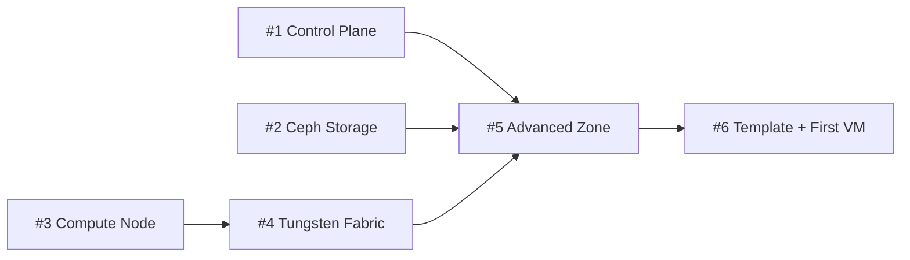
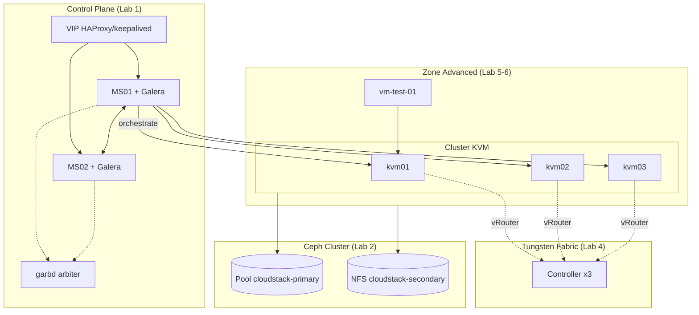

---
tags:
  - cloudstack
  - lab
  - overview
aliases:
  - CloudStack Lab Series
---

# CloudStack Production Cluster - Lab Series Overview

Bộ 6 lab dưới đây, gộp lại, dựng thành **một cụm Apache CloudStack production quy mô nhỏ** hoàn chỉnh: control plane HA, Primary/Secondary Storage trên Ceph, Compute Node KVM, Advanced Networking dùng Tungsten Fabric SDN, và một Zone đã kiểm chứng deploy VM thành công. Mỗi lab độc lập chạy được và có thể đọc riêng, nhưng thứ tự bên dưới phản ánh đúng phụ thuộc thật giữa chúng — không đảo thứ tự khi triển khai lần đầu.

> [!NOTE]
> Toàn bộ series dùng **Ubuntu 24.04**, **CloudStack 4.19.x/4.20.x** (xác nhận lại bản mới nhất khi triển khai), **Ceph** phiên bản LTS mới nhất, và **Tungsten Fabric** làm SDN controller — theo đúng các quyết định kiến trúc đã chốt khi viết series này. Xem [[Cloudstack|CloudStack Overview]] và [[Ceph|Ceph]] trong vault cho phần kiến thức nền lý thuyết đầy đủ hơn.

## Thứ tự triển khai

| # | Lab | Việc chính | Có thể chạy song song? |
| --- | --- | --- | --- |
| 1 | [[CloudStack Control Plane - Triển khai Management Server HA và Galera Database]] | 2x Management Server HA + Galera DB + garbd, import System VM template | Song song với #2, #3 |
| 2 | [[Ceph Cluster - Triển khai Primary và Secondary Storage cho CloudStack]] | Cụm Ceph 3 node, pool RBD (Primary Storage) + CephFS/NFS-Ganesha (Secondary Storage) | Song song với #1, #3 |
| 3 | [[CloudStack Compute Node - Chuẩn bị KVM Hypervisor Host]] | OS + KVM/libvirt + bridge network trên 3 host, chuẩn bị interface cho SDN | Song song với #1, #2 |
| 4 | [[Tungsten Fabric - Triển khai SDN Controller cho CloudStack]] | Cụm TF controller 3 node + vRouter agent trên 3 host từ #3 | Cần #3 xong trước |
| 5 | [[CloudStack Advanced Zone - Triển khai Network SDN và Storage]] | Tạo Zone Advanced, gắn TF (#4), Add Host (#3), Add Storage (#2), Enable Zone | Cần #1, #2, #3, #4 xong trước |
| 6 | [[CloudStack Template - Import Guest OS Template và Deploy VM đầu tiên]] | Import template, tạo Offering, deploy + SSH VM test end-to-end | Cần #5 xong trước |

## Kiến trúc tổng thể sau khi hoàn thành cả series

## Kết quả đạt được

- **Control plane** không có single point of failure ở tầng Management Server lẫn Database (Lab 1).
- **Storage** dùng chung một cụm Ceph cho cả Primary (RBD) lẫn Secondary (NFS), tiết kiệm hạ tầng so với 2 hệ thống riêng (Lab 2).
- **Compute** 3 KVM host, hardening libvirt/VNC/firewall theo từng loại traffic (Lab 3).
- **Network** cô lập bằng SDN thật (Tungsten Fabric) thay vì VLAN/Security Group truyền thống, sẵn sàng scale vượt giới hạn 4094 network (Lab 4).
- **Zone** đã kiểm chứng end-to-end: VM chạy trên Ceph RBD, network qua TF overlay, SSH được từ ngoài (Lab 5-6).

## Việc nằm ngoài phạm vi series này

Series dừng lại ở một Zone production tối thiểu đã hoạt động — các chủ đề vận hành dài hạn sau đây chưa được viết thành lab riêng, tham khảo ghi chú lý thuyết tương ứng trong vault khi cần:

- Multi-zone / Disaster Recovery giữa các site — chưa có lab, xem [[Scaling the Infrastructure]].
- Backup VM/Snapshot policy dài hạn — xem [[Secondary Storage, Snapshots & Backups]].
- Giám sát & alerting (Prometheus exporter, usage server) — xem [[CloudStack Monitoring & Alerting]].
- Quy trình nâng cấp CloudStack/Ceph/Tungsten Fabric an toàn — xem [[CloudStack Upgrade Procedure]].
- RBAC/Account/Domain/Project cho multi-tenant thật — xem [[RBAC & Roles (CloudStack)]] và [[Accounts, Domains & Projects (CloudStack)]].
- VPC multi-tier, Site-to-Site VPN — xem [[VPC & Isolated Networks]].

---
*Xem thêm: [[Cloudstack|CloudStack Overview]] | [[Ceph|Ceph]] | [[CloudStack Prerequisites]]*
