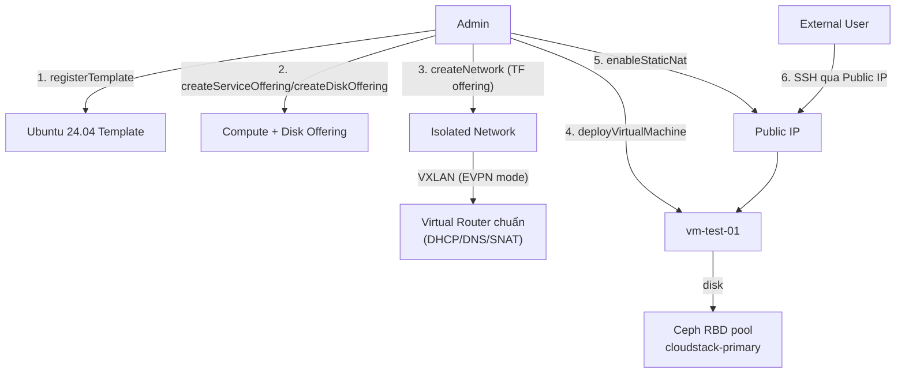

---
tags:
  - cloudstack
  - lab
  - template
  - vm
---

# CloudStack Template - Import Guest OS Template và Deploy VM đầu tiên

- **Bối cảnh và vấn đề**: Zone đã `Enabled` ở [[CloudStack Advanced Zone - Triển khai Network SDN và Storage]] nhưng chưa có OS template nào để deploy VM, cũng chưa có Service/Disk Offering cho user chọn. Đây là bước cuối cùng chứng minh toàn bộ chuỗi hạ tầng (control plane, storage, compute, VXLAN/EVPN) hoạt động đúng end-to-end trước khi bàn giao Zone cho user thật.
- **Cách giải quyết**: Import Ubuntu 24.04 cloud image làm Guest OS Template qua Secondary Storage, tạo Compute Offering + Disk Offering cơ bản, tạo Isolated Network dùng Network Offering đã tạo ở lab trước, deploy 1 VM test bằng SSH keypair injection qua cloud-init, cấu hình Static NAT/Firewall để SSH được từ ngoài vào.
- **Kết quả sau khi hoàn thành**: VM chạy thành công trên Ceph RBD, có network cô lập bằng VLAN ở tầng CloudStack và mở rộng qua EVPN VXLAN ở tầng hạ tầng, SSH được từ ngoài Zone. Series [[CloudStack Production Cluster - Lab Series Overview]] hoàn tất — cụm CloudStack sẵn sàng bàn giao vận hành.

> [!NOTE]
> Vì Guest network dùng Virtual Router chuẩn của CloudStack (CloudStack chỉ thấy VLAN, không biết gì về lớp EVPN VXLAN bên dưới), password reset qua Console và metadata service (`169.254.169.254`) hoạt động theo đúng hành vi mặc định đã được tài liệu hoá đầy đủ. Lab này vẫn ưu tiên SSH-key injection qua `cloud-init` làm phương thức truy cập chính vì đây là thực hành chuẩn cho production, không phải vì cơ chế password reset chưa chắc hoạt động.

> [!NOTE]
> Lab này dùng Ubuntu 24.04 cloud image làm ví dụ vì có sẵn `cloud-init`, hỗ trợ SSH-key injection ngay từ lần boot đầu — không cần đặt password mặc định trong template. Quy trình tương tự áp dụng cho bất kỳ distro nào khác hỗ trợ `cloud-init`/`cloudbase-init`.

## Prerequisites

- **Hạ tầng**: [[CloudStack Advanced Zone - Triển khai Network SDN và Storage]] đã hoàn tất — Zone `Enabled`, SSVM/CPVM `Running`, Network Offering đã `Enabled`.
- **Máy chủ / VM**: không thêm node mới ở lab này.
- **Tài khoản và quyền**: tài khoản `admin` hoặc account có quyền `registerTemplate`/`deployVirtualMachine`.
- **Mạng**: 1 Public IP còn trống trong dải đã khai báo ở lab trước, dùng cho Static NAT tới VM test.
- **Kiến thức nền**: giả định đã đọc [[Service, Disk & Network Offerings]] trong vault này.

## Thông tin Planning liên quan

| Thành phần | Giá trị | Ghi chú |
| --- | --- | --- |
| Template name | `ubuntu-24.04-cloudimg` | Ubuntu 24.04 LTS cloud image (QCOW2, KVM) |
| Template URL | `https://cloud-images.ubuntu.com/releases/24.04/release/ubuntu-24.04-server-cloudimg-amd64.img` | Xác nhận lại URL/checksum mới nhất trước khi import |
| Compute Offering | `<TBD>` | Ví dụ: 2 vCPU / 4GB RAM |
| Disk Offering | `<TBD>` | Ví dụ: 20GB, dùng chung QoS pool `cloudstack-primary` |
| Isolated Network name | `<TBD>` | Dùng Network Offering đã tạo ở lab trước |
| SSH keypair name | `<TBD>` | Đăng ký qua `registerSSHKeyPair` hoặc `createSSHKeyPair` |
| Public IP dùng Static NAT | `<TBD - 1 IP trong dải Public IP range>` | |
| VM test name | `vm-test-01` | Xoá sau khi hoàn tất kiểm tra nếu chỉ dùng để test |

## Diagram



---

## Installation

### Bước 1 - Import Guest OS Template

- Xác nhận `ostypeid` phù hợp trước khi register:

```bash
cmk list ostypes keyword="Ubuntu 24.04"
```

- Register template từ URL công khai (Secondary Storage của CloudStack sẽ tự tải về, không cần tải thủ công):

```bash
cmk register template \
  name=<template-name> \
  displaytext="Ubuntu 24.04 LTS cloud image" \
  url=<template-url> \
  zoneid=<zone-id> \
  hypervisor=KVM \
  format=QCOW2 \
  ostypeid=<ostype-id> \
  passwordenabled=true \
  ispublic=true
```

> [!NOTE]
> `passwordenabled=true` — cơ chế "reset password qua Console" của CloudStack dựa vào Password Server chạy trên Virtual Router chuẩn, hoạt động bình thường vì Zone này dùng VR mặc định cho DHCP/metadata. Lab vẫn ưu tiên SSH-key injection qua `cloud-init` ở Bước 4-5 làm phương thức truy cập chính cho VM test, đúng thực hành chuẩn production — password reset qua Console chỉ là phương án dự phòng khi cần truy cập console trực tiếp.

- Kiểm tra kết quả bước này:

```bash
cmk list templates templatefilter=all name=<template-name>
```

Kết quả mong đợi: `isready=true` sau khi Secondary Storage tải và convert xong (có thể mất vài phút tuỳ dung lượng image và băng thông).

### Bước 2 - Tạo Compute Offering và Disk Offering

```bash
cmk create serviceoffering \
  name=<compute-offering-name> \
  displaytext="2 vCPU / 4GB - Standard" \
  cpunumber=2 cpuspeed=2000 memory=4096 \
  storagetype=shared \
  offerha=true
```

> [!NOTE]
> `offerha=true` bật CloudStack HA ở cấp Service Offering — VM dùng offering này sẽ tự được khởi động lại trên host khác nếu host gốc bị phát hiện chết (fencing). Xem cơ chế và rủi ro chi tiết ở [[CloudStack HA Architecture]] trước khi bật mặc định cho mọi offering.

```bash
cmk create diskoffering \
  name=<disk-offering-name> \
  displaytext="20GB Standard" \
  disksize=20 \
  storagetype=shared
```

- Kiểm tra kết quả bước này:

```bash
cmk list serviceofferings name=<compute-offering-name>
cmk list diskofferings name=<disk-offering-name>
```

### Bước 3 - Tạo Isolated Network

```bash
cmk create network \
  name=<isolated-network-name> \
  displaytext="Isolated network - test" \
  networkofferingid=<network-offering-id-từ-lab-trước> \
  zoneid=<zone-id>
```

- Kiểm tra kết quả bước này:

```bash
cmk list networks name=<isolated-network-name>
```

Kết quả mong đợi: `state=Allocated`, `networkofferingid` đúng offering đã tạo ở lab Advanced Zone.

### Bước 4 - Đăng ký SSH keypair

- Sinh keypair cục bộ và đăng ký public key vào CloudStack (private key giữ lại phía admin, không upload):

```bash
ssh-keygen -t ed25519 -f ~/.ssh/<ssh-keypair-name> -N ""
cmk register sshkeypair name=<ssh-keypair-name> publickey="$(cat ~/.ssh/<ssh-keypair-name>.pub)"
```

- Kiểm tra kết quả bước này:

```bash
cmk list sshkeypairs name=<ssh-keypair-name>
```

### Bước 5 - Deploy VM test

```bash
cmk deploy virtualmachine \
  name=<vm-test-name> \
  displayname=<vm-test-name> \
  zoneid=<zone-id> \
  templateid=<template-id> \
  serviceofferingid=<compute-offering-id> \
  diskofferingid=<disk-offering-id> \
  networkids=<isolated-network-id> \
  keypair=<ssh-keypair-name>
```

- Kiểm tra kết quả bước này:

```bash
cmk list virtualmachines name=<vm-test-name>
```

Kết quả mong đợi: `state=Running`, có địa chỉ IP nội bộ trong dải Isolated Network.

### Bước 6 - Cấu hình Static NAT để SSH từ ngoài vào

```bash
cmk associate ipaddress zoneid=<zone-id> networkid=<isolated-network-id>
cmk enable staticnat virtualmachineid=<vm-id> ipaddressid=<public-ip-id>
```

- Mở firewall rule cho SSH trên Public IP vừa gán:

```bash
cmk create firewallrule \
  ipaddressid=<public-ip-id> \
  protocol=TCP \
  startport=22 endport=22 \
  cidrlist=<cidr-được-phép-ssh-vào>
```

> [!WARNING]
> Không dùng `cidrlist=0.0.0.0/0` cho production — giới hạn đúng dải IP quản trị được phép SSH vào VM, giống nguyên tắc firewall theo network đã áp dụng xuyên suốt các lab trước trong series.

- Kiểm tra kết quả bước này:

```bash
ssh -i ~/.ssh/<ssh-keypair-name> ubuntu@<public-ip>
```

Kết quả mong đợi: SSH thành công bằng key, không cần password — xác nhận cloud-init đã inject key đúng, và toàn bộ luồng Public IP → Static NAT → Virtual Router → VXLAN (EVPN) → VM hoạt động.

### Khai báo thông tin nhạy cảm

- Private key `~/.ssh/<ssh-keypair-name>` sinh ở Bước 4 là thứ duy nhất cần bảo vệ trong lab này — chỉ giữ ở máy admin, quyền `600`, không commit vào bất kỳ repo Git nào kể cả repo automation nội bộ.

## Kiểm tra kết quả

| Hạng mục cần kiểm tra | Cách kiểm tra | Kết quả đúng |
| --- | --- | --- |
| Template sẵn sàng | `cmk list templates templatefilter=all name=<template-name>` | `isready=true` |
| VM chạy | `cmk list virtualmachines name=<vm-test-name>` | `state=Running` |
| Disk nằm trên Ceph RBD | `rbd -p cloudstack-primary --id cloudstack-rbd ls` (chạy trên Ceph admin node) | Thấy volume tương ứng VM vừa tạo |
| SSH từ ngoài vào VM | `ssh -i <key> ubuntu@<public-ip>` | Đăng nhập thành công bằng key, không cần password |
| VM có internet ra ngoài | Từ trong VM: `curl -I https://download.cloudstack.org` | Nhận HTTP response, xác nhận SNAT qua Virtual Router hoạt động |

- Sau khi xác nhận đủ 5 hạng mục trên, Zone chính thức sẵn sàng bàn giao. Xoá VM test nếu chỉ dùng để kiểm tra:

```bash
cmk destroy virtualmachine id=<vm-id> expunge=true
```

## Troubleshooting

Không áp dụng - lab dựng mới theo hướng dẫn triển khai chuẩn, chưa có log lỗi thực tế phát sinh trong quá trình build để ghi nhận.

## Rollback

- Gỡ theo thứ tự ngược: destroy VM → xoá Static NAT/Firewall rule → xoá Network → xoá Offering → xoá Template:

```bash
cmk destroy virtualmachine id=<vm-id> expunge=true
cmk disable staticnat ipaddressid=<public-ip-id>
cmk delete firewallrule id=<firewallrule-id>
cmk delete network id=<isolated-network-id>
cmk delete serviceoffering id=<compute-offering-id>
cmk delete diskoffering id=<disk-offering-id>
cmk delete template id=<template-id>
```

> [!CAUTION]
> `expunge=true` xoá VM và disk ngay lập tức, bỏ qua khoảng thời gian "chờ expunge" mặc định của CloudStack — không thể khôi phục. Với VM test thì an toàn, nhưng tuyệt đối không dùng flag này cho VM sản xuất thật trừ khi chắc chắn muốn xoá vĩnh viễn ngay.

## Reference

- [Ubuntu Cloud Images](https://cloud-images.ubuntu.com/releases/24.04/release/)
- [Apache CloudStack - Working with Templates](https://docs.cloudstack.apache.org/en/latest/adminguide/templates.html)
- [Apache CloudStack - Static NAT and Firewall](https://docs.cloudstack.apache.org/en/latest/adminguide/networking/nat.html)
- [cloud-init - SSH key injection](https://cloudinit.readthedocs.io/)
- Ghi chú liên quan trong vault: [[Service, Disk & Network Offerings]] | [[CloudStack HA Architecture]]
