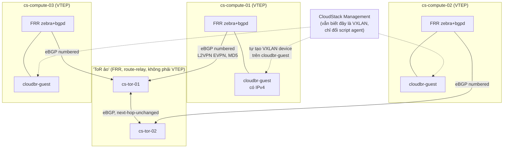

---
tags:
  - cloudstack
  - lab
  - networking
  - vxlan
  - evpn
  - bgp
  - frrouting
---

# CloudStack VXLAN EVPN - Triển khai Guest Network Isolation với FRRouting

- **Bối cảnh và vấn đề**: Plugin VXLAN của Apache CloudStack có 2 chế độ: **Multicast** (mặc định) và **EVPN qua BGP**. Chế độ Multicast học BUM traffic (broadcast/unknown-unicast/multicast) qua multicast group ở underlay, và có một giới hạn cứng ít người biết: `net.ipv4.igmp_max_memberships` mặc định của Linux là `20` — nghĩa là **mỗi host tối đa 20 VXLAN interface** (20 Guest network đồng thời trên 1 host) trước khi gặp lỗi `No buffer space available`. Ở quy mô muốn mở rộng thật cho production, đây là điểm nghẽn thật, chưa kể switch underlay phải bật đúng PIM/IGMP snooping mà không phải team Network nào cũng đồng ý.
- **Cách giải quyết**: Chuyển sang chế độ **EVPN** của cùng plugin VXLAN — CloudStack **vẫn khai `isolationmethods=VXLAN`** như bình thường, chỉ đổi 1 symlink (`modifyvxlan.sh` → `modifyvxlan-evpn.sh`) trên từng KVM host để agent dùng script EVPN thay vì script multicast. **FRRouting** (`zebra`+`bgpd`) chạy trên mỗi `cs-compute-0N` đóng vai trò VTEP, học MAC/IP qua BGP L2VPN EVPN (Type-2) và danh sách VTEP cần flood BUM qua Type-3 (ingress replication unicast, không multicast). Một cặp VM **`cs-tor-01`/`cs-tor-02`** đóng vai trò "Top-of-Rack" ảo — đúng theo topology mẫu trong tài liệu chính thức (mỗi hypervisor eBGP với ToR trong rack của nó, ToR nối lên Spine) — chỉ khác là ở quy mô lab này không có switch vật lý hỗ trợ EVPN nên dùng FRR VM giả lập vai trò đó.
- **Kết quả sau khi hoàn thành**: Guest network dùng plugin VXLAN gốc của CloudStack (không phải hack/bypass), chạy ở chế độ EVPN — không còn giới hạn 20 network/host, không phụ thuộc PIM multicast ở underlay, có control plane BGP tường minh để debug/hardening.

> [!NOTE]
> Toàn bộ thiết kế trong lab này bám theo đúng [Apache CloudStack - VXLAN Plugin (bản 4.23)](https://docs.cloudstack.apache.org/en/4.23.0.0/plugins/vxlan.html) — không phải một cách lách/giấu EVPN khỏi CloudStack. CloudStack biết và quản lý đây là network VXLAN bình thường; điều duy nhất đổi là script agent dùng để tạo VXLAN interface trên host.

> [!WARNING]
> Tài liệu chính thức minh hoạ FRR bằng **eBGP unnumbered peering theo interface, mỗi hypervisor có 2 uplink riêng tới 2 Top-of-Rack switch vật lý** (redundancy ở tầng liên kết). Lab này chỉ có **1 NIC Guest/host** (theo thiết kế 4-NIC đã chốt ở [[CloudStack Compute Node - Chuẩn bị KVM Hypervisor Host]]), và các "ToR" ở đây là FRR VM chạy trên cùng 1 L2 segment với compute host (không phải cáp point-to-point riêng tới từng switch) — nên lab dùng **eBGP có địa chỉ IP tường minh** (numbered) thay vì unnumbered, và mỗi host chỉ eBGP tới **1** trong 2 `cs-tor`, không phải cả 2. Đây là sự đơn giản hoá có chủ đích cho quy mô lab, đánh đổi lại là mất 1 `cs-tor` sẽ ảnh hưởng các host gắn vào đúng ToR đó (không mất toàn bộ fabric vì `cs-tor-01/02` tự peer nhau để đóng vòng route exchange). Muốn đúng 100% pattern dual-uplink của tài liệu chính thức, cần thêm 1 NIC Guest thứ 2/host.

## Quyết định kiến trúc - Multicast VXLAN vs EVPN VXLAN

| Khía cạnh | Multicast (script mặc định `modifyvxlan.sh`) | EVPN (symlink `modifyvxlan-evpn.sh`) |
| --- | --- | --- |
| Học MAC/IP giữa VTEP | Flood-and-learn qua data plane | Control plane BGP (Type-2 route) |
| BUM traffic | Multicast group ở underlay — cần PIM/IGMP snooping | Ingress replication (unicast) qua Type-3, không cần multicast |
| Port UDP | `8472` (legacy, mặc định script gốc) | `4789` (chuẩn IANA) |
| Giới hạn cứng đã biết | `net.ipv4.igmp_max_memberships` mặc định `20` → tối đa 20 VXLAN interface/host | Không có giới hạn tương tự |
| Control plane | Không có — thuần data plane | BGP RIB tường minh, `show bgp l2vpn evpn` xem được chính xác |
| Yêu cầu thêm | Không cài thêm software, nhưng cần switch hỗ trợ PIM | FRRouting ≥ 10 trên mỗi VTEP + thiết kế BGP fabric (ASN, peering) |
| Đổi chế độ | — | Chỉ 1 symlink trên mỗi host, **phải làm trước khi tạo Guest network đầu tiên** |

> [!WARNING]
> Không đổi symlink `modifyvxlan.sh` sau khi Zone đã có Guest network đang chạy ở chế độ Multicast — VXLAN interface đã tồn tại được tạo bởi script cũ, đổi symlink không hồi tố các network đã tạo, chỉ ảnh hưởng network mới. Quyết định Multicast hay EVPN nên chốt **trước** [[CloudStack Advanced Zone - Triển khai Network SDN và Storage]], giống nguyên tắc "Zone/Physical Network không đổi được sau khi tạo" đã nhắc xuyên suốt series.

## Prerequisites

- **Hạ tầng**: [[CloudStack Compute Node - Chuẩn bị KVM Hypervisor Host]] đã hoàn tất — mỗi `cs-compute-0N` đã có bridge `cloudbr-guest` **có IPv4** (VTEP source).
- **Máy chủ/VM**: 2 VM mới cho vai trò "ToR ảo":

  | Node | Vai trò | CPU | RAM | Disk |
  | --- | --- | --- | --- | --- |
  | cs-tor-01 | FRR — eBGP route-relay (không phải VTEP, không có VNI cục bộ) | 2 vCPU | 4 GB | 20 GB |
  | cs-tor-02 | FRR — eBGP route-relay | 2 vCPU | 4 GB | 20 GB |

- **Tài khoản và quyền**: sudo trên `cs-tor-01/02` và cả 3 `cs-compute-0N`.
- **Mạng**: `cs-tor-01/02` cần có NIC trên cùng L2 segment/VLAN với `cloudbr-guest` của các `cs-compute-0N` (đây là điều kiện để eBGP numbered thiết lập được — không cần route riêng, chỉ cần cùng subnet).
- **Kiến thức nền**: giả định đã biết khái niệm BGP cơ bản (AS, eBGP, next-hop) ở mức tổng quan.

> [!WARNING]
> `cs-tor-01/02` là nơi duy nhất trong fabric có khả năng relay route EVPN giữa các nhóm host — compromise 1 trong 2 cho phép quảng bá Type-2 route giả (MAC/IP bất kỳ trỏ vào VTEP bất kỳ) tới toàn bộ host peer với nó, dẫn tới khả năng chiếm traffic (MITM) trên các Guest network liên quan. Xem Bước 5 để hardening đúng mức độ nghiêm trọng này.

## Thông tin Planning liên quan

| Thành phần | Giá trị | Ghi chú |
| --- | --- | --- |
| cs-tor-01/02 hostname/IP | `<TBD>` | Cùng L2 segment với `cloudbr-guest` của `cs-compute-0N` |
| Phân bổ host ↔ ToR | `cs-compute-01 → cs-tor-01`, `cs-compute-02 → cs-tor-02`, `cs-compute-03 → cs-tor-01` | Ví dụ chia đều — điều chỉnh theo số host thật |
| ASN scheme | 4-byte private ASN, ví dụ `cs-compute-0N = 42000000<0N>`, `cs-tor-0N = 42000001<0N>` | Mỗi thiết bị 1 ASN riêng, đúng tinh thần thiết kế eBGP "unique ASN per device" (RFC 7938) mà tài liệu CloudStack tham chiếu |
| BGP MD5 password | `<sinh bằng openssl rand>` | Bắt buộc cho mọi session eBGP |
| VNI range (khai ở CloudStack) | `<TBD, ví dụ 10000-10100>` | Khai ở [[CloudStack Advanced Zone - Triển khai Network SDN và Storage]] — CloudStack tự cấp phát, không cần mapping tay VLAN↔VNI như thiết kế lách trước đây |
| Guest bridge | `cloudbr-guest` | Đã có IPv4, tạo ở [[CloudStack Compute Node - Chuẩn bị KVM Hypervisor Host]] |

## Diagram



---

## Installation

### Bước 1 - Cài đặt FRRouting trên `cs-tor-01/02` và cả 3 `cs-compute-0N`

```bash
sudo apt update
sudo apt install -y curl gnupg
curl -s https://deb.frrouting.org/frr/keys.gpg | sudo tee /usr/share/keyrings/frrouting.gpg > /dev/null
echo "deb [signed-by=/usr/share/keyrings/frrouting.gpg] https://deb.frrouting.org/frr $(lsb_release -sc) frr-stable" | \
  sudo tee -a /etc/apt/sources.list.d/frr.list
sudo apt update && sudo apt install -y frr frr-pythontools
```

> [!WARNING]
> Tài liệu chính thức của CloudStack yêu cầu **FRRouting phiên bản 10 trở lên** cho tính năng EVPN — `frr-stable` có thể chưa đúng version này tuỳ thời điểm cài. Xác nhận `frr --version` ≥ 10 sau khi cài, pin version cụ thể qua `apt-cache policy frr` nếu repo có nhiều version.

- Bật daemon `zebra` và `bgpd` trong `/etc/frr/daemons`:

```bash
sudo sed -i 's/^bgpd=no/bgpd=yes/' /etc/frr/daemons
sudo systemctl enable --now frr
```

- Kiểm tra kết quả bước này:

```bash
sudo vtysh -c "show version" | head -n1
sudo systemctl status frr --no-pager | grep -i active
```

Kết quả mong đợi: version FRR ≥ 10, `active`.

### Bước 2 - Symlink `modifyvxlan.sh` → `modifyvxlan-evpn.sh` trên cả 3 `cs-compute-0N`

Đây là bước duy nhất khiến CloudStack Agent chuyển từ chế độ Multicast (mặc định) sang EVPN — **phải làm trước khi có Guest network đầu tiên**:

```bash
cd /usr/share
sudo cp -a modifyvxlan.sh modifyvxlan.sh.bak-multicast   # backup để rollback ở cuối bài, không suy đoán lại sau này
sudo ln -sf cloudstack-common/scripts/vm/network/vnet/modifyvxlan-evpn.sh modifyvxlan.sh
```

- Kiểm tra kết quả bước này:

```bash
ls -la /usr/share/modifyvxlan.sh
```

Kết quả mong đợi: symlink trỏ đúng vào `modifyvxlan-evpn.sh`, thực hiện giống nhau trên cả 3 compute node.

> [!WARNING]
> Đường dẫn chính xác (`/usr/share/cloudstack-common/scripts/vm/network/vnet/`) có thể lệch nhẹ giữa các minor version CloudStack — xác nhận lại đúng đường dẫn cài đặt thật trên hệ thống (`find / -name 'modifyvxlan*.sh' 2>/dev/null`) trước khi tạo symlink nếu không khớp.

### Bước 3 - Cấu hình `cs-tor-01/02`: eBGP route-relay, không phải VTEP

Trên **cả 2** `cs-tor-0N`, cấu hình FRR chỉ làm nhiệm vụ relay route EVPN — không khai VNI, không phải VTEP:

```bash
sudo vtysh
```

```text
configure terminal
router bgp <asn-cs-tor-0N-theo-planning-table>
 no bgp default ipv4-unicast
 neighbor <ip-cs-compute-01> remote-as <asn-cs-compute-01>
 neighbor <ip-cs-compute-01> password <bgp-md5-password-theo-planning-table>
 neighbor <ip-cs-compute-03> remote-as <asn-cs-compute-03>
 neighbor <ip-cs-compute-03> password <bgp-md5-password-theo-planning-table>
 neighbor <ip-cs-tor-khac> remote-as <asn-cs-tor-khac>
 neighbor <ip-cs-tor-khac> password <bgp-md5-password-theo-planning-table>
 !
 address-family l2vpn evpn
  neighbor <ip-cs-compute-01> activate
  neighbor <ip-cs-compute-01> next-hop-unchanged
  neighbor <ip-cs-compute-03> activate
  neighbor <ip-cs-compute-03> next-hop-unchanged
  neighbor <ip-cs-tor-khac> activate
  neighbor <ip-cs-tor-khac> next-hop-unchanged
 exit-address-family
!
end
write memory
```

> [!WARNING]
> `next-hop-unchanged` **bắt buộc** trên mọi neighbor ở `cs-tor-0N` — mặc định eBGP tự đổi next-hop thành chính nó khi relay route (khác iBGP). Nếu thiếu, Type-2/Type-3 route relay qua ToR sẽ mang next-hop là IP của `cs-tor`, khiến VXLAN tunnel dữ liệu đi vòng qua ToR (sai mô hình "route server", ToR chỉ nên tham gia control plane, không nằm trong data path) hoặc tệ hơn là tunnel không thiết lập được vì `cs-tor` không phải VTEP thật.

- Danh sách neighbor phụ thuộc vào host nào được phân bổ vào ToR này (xem Planning table) — chỉ khai đúng các host đã gán, và luôn khai `cs-tor` còn lại để đóng vòng route exchange.

- Kiểm tra kết quả bước này (chạy trên cả 2 `cs-tor`):

```bash
sudo vtysh -c "show bgp l2vpn evpn summary"
```

Kết quả mong đợi: `Established` với mọi neighbor đã khai (sẽ chỉ thấy đúng số host được gán + `cs-tor` còn lại) — chưa có route nào vì CloudStack chưa tạo Guest network nào ở giai đoạn này.

### Bước 4 - Cấu hình FRR trên mỗi `cs-compute-0N`: eBGP tới đúng 1 `cs-tor`

Trên từng `cs-compute-0N` (VTEP), theo đúng phân bổ ở Planning table:

```text
configure terminal
router bgp <asn-cua-chinh-host-nay>
 bgp router-id <ip-cloudbr-guest-cua-chinh-host-nay>
 no bgp default ipv4-unicast
 neighbor <ip-cs-tor-duoc-gan> remote-as <asn-cs-tor-duoc-gan>
 neighbor <ip-cs-tor-duoc-gan> password <bgp-md5-password-theo-planning-table>
 !
 address-family l2vpn evpn
  neighbor <ip-cs-tor-duoc-gan> activate
  advertise-all-vni
  advertise-svi-ip
 exit-address-family
!
end
write memory
```

> [!NOTE]
> `advertise-all-vni` tự động quảng bá Type-2/Type-3 cho **toàn bộ VNI CloudStack tạo trên host này** — không cần khai tay từng VNI, đúng như hành vi CloudStack kỳ vọng ở agent (agent chỉ lo tạo/xoá VXLAN interface qua `modifyvxlan-evpn.sh`, FRR tự phát hiện và quảng bá). `advertise-svi-ip` quảng bá thêm IP của SVI (nếu Guest network có gateway trên chính bridge) — hữu ích cho ARP suppression về sau.

> [!TODO]
> Tài liệu CloudStack minh hoạ peering bằng **eBGP unnumbered** (`neighbor <interface> interface peer-group uplinks`, không cần IP tường minh) cho trường hợp point-to-point tới ToR vật lý. Cấu hình numbered ở trên là lựa chọn phù hợp cho lab này (xem cảnh báo đầu bài) — nếu triển khai production thật với ToR vật lý nối point-to-point, nên theo đúng pattern unnumbered của tài liệu chính thức, đơn giản hoá việc quản lý địa chỉ IP trên link transit.

- Kiểm tra kết quả bước này:

```bash
sudo vtysh -c "show bgp l2vpn evpn summary"
```

Kết quả mong đợi: `Established` với `cs-tor` đã gán.

### Bước 5 - Hardening bảo mật cho fabric BGP EVPN

- **MD5 authentication** đã bắt buộc ở Bước 3-4 trên mọi session.

- **Giới hạn firewall theo IP tường minh** — vì dùng eBGP numbered (không phải unnumbered/link-local), có thể áp ACL theo IP như bình thường:

```bash
# Trên cs-tor-01/02
sudo ufw allow from <ip-cac-cs-compute-duoc-gan>,<ip-cs-tor-khac> to any port 179 proto tcp comment 'ebgp evpn'

# Trên mỗi cs-compute-0N
sudo ufw allow from <ip-cs-tor-duoc-gan> to any port 179 proto tcp comment 'ebgp evpn'
sudo ufw allow from <guest-segment-cidr> to any port 4789 proto udp comment 'vxlan data plane (evpn mode)'
```

- **`ttl-security hops 1`** thay cho `ebgp-multihop` lớn — vì đây là peering trực tiếp cùng L2 segment (1 hop), siết chặt hơn ví dụ trong tài liệu chính thức (dùng `ebgp-multihop 255` cho trường hợp point-to-point đa hop qua nhiều Spine, không áp dụng cho lab 1-hop này):

```text
 neighbor <ip-peer> ttl-security hops 1
```

> [!NOTE]
> GTSM (`ttl-security hops`) kiểm tra TTL gói tin BGP đến phải gần bằng 255 (đến từ đúng 1 hop), chặn được tấn công giả mạo BGP TCP session từ xa nhiều hop hơn — không thay thế MD5 mà bổ sung thêm 1 lớp, gần như miễn phí về chi phí vận hành cho peering 1-hop như trong lab này.

- **`maximum-prefix`** trên mỗi session tại `cs-tor` — chặn 1 VTEP lỗi/compromise tràn route:

```text
 neighbor <ip-peer> maximum-prefix 5000 warning-only
```

- **Không dùng dynamic/passive neighbor**, luôn khai tường minh từng peer như đã làm — tránh thiết bị lạ trên cùng L2 segment vô tình/cố ý join fabric.

- Kiểm tra kết quả bước này:

```bash
nc -zv <ip-cs-tor-01> 179   # từ máy KHÔNG trong whitelist -> kỳ vọng refused/timeout
```

## Kiểm tra kết quả

  | Hạng mục cần kiểm tra | Cách kiểm tra | Kết quả đúng |
  | --- | --- | --- |
  | FRR ≥ 10 chạy trên toàn bộ node | `vtysh -c "show version"` | Version ≥ 10, `active` |
  | Symlink EVPN đã áp | `ls -la /usr/share/modifyvxlan.sh` | Trỏ vào `modifyvxlan-evpn.sh`, trên cả 3 compute node |
  | BGP eBGP session thiết lập | `show bgp l2vpn evpn summary` | `Established` đúng theo phân bổ host↔ToR |
  | `cs-tor-01`/`cs-tor-02` đóng vòng | `show bgp l2vpn evpn summary` trên cả 2 `cs-tor` | Established với nhau |
  | Firewall BGP đúng scope | `nc -zv <tor-ip> 179` từ máy ngoài whitelist | Refused/timeout |
  | MD5 auth bắt buộc | Test session thiếu password | Không `Established` |

> [!NOTE]
> Lab này **chưa thể** kiểm chứng việc học MAC/IP qua Type-2 hay traffic VM cross-host thật — vì CloudStack chưa tạo Guest network/VXLAN device nào ở giai đoạn này (chỉ xảy ra sau khi tạo Zone/Network ở [[CloudStack Advanced Zone - Triển khai Network SDN và Storage]] và deploy VM ở [[CloudStack Template - Import Guest OS Template và Deploy VM đầu tiên]]). Kiểm chứng đầy đủ end-to-end (`show bgp l2vpn evpn route type macip`, ping cross-host) nằm ở mục Kiểm tra kết quả của 2 lab đó.

## Troubleshooting

Không áp dụng - lab dựng mới theo hướng dẫn triển khai chuẩn, chưa có log lỗi thực tế phát sinh trong quá trình build để ghi nhận.

## Rollback

```bash
# Trên cs-compute-0N: khôi phục từ backup đã tạo ở Bước 2
cd /usr/share
sudo rm modifyvxlan.sh
sudo mv modifyvxlan.sh.bak-multicast modifyvxlan.sh

# Gỡ FRR trên toàn bộ node
sudo systemctl disable --now frr
sudo apt remove --purge -y frr frr-pythontools
```

> [!CAUTION]
> Đổi symlink về Multicast khi đang có Guest network thật chạy ở chế độ EVPN **không** tự chuyển đổi các VXLAN interface đã tồn tại — chỉ ảnh hưởng network tạo mới sau đó. Muốn chuyển hẳn 1 network đang chạy từ EVPN sang Multicast (hoặc ngược lại) cần xoá và tạo lại network đó, ảnh hưởng VM đang chạy trên network — chỉ làm ở cửa sổ bảo trì đã thông báo trước.

## Reference

- [Apache CloudStack - VXLAN Plugin](https://docs.cloudstack.apache.org/en/4.23.0.0/plugins/vxlan.html)
- [FRRouting - EVPN documentation](https://docs.frrouting.org/en/latest/evpn.html)
- [RFC 7432 - BGP MPLS-Based Ethernet VPN](https://datatracker.ietf.org/doc/html/rfc7432)
- [RFC 8365 - A Network Virtualization Overlay Solution Using EVPN (NVO3)](https://datatracker.ietf.org/doc/html/rfc8365)
- [RFC 7938 - Use of BGP for Routing in Large-Scale Data Centers](https://datatracker.ietf.org/doc/html/rfc7938)
- Ghi chú liên quan trong vault: [[CloudStack Compute Node - Chuẩn bị KVM Hypervisor Host]] | [[CloudStack Advanced Zone - Triển khai Network SDN và Storage]] | [[CloudStack Network Architecture Overview]]
