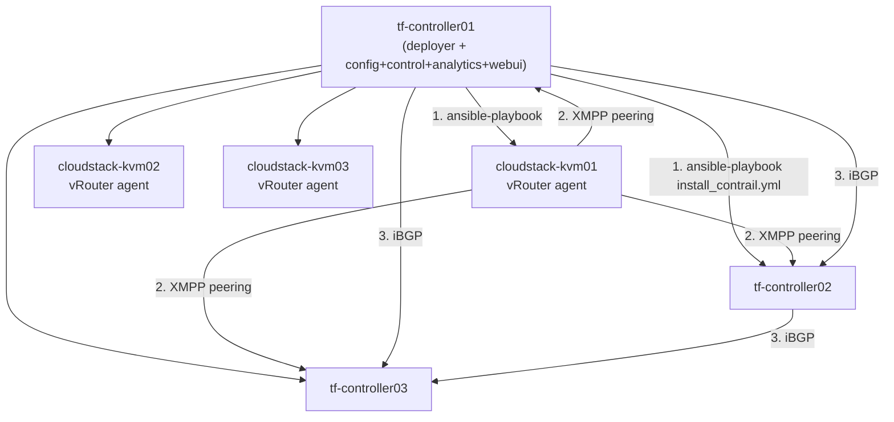

---
tags:
  - cloudstack
  - lab
  - networking
  - sdn
  - tungsten-fabric
---

# Tungsten Fabric - Triển khai SDN Controller cho CloudStack

- **Bối cảnh và vấn đề**: Advanced Zone của CloudStack cần một cơ chế isolation cho Guest network. VLAN truyền thống giới hạn 4094 network và không có control plane tập trung; native VXLAN của CloudStack tốt hơn về số lượng network nhưng vẫn thiếu các tính năng SDN nâng cao (distributed routing/firewall theo policy, overlay quản lý tập trung qua BGP/XMPP). Tungsten Fabric (TF) cung cấp lớp SDN đầy đủ, mã nguồn mở, có plugin tích hợp chính thức với CloudStack cho hypervisor KVM. Lý do đầy đủ và đánh đổi so với VXLAN/OVS thuần nằm ở phần [Quyết định kiến trúc](#quyết-định-kiến-trúc---vì-sao-chọn-tungsten-fabric) bên dưới.
- **Cách giải quyết**: Dựng cụm TF controller 3 node (config + control + analytics + webui converged trên cùng node, theo đúng tinh thần cost-conscious của cả series) bằng `ansible-deployer` chính thức của dự án Tungsten Fabric, sau đó triển khai vRouter agent lên 3 KVM Compute Node đã chuẩn bị ở [[CloudStack Compute Node - Chuẩn bị KVM Hypervisor Host]] — vRouter chiếm interface Guest overlay đã để trống sẵn ở lab đó.
- **Kết quả sau khi hoàn thành**: Cụm TF ở trạng thái tất cả service `active` (`contrail-status`), vRouter agent trên 3 compute node peer XMPP thành công với 3 control node. Đây là hạ tầng SDN sẵn sàng để [[CloudStack Advanced Zone - Triển khai Network SDN và Storage]] đăng ký làm Network Service Provider cho Zone.

> [!NOTE]
> Tungsten Fabric là dự án cộng đồng, công cụ triển khai (`ansible-deployer`) và tên image container có thể thay đổi giữa các release. Các lệnh trong lab này thể hiện đúng **kiến trúc và trình tự** đã được tài liệu hoá ổn định qua nhiều năm, nhưng hãy đối chiếu lại tên repo/tag image chính xác tại trang chính thức [tungstenfabric.org](https://tungstenfabric.org) trước khi chạy — đánh dấu bằng `> [!TODO]` ở từng chỗ cần xác nhận.

> [!NOTE]
> Lab này **chỉ dựng hạ tầng TF**, chưa đụng tới CloudStack. Bước đăng ký TF làm Network Service Provider và tạo Physical Network dùng TF nằm ở [[CloudStack Advanced Zone - Triển khai Network SDN và Storage]].

## Quyết định kiến trúc - Vì sao chọn Tungsten Fabric

- **Advanced Zone không bắt buộc phải có SDN controller.** Isolation method cho Guest network là một lựa chọn độc lập với kiến trúc Zone: `VLAN` thuần (giới hạn 4094, do physical fabric xử lý — vẫn là Advanced Zone hợp lệ, không cần SDN gì cả), `VXLAN` (plugin native của CloudStack, mở namespace lên 16M nhưng vẫn chỉ là data-plane), hoặc cắm hẳn một SDN controller (Tungsten Fabric, Nuage, NSX...). Phần lớn CloudStack production hiện tại chạy VLAN hoặc VXLAN thuần, không SDN — lab này chủ động đi nhánh thứ ba.

- **VXLAN plugin native chỉ đổi encapsulation, không có control plane.** CloudStack tự tạo interface `vxlan<VNI>` trên Linux bridge cho từng guest network, nhưng không có cơ chế nào học route hộ: traffic broadcast/unknown-unicast (BUM) phải dựa vào multicast PIM ở underlay switch (nhiều DC không muốn bật) hoặc danh sách unicast peer khai tay. Routing giữa các tier trong cùng 1 VPC luôn phải hairpin qua **1 VM Virtual Router** — VXLAN chỉ giải quyết bài toán "hết VLAN ID", không giải quyết bài toán scale/performance routing.

- **Security ở Advanced Zone (VPC) chỉ còn ACL trên VR.** Security Group — cơ chế cô lập theo policy, distributed — chỉ dùng được ở Basic Zone hoặc Advanced Zone không-VPC. Một khi cần multi-tier (VPC/isolated network), toàn bộ security phụ thuộc Network ACL cấu hình trên đúng 1 VM VR: một điểm quản lý, cũng là một điểm nghẽn.

- **Tungsten Fabric giải quyết cả 2 khoảng trống trên.** `vRouter` agent chạy trên từng compute node, học route qua XMPP từ Control Node theo đúng kiến trúc MPLS L3VPN/EVPN — routing giữa network/tier diễn ra ngay tại hypervisor nguồn, không hairpin qua VR. Network policy gắn theo tag/object và được enforce distributed trên mọi node, không còn phụ thuộc 1 VM ACL duy nhất. TF còn có BGP gateway thật (peer trực tiếp với router vật lý, mở đường cho multi-DC) và analytics node built-in cho visibility flow-level — hai thứ VXLAN plugin không có.

- **TF chính là câu trả lời SDN mà OpenStack dùng cho cùng bài toán.** Tiền thân OpenContrail được Juniper xây riêng làm backend SDN cho Neutron, nay là dự án độc lập thuộc Linux Foundation Networking. Bản chất lựa chọn ở đây giống hệt lựa chọn bên OpenStack: Neutron ML2/OVS + VXLAN thuần (tương đương VXLAN plugin của CloudStack) so với Neutron cắm Contrail/TF làm backend (tương đương nhánh lab này). Đưa TF vào CloudStack là mang nguyên kiến trúc SDN cấp enterprise mà OpenStack production hay dùng sang, thay vì tự giới hạn ở mức data-plane thuần.

- **Đánh đổi cần chấp nhận.** TF kéo theo một cụm control/config/analytics riêng (Cassandra/Zookeeper/RabbitMQ) — thêm hạ tầng, thêm vận hành/HA/patch so với VXLAN plugin (không cần thêm hạ tầng gì, chỉ là tính năng có sẵn của Linux bridge). Nếu không thật sự cần distributed routing, microsegmentation, hay BGP gateway/multi-DC, VXLAN hoặc thậm chí VLAN thuần vẫn là lựa chọn hợp lý hơn — đơn giản, ít thành phần để vận hành sai. Lab này chọn TF vì series nhắm tới kiến trúc production đầy đủ tính năng, không phải vì VXLAN plugin "kém" cho mọi quy mô.

## Prerequisites

- **Hạ tầng**: [[CloudStack Compute Node - Chuẩn bị KVM Hypervisor Host]] đã hoàn tất — 3 KVM host có sẵn interface Guest overlay ở trạng thái `UP`, chưa gán IP/bridge.
- **Máy chủ / VM**: 3 node controller mới (không dùng chung với MS/DB/Ceph để tránh cạnh tranh tài nguyên với Cassandra/RabbitMQ vốn khá nặng CPU/IO) + tái sử dụng 3 KVM host đã có từ lab trước cho vai trò vRouter. Cấu hình ví dụ:

  | Node | Vai trò | CPU | RAM | Disk |
  | --- | --- | --- | --- | --- |
  | tf-controller01/02/03 | config + control + analytics + webui (converged) | 8 vCPU | 32 GB | 200 GB SSD (Cassandra I/O nhạy, ưu tiên SSD) |
  | cloudstack-kvm01/02/03 | vRouter agent (tái sử dụng từ lab Compute Node) | — | — | — |

- **Tài khoản và quyền**: sudo trên cả 3 controller node và 3 KVM host; 1 node trong 3 controller đóng vai trò "deployer" (chạy Ansible điều phối cả cụm) cần SSH key tới toàn bộ node còn lại, kể cả 3 KVM host.
- **Mạng**: dải Management network cho TF controller, và interface Guest overlay trên KVM host (đã chuẩn bị ở lab trước) — đặt placeholder ở Planning table. MTU khuyến nghị 9000 trên interface overlay để chứa overhead encapsulation MPLSoUDP/VXLAN mà không phân mảnh gói tin.
- **Kiến thức nền**: giả định đã đọc [[CloudStack Network Architecture Overview]] và [[Basic vs Advanced Networking]] trong vault này; không giải thích lại khái niệm SDN/overlay từ đầu.

> [!WARNING]
> Cụm TF điều khiển toàn bộ Guest network traffic của Zone sau này — nếu cả 3 control node cùng down, VM đang chạy vẫn sống (dataplane vRouter vẫn forward theo route đã học), nhưng **không học được route mới**: VM mới deploy hoặc thay đổi network sẽ không có kết nối cho tới khi control plane phục hồi.

## Thông tin Planning liên quan

| Thành phần | Giá trị | Ghi chú |
| --- | --- | --- |
| tf-controller01/02/03 hostname/IP | `<TBD>` | config + control + analytics + webui |
| Node deployer | `tf-controller01` | Chạy Ansible điều phối, cần SSH tới toàn cụm |
| Management network CIDR (TF) | `<TBD>` | API, XMPP, BGP, Cassandra/Zookeeper/RabbitMQ nội bộ |
| Guest overlay interface trên KVM host | Tham chiếu [[CloudStack Compute Node - Chuẩn bị KVM Hypervisor Host]] Bước 5 | vRouter sẽ tạo `vhost0` chiếm interface này |
| MTU Guest overlay | `9000` | Tránh phân mảnh gói tin đã encapsulate |
| TF release | `<xác nhận tại tungstenfabric.org, ghi rõ container image tag đã test>` | Pin version cụ thể, không dùng tag `latest` cho production |
| Container registry | `<TBD - registry nội bộ nếu không cho phép pull trực tiếp từ internet>` | Cân nhắc mirror image nội bộ cho môi trường production cô lập |
| `AAA_MODE` Config API | `<xác nhận tuỳ version — mặc định nhiều bản là no-auth>` | Ảnh hưởng trực tiếp tới hardening ở Bước 5 |

## Diagram



---

## Installation

### Bước 1 - Chuẩn bị hệ điều hành và Docker trên toàn bộ node

- Thực hiện trên cả 3 controller node và 3 KVM host: hostname, `/etc/hosts`, NTP, firewall baseline (giống pattern các lab trước):

```bash
sudo hostnamectl set-hostname <hostname-theo-planning-table>
sudo apt update && sudo apt install -y chrony ufw
sudo systemctl enable chrony --now
sudo ufw default deny incoming
sudo ufw default allow outgoing
sudo ufw allow from <management-cidr> to any port 22 proto tcp
sudo ufw enable
```

- Cài Docker CE — `ansible-deployer` của Tungsten Fabric dùng Docker container cho từng service, khác với Podman đã dùng ở lab Ceph:

```bash
sudo apt install -y ca-certificates curl
sudo install -m 0755 -d /etc/apt/keyrings
sudo curl -fsSL https://download.docker.com/linux/ubuntu/gpg -o /etc/apt/keyrings/docker.asc
sudo chmod a+r /etc/apt/keyrings/docker.asc
echo "deb [arch=$(dpkg --print-architecture) signed-by=/etc/apt/keyrings/docker.asc] https://download.docker.com/linux/ubuntu $(. /etc/os-release && echo $VERSION_CODENAME) stable" | \
  sudo tee /etc/apt/sources.list.d/docker.list > /dev/null
sudo apt update
sudo apt install -y docker-ce docker-ce-cli containerd.io
sudo systemctl enable docker --now
```

> [!NOTE]
> Docker daemon mặc định expose API qua unix socket cục bộ (an toàn) — không bật `-H tcp://0.0.0.0` trừ khi thật sự cần quản trị Docker từ xa, và nếu cần, luôn kèm TLS client certificate.

- Kiểm tra kết quả bước này:

```bash
sudo docker run --rm hello-world
```

Kết quả mong đợi: container chạy thành công, in ra thông báo "Hello from Docker!".

### Bước 2 - Cấu hình SSH cho node deployer

> [!NOTE]
> Khác với các lab trước (Ceph dùng `ceph-adm`, Control Plane thao tác qua `sudo`), lab này dùng thẳng `root` cho SSH giữa các node — vì `ansible-deployer` cần quyền root thật trên cả 3 KVM host để tạo interface `vhost0`, bind lại NIC vật lý vào vRouter và quản lý Docker, không chỉ chạy lệnh qua `sudo` từng phần như các lab khác. Chạy toàn bộ Bước 2-4 **khi đã là `root`** trên `tf-controller01` (không phải user thường rồi `sudo` từng lệnh) để `~/.ssh/tf-deployer-key` khớp đúng đường dẫn `/root/.ssh/tf-deployer-key` khai báo trong `instances.yaml` ở Bước 3.

- Trên `tf-controller01` (deployer, đang là `root`), sinh SSH key và copy sang toàn bộ node còn lại kể cả 3 KVM host:

```bash
ssh-keygen -t ed25519 -f /root/.ssh/tf-deployer-key -N ""
for h in tf-controller02 tf-controller03 cloudstack-kvm01 cloudstack-kvm02 cloudstack-kvm03; do
  ssh-copy-id -i /root/.ssh/tf-deployer-key.pub root@$h
done
```

- Kiểm tra kết quả bước này:

```bash
ssh -i /root/.ssh/tf-deployer-key root@cloudstack-kvm01 hostname
```

Kết quả mong đợi: SSH chạy được không hỏi password.

### Bước 3 - Chuẩn bị `ansible-deployer` và khai báo `instances.yaml`

> [!TODO]
> Xác nhận URL repo chính thức và tag version tại thời điểm triển khai — dự án có thể đã đổi tên/repo kể từ lúc viết lab này.

- Clone `ansible-deployer` trên `tf-controller01`:

```bash
git clone <url-repo-ansible-deployer-chính-thức-tungsten-fabric> tf-deployer
cd tf-deployer
```

- Khai báo `instances.yaml` — gán role `config,control,analytics,webui` cho 3 controller node, role `vrouter` cho 3 KVM host, chỉ định đúng interface Guest overlay đã chuẩn bị sẵn làm `PHYSICAL_INTERFACE` của vRouter:

```yaml
provider_config:
  bms:
    ssh_pwd: null
    ssh_user: root
    ssh_key: /root/.ssh/tf-deployer-key
    ntpserver: <ntp-server-nội-bộ>

instances:
  tf-controller01:
    provider: bms
    ip: <ip-tf-controller01>
    roles:
      config_database: null
      config: null
      control: null
      analytics_database: null
      analytics: null
      webui: null
  tf-controller02:
    provider: bms
    ip: <ip-tf-controller02>
    roles:
      config_database: null
      config: null
      control: null
      analytics_database: null
      analytics: null
      webui: null
  tf-controller03:
    provider: bms
    ip: <ip-tf-controller03>
    roles:
      config_database: null
      config: null
      control: null
      analytics_database: null
      analytics: null
      webui: null
  cloudstack-kvm01:
    provider: bms
    ip: <ip-cloudstack-kvm01>
    roles:
      vrouter:
        PHYSICAL_INTERFACE: <nic-guest-overlay-kvm01>
  cloudstack-kvm02:
    provider: bms
    ip: <ip-cloudstack-kvm02>
    roles:
      vrouter:
        PHYSICAL_INTERFACE: <nic-guest-overlay-kvm02>
  cloudstack-kvm03:
    provider: bms
    ip: <ip-cloudstack-kvm03>
    roles:
      vrouter:
        PHYSICAL_INTERFACE: <nic-guest-overlay-kvm03>

contrail_configuration:
  CLOUD_ORCHESTRATOR: none
  CONTRAIL_VERSION: <tag-image-đã-xác-nhận>
  CONTROLLER_NODES: <ip-tf-controller01>,<ip-tf-controller02>,<ip-tf-controller03>
```

> [!NOTE]
> `CLOUD_ORCHESTRATOR: none` vì cụm này tích hợp trực tiếp với CloudStack qua plugin riêng, không đi qua Neutron/OpenStack hay Kubernetes — TF chỉ đóng vai trò SDN backend thuần, CloudStack Management Server gọi thẳng vào TF Config API.

- Kiểm tra kết quả bước này:

```bash
ansible-inventory -i instances.yaml --list
```

Kết quả mong đợi: liệt kê đủ 6 node với đúng role đã khai báo, không lỗi cú pháp YAML.

### Bước 4 - Triển khai cụm Tungsten Fabric

- Chạy playbook cài đặt (provision Docker nếu thiếu, pull image, khởi tạo toàn bộ service theo role):

```bash
ansible-playbook -i instances.yaml playbooks/install_contrail.yml
```

> [!WARNING]
> Bước này pull nhiều container image (Cassandra, Zookeeper, RabbitMQ, Redis, các service TF...) — cần đường truyền internet ổn định hoặc registry nội bộ đã mirror sẵn. Nếu môi trường production bị cô lập internet, chuẩn bị registry nội bộ trước khi chạy, khai báo qua `container_registry` trong `instances.yaml`.

- Kiểm tra kết quả bước này trên từng controller node:

```bash
sudo docker exec $(sudo docker ps -qf name=config-api | head -n1) contrail-status
```

> [!NOTE]
> Không dùng `-it` cho lệnh kiểm tra one-shot này — `-it` cấp phát pseudo-TTY, chỉ cần thiết khi attach vào shell tương tác; chạy qua SSH không tương tác (như ở mục Kiểm tra kết quả cuối bài) mà vẫn giữ `-it` thường lỗi kiểu "the input device is not a TTY". `| head -n1` phòng trường hợp filter theo tên khớp nhiều hơn 1 container.

Kết quả mong đợi: toàn bộ service liệt kê ở trạng thái `active`, không có dòng `initializing`/`failed` kéo dài quá vài phút.

### Bước 5 - Hardening Config API và Analytics API

TF Config API (port `8082`/`8143`) ở chế độ `no-auth` mặc định trên nhiều bản triển khai ngoài OpenStack/Kubernetes — nghĩa là **bất kỳ ai reach được port này đều có toàn quyền đọc/ghi cấu hình mạng**, không có username/password. Đây là điểm hardening quan trọng nhất của cụm TF trong bối cảnh tích hợp CloudStack (không có Keystone đứng trước để xác thực hộ).

> [!TODO]
> Xác nhận cơ chế AAA hiện có của version TF đang triển khai (`AAA_MODE`, hỗ trợ local RBAC hay chỉ Keystone) tại tài liệu chính thức — nếu bản đang dùng hỗ trợ RBAC cục bộ, bật thay vì chỉ dựa vào firewall.

> [!TODO]
> Số port bên dưới (`8082` Config API, `8143`/`8080` WebUI, `9041`) là số port phổ biến qua các bản Contrail/TF cũ hơn nhưng **chưa được xác minh lại cho đúng version đang triển khai** — có khả năng `8143` thực chất là WebUI HTTPS chứ không phải Config API HTTPS (Config API nhiều bản chỉ chạy HTTP thuần trên `8082`, không có cổng HTTPS riêng). Đối chiếu lại đúng port trong `contrail-status`/tài liệu chính thức trước khi áp dụng rule production — mở nhầm cổng nghĩa là hoặc chặn nhầm chức năng cần, hoặc mở lộ chức năng không nên mở.

- Trong lúc chưa xác nhận được cơ chế AAA phù hợp, giới hạn chặt bằng firewall: Config API và Analytics API chỉ được reach từ chính các controller node và từ VIP Management Server (đã dựng ở [[CloudStack Control Plane - Triển khai Management Server HA và Galera Database]]) — không mở cho toàn bộ Management network:

```bash
sudo ufw allow from <vip-control-plane>,<ip-ms01>,<ip-ms02> to any port 8082,8143 proto tcp comment 'TF config API - chi cho CloudStack MS'
sudo ufw allow from <tf-controller-cidr-nội-bộ> to any port 8082,8143,9041,9042,5672,2181,2888,3888 proto tcp comment 'TF internal services - chi trong cum controller'
sudo ufw allow from <tf-controller-cidr-nội-bộ>,<kvm-guest-overlay-cidr> to any port 179,5269 proto tcp comment 'BGP + XMPP'
sudo ufw allow from <management-cidr> to any port 8080,8143 proto tcp comment 'TF webui'
```

> [!WARNING]
> Cassandra (`9042`), Zookeeper (`2181/2888/3888`), RabbitMQ (`5672`) là các service nội bộ của cụm TF — tuyệt đối không expose ra ngoài `<tf-controller-cidr-nội-bộ>`. Những service này không có xác thực mạnh theo mặc định và là mục tiêu tấn công trực tiếp vào state của toàn bộ SDN nếu bị reach từ ngoài.

- Bật TLS cho webui (nếu chưa mặc định bật) bằng certificate từ internal CA thay vì self-signed, cấu hình qua biến `WEBUI_SSL_CERT_FILE`/`WEBUI_SSL_KEY_FILE` trong `contrail_configuration` của `instances.yaml`, chạy lại `install_contrail.yml` để áp dụng.

- Kiểm tra kết quả bước này:

```bash
curl -k https://<ip-tf-controller01>:8143/virtual-networks
```

Chạy lệnh trên từ một máy **ngoài** danh sách được allow ở firewall — kết quả mong đợi: connection timeout/refused. Chạy lại từ VIP Management Server — kết quả mong đợi: trả về JSON danh sách virtual network (rỗng vì chưa tích hợp CloudStack).

## Kiểm tra kết quả

- Xác nhận toàn bộ service TF trên cả 3 controller node đều `active`:

```bash
for h in tf-controller01 tf-controller02 tf-controller03; do
  echo "== $h =="
  ssh -i ~/.ssh/tf-deployer-key root@$h "sudo docker exec \$(sudo docker ps -qf name=config-api | head -n1) contrail-status"
done
```

- Xác nhận vRouter agent trên cả 3 KVM host đã peer XMPP với control node:

```bash
for h in cloudstack-kvm01 cloudstack-kvm02 cloudstack-kvm03; do
  echo "== $h =="
  ssh -i ~/.ssh/tf-deployer-key root@$h "sudo docker exec \$(sudo docker ps -qf name=vrouter-agent | head -n1) contrail-status"
done
```

  | Hạng mục cần kiểm tra | Cách kiểm tra | Kết quả đúng |
  | --- | --- | --- |
  | Toàn bộ service controller | `contrail-status` trên từng controller node | Tất cả `active` |
  | vRouter agent | `contrail-status` trên từng KVM host | `vrouter-agent: active`, thấy `vhost0` interface |
  | XMPP peering | `contrail-status` chi tiết trên vRouter | Control node hiển thị connected, không `down` |
  | Config API chỉ reach được từ MS | `curl -k https://<tf-controller>:8143/virtual-networks` từ máy ngoài whitelist | Timeout/refused |

## Troubleshooting

Không áp dụng - lab dựng mới theo hướng dẫn triển khai chuẩn, chưa có log lỗi thực tế phát sinh trong quá trình build để ghi nhận.

## Rollback

> [!TODO]
> Tên playbook uninstall bên dưới (`uninstall_vrouter.yml`, `uninstall_contrail.yml`) viết theo quy ước đặt tên của `ansible-deployer`, **chưa xác minh lại có tồn tại đúng tên này trong repo/version đang dùng** — cùng mức độ chưa chắc chắn như đã nêu ở Bước 3. Đối chiếu `ls playbooks/` trong repo đã clone trước khi chạy, một số version chỉ có 1 playbook cleanup chung thay vì tách riêng theo role.

- Gỡ vRouter khỏi từng KVM host trước (trả interface Guest overlay về trạng thái ban đầu):

```bash
ansible-playbook -i instances.yaml playbooks/uninstall_vrouter.yml --limit cloudstack-kvm01,cloudstack-kvm02,cloudstack-kvm03
```

- Gỡ toàn bộ cụm controller:

```bash
ansible-playbook -i instances.yaml playbooks/uninstall_contrail.yml
```

> [!CAUTION]
> Gỡ cụm TF trong khi Zone CloudStack đang dùng TF làm Network Service Provider sẽ làm toàn bộ Guest network mất khả năng học route mới ngay lập tức, và nếu gỡ luôn dữ liệu Cassandra (`config_database`/`analytics_database`), toàn bộ định nghĩa virtual-network/policy đã tạo qua CloudStack sẽ mất, không thể khôi phục nếu chưa backup. Chỉ rollback sau khi đã gỡ TF khỏi CloudStack ở [[CloudStack Advanced Zone - Triển khai Network SDN và Storage]].

## Reference

- [Tungsten Fabric - Official Documentation](https://tungstenfabric.org)
- [Tungsten Fabric - Architecture Overview](https://tungstenfabric.org/architecture/)
- [Apache CloudStack - Tungsten-Fabric Integration Guide](https://docs.cloudstack.apache.org/en/latest/plugins/tungsten.html)
- Ghi chú liên quan trong vault: [[CloudStack Network Architecture Overview]] | [[Basic vs Advanced Networking]] | [[Virtual Router Deep Dive]]
