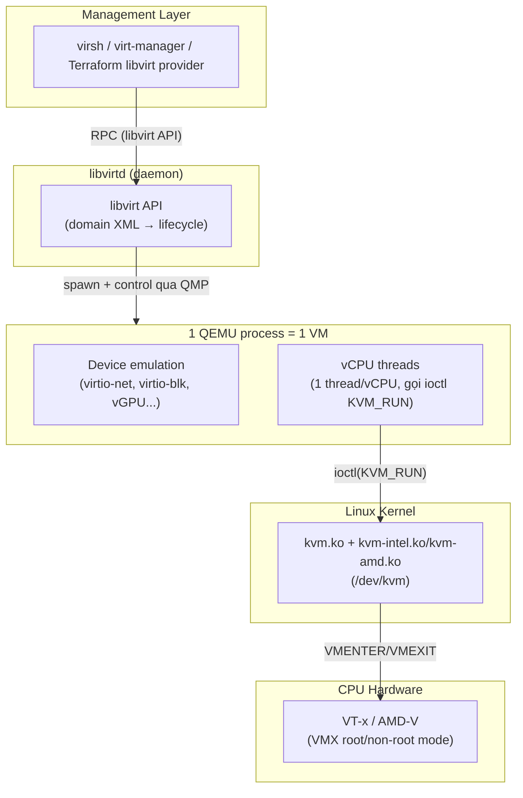

---
tags:
  - virtualization
  - kvm
  - overview
aliases:
  - KVM Overview
  - KVM Index
---

# KVM Virtualization

**KVM (Kernel-based Virtual Machine)** không phải một hypervisor độc lập như ESXi — nó là **một kernel module Linux** (`kvm.ko` + `kvm-intel.ko`/`kvm-amd.ko`) biến Linux thành type-1 hypervisor bằng cách lộ ra `/dev/kvm` để userspace dùng hardware virtualization extension (VT-x/AMD-V) của CPU. Một VM KVM thực tế là **3 lớp chồng lên nhau**: kernel module KVM (thực thi vCPU), QEMU (emulate device, làm userspace process đại diện cho VM), và libvirt (management API/CLI đứng trên QEMU để không phải gọi tay `qemu-system-x86_64` với hàng chục flag).

> [!tip] Nếu bạn quen VMware ESXi
> ESXi là một OS độc lập (VMkernel) cài thẳng lên bare-metal, mọi thứ (scheduler, storage stack, network stack) đều do VMkernel tự viết lại. KVM **không thay thế Linux** — nó biến **Linux sẵn có** (Ubuntu, RHEL, bất kỳ distro nào) thành hypervisor. Nghĩa là mọi thứ bạn biết về Linux (systemd, cgroups, iptables/nftables, LVM, tuning kernel) đều áp dụng trực tiếp lên host KVM — không có "VMkernel riêng" nào tách biệt. Đây là khác biệt tư duy lớn nhất khi chuyển từ ESXi sang KVM.

## Bản đồ kiến thức

```mermaid
graph TD
    K[KVM Virtualization] --> PRE[Prerequisites]
    K --> KK[kvm-kernel]
    K --> QE[quemu]
    K --> LV[libvir]
    K --> NET[networking]
    K --> ST[storage]
    K --> PERF[performance-tunning]
    K --> SEC[security]
    K --> OPS[operations]
    K --> CMP[comparison]

    KK --> KKM[KVM Kernel Module & Hardware Virt Extensions]
    KK --> EPT[Memory Virtualization - EPT & NPT]
    KK --> VCPU[vCPU Threads & Scheduling]

    QE --> QPM[QEMU Process Model & Machine Types]
    QE --> QMP[QEMU Monitor - QMP & HMP]
    QE --> VIRTIO[Virtio Devices]
    QE --> QCOW[Disk Image Formats - qcow2 vs raw]

    LV --> LVA[Libvirt Architecture & Domain XML]
    LV --> VIRSH[Virsh Cheatsheet]
    LV --> LVSTOR[Libvirt Storage Pools & Volumes]
    LV --> MIG[Live Migration]

    NET --> BR[Linux Bridge & NAT Networking]
    NET --> MACVTAP[Macvtap & SR-IOV Passthrough]
    NET --> OVS[Open vSwitch Integration]

    ST --> SBACK[Storage Backends Overview]
    ST --> SNAP[Snapshots & Backup]
    ST --> RBD[Ceph RBD with KVM]

    PERF --> CPUPIN[CPU Pinning & NUMA]
    PERF --> HUGE[Hugepages & Memory Tuning]
    PERF --> IOTUNE[IO Tuning - Cache Modes & IOThreads]
    PERF --> VFIO[Device Passthrough - VFIO & GPU]

    SEC --> SVIRT[sVirt - SELinux & AppArmor Isolation]
    SEC --> ISO[Guest Isolation & Attack Surface]

    OPS --> MON[Monitoring & Troubleshooting]
    OPS --> D2[Day 2 Operations Cheatsheet]

    CMP --> VSXEN[KVM vs Xen vs ESXi vs Hyper-V]
```



## Kiến trúc 3 lớp — điều quan trọng nhất cần hiểu trước tiên



> [!info] Đọc sơ đồ này thế nào
> - **libvirt không chạy VM** — nó chỉ sinh ra và điều khiển QEMU process (qua fork/exec + QMP socket). Nếu `libvirtd` chết, VM đang chạy **không bị ảnh hưởng** (QEMU process vẫn sống độc lập) — chỉ là bạn tạm mất khả năng quản lý qua `virsh` cho tới khi libvirtd lên lại.
> - **Mỗi VM = 1 QEMU process, mỗi vCPU = 1 thread trong process đó.** Linux scheduler (CFS) tự lo việc xếp các thread này lên CPU vật lý — đây là lý do tuning CPU pinning/NUMA (xem [[CPU Pinning & NUMA]]) tác động trực tiếp tới hiệu năng VM.
> - **KVM kernel module chỉ làm 1 việc: chạy vCPU qua VMX non-root mode.** Mọi I/O (disk, network) đều được QEMU emulate ở userspace rồi trap ngược vào kernel — đây là lý do virtio (paravirtualized driver) quan trọng: nó giảm số lần VMEXIT/VMENTER cho I/O, xem [[Virtio Devices]].

## Thành phần cốt lõi

| Thành phần | Vai trò | Chạy ở đâu |
|---|---|---|
| [[KVM Kernel Module & Hardware Virtualization Extensions\|kvm.ko]] | Thực thi vCPU qua VT-x/AMD-V, quản lý VMCS/VMCB | Kernel space |
| **QEMU** | Emulate device, làm "cơ thể" của VM (1 process/VM) | Userspace, host |
| **libvirtd** | Management daemon — domain XML, lifecycle, API thống nhất đa hypervisor | Userspace, host |
| [[Virtio Devices\|virtio]] | Paravirtualized driver (net/blk/scsi/balloon) — I/O nhanh hơn full emulation | Guest + QEMU |

## kvm-kernel

- [[KVM Kernel Module & Hardware Virtualization Extensions]] — kvm.ko, /dev/kvm, VT-x/AMD-V, VMCS/VMCB
- [[Memory Virtualization - EPT & NPT]] — second-level address translation, vì sao không cần shadow paging nữa
- [[vCPU Threads & Scheduling]] — vCPU = thread, CFS scheduler, vcpupin

## quemu

- [[QEMU Process Model & Machine Types]] — 1 VM = 1 process, machine type (q35/pc), CPU model
- [[QEMU Monitor - QMP & HMP]] — giao tiếp runtime với QEMU process đang chạy
- [[Virtio Devices]] — virtio-net/blk/scsi/balloon, vhost-net/vhost-user
- [[Disk Image Formats - qcow2 vs raw]] — qcow2 internal snapshot, backing file, cluster size

## libvir

- [[Libvirt Architecture & Domain XML]] — libvirtd, driver model, cấu trúc domain XML
- [[Virsh Cheatsheet]] — lệnh quản lý domain/network/storage hay dùng nhất
- [[Libvirt Storage Pools & Volumes]] — abstraction của libvirt trên storage backend thật
- [[Live Migration]] — cơ chế migrate VM giữa host, yêu cầu shared storage/network

## networking

- [[Linux Bridge & NAT Networking]] — virbr0, NAT (default) vs bridged (production)
- [[Macvtap & SR-IOV Passthrough]] — bypass bridge để giảm latency/CPU overhead
- [[Open vSwitch Integration]] — khi cần VLAN/tunnel phức tạp hơn Linux bridge thuần

## storage

- [[Storage Backends Overview]] — local disk, NFS, iSCSI, LVM, Ceph RBD — chọn gì khi nào
- [[Snapshots & Backup]] — external snapshot, blockcommit, virsh backup
- [[Ceph RBD with KVM]] — dùng chung hạ tầng Ceph đã ghi ở [[Ceph|Ceph vault]] cho KVM/CloudStack

## performance-tunning

- [[CPU Pinning & NUMA]] — vcpupin, NUMA topology, vì sao "free lunch" hết khi multi-socket
- [[Hugepages & Memory Tuning]] — giảm TLB miss, bắt buộc cho workload latency-sensitive
- [[IO Tuning - Cache Modes & IOThreads]] — cache=none/writeback, aio=native/io_uring, iothreads
- [[Device Passthrough - VFIO & GPU]] — PCI passthrough, IOMMU groups, GPU passthrough

## security

- [[sVirt - SELinux & AppArmor Isolation]] — MAC bắt buộc cách ly QEMU process
- [[Guest Isolation & Attack Surface]] — VM escape, side-channel, hardening checklist

## operations

- [[Monitoring & Troubleshooting]] — log libvirt/QEMU, virt-top, symptom-based debug
- [[Day 2 Operations Cheatsheet]] — backup, resize, add device, snapshot thường ngày

## comparison

- [[KVM vs Xen vs ESXi vs Hyper-V]] — khi nào chọn KVM, đánh đổi gì

## Prerequisites

[[Kvm Prerequisites]] — kiến thức nền Linux/x86 cần có trước khi đi sâu vào KVM

## Phiên bản & ngữ cảnh

Ghi chú này viết trong ngữ cảnh **KVM trên Linux hiện đại (kernel 6.x, QEMU 8.x/9.x, libvirt 10.x)**, dùng qua `libvirtd` (mô hình client/server truyền thống — chưa xét mô hình `virtqemud` modular mới của libvirt 8+, nếu môi trường bàn giao dùng bản libvirt mới cần kiểm tra lại). Đây cũng là hypervisor nền của Apache CloudStack — xem thêm [[Hypervisor Support - KVM, VMware & Others]] trong vault CloudStack để nối kiến thức 2 bên.

```bash
# Kiểm tra host có hỗ trợ hardware virtualization không (bắt buộc trước khi làm bất cứ gì)
egrep -c '(vmx|svm)' /proc/cpuinfo   # >0 = CPU hỗ trợ VT-x (vmx) hoặc AMD-V (svm)
lsmod | grep kvm                     # kvm_intel hoặc kvm_amd đã load chưa
virsh version                        # version libvirt + QEMU đang chạy
```

> [!warning] Đọc trước khi làm bất cứ điều gì trên hệ thống bàn giao
> Xác nhận 3 điều trước khi động vào: (1) host có nested virtualization hay không nếu đang test trong VM, (2) hypervisor này có đang được orchestrate bởi CloudStack/OpenStack không (nếu có — **đừng sửa tay** qua `virsh` vì sẽ lệch state với DB của orchestrator, xem [[Hypervisor Support - KVM, VMware & Others]]), (3) storage backend thật là gì (local LVM? NFS? Ceph RBD?) vì quyết định gần hết cách debug I/O sau này.
