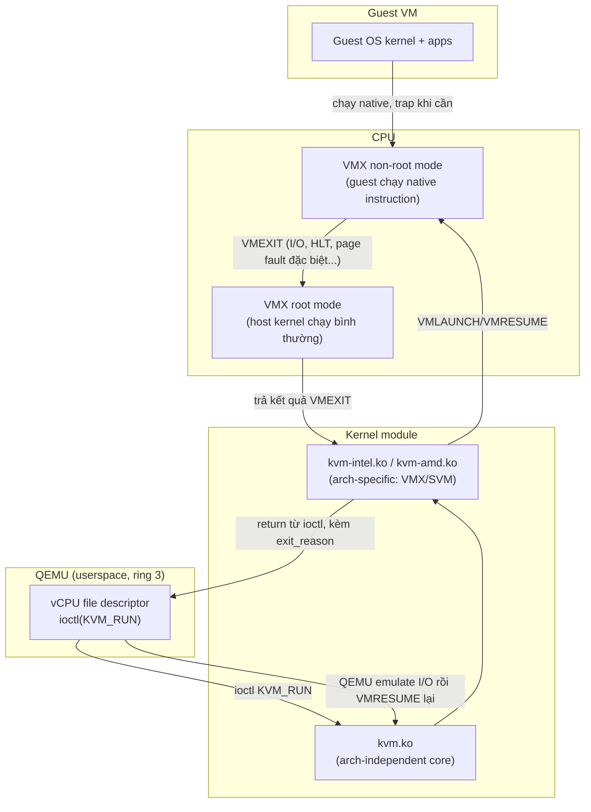

---
tags:
  - kvm
  - kernel
  - architecture
---

# KVM Kernel Module & Hardware Virtualization Extensions

**KVM (`kvm.ko`)** là kernel module biến Linux thành hypervisor bằng cách lộ ra device node `/dev/kvm` cho userspace (QEMU) mở và điều khiển vCPU qua `ioctl()`. Bản thân `kvm.ko` **không emulate device gì cả** — nó chỉ làm đúng 1 việc: chạy vCPU trong "non-root mode" của CPU, bắt các sự kiện cần xử lý (VMEXIT) và trả quyền lại cho QEMU khi cần emulate I/O.

> [!tip] So với ESXi/VMkernel
> VMkernel là một hypervisor độc lập tự viết toàn bộ (scheduler, memory manager, device driver riêng). KVM **tận dụng lại toàn bộ Linux kernel đã có** (scheduler CFS, memory management, device driver) và chỉ thêm phần lõi "chạy được vCPU" — đây là lý do KVM code base nhỏ hơn nhiều so với ESXi hoặc Xen (không cần viết lại scheduler/memory manager từ đầu).

## Why — vì sao cần kernel module riêng, không làm thuần software?

x86 truyền thống có một số instruction "nhạy cảm" (sensitive nhưng không privileged theo đúng nghĩa) khiến kỹ thuật trap-and-emulate cổ điển không hoạt động hoàn hảo — phần mềm hypervisor thuần (như VMware thời trước 2006, hay QEMU chạy standalone không KVM) phải dùng **binary translation** để dò và thay thế các instruction này, rất tốn CPU. Intel (VT-x, 2006) và AMD (AMD-V/SVM, 2006) giải quyết vấn đề này ở tầng **hardware**: thêm một mode CPU mới cho phép guest chạy native instruction trực tiếp trên CPU, chỉ "bẫy" (trap) về hypervisor đúng những sự kiện cần thiết. KVM là kernel module khai thác trực tiếp tính năng hardware này.

## When — dùng khi nào / không dùng khi nào?

- **Dùng KVM khi**: CPU host hỗ trợ VT-x/AMD-V (gần như mọi CPU x86_64 server/desktop hiện đại), cần hiệu năng gần bare-metal, cần chạy Linux/Windows guest không sửa kernel.
- **Không dùng (hoặc phải cân nhắc) khi**: chạy trong môi trường cloud/VM không expose nested virtualization (một số cloud VM cỡ nhỏ tắt tính năng này), hoặc cần hypervisor type-1 độc lập không phụ thuộc Linux host (lúc đó Xen hoặc ESXi phù hợp hơn — xem [[KVM vs Xen vs ESXi vs Hyper-V]]).

## Where — vị trí trong hệ thống



## How — cơ chế hoạt động

1. QEMU mở `/dev/kvm`, tạo VM context qua `ioctl(KVM_CREATE_VM)`, tạo vCPU qua `ioctl(KVM_CREATE_VCPU)` — mỗi vCPU nhận về 1 file descriptor riêng.
2. Mỗi vCPU chạy trên **1 thread QEMU riêng** (xem [[vCPU Threads & Scheduling]]), thread này gọi `ioctl(KVM_RUN)` liên tục trong vòng lặp.
3. `KVM_RUN` khiến CPU chuyển sang **VMX non-root mode** (lệnh `VMLAUNCH`/`VMRESUME`) — guest code chạy **trực tiếp** trên CPU vật lý, tốc độ gần native.
4. Khi guest thực hiện việc cần hypervisor xử lý (I/O port, MMIO, `HLT`, một số MSR...) → **VMEXIT** tự động về root mode, `ioctl(KVM_RUN)` trả về kèm `exit_reason`.
5. QEMU đọc `exit_reason`, emulate hành vi tương ứng (VD: ghi giá trị vào virtio queue), rồi gọi lại `KVM_RUN` để tiếp tục.

**VMCS (Intel) / VMCB (AMD)** là cấu trúc dữ liệu (do CPU quản lý, host chỉ trỏ tới) lưu toàn bộ state của guest (register, control field quyết định event nào trap) — mỗi vCPU có 1 VMCS/VMCB riêng.

> [!info] VMEXIT càng nhiều = càng chậm
> Mọi lần VMEXIT đều có overhead cố định (save/restore state) dù việc xử lý sau đó nhanh hay chậm. Đây là lý do full device emulation (emulate 1 NIC Realtek giả) chậm hơn nhiều so với virtio (paravirtualized) — virtio được thiết kế để giảm số lần VMEXIT cần thiết cho mỗi request I/O, xem [[Virtio Devices]].

## Key Config — cần nhớ

```bash
# Kiểm tra CPU có hỗ trợ + kernel module đã load
egrep -c '(vmx|svm)' /proc/cpuinfo
lsmod | grep kvm
# kvm_intel hoặc kvm_amd phải xuất hiện, kèm kvm (core module)

# Kiểm tra nested virtualization (chạy KVM trong KVM) có bật không
cat /sys/module/kvm_intel/parameters/nested   # Y = bật (Intel)
cat /sys/module/kvm_amd/parameters/nested     # 1 = bật (AMD)
```

| Tham số | Ảnh hưởng | Ghi chú |
|---|---|---|
| `nested=1` (module param) | Cho phép chạy hypervisor lồng nhau (KVM-in-KVM) | Chỉ cần khi lab/CI, không cần cho production thường |
| `kvm_intel.eptad` | Bật Accessed/Dirty bit cho EPT | Mặc định on ở CPU mới, ảnh hưởng live migration dirty page tracking |

## Security Considerations

- `/dev/kvm` mặc định chỉ user thuộc group `kvm` truy cập được — không nên mở quyền rộng hơn cần thiết.
- Lỗ hổng ở tầng `kvm.ko` (hiếm nhưng đã từng xảy ra, VD một số CVE liên quan tới xử lý MSR/VMCS) có thể dẫn tới **VM escape** — luôn giữ kernel host được patch, xem thêm [[Guest Isolation & Attack Surface]].
- Nested virtualization tăng attack surface (thêm 1 tầng hypervisor lồng) — chỉ bật khi thực sự cần.

## Ops Runbook

```bash
dmesg | grep -i kvm          # lỗi load module, incompatible CPU...
journalctl -k | grep -i kvm
```

- Không có "service" riêng cho `kvm.ko` — nó là kernel module load lúc boot (qua `modprobe`/udev rule), không restart được mà không reboot (trừ khi rmmod/insmod lại khi không còn VM nào chạy).

## Gotchas & Lessons Learned

> [!warning] "CPU hỗ trợ VT-x" trên `/proc/cpuinfo` không có nghĩa là BIOS đã bật
> Flag `vmx`/`svm` trong `/proc/cpuinfo` chỉ cho biết **CPU có khả năng**, không cho biết BIOS/UEFI đã enable Intel VT-x hay AMD-V hay chưa (nhiều máy để mặc định disable, đặc biệt máy OEM/laptop doanh nghiệp). Nếu `lsmod | grep kvm` không ra gì kèm lỗi trong dmesg dạng "disabled by BIOS", việc cần làm là vào BIOS bật thủ công, không phải sửa gì ở Linux.

## Resources

- KVM kernel documentation: `Documentation/virt/kvm/` trong source tree Linux kernel
- Intel SDM Volume 3C (VMX) / AMD APM Volume 2 (SVM) — tài liệu gốc cho ai cần hiểu sâu tới mức instruction-level

---
*Xem thêm: [[Memory Virtualization - EPT & NPT]] | [[vCPU Threads & Scheduling]] | [[Kvm-virtualization|KVM Virtualization]]*
