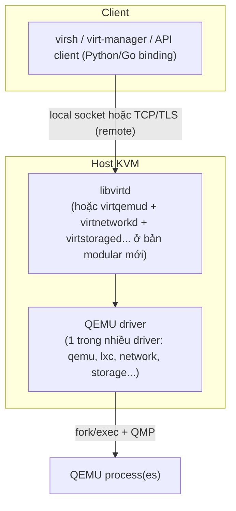

---
tags:
  - libvirt
  - architecture
---

# Libvirt Architecture & Domain XML

**Libvirt** là lớp API/management thống nhất đứng trên nhiều hypervisor khác nhau (KVM/QEMU, Xen, VMware ESX, LXC, Hyper-V ở mức hạn chế...) — mục tiêu là để công cụ phía trên (`virsh`, `virt-manager`, Terraform, OpenStack Nova, CloudStack) không cần biết chi tiết API riêng của từng hypervisor. Với KVM, libvirt hoạt động bằng cách sinh ra và điều khiển process QEMU (qua fork/exec + QMP) — libvirt **không tự chạy VM**.

> [!tip] So với vCenter
> vCenter là management plane **độc quyền** của VMware, chỉ nói chuyện với ESXi. Libvirt là management plane **đa hypervisor mở**, nhưng đổi lại **không có GUI tập trung sẵn có** như vCenter — `virt-manager` chỉ là 1 GUI đơn giản chạy trên máy client, không phải server quản lý tập trung nhiều host. Muốn quản lý tập trung nhiều host KVM giống vCenter, cần thêm lớp orchestrator (CloudStack, OpenStack, oVirt/RHV).

## Where — kiến trúc daemon



> [!info] libvirtd monolithic vs modular daemon (libvirt 8+)
> Bản libvirt cũ chạy **1 daemon duy nhất** (`libvirtd`) xử lý mọi driver (qemu, network, storage, nwfilter...). Từ libvirt 8.0+, mặc định chuyển sang **modular daemon** (`virtqemud`, `virtnetworkd`, `virtstoraged`, `virtnodedevd`...) — mỗi driver là 1 daemon riêng, khởi động theo socket activation (chỉ start khi có request). Kiểm tra `systemctl status libvirtd` **và** `systemctl status virtqemud` để biết distro đang dùng mô hình nào — nhầm lẫn 2 mô hình này là nguồn gây "libvirtd không chạy nhưng VM vẫn hoạt động bình thường" ở các distro mới.

## Domain XML — "VMX file" của thế giới libvirt

Domain XML khai báo toàn bộ cấu hình 1 VM — CPU, memory, disk, network, boot order... Đây là nguồn sự thật (source of truth) mà libvirt dùng để dựng lệnh `qemu-system-x86_64` tương ứng phía sau.

```xml
<domain type='kvm'>
  <name>vm01</name>
  <memory unit='GiB'>4</memory>
  <vcpu>2</vcpu>
  <os>
    <type arch='x86_64' machine='pc-q35-8.2'>hvm</type>
    <boot dev='hd'/>
  </os>
  <devices>
    <disk type='file' device='disk'>
      <driver name='qemu' type='qcow2'/>
      <source file='/var/lib/libvirt/images/vm01.qcow2'/>
      <target dev='vda' bus='virtio'/>
    </disk>
    <interface type='bridge'>
      <source bridge='br0'/>
      <model type='virtio'/>
    </interface>
    <graphics type='vnc' port='-1' autoport='yes'/>
  </devices>
</domain>
```

| Thẻ chính | Ý nghĩa |
|---|---|
| `<domain type='kvm'>` | Hypervisor backend — `kvm` (qua QEMU+KVM), `qemu` (TCG thuần, không hardware accel) |
| `<os><type machine='...'>` | Machine type — xem [[QEMU Process Model & Machine Types]] |
| `<cputune>/<numatune>` | CPU pinning, NUMA — xem [[CPU Pinning & NUMA]] |
| `<devices><disk>` | Disk, bus type (virtio/ide/scsi), driver cache mode |
| `<devices><interface>` | NIC, backend network — xem [[Linux Bridge & NAT Networking]] |

```bash
# Xem XML của domain đang chạy (bao gồm cả thông tin runtime QEMU tự thêm)
virsh dumpxml vm01

# Xem XML đã lưu persistent (không kèm runtime info)
virsh dumpxml vm01 --inactive

# Sửa XML an toàn — mở editor, validate trước khi apply
virsh edit vm01
```

## How — vòng đời domain

```
virsh define vm01.xml   → domain "defined" (đã lưu config, chưa chạy)
        │
virsh start vm01         → domain "running" (spawn QEMU process)
        │
virsh suspend/resume     → "paused" ↔ "running" (QEMU process vẫn sống, chỉ dừng vCPU)
        │
virsh shutdown vm01      → gửi ACPI signal, guest OS tự shutdown sạch
virsh destroy vm01       → kill QEMU process ngay (như rút điện — chỉ dùng khi shutdown không phản hồi)
        │
virsh undefine vm01      → xóa persistent config (domain không còn tồn tại trong libvirt)
```

> [!warning] `virsh destroy` không xóa VM — chỉ tắt cứng
> Tên gây hiểu nhầm nhiều nhất trong toàn bộ `virsh`: `destroy` **không** xóa domain hay disk — nó tương đương rút điện (kill QEMU process ngay lập tức). Muốn xóa hẳn domain definition, dùng `undefine`. Muốn xóa cả disk đi kèm, thêm `--remove-all-storage` vào `undefine` (cẩn trọng — hành động này xóa file thật).

## Gotchas & Lessons Learned

> [!warning] Lesson learned: sửa domain XML khi VM đang chạy có thể không có hiệu lực ngay
> `virsh edit` sửa **persistent config**, nhưng VM đang chạy dùng config đã load vào QEMU process từ lúc start — hầu hết thay đổi (VD thêm RAM) chỉ có hiệu lực sau khi **restart VM** (`shutdown` rồi `start` lại), trừ một số thay đổi hỗ trợ hotplug (thêm disk, NIC qua `virsh attach-device`). Nếu thấy sửa XML mà VM "không đổi gì", kiểm tra lại đây có phải thay đổi cần restart hay không trước khi nghi ngờ lỗi khác.

## Resources

- `man virsh`, `man libvirtd`
- Libvirt Domain XML format docs: https://libvirt.org/formatdomain.html

---
*Xem thêm: [[Virsh Cheatsheet]] | [[Libvirt Storage Pools & Volumes]] | [[Live Migration]] | [[Kvm-virtualization|KVM Virtualization]]*
