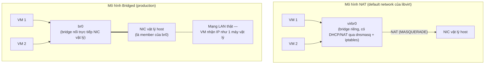

---
tags:
  - networking
  - kvm
---

# Linux Bridge & NAT Networking

Cách networking cơ bản nhất cho VM KVM: mỗi VM có 1 **TAP interface** (thiết bị network ảo cấp bởi kernel) được nối vào 1 **Linux bridge** — bridge hoạt động như 1 switch Layer 2 phần mềm, cho phép nhiều TAP interface (nhiều VM) và 1 NIC vật lý (nếu cần ra ngoài) "nói chuyện" như đang cắm chung 1 switch thật.

> [!tip] So với vSwitch/Port Group của ESXi
> Cùng khái niệm: Linux bridge tương đương vSwitch (Standard hoặc Distributed), TAP interface của mỗi VM tương đương "vNIC gắn vào port group". Khác biệt lớn nhất: vSwitch được quản lý hoàn toàn qua vCenter API/GUI; Linux bridge là **thuần networking layer của Linux** (`ip link`, `brctl` cũ hoặc `bridge` command mới) — nếu ai sửa trực tiếp trên OS mà không qua libvirt/CloudStack, state có thể lệch khỏi những gì management layer tưởng đang có.

## Where — 2 mô hình chính



| Mô hình | VM có IP như thế nào | Truy cập từ ngoài vào VM | Khi nào dùng |
|---|---|---|---|
| **NAT** (`virbr0`, mạng `default`) | IP private (192.168.122.0/24 mặc định), NAT ra ngoài qua host | Cần port-forward qua iptables, phức tạp | Lab/dev cá nhân, không cần VM có IP thật trong LAN |
| **Bridged** (`br0` nối NIC vật lý) | IP cùng subnet với LAN thật (DHCP từ router LAN hoặc static) | Truy cập trực tiếp như máy vật lý | **Chuẩn cho production/self-hosted** — VM cần expose service ra LAN/mạng công ty |

> [!warning] Lesson learned: mặc định `virsh net-start default` chỉ tạo NAT, không phải bridged
> Người mới cài KVM lần đầu, tạo VM xong không hiểu sao "không SSH được từ máy khác trong LAN" — vì mạng `default` của libvirt luôn là NAT (`virbr0`), IP đó chỉ route được từ chính host, không định tuyến ra LAN. Muốn VM có IP LAN thật, phải tự tạo bridge nối NIC vật lý (xem dưới), NAT chỉ phù hợp lab cá nhân.

## How — tạo bridged network

```bash
# Cách 1: Netplan (Ubuntu 20.04+)
cat > /etc/netplan/01-bridge.yaml <<EOF
network:
  version: 2
  ethernets:
    enp1s0: {}
  bridges:
    br0:
      interfaces: [enp1s0]
      dhcp4: true
EOF
netplan apply
```

```xml
<!-- Domain XML dùng bridge đã tạo ở tầng OS, KHÔNG qua libvirt virtual network -->
<interface type='bridge'>
  <source bridge='br0'/>
  <model type='virtio'/>
</interface>
```

> [!info] libvirt "virtual network" (`virsh net-*`) khác "bridge nối NIC vật lý" tự tạo ở OS
> `virsh net-list` chỉ hiển thị network do **libvirt tự quản lý** (thường là NAT, có dnsmasq riêng). Bridge nối trực tiếp NIC vật lý (`br0` tạo qua netplan/nmcli) là **networking layer của OS**, libvirt chỉ tham chiếu tên bridge đó trong domain XML (`type='bridge'`) — không quản lý vòng đời của nó. Đừng tìm `br0` trong `virsh net-list`, nó sẽ không xuất hiện.

## Key Config

```bash
# Kiểm tra bridge hiện có + interface member
ip link show type bridge
bridge link show
brctl show   # lệnh cũ, vẫn còn dùng được ở nhiều distro

# Kiểm tra IP/DHCP lease của NAT network default
virsh net-dhcp-leases default
```

## Gotchas & Lessons Learned

> [!warning] Bridge nối NIC vật lý duy nhất → mất kết nối SSH tới host nếu cấu hình sai
> Khi đưa NIC vật lý duy nhất (đang dùng để SSH vào host) làm member của bridge mới, một sai sót cấu hình (quên set `dhcp4: true` cho bridge, hoặc bridge chưa `up`) có thể làm mất kết nối tới host **ngay lập tức** — không có "rollback" tự động. Luôn thực hiện qua console vật lý/IPMI/iDRAC nếu có thể, hoặc test trên NIC phụ trước khi áp dụng cho NIC quản lý chính.

## Resources

- `man bridge`, `man ip-link`
- Netplan documentation: https://netplan.io/reference

---
*Xem thêm: [[Macvtap & SR-IOV Passthrough]] | [[Open vSwitch Integration]] | [[Virtio Devices]] | [[Kvm-virtualization|KVM Virtualization]]*
