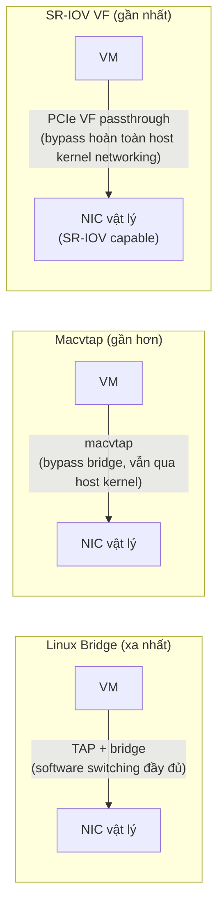

---
tags:
  - networking
  - performance
---

# Macvtap & SR-IOV Passthrough

**Macvtap** cho VM giao tiếp **trực tiếp** với NIC vật lý mà không cần Linux bridge làm trung gian — giảm 1 lớp switching software, đổi lại mất khả năng VM-to-VM traffic đi qua cùng NIC đó nhìn thấy nhau qua bridge (tùy mode). **SR-IOV** (Single Root I/O Virtualization) đi xa hơn: 1 NIC vật lý hỗ trợ SR-IOV tự "chia" thành nhiều **VF (Virtual Function)** ở tầng hardware/PCIe — mỗi VF gán trực tiếp (passthrough) cho 1 VM, VM thấy đúng như có 1 NIC vật lý riêng, bỏ qua hoàn toàn CPU host cho việc xử lý packet.

> [!tip] So với SR-IOV trên vSphere (DirectPath I/O)
> Cùng công nghệ hardware (SR-IOV là chuẩn PCIe, không riêng của Linux/KVM), vSphere gọi tính năng tương tự là "SR-IOV passthrough" hoặc "DirectPath I/O". Đánh đổi giống nhau ở cả 2 platform: mất khả năng vMotion/live migration cho VM đang dùng SR-IOV VF (thiết bị PCIe passthrough gắn chặt với NIC vật lý cụ thể của 1 host).

## Where — 3 mức độ "gần" với hardware



| Kỹ thuật | CPU overhead host | VM-to-VM cùng NIC thấy nhau? | Live migration | Khi nào dùng |
|---|---|---|---|---|
| Linux Bridge | Cao nhất (full software switching) | Có | Dễ nhất | Đa số trường hợp, cần flexibility |
| Macvtap (mode `bridge`) | Thấp hơn bridge | Có (qua macvtap mode bridge) | Được, không cần cấu hình đặc biệt | Cần giảm latency, không cần SR-IOV hardware |
| SR-IOV VF | Gần bằng 0 (bypass hoàn toàn) | Không (mỗi VF độc lập ở tầng PCIe) | **Không** (trừ kỹ thuật phức tạp switch VF↔virtio lúc migrate) | NFV, workload network cực nhạy latency/throughput |

## How — cấu hình Macvtap

```xml
<interface type='direct'>
  <source dev='eth0' mode='bridge'/>
  <model type='virtio'/>
</interface>
```

| Mode | Ý nghĩa |
|---|---|
| `bridge` | VM-to-VM cùng NIC vẫn giao tiếp được, gần giống bridge nhưng nhẹ hơn |
| `vepa` | Traffic VM-to-VM phải đi ra switch ngoài rồi mới quay lại (cần switch hỗ trợ hairpin) |
| `private` | VM hoàn toàn không thấy VM khác cùng NIC, chỉ thấy traffic đi/về từ ngoài |
| `passthrough` | Gán thẳng cả NIC vật lý cho 1 VM duy nhất (không chia sẻ được nữa) |

## How — cấu hình SR-IOV

```bash
# 1. Bật SR-IOV trên NIC (cần driver + firmware hỗ trợ, ví dụ Intel ixgbe/i40e, Mellanox mlx5)
echo 4 > /sys/class/net/eth0/device/sriov_numvfs   # tạo 4 Virtual Function

# 2. Kiểm tra VF đã xuất hiện
lspci | grep -i "Virtual Function"

# 3. Gán 1 VF cho VM qua domain XML (dùng hostdev, giống PCI passthrough thường)
```
```xml
<interface type='hostdev'>
  <source>
    <address type='pci' domain='0x0000' bus='0x03' slot='0x10' function='0x0'/>
  </source>
</interface>
```

> [!warning] SR-IOV yêu cầu IOMMU (VT-d/AMD-Vi) bật ở BIOS + kernel — thiếu bước này VF không gán được
> Giống PCI passthrough thường (xem [[Device Passthrough - VFIO & GPU]]), gán VF cho VM cần IOMMU groups hoạt động đúng. Nếu `dmesg | grep -i iommu` không thấy gì, kiểm tra lại BIOS đã bật Intel VT-d/AMD-Vi và kernel boot có `intel_iommu=on` (hoặc `amd_iommu=on`) chưa.

## Gotchas & Lessons Learned

> [!warning] Lesson learned: SR-IOV VF gán cho VM → mất khả năng live migrate VM đó
> Vì VF là passthrough PCIe thật (gắn chặt vào NIC vật lý của host cụ thể), `virsh migrate --live` sẽ **fail ngay** nếu VM đang có VF attach — không có cách nào "di chuyển" 1 thiết bị PCIe vật lý sang host khác giữa lúc VM chạy. Nếu cluster cần cả hiệu năng network cực cao **và** khả năng live migration, cân nhắc dùng vhost-user/DPDK (xem [[Virtio Devices]]) thay vì SR-IOV thuần — đánh đổi phức tạp vận hành hơn nhưng giữ được migration.

## Resources

- Linux kernel SR-IOV documentation: `Documentation/networking/switchdev.rst` (liên quan), driver-specific docs (Intel/Mellanox)
- Libvirt network XML format: https://libvirt.org/formatnetwork.html

---
*Xem thêm: [[Linux Bridge & NAT Networking]] | [[Device Passthrough - VFIO & GPU]] | [[Live Migration]] | [[Kvm-virtualization|KVM Virtualization]]*
