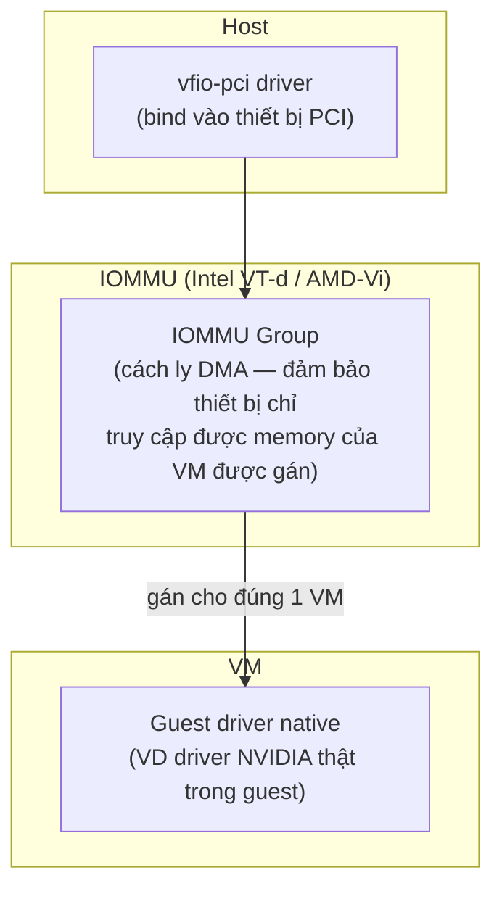

---
tags:
  - performance
  - vfio
  - gpu
---

# Device Passthrough — VFIO & GPU

**VFIO (Virtual Function I/O)** là framework kernel Linux cho phép gán trực tiếp 1 thiết bị PCI/PCIe vật lý (GPU, NIC, NVMe...) cho 1 VM cụ thể — VM thấy và điều khiển thiết bị đó **native**, gần như hiệu năng bare-metal, host hoàn toàn không can thiệp vào đường dữ liệu sau khi đã gán. Đây là cơ chế nền cho GPU passthrough (VM chạy CUDA/gaming/AI workload cần GPU thật) và cũng là nền tảng SR-IOV VF passthrough (xem [[Macvtap & SR-IOV Passthrough]]).

> [!tip] So với vSphere DirectPath I/O / vGPU
> vSphere có 2 hướng riêng biệt: DirectPath I/O (passthrough hoàn toàn 1 GPU cho 1 VM, giống VFIO) và vGPU (chia sẻ 1 GPU vật lý cho nhiều VM qua driver NVIDIA vGPU Manager, cần license NVIDIA). KVM có tương đương cho cả 2: VFIO passthrough thuần (miễn phí, không cần license), và **mediated device (mdev)** cho GPU chia sẻ (cũng cần driver hỗ trợ mdev từ vendor, tương tự yêu cầu license NVIDIA vGPU).

## Where — yêu cầu tiên quyết: IOMMU



**IOMMU** (Intel VT-d, AMD-Vi) là phần cứng đảm bảo thiết bị PCI passthrough **chỉ DMA (Direct Memory Access) được vào đúng vùng RAM của VM được gán** — không có IOMMU, một thiết bị passthrough về lý thuyết có thể DMA vào bất kỳ vùng RAM nào của host (rủi ro an ninh nghiêm trọng), nên KVM **bắt buộc** IOMMU bật mới cho passthrough hoạt động.

## How — quy trình gán GPU cho VM

```bash
# 1. Bật IOMMU trong kernel boot parameter (GRUB)
# Intel: intel_iommu=on iommu=pt
# AMD:   amd_iommu=on iommu=pt

# 2. Xác định IOMMU group của GPU cần passthrough
lspci -nnk | grep -i nvidia
# 01:00.0 VGA compatible controller [0300]: NVIDIA Corporation ... [10de:XXXX]

ls -la /sys/bus/pci/devices/0000:01:00.0/iommu_group/devices/
# Nếu group có NHIỀU thiết bị khác không liên quan tới GPU này -> vấn đề, xem lưu ý dưới

# 3. Unbind driver host đang dùng (nvidia/nouveau), bind sang vfio-pci
echo "options vfio-pci ids=10de:XXXX,10de:YYYY" > /etc/modprobe.d/vfio.conf
# XXXX = GPU device id, YYYY = HDMI audio device id (GPU thường có 2 function PCI)

# 4. Blacklist driver host để tránh nó "chiếm" thiết bị trước vfio-pci
echo "blacklist nouveau" >> /etc/modprobe.d/blacklist.conf
echo "blacklist nvidia" >> /etc/modprobe.d/blacklist.conf
update-initramfs -u   # hoặc dracut tương ứng RHEL-based
reboot
```

```xml
<domain>
  <devices>
    <hostdev mode='subsystem' type='pci' managed='yes'>
      <source>
        <address domain='0x0000' bus='0x01' slot='0x00' function='0x0'/>
      </source>
    </hostdev>
    <hostdev mode='subsystem' type='pci' managed='yes'>
      <source>
        <address domain='0x0000' bus='0x01' slot='0x00' function='0x1'/>   <!-- HDMI audio -->
      </source>
    </hostdev>
  </devices>
</domain>
```

## Key Config — IOMMU group phải "sạch"

> [!warning] IOMMU group chứa nhiều thiết bị không liên quan → không passthrough được riêng GPU
> Nếu `iommu_group` của GPU cần passthrough **cũng chứa** thiết bị khác (VD chipset SATA controller, USB controller khác trên cùng group do board layout PCIe) — VFIO yêu cầu **toàn bộ thiết bị trong 1 group phải được gán cùng nhau** hoặc không gán gì cả (vì IOMMU chỉ cách ly ở mức group, không mức thiết bị đơn lẻ trong 1 số trường hợp). Đây là lý do 1 số mainboard desktop thông thường (không phải server chuyên dụng) gặp khó khi passthrough GPU — cần kiểm tra kỹ topology PCIe của bo mạch trước khi mua phần cứng cho mục đích này.

## Gotchas & Lessons Learned

> [!warning] Lesson learned: GPU passthrough → mất khả năng dùng GPU đó ở host, và mất live migration cho VM đó
> Sau khi bind GPU vào `vfio-pci`, **host không còn dùng được GPU này nữa** (VD nếu đó là GPU màn hình duy nhất, host mất luôn display output — cần có GPU thứ 2 cho host hoặc quản lý qua SSH/IPMI hoàn toàn). Tương tự SR-IOV, VM có GPU passthrough **không live-migrate được** — thiết bị PCIe vật lý gắn chặt vào 1 host cụ thể.

> [!tip] `vendor-reset` hoặc reset bug — GPU AMD một số dòng không reset sạch giữa các lần VM restart
> Một số GPU (đặc biệt dòng AMD cũ hơn) có "reset bug" — khi VM restart, GPU không được reset về trạng thái sạch, VM sau không nhận GPU đúng cách cho tới khi **reboot cả host**. Đây là vấn đề đã biết của cộng đồng VFIO (không phải lỗi cấu hình của bạn) — kiểm tra kernel module `vendor-reset` (community-maintained) nếu gặp tình huống này với GPU AMD.

## Resources

- Arch Wiki PCI passthrough via OVMF (tài liệu cộng đồng chi tiết nhất, áp dụng được cho mọi distro): https://wiki.archlinux.org/title/PCI_passthrough_via_OVMF
- Kernel VFIO documentation: `Documentation/driver-api/vfio.rst`

---
*Xem thêm: [[Macvtap & SR-IOV Passthrough]] | [[Live Migration]] | [[Guest Isolation & Attack Surface]] | [[Kvm-virtualization|KVM Virtualization]]*
