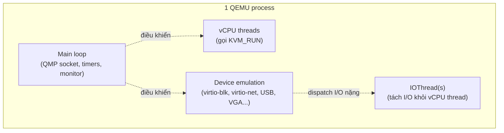

---
tags:
  - qemu
  - architecture
---

# QEMU Process Model & Machine Types

**QEMU** là userspace process đại diện cho toàn bộ "cơ thể" của một VM — mỗi VM tương ứng **đúng 1 process QEMU** (`qemu-system-x86_64` hoặc tương tự theo arch) chạy trên host. QEMU tự nó có 2 vai trò tách biệt: (1) khi kết hợp với KVM, nó chỉ làm nhiệm vụ **emulate device** (disk, network card, USB...) và để KVM lo chạy CPU; (2) khi chạy **không có** KVM (TCG — Tiny Code Generator), QEMU tự binary-translate luôn cả CPU instruction, chậm hơn rất nhiều — chế độ này chỉ dùng khi emulate cross-architecture (VD chạy ARM guest trên host x86) hoặc môi trường không có hardware virtualization.

> [!tip] Phân biệt rõ: QEMU-the-emulator vs QEMU-the-KVM-frontend
> Người mới dễ nhầm "QEMU" và "KVM" là một. Thực tế: QEMU tồn tại độc lập từ trước KVM rất lâu (bắt đầu là full emulator dùng TCG). Khi KVM xuất hiện (2007), QEMU được sửa để **có thể** dùng KVM làm CPU backend (thay TCG) trong khi vẫn giữ nguyên toàn bộ code emulate device. Vì vậy lệnh chạy VM luôn có cờ `-enable-kvm` (hoặc libvirt tự thêm) — thiếu cờ này, QEMU vẫn chạy được nhưng rơi về TCG, chậm hơn 10-50x.

## Where — vị trí trong hệ thống

Xem sơ đồ tổng ở [[Kvm-virtualization|KVM Virtualization]] — note này tập trung vào nội bộ 1 QEMU process.



## Machine Type — `pc` (i440FX) vs `q35`

Machine type quyết định **chipset ảo** mà guest "thấy" — ảnh hưởng tới loại bus PCI, số slot, hỗ trợ PCIe passthrough:

| Machine type | Chipset giả lập | PCIe native | Khi nào dùng |
|---|---|---|---|
| `pc` (i440FX) | Chipset Intel 440FX đời cũ (1996), chỉ PCI thường | Không (PCIe phải giả qua PCI bridge) | Guest cũ, tương thích ngược, tránh dùng cho VM mới |
| `q35` | Chipset Intel Q35 hiện đại hơn, hỗ trợ PCIe native | Có | **Mặc định khuyến nghị cho VM mới** — cần cho VFIO/GPU passthrough mượt, hỗ trợ AHCI/USB 3 tốt hơn |

```bash
# Kiểm tra machine type đang dùng
virsh dumpxml <domain> | grep "<type"
# <type arch='x86_64' machine='pc-q35-8.2'>...

# Danh sách machine type QEMU hỗ trợ trên host
qemu-system-x86_64 -machine help
```

> [!warning] Lesson learned: đổi machine type của VM đang chạy production là thay đổi nguy hiểm
> Đổi từ `pc` sang `q35` (hoặc ngược lại) thay đổi hoàn toàn bus layout mà guest OS nhìn thấy — Windows guest đặc biệt nhạy: driver storage controller cũ (IDE trên `pc`) không tự động map sang AHCI/virtio trên `q35`, dễ gây **boot loop "INACCESSIBLE_BOOT_DEVICE"**. Nếu cần đổi, luôn snapshot/backup trước, và chuẩn bị driver tương ứng (virtio driver ISO cho Windows) trước khi đổi.

## CPU Model — host-passthrough vs host-model vs custom

```xml
<!-- Hiệu năng tối đa, nhưng KHÔNG migrate được sang CPU khác đời -->
<cpu mode='host-passthrough'/>

<!-- libvirt tự dò CPU host, tạo model gần giống nhất, có thể migrate trong cùng thế hệ CPU -->
<cpu mode='host-model'/>

<!-- Cố định 1 CPU model cụ thể, ưu tiên tương thích migrate rộng nhất -->
<cpu mode='custom' match='exact'>
  <model>Skylake-Server-noTSX</model>
</cpu>
```

| Mode | Hiệu năng | Khả năng live-migrate | Khi nào chọn |
|---|---|---|---|
| `host-passthrough` | Cao nhất — lộ hết feature CPU thật | Chỉ migrate được giữa host **cùng CPU model chính xác** | Single-host lab, hoặc cluster đồng nhất tuyệt đối |
| `host-model` | Gần host-passthrough | Migrate được trong cùng thế hệ/vendor CPU | Mặc định hợp lý cho đa số cluster |
| `custom` | Thấp nhất (giới hạn feature) | Migrate rộng nhất — cả cluster nhiều đời CPU khác nhau | Cluster pha trộn nhiều đời CPU, ưu tiên tính di động VM |

## Gotchas & Lessons Learned

> [!warning] Cluster nhiều host CPU khác nhau mà dùng `host-passthrough` → live migration sẽ fail giữa chừng
> Đây là lỗi rất phổ biến khi mở rộng cluster theo thời gian (host cũ CPU đời A, host mới mua sau CPU đời B). `host-passthrough` lộ ra feature flag của CPU vật lý thật — nếu đích migrate thiếu 1 flag, QEMU trên đích sẽ từ chối khởi động VM giữa quá trình migrate, không phải lỗi âm thầm. Với cluster không đồng nhất CPU, luôn dùng `host-model` hoặc `custom` — accept một phần hiệu năng để đổi lấy khả năng di chuyển VM tự do.

## Resources

- `qemu-system-x86_64 -machine help` / `-cpu help` — liệt kê trực tiếp từ binary đang cài
- QEMU documentation: https://www.qemu.org/docs/master/

---
*Xem thêm: [[QEMU Monitor - QMP & HMP]] | [[Virtio Devices]] | [[Live Migration]] | [[Kvm-virtualization|KVM Virtualization]]*
