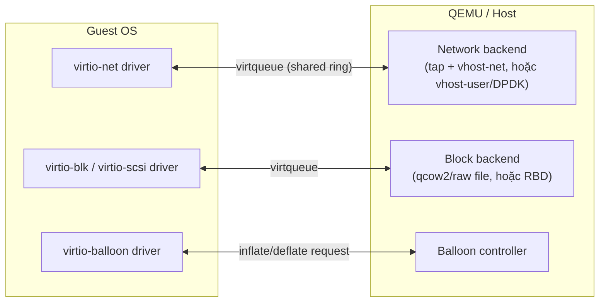

---
tags:
  - qemu
  - virtio
  - performance
---

# Virtio Devices

**Virtio** là chuẩn **paravirtualized device driver** — thay vì QEMU giả lập chính xác hành vi 1 thiết bị vật lý thật (VD NIC Realtek RTL8139, chậm vì mô phỏng đúng từng register hardware), virtio định nghĩa một giao diện **được thiết kế cho virtualization từ đầu**, cả guest driver và backend QEMU đều biết nó đang chạy trong VM — loại bỏ hầu hết overhead giả lập hardware thật không cần thiết.

> [!tip] So với vmxnet3/pvscsi của VMware
> Cùng ý tưởng: vmxnet3 (network) và pvscsi (storage) của VMware cũng là paravirtualized driver, đối lập với emulate NIC/controller vật lý thật (e1000, LSI Logic). Virtio là chuẩn **mở** (được chuẩn hóa qua OASIS), không riêng của KVM — Xen, VMware (một phần), cloud provider (AWS Nitro dùng biến thể virtio-blk/net) đều có hỗ trợ tương thích ở mức nào đó.

## Why — vấn đề gì virtio giải quyết

Full device emulation (VD giả NIC e1000 thật) khiến mỗi request I/O tốn **nhiều lần VMEXIT/VMENTER** (guest ghi từng register giống hardware thật kỳ vọng, QEMU phải trap từng bước để mô phỏng đúng behavior). Virtio thiết kế lại giao diện: guest và QEMU chia sẻ **ring buffer** trong memory (virtqueue) — guest đẩy nhiều request vào ring một lần, chỉ cần **1 lần "kick"** (thường qua 1 VMEXIT hoặc MMIO write) để báo QEMU xử lý cả loạt, giảm mạnh số lần chuyển đổi context tốn kém.

## Where — các loại virtio device chính



| Device | Thay thế cho (full emulation) | Dùng khi |
|---|---|---|
| **virtio-net** | e1000, rtl8139 | Luôn nên dùng cho guest hỗ trợ (Linux native, Windows cần driver) |
| **virtio-blk** | IDE/AHCI ảo | Disk performance cao, nhưng ít tính năng hơn virtio-scsi (không hotplug linh hoạt bằng) |
| **virtio-scsi** | LSI SCSI controller ảo | Khuyến nghị hiện tại cho disk — hỗ trợ nhiều LUN/hotplug tốt hơn virtio-blk |
| **virtio-balloon** | Không có tương đương full-emulation | Memory overcommit — cho phép host "lấy lại" RAM guest không dùng |
| **virtio-serial** | COM port ảo | Kênh guest agent (`qemu-guest-agent`) giao tiếp host ↔ guest |

## Key Config — vhost-net để tăng tốc network

Mặc định, virtio-net backend chạy hoàn toàn trong **QEMU userspace** — mỗi packet vẫn phải đi qua context switch userspace ↔ kernel. **vhost-net** di chuyển phần xử lý packet vào **kernel** (1 kernel thread riêng), bỏ qua hẳn round-trip vào QEMU userspace cho đường dữ liệu chính:

```xml
<interface type='bridge'>
  <source bridge='br0'/>
  <model type='virtio'/>
  <driver name='vhost'/>   <!-- mặc định libvirt đã tự chọn vhost nếu có sẵn -->
</interface>
```

```bash
# Kiểm tra vhost-net kernel module đã load
lsmod | grep vhost_net
```

> [!tip] vhost-user cho hiệu năng cực cao (DPDK/OVS-DPDK)
> Với workload network-intensive cực đoan (NFV, cần triệu packet/giây), `vhost-user` đẩy backend ra hẳn **1 process riêng ngoài QEMU** (thường OVS-DPDK) giao tiếp qua shared memory — bỏ qua cả kernel network stack. Đây là setup phức tạp, chỉ cần khi vhost-net thường (đã đủ tốt cho > 95% use case) không đáp ứng được.

## Performance Considerations

- **multiqueue virtio-net**: mặc định 1 virtqueue = giới hạn bởi 1 vCPU xử lý interrupt. Với VM nhiều vCPU và traffic cao, bật multiqueue (số queue = số vCPU) để phân tán xử lý packet qua nhiều vCPU.
```xml
<interface type='bridge'>
  <source bridge='br0'/>
  <model type='virtio'/>
  <driver name='vhost' queues='4'/>
</interface>
```
- **iothreads cho virtio-blk/scsi**: tách hẳn xử lý I/O disk ra thread riêng, không cạnh tranh với vCPU thread — xem chi tiết ở [[IO Tuning - Cache Modes & IOThreads]].

## Gotchas & Lessons Learned

> [!warning] Lesson learned: Windows guest không có virtio driver sẵn — quên bước này VM không boot được
> Khác Linux (driver virtio built-in kernel từ lâu), **Windows không có driver virtio native**. Cần nạp driver (từ ISO `virtio-win`) **trước khi** chọn disk controller là virtio-blk/scsi lúc cài Windows, hoặc cài trước bằng IDE rồi chuyển sang virtio sau (kèm rủi ro boot fail nếu thiếu bước load driver kịp lúc). Đây là lỗi rất phổ biến của người mới: tạo VM Windows với virtio-scsi ngay từ đầu, cài xong không boot lên được vì Windows installer không thấy disk.

> [!warning] multiqueue virtio-net không tự động cải thiện hiệu năng nếu queue > vCPU
> Đặt số queue nhiều hơn số vCPU không giúp gì thêm (không có vCPU nào xử lý thêm được) — chỉ tốn thêm memory cho ring buffer. Luôn đặt `queues` = số vCPU của VM, không hơn.

## Resources

- Virtio spec (OASIS): https://docs.oasis-open.org/virtio/virtio/
- `virtio-win` ISO (driver Windows): do Red Hat/Fedora Project duy trì

---
*Xem thêm: [[QEMU Process Model & Machine Types]] | [[IO Tuning - Cache Modes & IOThreads]] | [[Linux Bridge & NAT Networking]] | [[Kvm-virtualization|KVM Virtualization]]*
