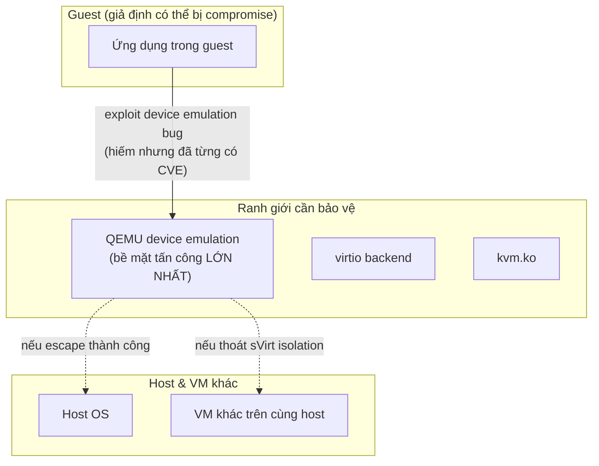

---
tags:
  - security
  - isolation
---

# Guest Isolation & Attack Surface

Bề mặt tấn công của KVM nằm chủ yếu ở **QEMU** (device emulation code, chạy userspace) và **kvm.ko** (kernel module) — không phải guest OS bên trong (guest chỉ là "khách" bị cách ly, giả định luôn có thể bị compromise). Mục tiêu bảo mật của toàn bộ stack: dù guest OS bị chiếm hoàn toàn quyền root bên trong, kẻ tấn công **không thể** thoát ra host (VM escape) hay ảnh hưởng tới VM khác.

> [!tip] Mô hình đe dọa cần tư duy đúng ngay từ đầu
> Đừng nghĩ "guest OS được patch đầy đủ thì an toàn" — mô hình đe dọa chuẩn cho multi-tenant virtualization luôn giả định **guest OS có thể bị compromise hoàn toàn** (qua ứng dụng chạy trong guest, không liên quan gì tới KVM). Câu hỏi thật sự cần trả lời: nếu điều đó xảy ra, kẻ tấn công có thoát được khỏi ranh giới VM đó không? Đây là lý do sVirt (xem [[sVirt - SELinux & AppArmor Isolation]]), patch kernel host, và giảm thiểu device emulation không cần thiết đều quan trọng hơn việc chỉ harden guest OS.

## Where — các điểm cần phòng vệ



| Thành phần | Vì sao là attack surface | Giảm thiểu |
|---|---|---|
| Device emulation (QEMU) | Code emulate hardware phức tạp, lịch sử có nhiều CVE (VD lỗi trong emulate USB, VGA, floppy cũ...) | Tắt device không dùng (đừng emulate hardware thừa "cho chắc"), giữ QEMU/libvirt luôn patch mới nhất |
| virtio backend | Ít bug hơn full emulation (code đơn giản hơn) nhưng vẫn là bề mặt trực tiếp guest chạm tới | Giữ kernel host + QEMU update |
| Shared clipboard/USB redirect (SPICE) | Kênh dữ liệu 2 chiều host↔guest, dễ bị lợi dụng nếu không giới hạn | Tắt nếu không cần, hoặc giới hạn theo nhu cầu thật |
| Nested virtualization | Thêm 1 tầng hypervisor lồng = thêm attack surface | Chỉ bật khi thật sự cần (lab/CI), không bật mặc định |

## Key Config — hardening checklist tối thiểu

```bash
# 1. Đảm bảo sVirt (SELinux/AppArmor) đang Enforcing, không Permissive/Disabled
getenforce   # RHEL-based
aa-status    # Ubuntu/Debian — kiểm tra profile libvirt-qemu đang enforce

# 2. Tắt device không cần thiết trong domain XML (giảm attack surface = giảm code path)
# VD: không cần floppy, không cần parallel port trên VM hiện đại -> đừng khai báo
```

```xml
<!-- Ví dụ: loại bỏ hoàn toàn USB controller nếu VM không cần USB redirect -->
<devices>
  <controller type='usb' model='none'/>
</devices>
```

```bash
# 3. Giới hạn quyền qemu process qua cgroups (libvirt tự làm 1 phần, kiểm tra lại)
systemctl show libvirtd | grep -i limit

# 4. Không chạy libvirtd/QEMU với quyền root process thật (kiểm tra user thực thi)
ps -eo user,cmd | grep qemu-system
```

## Security Considerations — checklist trước khi go-live multi-tenant

- [ ] SELinux/AppArmor `Enforcing`, không có host nào đang `Permissive` không rõ lý do
- [ ] Kernel host + QEMU + libvirt ở version còn được support/patch (kiểm tra CVE tracker của distro)
- [ ] Không dùng `client.admin` Ceph keyring cho libvirt (xem [[Ceph RBD with KVM]])
- [ ] Device không cần thiết (floppy, serial port thừa, USB redirect) đã bị loại khỏi domain XML
- [ ] Nested virtualization tắt trừ khi thật sự cần
- [ ] Network isolation giữa tenant (VLAN/OVS, xem [[Open vSwitch Integration]]) đã đúng thiết kế, không có VM nào "leak" sang mạng tenant khác qua misconfiguration

## Gotchas & Lessons Learned

> [!warning] Lesson learned: "VM escape" không phải kịch bản viễn tưởng — đã có CVE thật trong lịch sử QEMU
> Một số CVE nổi tiếng (VD VENOM - CVE-2015-3456, lỗi trong floppy disk controller emulation của QEMU) từng cho phép thoát từ guest ra host thật. Bài học rút ra: **patch security update cho QEMU/libvirt không phải việc "có thể trì hoãn"** như một số patch tính năng khác — đây là lớp phòng vệ cuối cùng giữa tenant với nhau trong môi trường multi-tenant, trì hoãn patch đồng nghĩa giữ nguyên 1 exploit đã public.

## Resources

- CVE tracker cho QEMU: https://www.qemu.org/security/ (trang chính thức, có link tới từng advisory)
- Red Hat Virtualization Security Guide

---
*Xem thêm: [[sVirt - SELinux & AppArmor Isolation]] | [[Device Passthrough - VFIO & GPU]] | [[Kvm-virtualization|KVM Virtualization]]*
