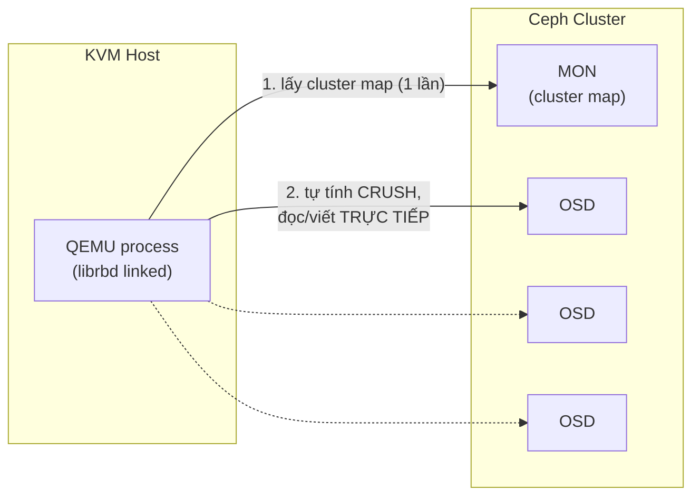

---
tags:
  - storage
  - ceph
  - integration
---

# Ceph RBD with KVM

QEMU nói chuyện với Ceph **trực tiếp qua `librbd`** (client library của Ceph) — không cần mount RBD image thành block device ở tầng OS (khác với cách 1 số hệ thống dùng `rbd map` để tạo `/dev/rbdX` rồi cấp cho VM như 1 block device thường). Đây là điểm khác biệt quan trọng nhất: KVM host **không cần** kernel RBD module, chỉ cần QEMU được build kèm hỗ trợ `librbd` (mặc định có ở mọi QEMU package hiện đại) và mạng tới Ceph MON.

> [!tip] Đây chính là cách CloudStack/OpenStack dùng Ceph làm Primary Storage
> Nếu bạn đang tiếp nhận hệ thống Apache CloudStack chạy KVM + Ceph (rất phổ biến ở các shop tự vận hành), đây chính xác là cơ chế đang chạy phía dưới mỗi khi CloudStack tạo VM — Primary Storage Pool trong CloudStack tương ứng 1 Ceph pool, mỗi VM disk là 1 RBD image trong pool đó. Xem kiến trúc Ceph đầy đủ ở [[RADOS & Cluster Architecture]] và [[Ceph with CloudStack]] trong vault Ceph.

## Where — đường đi I/O



Giống mọi client RADOS khác (xem [[RADOS & Cluster Architecture]] trong vault Ceph) — QEMU không đi qua gateway trung tâm, tự chạy CRUSH để biết OSD nào giữ dữ liệu rồi nói chuyện thẳng. Điều này nghĩa là **hiệu năng I/O của VM phụ thuộc trực tiếp vào network + tải cluster Ceph**, không có lớp cache/buffer trung gian nào che giấu vấn đề nếu Ceph cluster đang chậm.

## Key Config — domain XML

```xml
<disk type='network' device='disk'>
  <driver name='qemu' type='raw' cache='none' io='native'/>
  <source protocol='rbd' name='cloudstack-primary/i-2-15-VM-disk'>
    <host name='mon1.example.com' port='6789'/>
    <host name='mon2.example.com' port='6789'/>
    <host name='mon3.example.com' port='6789'/>
  </source>
  <auth username='libvirt'>
    <secret type='ceph' uuid='b0f60d9f-XXXX-XXXX-XXXX-XXXXXXXXXXXX'/>
  </auth>
  <target dev='vda' bus='virtio'/>
</disk>
```

```bash
# Tạo secret libvirt lưu Ceph keyring (không lưu key trần trong domain XML)
cat > secret.xml <<EOF
<secret ephemeral='no' private='yes'>
  <usage type='ceph'>
    <name>client.libvirt secret</name>
  </usage>
</secret>
EOF
virsh secret-define secret.xml
virsh secret-set-value <uuid> --base64 $(ceph auth print-key client.libvirt | base64)
```

| Cấu hình | Khuyến nghị | Lý do |
|---|---|---|
| Format ảnh | **raw**, không qcow2 | RBD đã tự lo thin-provisioning + snapshot ở tầng Ceph — chồng thêm qcow2 là dư thừa (xem [[Disk Image Formats - qcow2 vs raw]]) |
| `cache` mode | `none` (khuyến nghị phổ biến) hoặc `writeback` nếu RBD cache client bật | Tránh double-caching giữa QEMU page cache và Ceph client cache |
| `io` mode | `native` (yêu cầu `cache=none`) | Giảm overhead so với `threads` |
| Auth | Dùng user Ceph riêng (`client.libvirt` hoặc tương tự), không dùng `client.admin` | Giới hạn quyền — user riêng chỉ cần quyền `rwx` trên đúng pool cần dùng |

## Ops Runbook

```bash
# Kiểm tra kết nối tới Ceph từ phía QEMU/libvirt hoạt động đúng
virsh secret-list
rbd -p cloudstack-primary ls --id libvirt      # test quyền + kết nối bằng chính user libvirt dùng

# Xem VM nào đang dùng RBD image nào (map ngược từ tên image)
virsh domblklist vm01 --details
```

Khi nghi ngờ I/O chậm do Ceph (không phải do KVM host), luôn nhảy sang debug ở tầng Ceph trước — xem `ceph osd perf`, `ceph -s`, và [[Ceph Performance Tuning]] trong vault Ceph — vì KVM/QEMU phía này chỉ là 1 client mỏng, hiếm khi là nguyên nhân gốc.

## Gotchas & Lessons Learned

> [!warning] Lesson learned: RBD image bị "watcher" (VM khác đang giữ exclusive lock) khiến VM không start được
> Ceph RBD hỗ trợ exclusive-lock (mặc định bật ở feature set hiện đại) để tránh 2 QEMU process cùng viết vào 1 image — nếu VM cũ crash bất thường (host chết cứng) mà chưa release lock, VM mới cố gắng start trên host khác sẽ báo lỗi "image is locked/watched by another client". Kiểm tra bằng `rbd status <pool>/<image>`, và chỉ `rbd lock rm` sau khi **chắc chắn** VM cũ không còn chạy ở đâu (double I/O vào cùng image không có lock là nguyên nhân gây corrupt dữ liệu nghiêm trọng).

> [!warning] Không dùng `client.admin` keyring cho libvirt trên production
> Dùng thẳng `client.admin` (full quyền toàn cluster) để tiện lúc setup lab, nhưng quên đổi lại trước khi lên production là rủi ro bảo mật lớn — 1 host KVM bị compromise đồng nghĩa toàn bộ Ceph cluster (mọi pool, mọi VM khác) bị lộ quyền truy cập, không chỉ riêng pool của host đó. Xem thêm [[Ceph Security Considerations]] trong vault Ceph và [[Guest Isolation & Attack Surface]].

## Resources

- Ceph RBD + libvirt: https://docs.ceph.com/en/latest/rbd/libvirt/
- Vault Ceph: [[Ceph|Ceph]], [[RBD - Block Storage]], [[Ceph with CloudStack]]

---
*Xem thêm: [[Storage Backends Overview]] | [[Libvirt Storage Pools & Volumes]] | [[IO Tuning - Cache Modes & IOThreads]] | [[Kvm-virtualization|KVM Virtualization]]*
