---
tags:
  - cloud
  - openstack
  - overview
aliases:
  - OpenStack Overview
  - OpenStack Index
---

# OpenStack

OpenStack là nền tảng **cloud computing mã nguồn mở** cho phép xây dựng và quản lý hạ tầng cloud private/public. Được phát triển bởi Rackspace và NASA từ 2010, hiện được quản lý bởi **OpenInfra Foundation**.

> [!tip] Triết lý thiết kế
> OpenStack được thiết kế theo kiến trúc **microservices** — mỗi thành phần là một service độc lập, giao tiếp qua REST API và message queue (RabbitMQ). Đây vừa là điểm mạnh (linh hoạt, scalable) vừa là điểm phức tạp nhất khi vận hành.

## Bản đồ kiến thức

```mermaid
graph TD
    OS[OpenStack] --> DEP[Deployment]
    OS --> SVC[Core Services]
    OS --> NET[Networking]
    OS --> STG[Storage]
    OS --> IDN[Identity]
    OS --> HA[HA & Scalability]
    OS --> OPS[Operations]
    OS --> PRE[Prerequisites]

    DEP --> DM[Deployment Models]
    DEP --> HW[Hardware Requirements]
    DEP --> IM[Installation Methods]

    SVC --> KS[Keystone]
    SVC --> NV[Nova]
    SVC --> GL[Glance]
    SVC --> NT[Neutron]
    SVC --> CN[Cinder]
    SVC --> SW[Swift]
    SVC --> HZ[Horizon]
    SVC --> HT[Heat]
    SVC --> OC[Octavia]
    SVC --> IR[Ironic]

    NET --> NA[Neutron Architecture]
    NET --> PN[Provider & Tenant Networks]
    NET --> SG[Security Groups & Floating IP]
    NET --> OV[OVS & OVN]

    STG --> SO[Storage Overview]
    STG --> CE[Ceph Integration]

    IDN --> KD[Keystone Deep Dive]
    IDN --> PD[Projects, Domains & Users]
    IDN --> RB[RBAC & Policies]

    HA --> HA1[HA Architecture]
    HA --> PC[Pacemaker & Corosync]
    HA --> DB[Database HA - Galera]

    OPS --> CLI[CLI Commands]
    OPS --> MON[Monitoring & Alerting]
    OPS --> TB[Troubleshooting]
    OPS --> D2[Day 2 Operations]
    OPS --> UP[Upgrade Procedure]
```

## Core Services

| Service | Tên | Chức năng |
|---------|-----|-----------|
| [[Keystone - Identity\|Keystone]] | Identity Service | Authentication, Authorization, Service Catalog |
| [[Nova - Compute\|Nova]] | Compute Service | Quản lý VM lifecycle |
| [[Glance - Image\|Glance]] | Image Service | Lưu trữ và quản lý disk image |
| [[Neutron - Networking\|Neutron]] | Networking Service | SDN, virtual network |
| [[Cinder - Block Storage\|Cinder]] | Block Storage | Persistent block storage (như EBS) |
| [[Swift - Object Storage\|Swift]] | Object Storage | Distributed object store (như S3) |
| [[Horizon - Dashboard\|Horizon]] | Dashboard | Web UI |
| [[Heat - Orchestration\|Heat]] | Orchestration | Infrastructure as Code (như CloudFormation) |
| [[Octavia - Load Balancer\|Octavia]] | Load Balancer as a Service | LBaaS |
| [[Ironic - Bare Metal\|Ironic]] | Bare Metal Service | Quản lý máy vật lý |

## Deployment

- [[Deployment Models]] — All-in-One, Multi-node, HA
- [[Hardware Requirements]] — Cấu hình phần cứng tối thiểu và khuyến nghị
- [[Installation Methods]] — Kolla-Ansible, TripleO, OpenStack Ansible, Devstack

## Networking (Deep Dive)

- [[Neutron Architecture]] — ML2, L2/L3 agents, DHCP agent
- [[Provider & Tenant Networks]] — Flat, VLAN, VXLAN, GRE
- [[Security Groups & Floating IP]] — Firewall rules, NAT
- [[OVS & OVN]] — Open vSwitch và OVN backend

## Storage (Deep Dive)

- [[Cloud/OpenStack/Storage/Storage Overview]] — Block vs Object vs Shared File System
- [[Ceph Integration]] — Ceph làm backend cho Cinder, Glance, Nova

## Identity (Deep Dive)

- [[Keystone Deep Dive]] — Token, Endpoint, Catalog
- [[Projects, Domains & Users]] — Hierarchical multitenancy
- [[RBAC & Policies]] — policy.yaml, roles

## HA & Scalability

- [[HA Architecture]] — Controller HA, Compute HA
- [[Pacemaker & Corosync]] — Cluster resource management
- [[Database HA - Galera]] — MariaDB Galera Cluster

## Operations

- [[CLI Commands]] — openstack CLI, nova, neutron commands
- [[Monitoring & Alerting]] — Prometheus, Grafana, Ceilometer
- [[Troubleshooting]] — Log files, common issues
- [[Day 2 Operations]] — Backup, patching, scaling
- [[Upgrade Procedure]] — Rolling upgrade strategy

## Prerequisites

[[Prerequisites]] — Kiến thức cần có trước khi vận hành OpenStack

## Releases

OpenStack release theo chu kỳ **6 tháng/lần**, tên theo bảng chữ cái:
- **2024.1** – Caracal
- **2024.2** – Dalmatian
- **2025.1** – Epoxy

> [!info] Long-Term Support (SLURP)
> Skip-Level Upgrade Release Process (SLURP) — mỗi năm có 1 release hỗ trợ upgrade thẳng, bỏ qua release giữa. Quan trọng khi lập kế hoạch upgrade.
