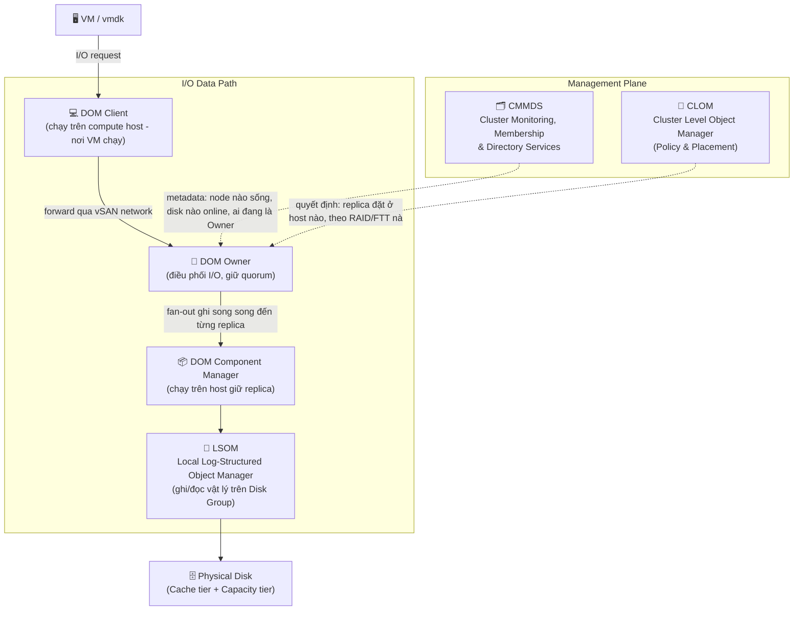
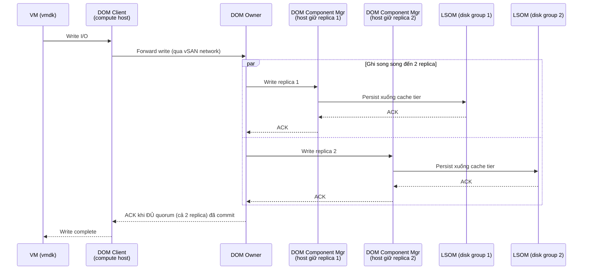
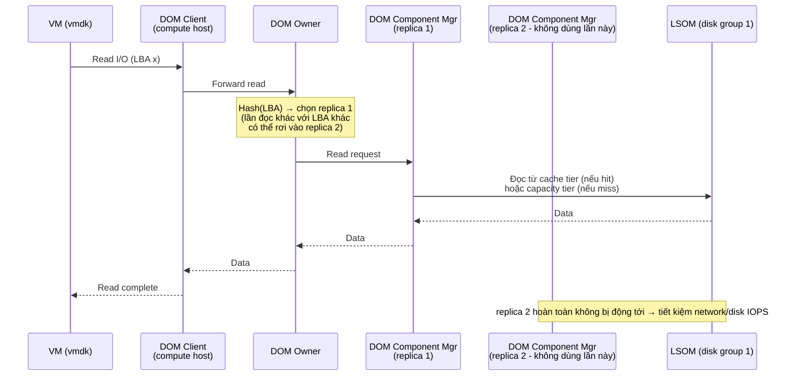
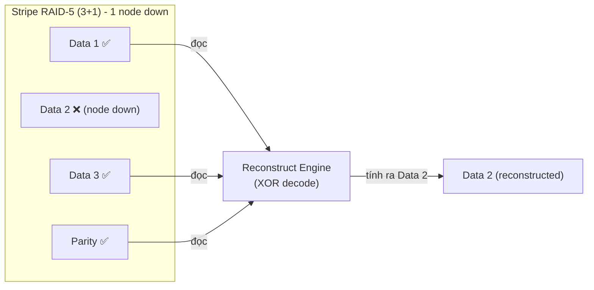

## Policies
**Default policy**: apply to only vSan datastore if there are no other policy used

### Compress policy
**vSAN Express Storage Architecture** provided the ability to change how compression is implemented. Compression now takes place in the upper layers of vSAN as it receives new writes (which means replica traffic is always compressed). In addition, compression is now toggled by storage policy and is enabled by default.
### So sánh dung lượng usable giữa RAID 1 / RAID 5 / RAID 6 trong vSAN

| **Policy** | **Số host tối thiểu yêu cầu** | **Hiệu quả lưu trữ** | **Dung lượng usable (ước tính trên 9.82 TB)** | **FTT (Failures To Tolerate)** |
| ---------- | ----------------------------- | -------------------- | --------------------------------------------- | ------------------------------ |
| **RAID 1** | 3                             | ~50% (vì mirror 2x)  | ~**4.91 TB**                                  | 1                              |
| **RAID 5** | 4                             | ~66.7%               | ~**6.54 TB**                                  | 1                              |
| **RAID 6** | 6                             | ~75% (4+2)           | ~**7.36 TB**                                  | 2                              |
#### Giải thích:
#### ✅ RAID 1 (Mirroring):
- Mỗi object được lưu **2 bản sao**.
- Yêu cầu tối thiểu **3 host**.
- Dung lượng usable = **50%** của datastore usable.
- Bù lại: tốc độ nhanh hơn RAID 5/6, nhưng tốn gấp đôi dung lượng.
---
#### ✅ RAID 5 (Erasure Coding - 3+1):
- Object chia thành 3 data blocks + 1 parity block.
- Yêu cầu tối thiểu **4 host**.
- Hiệu quả lưu trữ: **66.7%** usable.
- Tiết kiệm dung lượng hơn RAID 1, nhưng **hiệu năng thấp hơn** khi ghi dữ liệu nhỏ (cần encode parity).
---
#### ✅ RAID 6 (Erasure Coding - 4+2):
- 4 data blocks + 2 parity blocks.
- Yêu cầu **6 host** trở lên.
- Hiệu quả lưu trữ: **~75%**
- Chịu được **2 host failure**, nhưng chi phí ghi/đọc cao hơn RAID 5.
### Reserved Capacity
By enabling reserve capacity in advanced, vSAN prevents you from using the space to create workloads and intends to save the capacity available in a cluster.

If there is enough free space in the vSAN cluster, you can enable the operations reserve and/or the host rebuild reserve.

- Operations Reserve - Reserved space in the cluster for vSAN internal operations.
- Host Rebuild Reserve - Reserved space for vSAN to be able to repair in case of a single host failure.

The reserved capacity is not supported on a stretched cluster, cluster with fault domains and nested fault domains, ROBO cluster, or the number of hosts in the cluster is less than four.
## Scaling
- For clusters containing 3-5 hosts, vSAN ESA will use a 2+1 scheme that uses 1.5x raw capacity.
- For clusters containing 6 or more hosts, vSAN ESA will use a 4+1 scheme that uses 1.25x raw capacity.
- In addition, this RAID 5 scheme will automatically adjust after 24 hours if the number of hosts in the cluster changes (whether due to adding a host or due to host failure).

## vSan data encryption
**vSAN Data-In Transit Encryption**
**vSAN Data-At-Rest Encryption**
	- vSAN uses encryption keys as follows: ◦vCenter Server requests an AES-256 Key Encryption Key (KEK) from the KMS.vCenter Serverstores only the ID of the KEK, but not the key itself
	- The ESXi host encrypts disk data using the industry standard AES-256 XTS mode. Each disk has a different randomly generated Data Encryption Key (DEK)
	- Each ESXi host uses the KEK to encrypt its DEKs, and stores the encrypted DEKs on disk. The host does not store the KEK on disk. If a host reboots, it requests the KEK with the corresponding ID from the KMS. The host can then decrypt its DEKs as needed ◦
	- A host key is used to encrypt core dumps, not data. All hosts in the same cluster use the same host key. When collecting support bundles, a random key is generated to re-encrypt the core dumps. You can specify a password to encrypt the random key

## Vsan Stretched Cluster
Là mô hình vSAN trong đó **2 site vật lý khác nhau (Active–Active)** cùng chia sẻ một **vSAN datastore**, được **đồng bộ dữ liệu real-time** qua mạng giữa hai site.

> 🏢 Site A (Preferred site) + 🏢 Site B (Secondary site) + 🕵️ Witness node (ở site thứ 3)

### Cấu trúc bao gồm:

| Thành phần         | Vai trò                                                |
| ------------------ | ------------------------------------------------------ |
| **Site A**         | Nơi chính chạy workload (Preferred site)               |
| **Site B**         | Bản sao dữ liệu (Secondary site)                       |
| **Witness Node**   | Quorum (phân xử) nếu một site bị mất, đặt ở site thứ 3 |
| **vSAN Datastore** | Được đồng bộ giữa A và B theo RAID-1 hoặc RAID-5/6     |

> ⚠️ Witness **không lưu dữ liệu**, chỉ lưu metadata để giúp cluster xác định node nào còn sống.

---

### **Hoạt động như thế nào?**

- Khi bạn deploy một VM:
    - vSAN sẽ tạo **1 replica ở site A**
    - **1 replica ở site B**  
    - Và 1 **witness component ở Witness Node**

Nếu 1 site bị mất:
- Cluster **vẫn hoạt động bình thường**
- vSAN dùng **quorum logic** để duy trì trạng thái object

---

## Kiến trúc vSAN (Architecture Deep-dive): CMMDS / CLOM / DOM / LSOM

> Nguồn gốc: các dashboard trong vSAN Performance Service (Pivotal Dashboards + More Dashboards) — `DOM Client`, `DOM Owner`, `DOM Component Manager`, `LSOM Disk Group`, `CLOM`, `CMMDS`... — chính là 4 lớp phần mềm lõi tạo nên vSAN. Hiểu rõ 4 lớp này giúp đọc đúng biểu đồ performance và biết **nghẽn (bottleneck) đang nằm ở đâu**: network, compute (DOM), hay physical disk (LSOM).

vSAN không phải là 1 khối duy nhất mà là **4 lớp phần mềm chạy trong ESXi kernel**, mỗi lớp có nhiệm vụ riêng:

### 1. CMMDS — Cluster Monitoring, Membership, Directory Services

**Là gì:** một in-memory clustering database, đồng bộ **real-time** trên tất cả host trong cluster qua vSAN network. Có thể ví như "hệ thần kinh trung ương" của vSAN.

**Chức năng:**
- Theo dõi **membership**: host nào đang sống, đang join/leave cluster (heartbeat).
- Lưu **directory metadata**: danh sách disk, disk group, network, và **object layout** (component nào nằm trên host/disk nào) — nhưng **không lưu dữ liệu thật**, chỉ lưu metadata.
- Phát hiện thay đổi topology (host down, disk fail, network partition) và **thông báo** cho DOM/CLOM để phản ứng (failover Owner, trigger rebuild...).

**Ảnh hưởng đến hệ thống:**
- Vì đây là dữ liệu **đồng bộ trên toàn cluster qua network**, latency/packet loss trên vSAN network ảnh hưởng trực tiếp đến **tốc độ hội tụ (convergence time)** khi có sự cố (host down → mất bao lâu để cluster "biết" và bắt đầu rebuild).
- Cluster càng nhiều host/object thì CMMDS update rate càng cao → cần network ổn định, latency thấp cho vSAN vmknic.
- Dashboard `CMMDS` cho biết throughput update, RX/TX của lớp này — spike bất thường thường là dấu hiệu cluster đang unstable (host flapping, network chập chờn).

### 2. CLOM — Cluster Level Object Manager

**Là gì:** "bộ não policy" — **không nằm trong đường đi I/O thực tế** (không xử lý read/write của VM), chỉ chạy định kỳ hoặc khi có sự kiện để **tính toán và ra quyết định**.

**Chức năng:**
- Đọc **Storage Policy (SPBM)** của từng object (FTT, RAID type, fault domain...) và quyết định **component nào đặt ở host/disk nào** để thỏa policy.
- Kiểm tra **compliance**: object có đang tuân thủ policy không (VD: đủ số replica, đúng RAID).
- Khi có thay đổi (thêm host, disk fail, đổi policy) → CLOM tính toán lại placement và sinh ra kế hoạch **reconfigure/rebuild**.

**Ảnh hưởng đến hệ thống:**
- CLOM quyết định **vị trí vật lý** của replica/parity → ảnh hưởng **gián tiếp** nhưng rất lớn đến performance: nếu các component của 1 object nằm rải quá xa nhau (nhiều fault domain, nhiều hop network) thì mỗi write sẽ tốn nhiều network round-trip hơn.
- Placement không đều (skew) giữa các host/disk → 1 số disk group bị "hot" trong khi disk khác rảnh → hiển thị rõ ở dashboard `vSAN Distribution`.
- CLOM chạy nặng khi cluster có nhiều thay đổi cùng lúc (thêm/xóa host, đổi policy hàng loạt) — có thể làm chậm việc **compliance convergence** dù không ảnh hưởng I/O latency tức thời.

### 3. DOM — Distributed Object Manager (lớp I/O path chính)

Đây là lớp **quan trọng nhất với performance**, vì mọi I/O của VM đều đi qua đây. DOM chia thành 3 role, đúng như 3 dashboard riêng biệt:

| Role | Chạy ở đâu | Chức năng |
|---|---|---|
| **DOM Client** | Host đang chạy VM (compute host) | Nhận I/O request từ VMDK, gửi đến DOM Owner của object đó |
| **DOM Owner** | 1 trong các host giữ component của object (do CLOM/CMMDS bầu ra, duy nhất tại 1 thời điểm) | "Nhạc trưởng": điều phối I/O đến **tất cả** replica, đảm bảo **tính nhất quán** (write phải commit đủ theo quorum mới ACK), xử lý resync khi có lệch |
| **DOM Component Manager** | Từng host đang lưu **component vật lý** (replica/parity) | Nhận lệnh từ Owner, gọi xuống LSOM để đọc/ghi vào disk local |

**I/O path chi tiết (write, RAID-1 FTT=1 làm ví dụ):**

**Ảnh hưởng đến hệ thống (rất quan trọng):**
- **Write latency = latency của replica CHẬM NHẤT**, vì Owner phải chờ đủ quorum mới ACK về VM. Nếu 1 host/disk group chậm (disk lỗi, network congest), toàn bộ VM ghi lên object đó sẽ bị kéo chậm theo.
- Nếu **DOM Owner không nằm cùng host với DOM Client** (tức VM không chạy trên host giữ Owner) → phát sinh thêm 1 network hop cho mỗi I/O → tăng latency. Đây là lý do vSAN cố gắng tối ưu locality khi có thể.
- Với **RAID-1 (mirroring)**: write phải nhân bản network traffic ra N node (write amplification qua mạng).
- Với **RAID-5/6 (erasure coding)**: cần tính parity → thêm CPU overhead và thêm round-trip network đến các node giữ parity, nên **write latency cao hơn RAID-1**, đổi lại tiết kiệm dung lượng (xem bảng RAID phía trên).
- `DOM Component Scheduler` (dashboard) theo dõi **queue/hàng đợi I/O** ở lớp DOM — nếu queue depth tăng cao, đó là dấu hiệu **nghẽn ở tầng network hoặc tầng LSOM phía dưới**, không phải do VM sinh I/O quá nhiều.

### 4. LSOM — Local Log-Structured Object Manager

**Là gì:** lớp thấp nhất, chạy **local trên từng host**, chịu trách nhiệm đọc/ghi **vật lý** vào ổ đĩa. Đây là nơi I/O "chạm đất".

**Chức năng:**
- Quản lý **Disk Group** = 1 cache tier device (SSD/NVMe) + 1 hoặc nhiều capacity tier device (SSD hoặc HDD).
  - **OSA (Original Storage Architecture)**: cache tier dùng 100% cho write buffer (all-flash) hoặc read+write cache (hybrid); mọi write đều phải hit cache tier trước, sau đó **destage** (di chuyển) xuống capacity tier theo thời gian.
  - **ESA (Express Storage Architecture)**: bỏ khái niệm cache/capacity 2 tier — dùng log-structured filesystem trên toàn bộ NVMe, mỗi disk đều tham gia cả nhận write lẫn lưu trữ lâu dài.
- Ghi theo kiểu **log-structured** (ghi tuần tự, append-only) để giảm write amplification trên SSD/NVMe, thay vì ghi ngẫu nhiên (random write) vốn rất tốn với flash.
- Thực hiện **checksum** (bảo toàn dữ liệu), **deduplication & compression** (nếu bật), và với ESA là **compression-first ở receive layer**.

**Ảnh hưởng đến hệ thống:**
- Đây là **bottleneck vật lý cuối cùng**: loại và tốc độ của cache tier device quyết định **write latency trần** của cả cluster, vì (ở OSA) mọi write buộc phải qua cache tier trước khi ACK.
- Nếu **destaging** (đẩy dữ liệu từ cache xuống capacity) không kịp tốc độ ghi vào → cache tier đầy → LSOM sinh ra **congestion/back-pressure**, vSAN sẽ chủ động **throttle (làm chậm)** I/O của VM để tránh mất dữ liệu — đây là nguyên nhân phổ biến nhất của hiện tượng "vSAN đột nhiên chậm hẳn".
- Disk Group càng nhiều capacity device dùng chung 1 cache device → cache càng dễ là điểm nghẽn khi nhiều VM cùng ghi mạnh.
- Dashboard `LSOM Disk Group` hiển thị IOPS, latency, **congestion value**, outstanding I/O theo từng disk group — đây là nơi đầu tiên nên nhìn khi nghi ngờ bottleneck ở tầng storage vật lý.

### 5. Luồng đọc dữ liệu (Read I/O Path)

Read đi qua **cùng 4 lớp** (DOM Client → DOM Owner → DOM Component Manager → LSOM) nhưng logic khác hẳn write, vì read **không cần ghi đủ quorum** — chỉ cần lấy dữ liệu đúng từ **1 nguồn** là đủ. Đây là điểm khác biệt quan trọng nhất so với write path ở trên.

**Khác biệt cốt lõi so với write:**

| | Write | Read |
|---|---|---|
| Số node phải hoàn thành mới ACK | **Tất cả** replica (quorum) | Chỉ **1** replica (hoặc data blocks, không cần parity) |
| Traffic ra network | Nhân bản ra N node | Chỉ đến 1 node được chọn |
| Ảnh hưởng bởi node chậm nhất? | Có (latency = chậm nhất) | Không, trừ khi node được chọn đó đang chậm |

#### a) Read healthy — RAID-1 (Mirror)

Với object có nhiều bản mirror giống hệt nhau, DOM Owner **không đọc cả 2 bản** — mà chọn **1 replica duy nhất** cho mỗi I/O, dựa trên thuật toán băm địa chỉ block (giúp **cân bằng tải đọc** đều ra các replica thay vì luôn dồn vào 1 bản). Nhờ vậy read có thể tận dụng **toàn bộ băng thông của cả 2 replica cộng lại** khi nhiều I/O chạy song song, thay vì bị giới hạn như write.

> 🔎 Ngoại lệ: trong **Stretched Cluster / 2-Node**, vSAN bật **Read Locality** — VM ưu tiên đọc từ replica **cùng site** với host đang chạy VM, để tránh tốn băng thông liên site (inter-site link) vốn thường có latency cao hơn nhiều so với LAN nội bộ.

#### b) Read healthy — RAID-5/6 (Erasure Coding)

Khi cluster khỏe mạnh (không có component nào down), read **chỉ đọc trực tiếp các data block cần thiết** từ node giữ data — **không cần đọc parity, không cần tính toán gì cả**. Vì vậy read RAID-5/6 ở trạng thái khỏe gần như **không có overhead CPU**, khác hẳn với write (vốn luôn phải tính parity).

#### c) Degraded read — khi 1 component bị mất/down

Nếu node/disk giữ data block đó đang down hoặc component bị lỗi, vSAN không thể đọc trực tiếp — phải **tái tạo (reconstruct)** dữ liệu bằng cách đọc **tất cả các block còn lại (data + parity)** của cùng stripe rồi **XOR/giải mã** ra block bị thiếu:

**Ảnh hưởng hiệu năng của degraded read:**
- Phải đọc **nhiều block hơn hẳn** bình thường (thay vì 1 block, phải đọc N-1 block khác trong cùng stripe) → tăng IOPS thật sự tiêu thụ trên các node còn lại.
- Tốn thêm **CPU** để giải mã (XOR decode), cao hơn nhiều so với read healthy.
- Latency của read degraded luôn **cao hơn đáng kể** so với read bình thường — đây là lý do khi 1 host/disk down, các VM có object rơi vào tình trạng "degraded" sẽ cảm nhận rõ I/O chậm hơn, ngay cả khi chưa hết tolerance (FTT chưa bị vi phạm).

#### d) Vai trò cache tier trong read (khác nhau theo kiến trúc)

- **Hybrid vSAN (SSD cache + HDD capacity)**: cache tier dùng khoảng **70% làm read cache**, 30% làm write buffer. Read cache **hit** → trả kết quả nhanh (SSD speed); **miss** → phải đọc xuống HDD capacity tier → latency cao hơn hẳn (đây là nguyên nhân chính khiến hybrid vSAN có performance kém ổn định hơn all-flash).
- **All-Flash vSAN (OSA)**: cache tier chỉ dùng làm **write buffer**, *không* dùng làm read cache — vì capacity tier đã là flash nên đọc trực tiếp từ đó đã đủ nhanh, không cần thêm tầng cache.
- **vSAN ESA**: không còn 2 tier — mọi NVMe đều bình đẳng, read đi thẳng qua log-structured metadata index để định vị block, không có khái niệm cache-hit/miss như OSA.
- **vSAN Client Cache (Data-in-Memory read cache)**: một tầng cache **bổ sung, nằm ở compute host (DOM Client)**, dùng một phần RAM của host (tối đa ~1GB/host) để cache các block được đọc nhiều lần — nếu hit ở đây thì **read không cần đi qua network** đến DOM Owner/Component Manager nữa, giảm đáng kể latency và tải mạng cho working set nóng (hot data), nhưng chỉ hữu ích với workload có tính "đọc lặp lại" cao.

### Bảng tổng hợp: layer nào ảnh hưởng gì đến performance

| Layer | Nằm trong I/O path? | Ảnh hưởng chính | Triệu chứng khi có vấn đề |
|---|---|---|---|
| **CMMDS** | Không (control plane) | Tốc độ hội tụ cluster khi có sự cố; cần network vSAN ổn định | Failover/rebuild chậm khởi động, cluster "unstable" |
| **CLOM** | Không (control plane) | Vị trí đặt replica → số hop network mỗi I/O; phân bổ đều/lệch giữa hosts | `vSAN Distribution` lệch (skew), compliance chậm đồng bộ |
| **DOM** | **Có — trực tiếp** | Write latency = replica chậm nhất; thêm hop nếu Owner ≠ host chạy VM; overhead RAID-5/6 (parity) | `DOM Component Scheduler` queue cao; latency tăng dù disk local không bận |
| **LSOM** | **Có — trực tiếp** | Tốc độ cache tier device; destaging kịp hay không; congestion/throttle | `LSOM Disk Group` congestion cao, latency đọc/ghi tăng đột biến |

### Các dashboard còn lại (bổ sung ngữ cảnh)

- **vNic Network**: theo dõi NIC vật lý dùng cho vSAN traffic (VMkernel port dành riêng cho vSAN). Vì DOM Owner/Client/Component Manager giao tiếp với nhau **hoàn toàn qua network này**, packet loss/retransmit hay bandwidth thấp ở đây sẽ khuếch đại trực tiếp thành write/read latency ở tầng DOM — nên khi tuning performance, network vSAN (10/25GbE trở lên, riêng biệt với NIC quản lý) luôn được kiểm tra đầu tiên.
- **Memory**: vSAN dùng RAM cho metadata (CMMDS), read cache (tuỳ kiến trúc), và các cấu trúc quản lý I/O. Thiếu RAM có thể khiến host không đáp ứng đủ cho cả workload lẫn vSAN service, gây ra hiện tượng nghẽn không liên quan trực tiếp đến disk/network.
- **CPU**: các phép tính erasure coding (parity RAID-5/6), checksum, dedup/compression, và encryption đều tốn CPU cycle. Bật nhiều tính năng cùng lúc (compression + encryption + RAID-6) trên host CPU yếu có thể khiến **CPU chứ không phải disk** là bottleneck thật sự.
- **Cluster Resync**: theo dõi lưu lượng đang được đồng bộ lại (khi host down, rebuild sau failure, rebalance, hoặc đổi storage policy). Resync traffic **cạnh tranh băng thông** với I/O thực của VM — vSAN có cơ chế **Adaptive Resync Throttling** để tự động nhường băng thông cho VM traffic khi cluster đang bận, nhưng nếu resync kéo dài (do quá nhiều dữ liệu lệch) sẽ vẫn ảnh hưởng đến performance chung.