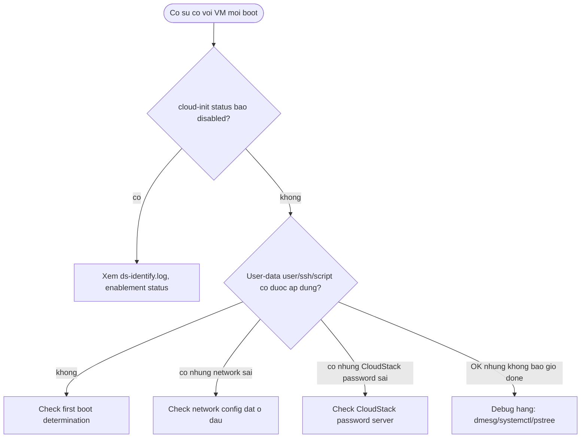

# cloud-init — Runbook vận hành

> [!important] Đọc file này đầu tiên khi có sự cố
> Đang cháy → nhảy thẳng [[#3. Triage — gặp lỗi thì xem ở đây]], dò theo triệu chứng.
> Ngày thường → làm [[#1. Checklist hằng ngày]] (~5 phút).
> Lý do đằng sau từng bước nằm ở note được link; file này chỉ giữ phần "làm gì".

## 0. Thông tin môi trường

| Thành phần | Host / URL | Owner / ghi chú |
|---|---|---|
| Platform chính dùng cloud-init | `<EC2 / OpenStack / CloudStack / KVM-libvirt NoCloud / ...>` | `<team, vị trí>` |
| Virtual router / metadata endpoint | `<vd data-server. hoặc 169.254.169.254>` | `<team network>` |
| Golden image build pipeline | `<URL CI/CD build image>` | `<team sở hữu>` |
| Nơi lưu user-data/cloud-config mẫu | `<repo/path>` | `<team>` |

> [!todo] Điền thông tin môi trường
> Thay các giá trị `<...>` trong bảng trên bằng giá trị thật của hệ thống đang vận hành.

## 1. Checklist hằng ngày

- [ ] **Instance mới launch có status `done` không recoverable error** — kết quả đúng: `status: done`,
  `recoverable_errors: {}` → [[cloud-init--cli-status-debug#Các lựa chọn — Giá trị status]]
  ```bash
  cloud-init status --long
  ```
- [ ] **Không có instance nào kẹt ở `disabled-by-generator` ngoài ý muốn** — kết quả đúng: chỉ VM cố tình
  không dùng cloud-init mới ở trạng thái này → [[cloud-init--datasources#Các lựa chọn — Datasource khi tự build/override]]
  ```bash
  cloud-init status --format json | grep boot_status_code
  ```
- [ ] **Log final stage không có traceback mới** — kết quả đúng: không có dòng `Traceback` trong 24h gần nhất → [[cloud-init--cli-status-debug#Ops notes]]
  ```bash
  grep -i traceback /var/log/cloud-init.log | tail -20
  ```

## 2. Checklist định kỳ

### Hằng tuần

- [ ] Review VM mới launch có bị lặp lại cùng 1 gotcha không (vd network config đặt sai chỗ) → [[cloud-init#10. Gotchas & Lessons Learned]]

### Hằng tháng

- [ ] Rà soát hardening checklist vẫn còn đúng (đặc biệt `disable_root`, `ssh_pwauth`, `manual_cache_clean`) trên template image đang dùng → [[cloud-init#8. Security Considerations]]

### Hằng quý / hằng năm

- [ ] Review có CVE mới cho version cloud-init đang dùng trên fleet không (vd kiểu CVE-2024-11584) → [[cloud-init#Bẫy vận hành]]
- [ ] Diễn tập lại playbook "capture golden image" đúng quy trình clean cache → [[#5. Playbook khẩn cấp]]
- [ ] Review version cloud-init trên các golden image so với latest stable, lên kế hoạch rebuild nếu quá cũ

## 3. Triage — gặp lỗi thì xem ở đây



| Triệu chứng | Check đầu tiên | Nguyên nhân hay gặp | Chi tiết |
|---|---|---|---|
| `cloud-init status --long` báo `disabled-by-generator` | `cat /run/cloud-init/ds-identify.log` | `ds-identify` không tìm thấy datasource phù hợp | [[cloud-init--datasources#How it works]] |
| `systemctl status cloud-init.service` báo unit không tồn tại | `systemctl status cloud-init-network.service` | Đổi tên service từ v24.3 | [[cloud-init--boot-stages#Kiến trúc single-process (từ v24.3)]] |
| SSH key/user mới không được tạo trên VM clone từ image | `cat /var/lib/cloud/data/instance-id` so với instance-id thật của VM | `manual_cache_clean: true`, image capture lúc "trust" chưa clean cache | [[cloud-init--boot-stages#First boot determination]] |
| Nhiều VM báo cùng SSH host key fingerprint | So fingerprint `/etc/ssh/ssh_host_*_key.pub` giữa các VM | Giống nguyên nhân trên, host key không rotate | [[cloud-init#Image clone dùng chung SSH host key vì manual_cache_clean: true]] |
| `network:` khai trong user-data không có tác dụng | Xem instance có network config ở system config/datasource không | User-data không có quyền đổi network config | [[cloud-init--network-config#Ai thắng khi xung đột]] |
| CloudStack: VM không login được bằng password đã set lúc tạo | `nc -vz -w 3 <virtual-router-ip> 8080` rồi xem log CloudStack agent | Password server trả `saved_password` (đã bị lấy/consume trước đó) | [[cloud-init--datasources#Các lựa chọn — Datasource khi tự build/override]] |
| `runcmd` không chạy dù user-data đúng cú pháp | `cloud-init status --long` xem field `stage` | `runcmd` chạy ở Config stage, nếu network chưa lên thì chưa tới lượt | [[cloud-init--boot-stages#How it works]] |
| cloud-init treo, không bao giờ `done` | `dmesg -T` grep warning/error/fatal, `systemctl --failed`, `pstree <pid>` | Module đợi thứ gì đó (network, NTP, HTTP endpoint) không về | [[cloud-init--cli-status-debug#Ops notes]] |

## 4. Network quick check

```bash
# Chạy từ chính VM đang boot — timeout = firewall drop, refused = service không listen
for target in 169.254.169.254:80 <virtual-router-ip>:80 <virtual-router-ip>:8080; do
  nc -vz -w 3 "${target%%:*}" "${target##*:}"
done
```

![[cloud-init#^ports]]

## 5. Playbook khẩn cấp

### Capture golden image an toàn (tránh dùng chung SSH host key)

**Khi nào dùng:** Trước khi snapshot/capture bất kỳ VM nào thành image dùng lại cho nhiều instance khác.

1. Đảm bảo VM đã boot xong hoàn toàn: `cloud-init status --wait`
2. Xoá sạch state + log cũ để VM con coi đây là first boot thật sự:
   ```bash
   sudo cloud-init clean --logs --machine-id --seed
   ```
3. (Nếu dùng `manual_cache_clean: true` ở template) xác nhận lại trong `/etc/cloud/cloud.cfg.d/*` rằng
   setting này đúng ý định, không phải để sót từ lần build trước.
4. Shutdown VM, capture snapshot/image ngay sau bước clean — không boot lại VM nguồn trước khi capture.

**Verify:** Boot thử 1 VM từ image mới, `cloud-init status --long` phải báo `detail` là datasource đúng và
SSH host key fingerprint **khác** VM nguồn.
**Chi tiết:** [[cloud-init#Image clone dùng chung SSH host key vì manual_cache_clean: true]]

### cloud-init hoàn toàn không chạy trên VM mới

**Khi nào dùng:** `cloud-init status` báo `disabled`, không thấy log gì liên quan user-data.

1. `cat /run/cloud-init/ds-identify.log` — xem có detect được platform không.
2. Nếu log trống/không có file: kiểm tra marker file `/etc/cloud/cloud-init.disabled` và kernel cmdline
   (`cat /proc/cmdline | grep cloud-init`).
3. Nếu `ds-identify` chạy nhưng không detect: ép tay 1 lần để xác nhận:
   ```bash
   sudo DEBUG_LEVEL=2 DI_LOG=stderr /usr/lib/cloud-init/ds-identify --force
   ```
4. Nếu platform non-x86/ARM và mới upgrade cloud-init: khả năng cao là thay đổi strict identification từ
   v25.1.4 — ép `datasource_list: [<tên datasource>]` trong `/etc/cloud/cloud.cfg.d/91_force.cfg`.

**Verify:** `cloud-init status --long` báo `boot_status_code: enabled-by-generator` hoặc
`enabled-by-kernel-command-line` ở lần boot kế tiếp.
**Chi tiết:** [[cloud-init--datasources#How it works]]

## 6. Lịch hết hạn & mốc quan trọng

| Cái gì | Hết hạn / mốc | Ai lo | Bắt đầu xử lý trước |
|---|---|---|---|
| Rebuild golden image theo version cloud-init mới | `<lịch rebuild theo quy trình nội bộ>` | `<owner>` | `<N tuần>` |
| Theo dõi CVE cloud-init (vd CVE-2024-11584 style) | liên tục | `<security team>` | — |
| EOL của distro base image (ảnh hưởng version cloud-init được backport) | `<theo lịch EOL distro>` | `<owner>` | `<90 ngày>` |

## 7. Escalation & liên hệ

| Tình huống | Gọi ai | Kênh |
|---|---|---|
| Datasource/metadata service của platform (CloudStack VR, OpenStack metadata...) down | `<team hạ tầng cloud platform>` | `<kênh>` |
| Nghi image template bị lộ SSH host key dùng chung (security incident) | `<security team>` | `<kênh>` |

## 8. Nhật ký sự cố

- [[cloud-init#Lesson learned thực tế]]
