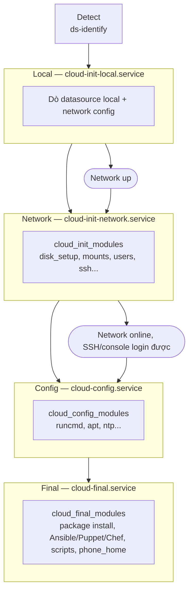
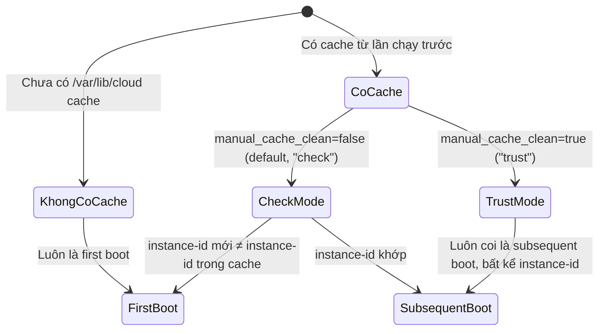

# cloud-init — Boot Stages

## What it does

> Hình dung một dây chuyền sản xuất có 5 trạm, mỗi trạm chỉ được phép làm đúng việc của mình vì trạm sau
> cần cái trạm trước để lại: trạm 1 chưa có điện (chưa có mạng) nên chỉ làm việc không cần điện; trạm 3 mới
> được cắm điện; trạm 5 thì tắt máy xong rồi vẫn còn vài việc lặt vặt cuối cùng.

cloud-init chia công việc ra 5 stage chạy tuần tự: **Detect → Local → Network → Config → Final**. Mỗi
stage có đúng 1 systemd unit, chạy đúng lúc hệ thống đang ở trạng thái gì (chưa có mạng, có mạng rồi,
sắp login được), và chỉ chạy đúng tập module được giao.

## Why it exists

Nếu chạy tất cả modules cùng lúc, sẽ có module cần mạng (vd tải user-data qua HTTP) chạy trước khi mạng
lên, hoặc module set network config chạy sau khi network service đã start — tự đá nhau. Tách thành 5
stage với ranh giới rõ ràng (trước mạng / sau mạng / cuối boot) để module nào cũng chắc chắn môi trường nó
cần đã sẵn sàng, mà không phải tự kiểm tra thủ công.

## How it works

| Stage | systemd unit | Chạy khi | Blocks | Modules |
|---|---|---|---|---|
| Detect | *(generator, không phải service)* | Sớm nhất, trước mọi thứ | — | `ds-identify` quyết định bật/tắt `cloud-init.target` |
| Local | `cloud-init-local.service` | Ngay khi `/` mounted read-write | Toàn bộ boot nếu cần, **phải** block network | Không có |
| Network | `cloud-init-network.service` | Sau Local, khi network đã configured và lên | Phần lớn boot còn lại (SSH, console login) | `cloud_init_modules` (`/etc/cloud/cloud.cfg`) |
| Config | `cloud-config.service` | Sau Network | Không block gì | `cloud_config_modules` |
| Final | `cloud-final.service` | Cuối boot (như `rc.local` truyền thống) | Không block gì | `cloud_final_modules` |

1. **Local** chỉ lo 2 việc: tìm datasource "local" (không cần mạng) và render network config (kể cả
   fallback DHCP). Đây là lý do nó **phải** chạy xong trước khi network service khác start — nếu không,
   config mạng cũ (stale, còn MAC address của lần boot trước) có thể đã được áp dụng rồi mới bị ghi đè,
   gây ra tình trạng khó debug (broadcast hostname cũ, phải restart network device).
2. **Network** là stage duy nhất xử lý **toàn bộ** user-data: tải `#include`/`#include-once` (kể cả qua
   HTTP), giải nén content nén, chạy part-handler. Nó cũng chạy `disk_setup`/`mounts` — 2 module này
   **không thể chạy sớm hơn** vì có thể nhận input từ user-data (cấu hình mount) chỉ lấy được qua mạng. Sau
   stage này, SSH/console login mới dùng được.
3. **Config** chạy các module "không ảnh hưởng gì tới stage khác" — `runcmd` nằm ở đây, không phải Final,
   vì nó cần chạy sau khi network xong nhưng không cần đợi tới "cuối cùng của boot".
4. **Final** chạy muộn nhất có thể — cài package, chạy Ansible/Puppet/Chef/salt-minion, script user. Muốn
   script bên ngoài đợi cloud-init xong hẳn thì dùng `cloud-init status --wait` thay vì tự viết dependency
   chain systemd riêng.

### Kiến trúc single-process (từ v24.3)

Trước v24.3, mỗi stage là **1 process Python riêng** (`cloud-init init --local`, `cloud-init init`,
`cloud-init modules --mode=config`, `cloud-init modules --mode=final`). Từ v24.3, chỉ còn **1 process duy
nhất** chạy `cloud-init --all-stages` (unit `cloud-init-main.service`, `Type=notify`). Các unit
`cloud-init-local/network/config/final.service` giờ chỉ là "shim" — mỗi cái gửi `echo "start"` qua Unix
socket (`/run/cloud-init/share/<stage>.sock`) để báo process chính "tới lượt mày", rồi đợi kết quả trả về
qua cùng socket trước khi `exit 0`. Mục đích: đỡ phải khởi động lại Python interpreter 4 lần, boot nhanh
hơn. Thứ tự systemd (`After=`/`Before=`) giữ nguyên như cũ, chỉ là cơ chế bên trong đổi.

> [!warning] Tên service đổi
> `cloud-init.service` (tên cũ) đổi thành `cloud-init-network.service` từ v24.3. Script/monitoring hardcode
> tên cũ sẽ báo "unit not found". Muốn order theo "cloud-init đã xong Config stage" mà không quan tâm tên
> service cụ thể, dùng `After=cloud-config.target` thay vì tên service.

### First boot determination

cloud-init phải biết đây là **first boot của instance mới**, hay chỉ là **reboot của instance cũ** — vì
per-instance config (SSH host key, user-data) chỉ chạy lại khi là first boot thật sự.

Mặc định (`manual_cache_clean: false`, chế độ `check`): so instance-id trong cache với instance-id dò
được lúc runtime — khác nhau thì coi là first boot (chạy lại per-instance config, rotate SSH host key).
Chế độ `trust` (`manual_cache_clean: true`) bỏ qua việc so sánh này hoàn toàn — chỉ cách duy nhất để ép nó
nhận ra "first boot mới" là chạy tay `cloud-init clean`.

### Các lựa chọn — Module frequency

| Lựa chọn | Là gì | Khi nào dùng | Bẫy |
|---|---|---|---|
| `once-per-instance` *(default)* | Chạy lại mỗi khi instance-id đổi (first boot mới) | Hầu hết module: set hostname, tạo user, ssh key | Nếu `manual_cache_clean: true`, instance-id đổi cũng không kích hoạt — xem First boot determination ở trên |
| `always` | Chạy lại **mỗi lần boot**, bất kể instance-id | Module cần idempotent mỗi boot (vd đồng bộ lại 1 file config) | Dùng cho module không idempotent (vd `users_groups` tạo user) sẽ lỗi hoặc log warning liên tục |
| `once` | Chạy đúng 1 lần duy nhất, **không bao giờ** reset dù clone sang instance khác | Việc chỉ nên làm 1 lần trong vòng đời image (hiếm dùng) | Dễ nhầm với `once-per-instance` — `once` không reset dù đổi instance-id, `once-per-instance` thì có |

Đổi frequency tạm thời để test: `cloud-init single --name <module> --frequency always`.

## Config gotchas

| Config | Default | Khuyến nghị | Vì sao |
|---|---|---|---|
| `cloud_init_modules` / `cloud_config_modules` / `cloud_final_modules` | Danh sách mặc định theo distro trong `/etc/cloud/cloud.cfg` | Thêm module bằng cách **merge** qua `/etc/cloud/cloud.cfg.d/*.cfg`, đừng sửa thẳng file gốc | Sửa thẳng `/etc/cloud/cloud.cfg` dễ mất khi package update; để nhầm module vào sai stage (vd cần mạng mà để ở `cloud_init_modules` trước khi Network stage xong) sẽ fail âm thầm |
| `ConditionKernelCommandLine=!cloud-init=disabled` (trong mọi unit) | — | Biết rằng **ai có quyền sửa kernel cmdline** (bootloader, console vật lý) là tắt được cloud-init hoàn toàn | Đây cũng là 1 trong 3 cách tắt cloud-init chính thức — xem bên dưới |

### Cách tắt cloud-init

Theo thứ tự ConditionPathExists/ConditionKernelCommandLine/ConditionEnvironment có mặt trong mọi unit
file:

1. **Marker file:** `touch /etc/cloud/cloud-init.disabled`
2. **Kernel command line:** thêm `cloud-init=disabled` (vd sửa `GRUB_CMDLINE_LINUX` rồi `grub-mkconfig`)
3. **Environment variable:** `KERNEL_CMDLINE=cloud-init=disabled` trong `/etc/systemd/system.conf`

Cả 3 cách đều khiến **mọi** unit (`cloud-init-local/network/config/final.service`) bị `ConditionPathExists`/
`ConditionKernelCommandLine`/`ConditionEnvironment` chặn ngay từ đầu — không unit nào chạy, kể cả `ds-identify`
qua generator.

## Hay nhầm lẫn

| Dễ nhầm | Thực tế | Hậu quả khi nhầm |
|---|---|---|
| `once` vs `once-per-instance` | `once` không reset dù đổi instance-id/clone VM; `once-per-instance` thì có reset | Dùng nhầm `once` cho việc cần chạy lại mỗi instance mới → VM clone không được setup |
| `cloud_init_modules` (tên stage *Local/Network* dùng chung key `cloud_init_modules`) vs `cloud_config_modules` | `cloud_init_modules` thật ra chạy ở **Network** stage (không phải Local — Local không chạy module nào); tên key dễ gây tưởng nó chạy ở "init"/Local stage | Đặt nhầm module cần mạng vào group nghĩ là "init" sớm, thực ra nó đã ở đúng chỗ (Network) nên vẫn chạy được — nhưng đọc code/tài liệu dễ hiểu sai thứ tự |

## Ops notes

- Muốn biết cloud-init đang ở stage nào: `cloud-init status --long`, field `stage` (null nếu đã xong).
- Muốn chạy lại từ đầu như VM mới: `cloud-init clean --logs --reboot`.
- Muốn chạy lại đúng 1 module: `cloud-init single --name <module> --frequency always`.
- Sau khi sửa `/etc/cloud/cloud.cfg.d/*`, đổi mới có hiệu lực ở **lần boot sau** (hoặc chạy lại đúng stage
  liên quan bằng `single`), không tự áp dụng ngay.

## Network

Không áp dụng — boot stage là concept về thứ tự thực thi, không tự thêm port riêng. Port xem
[[cloud-init#7. Network — Port & Firewall Rules]].

## Security notes

- `ConditionKernelCommandLine`/marker file nghĩa là **ai có quyền sửa bootloader hoặc gắn console vật
  lý** vào VM đều tắt được cloud-init hoàn toàn trước khi nó kịp chạy — coi đây là 1 phần attack surface
  nếu VM cho phép truy cập console/bootloader không kiểm soát.
- `manual_cache_clean: true` không chỉ là vấn đề vận hành mà còn là vấn đề bảo mật: SSH host key không
  rotate ở VM clone từ image "trust" → xem [[cloud-init#Bẫy vận hành]].

## Refs

- [[cloud-init]] — note gốc.
- [[cloud-init--datasources]] — Detect stage dùng `ds-identify` để chọn datasource.
- [[cloud-init--cli-status-debug]] — cách đọc `stage`, `status`, `single`, `clean`.
- [Boot stages](https://docs.cloud-init.io/en/latest/explanation/boot.html)
- [First boot determination](https://docs.cloud-init.io/en/latest/explanation/first_boot.html)
- [Breaking changes — 24.3 Single Process Optimization](https://docs.cloud-init.io/en/latest/reference/breaking_changes.html)
- [Systemd unit templates (GitHub, tag 26.2)](https://github.com/canonical/cloud-init/tree/26.2/systemd)
