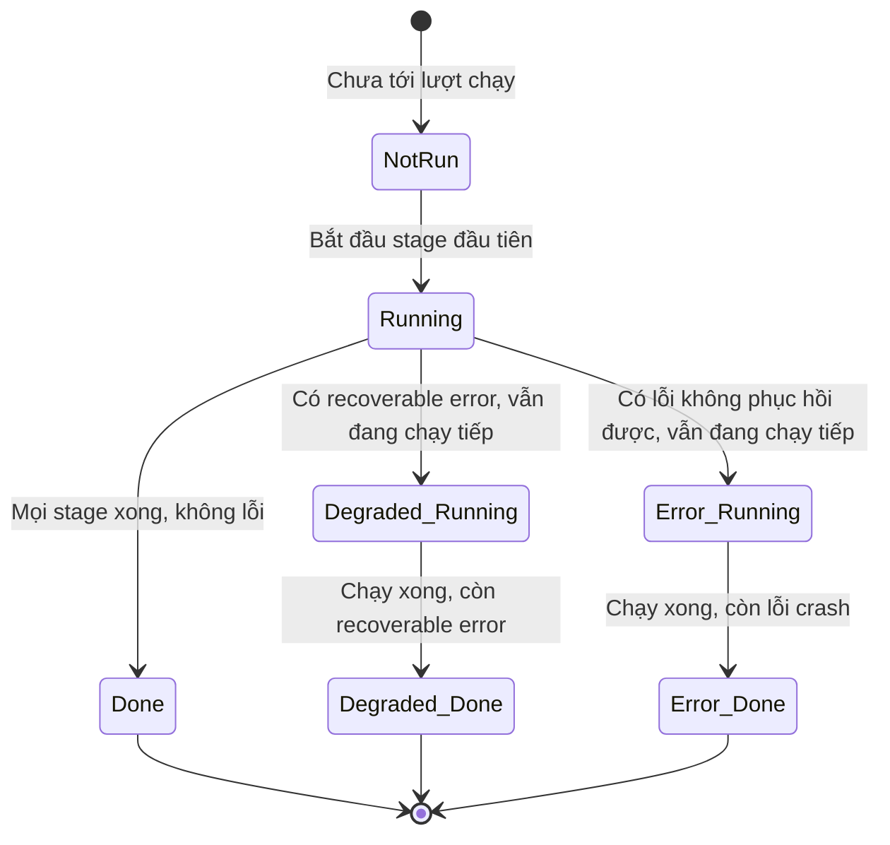

# cloud-init — CLI, Status & Debug

## What it does

> Giống hộp đen trên máy bay: ghi lại toàn bộ hành trình (log), có đèn báo đơn giản cho biết chuyến bay ổn
> hay có sự cố (`status`), và cho phép kỹ thuật viên "bay thử lại" đúng 1 đoạn để tìm lỗi (`single`) mà
> không cần cất cánh lại từ đầu (`clean --reboot`).

Bộ CLI của cloud-init (`cloud-init status`, `analyze`, `clean`, `schema`, `single`, `query`,
`collect-logs`...) là cách duy nhất để biết cloud-init đã chạy xong chưa, chạy đúng không, và để debug/rerun
có kiểm soát khi có sự cố — vì cloud-init chạy hoàn toàn tự động lúc boot, không có UI nào khác báo cho bạn
biết.

## Why it exists

cloud-init chạy im lặng trong background lúc boot. Không có cách hỏi "mày xong chưa" thì script bên ngoài
(CI/CD, orchestrator) không biết khi nào VM thật sự sẵn sàng để SSH vào hay chạy bước tiếp theo — dễ dẫn
tới race condition (SSH vào quá sớm, user chưa được tạo). Bộ CLI giải quyết đúng việc "quan sát được" và
"debug được" một quá trình chạy ngầm.

## How it works

### Trạng thái "status" (đang chạy ra sao)

### Các lựa chọn — Giá trị status

| Lựa chọn | Là gì | Khi nào thấy | Nên làm gì |
|---|---|---|---|
| `not run` | Chưa tới lượt chạy stage nào | Ngay sau boot, trước khi service đầu tiên start | Đợi, hoặc `cloud-init status --wait` |
| `running` | Đang xử lý 1 trong các stage | Giữa quá trình boot | Đợi; nếu treo lâu bất thường xem [[cloud-init--Runbook]] |
| `done` | Chạy xong, không lỗi gì | Boot thành công | Không cần làm gì |
| `error - running` | Có lỗi **không phục hồi** được, nhưng vẫn tiếp tục các stage sau | Module lỗi nặng (exception) nhưng không chặn boot | Xem log, exit code sẽ là `1` khi hoàn tất |
| `error - done` | Đã chạy xong tất cả stage, nhưng có lỗi không phục hồi | Sau khi boot xong mà có lỗi | Xem `/var/log/cloud-init.log`, tìm traceback |
| `degraded running` | Có **recoverable error**, vẫn đang chạy tiếp | Module lỗi nhẹ, có thể tiếp tục | Theo dõi `recoverable_errors` trong `--format json` |
| `degraded done` | Chạy xong, còn recoverable error | Boot "xong" nhưng chưa hoàn hảo 100% | Review field `recoverable_errors`, quyết có cần fix không |
| `disabled` | cloud-init bị tắt hoàn toàn cho boot này | Marker file, kernel cmdline, hoặc `ds-identify` không tìm thấy platform | Xem [[cloud-init--datasources]] và enablement status bên dưới |

`extended_status` (trong `--long`/`--format json`) là field **chính xác và đầy đủ nhất** — phân biệt được
`degraded` với lỗi thật, trong khi field `status` đơn giản hơn có thể gộp chung.

### Các lựa chọn — boot_status_code (enablement status)

Đây là lý do **tại sao** cloud-init được bật/tắt cho boot này — khác hoàn toàn với "status" (đang chạy ra
sao) ở trên:

| Lựa chọn | Là gì |
|---|---|
| `unknown` | `ds-identify` chưa chạy để quyết định |
| `disabled-by-marker-file` | File `/etc/cloud/cloud-init.disabled` tồn tại |
| `disabled-by-generator` | `ds-identify` không tìm thấy datasource nào phù hợp |
| `disabled-by-kernel-command-line` | Kernel cmdline chứa `cloud-init=disabled` |
| `disabled-by-environment-variable` | Env var `KERNEL_CMDLINE` chứa `cloud-init=disabled` |
| `enabled-by-kernel-command-line` | Kernel cmdline chứa `cloud-init=enabled` |
| `enabled-by-generator` | `ds-identify` phát hiện datasource hợp lệ |
| `enabled-by-sysvinit` | Bật mặc định trên hệ SysV init (không phải systemd) |

### Exit code của `cloud-init status`

| Exit code | Ý nghĩa |
|---|---|
| `0` | Chạy xong không lỗi |
| `1` | cloud-init crash |
| `2` *(từ v23.4)* | Chạy xong nhưng có recoverable error |

### Bộ lệnh CLI chính

| Lệnh | Việc chính | Ví dụ |
|---|---|---|
| `status` | Xem trạng thái hiện tại | `cloud-init status --long`, `--wait`, `--format json` |
| `analyze` | Đo thời gian từng bước lúc boot | `cloud-init analyze blame`, `show`, `dump`, `boot` |
| `clean` | Xoá artifact để mô phỏng instance mới | `cloud-init clean --logs --reboot` |
| `schema` | Validate cloud-config bằng JSON schema | `cloud-init schema -c file.yml --annotate`, `--system` |
| `single` | Chạy lại đúng 1 module | `cloud-init single --name set_hostname --frequency always` |
| `query` | Đọc instance-data đã crawl | `cloud-init query --all`, `--list-keys`, `v1.cloud_name` |
| `collect-logs` | Gom log + system info thành 1 file tar để báo lỗi | `cloud-init collect-logs` |
| `devel net-convert` | Test chuyển đổi network config giữa các format | xem [[cloud-init--network-config#Ops notes]] |
| `cloud-init-per` | Chạy 1 lệnh theo tần suất chỉ định, tránh chạy trùng trong 1 boot | `cloud-init-per once hello bash -c '...'` |

## Config gotchas

| Config / thói quen | Vấn đề | Khuyến nghị | Vì sao |
|---|---|---|---|
| `cloud-init status --wait` gọi trong `bootcmd`/`runcmd` | Deadlock | Không bao giờ gọi `status --wait` từ bên trong chính cloud-init | cloud-init đang chạy module đó thì chưa thể "done" — đợi chính nó xong là đợi vô tận |
| `cloud-init clean --configs all` | Xoá luôn config đang hoạt động tốt | Chỉ định đúng loại cần xoá (`ssh_config`/`network`/`datasource`/`fstab`) thay vì `all` nếu không chắc | `all` best-effort xoá mọi loại config do cloud-init sinh ra — có thể xoá nhầm thứ đang cần |
| Chia sẻ output `collect-logs` cho vendor support | Lộ secret | Review `/var/lib/cloud/instance/user-data.txt` trong tarball trước khi gửi đi | File này là user-data **thô**, có thể chứa password/API key nếu user-data không hash kỹ (xem [[cloud-init--user-data-merging#Security notes]]) |

## Hay nhầm lẫn

| Dễ nhầm | Thực tế | Hậu quả khi nhầm |
|---|---|---|
| `status` field vs `extended_status` field | `extended_status` chính xác và đầy đủ hơn, phân biệt được `degraded` | Script tự động chỉ đọc `status` có thể coi `degraded done` là `done` bình thường, bỏ sót lỗi nhẹ |
| `disabled-by-marker-file` vs `disabled-by-generator` | Marker file là **người** chủ động tắt; generator là **ds-identify không tìm thấy platform** — không phải ai tắt | Thấy `disabled-by-generator` mà đi tìm marker file/kernel cmdline → tốn thời gian, nguyên nhân thật là datasource detect fail |
| `cloud-init clean` vs `cloud-init single` | `clean` xoá state để **mô phỏng VM mới** (dùng với `--reboot`); `single` chỉ chạy lại **1 module cụ thể**, không xoá gì | Dùng `clean` khi chỉ muốn test lại 1 module → mất hết state, phải chạy lại từ đầu |

## Ops notes

Quy trình debug chuẩn khi cloud-init "không chạy gì" hoặc "chạy sai":

1. `cloud-init status --long` — xem `extended_status`, `detail` (tên datasource), `errors`.
2. `cat /run/cloud-init/ds-identify.log` — datasource có detect được không.
3. `systemctl status cloud-init-local cloud-init-network cloud-config cloud-final` *(tên service từ v24.3, xem [[cloud-init--boot-stages]])*.
4. Nếu **treo** (hang): `dmesg -T | grep -iE 'warning|error|fatal|exception'`, `systemctl --failed`,
   `systemctl list-jobs --after`, `pstree <PID của cloud-init>`.
5. Validate lại user-data đã đưa vào: `cloud-init schema --system --annotate`.
6. Gom toàn bộ log để báo lỗi/lưu trữ: `cloud-init collect-logs` (tích hợp `apport` trên Ubuntu — có thể
   `ubuntu-bug cloud-init` để tự đính kèm).

## Network

Không áp dụng — CLI chạy local, không tự mở port.

## Security notes

- `cloud-init collect-logs` gom cả `/var/lib/cloud/instance/user-data.txt` (user-data thô) — xem review
  trước khi chia sẻ ở Config gotchas.
- `cloud-init query --all` chạy bằng non-root chỉ thấy giá trị đã redact — đừng chạy bằng `sudo` một cách
  "cho tiện" nếu không thật sự cần field sensitive, tránh tạo thói quen expose field đó ra script/log khác.

## Refs

- [[cloud-init]] — note gốc.
- [[cloud-init--boot-stages]] — ý nghĩa field `stage` trong status JSON.
- [[cloud-init--Runbook]] — checklist hằng ngày & triage dùng chính các lệnh ở đây.
- [CLI commands](https://docs.cloud-init.io/en/latest/reference/cli.html)
- [Debugging cloud-init](https://docs.cloud-init.io/en/latest/howto/debugging.html)
- [Breaking changes — error codes (23.4)](https://docs.cloud-init.io/en/latest/reference/breaking_changes.html)
