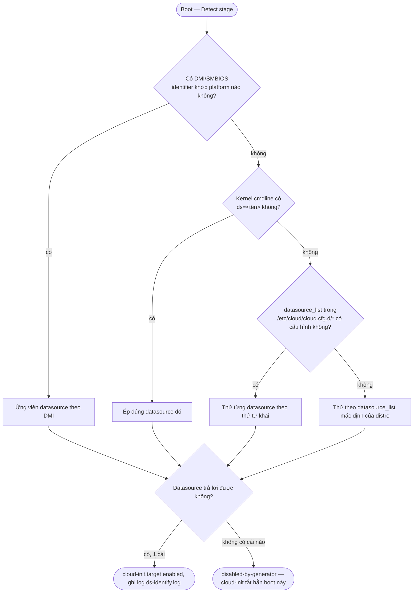

# cloud-init — Datasources

## What it does

> Mỗi hãng taxi công nghệ có app riêng để biết "khách này là ai, đặt xe ở đâu" — xe Grab không đọc được
> yêu cầu đặt qua app Be. Datasource chính là cái "app" đó cho từng cloud platform: biết cách hỏi platform
> "tao là VM nào, mày có gì cho tao" theo đúng ngôn ngữ của platform đó.

Datasource là lớp trừu tượng giữa "nơi data thật sự nằm" (metadata service HTTP, ISO gắn local,
DMI/SMBIOS string...) và phần còn lại của cloud-init (modules chỉ cần biết "có user-data, có meta-data",
không cần biết lấy từ đâu). `ds-identify` là script chạy sớm nhất để dò ra **đúng 1** datasource phù hợp
với platform đang chạy.

## Why it exists

Không có lớp này thì mỗi module (`cc_ssh`, `cc_users_groups`...) phải tự biết cách gọi AWS IMDS khác
CloudStack khác OpenStack khác NoCloud — nhân bản logic lấy data ra khắp nơi. Tách datasource ra riêng để
thêm 1 platform mới chỉ cần viết 1 class `DataSourceXxx`, không đụng vào modules.

## How it works



1. `ds-identify` chạy trong **Detect** stage (tích hợp vào systemd generator, trước cả `cloud-init-local.service`),
   quyết định bật/tắt `cloud-init.target` dựa trên kết quả dò (xem [[cloud-init--boot-stages]]).
2. Thứ tự ưu tiên: DMI/SMBIOS identifier (đặc trưng riêng từng platform) → kernel command line `ds=<tên>`
   (ép cứng) → `datasource_list` trong system config → danh sách mặc định theo distro.
3. Kết quả log vào `/run/cloud-init/ds-identify.log` — đây là file đầu tiên cần xem khi nghi cloud-init
   "không chạy gì cả".
4. **Từ v25.1.4**: trên kiến trúc non-x86 không có DMI data, `ds-identify` **không còn** tự động fallback
   sang "late discovery mode" (dò qua mạng bằng well-known link-local IP) nữa — lý do bảo mật, tránh kẻ xấu
   trên cùng mạng giả làm metadata service. Nếu image non-x86 (ARM...) đột nhiên không detect được
   OpenStack/EC2/AltCloud sau khi upgrade, đây là nguyên nhân — phải ép `datasource_list: [OpenStack]` hoặc
   bật ConfigDrive tường minh.

### Ai thắng khi xung đột

| Bên A | Bên B | Kết quả | Im lặng hay báo lỗi? |
|---|---|---|---|
| Kernel command line `ds=<tên>` | `datasource_list` trong system config | `> [!todo] Cần xác nhận`: docs không nói rõ thứ tự ưu tiên tuyệt đối giữa 2 cơ chế override này khi cả hai cùng khai và khác nhau | — |
| `datasource_list` chỉ có 1 entry (không kèm `None`) | ds-identify không chắc chắn detect được | *(≥v23.4)* Không tự dùng luôn — DS đơn độc không còn auto-trust nếu không chắc; *(23.2)* trước đó thì auto-dùng luôn | Không báo lỗi rõ ràng, chỉ đổi hành vi detect theo version — xem Breaking changes |

## Các lựa chọn — Datasource khi tự build/override

Đây là nhóm datasource bạn **thật sự chọn được** khi tự dựng lab hoặc khi cần ép tay (các platform lớn
còn lại gần như luôn auto-detect, không cần chọn):

| Lựa chọn | Là gì | Khi nào dùng | Bẫy |
|---|---|---|---|
| **NoCloud** | Seed local (file hoặc volume label `CIDATA`) hoặc HTTP(S) (`seedfrom`), gồm `user-data` + `meta-data` + `network-config` + `vendor-data` | Lab, KVM/libvirt/VMware tự dựng, test cloud-config trước khi lên cloud thật | `instance-id` trong `meta-data` không đổi giữa các lần build ISO → cloud-init coi là "đã chạy", không áp lại user-data mới (xem [[cloud-init--boot-stages#First boot determination]]) |
| **ConfigDrive** | Volume/ISO gắn local theo chuẩn OpenStack (label `config-2`/`CONFIG-2`, thư mục `openstack/` + `ec2/`) | OpenStack không có metadata service qua mạng, hoặc cần chắc chắn có network info sớm (trước khi metadata service kịp trả lời) | Version 1 (deprecated) có cấu trúc hoàn toàn khác Version 2 — nhầm version đọc sai file hoàn toàn |
| **OpenStack** | Metadata service qua mạng (`169.254.169.254`), chuẩn OpenStack Nova | VM chạy trên OpenStack có metadata service | Non-x86 không có DMI data: từ **v25.1.4** không còn auto-dò muộn qua mạng — phải ép `datasource_list: [OpenStack]` hoặc dùng ConfigDrive |
| **CloudStack** | Metadata + password server qua virtual router, hostname well-known `data-server.` | VM chạy trên Apache CloudStack | `data-server.` không resolve → dò qua DHCP lease rồi default gateway (chậm hơn); 2 bước đều fail thì datasource fail không báo rõ nguyên nhân gốc |
| **None** | Không datasource nào khả dụng; user-data/meta-data cấp thẳng qua `datasource.None.userdata_raw`/`metadata` trong system config | Fallback cuối cùng, hoặc test cấu hình cứng không cần datasource thật | Không render được network config gì cả; dễ bị rớt khỏi `datasource_list` nếu không khai tường minh (xem Breaking changes 23.4/24.1 bên dưới) |
| **Fallback** *(không phải datasource chọn được)* | Tên hiển thị khi **không tìm thấy** datasource nào cả | — | Dễ nhầm với datasource `None` — xem Hay nhầm lẫn |

Các platform lớn khác (Azure, EC2/AWS, GCE, DigitalOcean, Oracle, OVF/VMware, LXD, MAAS, Scaleway, Vultr,
SmartOS, Akamai, Aliyun, AltCloud, CloudCIX, CloudSigma, Exoscale, NWCS, OpenNebula, RbxCloud, UpCloud,
WSL...) gần như luôn auto-detect, không cần chọn tay — chi tiết từng cái xem
[danh sách datasource chính thức](https://docs.cloud-init.io/en/latest/reference/datasources.html).

## Config gotchas

| Config | Default | Khuyến nghị | Vì sao |
|---|---|---|---|
| `datasource_list` | Danh sách mặc định theo distro (thử nhiều loại) | Ép đúng 1 datasource khi biết chắc platform, đặt trong **1 dòng duy nhất** (`[OpenStack]` không phải nhiều dòng YAML) | Docs cảnh báo: nếu dùng dạng multi-line array, `ds-identify` (viết bằng shell, không parse YAML đầy đủ) sẽ **đọc sai** danh sách |
| `datasource.CloudStack.max_wait` / `.timeout` | `120` / `50` (giây) | Giữ default trừ khi virtual router chậm trả lời có hệ thống | Đặt quá thấp → bỏ cuộc sớm, boot "thành công" nhưng không có user-data nào được áp |
| Kernel cmdline `ds=nocloud*` | — | Chỉ đặt khi thật sự muốn NoCloud | *(trước v23.2)* `ds=nocloud*` chỉ là gợi ý; *(từ v23.2)* nó **ép cứng** luôn — VM nào vô tình có chuỗi này trong cmdline cũ sẽ đổi hành vi sau khi upgrade |

## Hay nhầm lẫn

| Dễ nhầm | Thực tế | Hậu quả khi nhầm |
|---|---|---|
| Datasource `None` vs "Fallback" trong log | `None` là 1 datasource **chọn được**, cấp data qua system config; "Fallback" chỉ là tên hiển thị khi **không có datasource nào** detect được | Thấy "Fallback" trong log mà tưởng đang dùng datasource `None` đã cấu hình → đi sai hướng debug |
| ConfigDrive vs NoCloud | Cả hai đều là seed "local", nhưng ConfigDrive theo chuẩn cấu trúc thư mục OpenStack (`openstack/`, `ec2/`), NoCloud theo format riêng của cloud-init (`user-data`, `meta-data` phẳng) | Tạo seed ISO sai cấu trúc cho datasource đang dùng → datasource báo không tìm thấy, rơi về `None`/Fallback |
| "fallback datasource" (None/Fallback) vs "fallback networking" | "fallback networking" là cơ chế DHCP-on-first-NIC khi **không có** network config nào — khác hoàn toàn khái niệm datasource | Nhầm 2 khái niệm khi đọc log/docs, tưởng network fallback nghĩa là datasource cũng đang fallback |

## Ops notes

- Xem log dò datasource: `cat /run/cloud-init/ds-identify.log`.
- Dò lại thủ công để debug (không ảnh hưởng hệ thống đang chạy):
  ```bash
  sudo DEBUG_LEVEL=2 DI_LOG=stderr /usr/lib/cloud-init/ds-identify --force
  ```
- Xem datasource nào đang active: `cloud-init status --long` → field `detail` (vd `DataSourceCloudStack`,
  `DataSourceNoCloud`).

## Network

Chi tiết port từng datasource hay gọi (IMDS `80/tcp`, CloudStack `80/tcp` + `8080/tcp`, NoCloud HTTP
seed...) nằm ở bảng chính: [[cloud-init#7. Network — Port & Firewall Rules]].

## Security notes

- Late-discovery mode qua mạng (trước v25.1.4) từng là lỗ hổng: kẻ xấu trên cùng L2 có thể giả metadata
  service để cấp user-data độc hại cho VM non-x86 không có DMI. Từ v25.1.4, hành vi này bị tắt mặc định.
- NoCloud + `manual_cache_clean: true` là tổ hợp nguy hiểm: kẻ tấn công có quyền trình diện datasource với
  instance-id khác có thể khiến thiết bị coi đó là "first boot" và reset bằng config của kẻ tấn công
  ([Launchpad #1879530](https://bugs.launchpad.net/ubuntu/+source/cloud-init/+bug/1879530)) — xem thêm
  [[cloud-init--boot-stages#First boot determination]].

## Refs

- [[cloud-init]] — note gốc.
- [[cloud-init--boot-stages]] — Detect stage, first boot determination.
- [[cloud-init--network-config]] — datasource nào cấp network config.
- [Datasources — danh sách đầy đủ](https://docs.cloud-init.io/en/latest/reference/datasources.html)
- [CloudStack datasource](https://docs.cloud-init.io/en/latest/reference/datasources/cloudstack.html)
- [NoCloud datasource](https://docs.cloud-init.io/en/latest/reference/datasources/nocloud.html)
- [ConfigDrive datasource](https://docs.cloud-init.io/en/latest/reference/datasources/configdrive.html)
- [Breaking changes — Datasource identification (23.2-25.1.4)](https://docs.cloud-init.io/en/latest/reference/breaking_changes.html)
