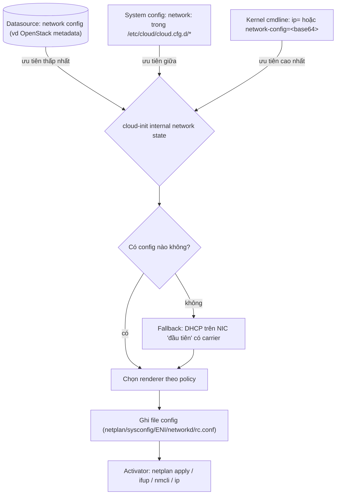

# cloud-init — Network Configuration

## What it does

> Giống 1 phiên dịch viên hội nghị: diễn giả (datasource/system config) chỉ nói 1 thứ tiếng chung (network
> config v1/v2), phiên dịch viên dịch ra đúng ngôn ngữ mà từng đoàn đại biểu (distro) nghe hiểu được —
> đoàn Ubuntu nghe tiếng Netplan, đoàn RHEL nghe tiếng Sysconfig.

cloud-init nhận network config ở **1 định dạng chung** (v1 hoặc v2), chuyển thành internal state, rồi
**renderer** dịch state đó ra định dạng network riêng của từng distro (Netplan, NetworkManager, Sysconfig,
ENI, networkd, BSD `rc.conf`). Sau khi ghi file, **activator** mới là bên thật sự "bật" network lên.

## Why it exists

Mỗi distro có network stack khác nhau, mỗi cloud platform cấp network info theo format khác nhau (OpenStack
Metadata Service Network, Azure IMDS, DigitalOcean JSON...). Nếu không có lớp trung gian này, mỗi cloud lại
phải viết riêng code sinh network config cho từng distro — nhân bản logic. Tách input (network config v1/v2)
khỏi output (renderer) để thêm 1 distro mới chỉ cần viết 1 renderer, không đụng vào logic đọc datasource.

## How it works

1. **Thứ tự nguồn** (ưu tiên tăng dần, cái sau đè cái trước): datasource → system config → kernel command
   line. **User-data không nằm trong danh sách này — nó không thể đổi network config**, bất kể đặt `network:`
   ở đâu trong `#cloud-config` thường (xem [[cloud-init#Ai thắng khi xung đột]]).
2. Không có config nào ở cả 3 nguồn → cloud-init tự sinh **fallback**: DHCP trên interface "đầu tiên" có vẻ
   kết nối được (ưu tiên interface có cờ `carrier` bật). Loại trừ `lo`, `veth*`, bridge, VLAN khỏi danh sách
   ứng viên vì cloud-init chạy quá sớm, các device "ghép" này chưa chắc đã sẵn sàng.
3. **Renderer** được chọn theo policy: thử lần lượt ENI → Sysconfig → Netplan → NetworkManager → FreeBSD →
   NetBSD → OpenBSD → Networkd, **dùng cái đầu tiên có đủ binary/path cần thiết** trên hệ thống. Có thể
   override thứ tự này qua `system_info.network.renderers`.
4. **Activator** là bước riêng, thật sự "bật" network lên: ENI dùng `ifup`/`ifdown`, Netplan dùng `netplan
   apply`, NetworkManager dùng `nmcli`, networkd dùng lệnh `ip`. BSD renderer tự gọi service của nó, không
   cần activator riêng.

### Ai thắng khi xung đột

Nguyên tắc chung: **càng gần kernel/boot loader thì càng thắng**; user-data đứng ngoài hoàn toàn.

| Bên A | Bên B | Kết quả | Im lặng hay báo lỗi? |
|---|---|---|---|
| Kernel cmdline `ip=`/`network-config=` | System config `network:` trong `cloud.cfg.d` | Kernel cmdline thắng | Im lặng |
| System config `network:` | Network config từ datasource (vd OpenStack metadata) | System config thắng | Im lặng |
| `network:` trong user-data `#cloud-config` | Bất kỳ nguồn nào ở trên | User-data **không có tác dụng** | Im lặng — lỗi hay gặp nhất, xem [[cloud-init#Bẫy vận hành]] |
| `network-config=disabled` (kernel cmdline) hoặc `network: {config: disabled}` (cloud config) | Mọi nguồn network config khác | Network config bị tắt hoàn toàn, kể cả fallback | Im lặng — interface không có IP, không báo lỗi rõ ràng trong log cloud-init |

## Các lựa chọn — Network config format

| Lựa chọn | Là gì | Khi nào dùng | Bẫy |
|---|---|---|---|
| **Network config v2** | Subset của format Netplan — `ethernets:`, `bonds:`, `bridges:`, `vlans:` với DHCP/static/route/MTU | Mặc định nên dùng cho config mới — gần với Netplan nên dễ đối chiếu | Chỉ là **subset** của Netplan thật — property Netplan hỗ trợ không chắc cloud-init parse được hết |
| **Network config v1** | Format cũ hơn, danh sách `config:` kiểu "type: physical/bond/vlan" | Tương thích ngược với config cũ, hoặc datasource chỉ cấp v1 | Cú pháp khác hẳn v2, copy nhầm snippet giữa 2 version là lỗi parse ngay |
| **ENI** (`/etc/network/interfaces`) | cloud-init có thể **đọc** (không chỉ ghi) format này | Hệ thống cũ còn cấu hình ENI tay, muốn cloud-init hiểu lại | Chỉ hỗ trợ parse, không phải format "chuẩn" để viết user-data mới |

## Config gotchas

| Config | Default | Khuyến nghị | Vì sao |
|---|---|---|---|
| `network: {config: disabled}` | không set | Chỉ bật khi tự quản network bằng tool khác hoàn toàn | Bật nhầm → interface không có IP nào cả, kể cả fallback DHCP, VM "mất mạng" ngay từ Local stage |
| `disable_network_activation` | `false` | Giữ `false` trừ khi datasource cần network lên **sau** khi cloud-init ghi config (hiếm) | Bật `true` mà không hiểu rõ → network có thể không được "activate" dù đã render đúng file |
| `disable_fallback_netcfg` | `false` hầu hết distro; **PhotonOS và Raspberry Pi OS mặc định không render fallback** | Theo default distro; chỉ set `false` tường minh trên Photon/RPi nếu thật sự cần fallback | Không hiểu default này khác nhau theo distro → thấy Photon/RPi "không tự lấy DHCP" tưởng là bug |
| `system_info.network.renderers` | Policy mặc định (ENI, Sysconfig, Netplan, NetworkManager...) | Chỉ override khi hệ thống có nhiều renderer cùng cài và chọn sai cái | Override sai thứ tự → network render ra format renderer khác không khớp activator thật sự có trên máy |

## Hay nhầm lẫn

| Dễ nhầm | Thực tế | Hậu quả khi nhầm |
|---|---|---|
| Renderer vs Activator | Renderer = ghi file config (netplan YAML, ifcfg...); Activator = lệnh thật sự bật network (`netplan apply`, `ifup`...) | Debug sai chỗ: file config đúng nhưng network không lên vì activator không chạy được (thiếu binary) |
| Network config v1 vs v2 | Cú pháp hoàn toàn khác nhau (`config:` list kiểu khai báo type vs `ethernets:`/`bonds:` kiểu Netplan) | Copy nhầm snippet giữa 2 bản → cloud-init parse lỗi hoặc bỏ qua silent |
| "fallback networking" vs "disable_fallback_netcfg" | Cả hai dùng chữ "fallback" nhưng một là *cơ chế* (DHCP khi không có config), một là *config tắt cơ chế đó* | Đọc lướt dễ nhầm hướng — set nhầm giá trị ngược ý muốn |

## Ops notes

- Test chuyển đổi format mà không cần boot VM thật: `cloud-init devel net-convert -p <input> -k <kind> -d
  <output_dir> -D <distro> -O <renderer>` — ví dụ convert network config v2 sang sysconfig để xem trước kết
  quả.
- Xem renderer nào đã được chọn thực tế: kiểm tra file sinh ra (`/etc/netplan/*.yaml`,
  `/etc/sysconfig/network-scripts/ifcfg-*`, `/etc/network/interfaces.d/*`) khớp với renderer mong đợi.

## Network

Không áp dụng — đây là concept về cách cloud-init *tạo* network config cho OS, không phải port cloud-init
tự dùng. Port/firewall cloud-init cần để lấy network config từ datasource: xem
[[cloud-init#7. Network — Port & Firewall Rules]].

## Security notes

- `network-config=disabled` qua kernel cmdline là cách tắt toàn bộ network config của cloud-init — ai sửa
  được bootloader/kernel cmdline là kiểm soát được việc VM có mạng hay không ngay từ boot.
- Fallback DHCP trên "interface đầu tiên có carrier" nghĩa là nếu VM có nhiều NIC (1 NIC quản trị, 1 NIC
  untrusted), không cấu hình network config tường minh có thể khiến cloud-init DHCP nhầm lên NIC untrusted.

## Refs

- [[cloud-init]] — note gốc, bảng network/port tổng.
- [[cloud-init--datasources]] — datasource nào cấp network config (OpenStack, DigitalOcean, LXD, NoCloud, SmartOS, UpCloud, Vultr).
- [Network configuration](https://docs.cloud-init.io/en/latest/reference/network-config.html)
- [Networking config Version 2](https://docs.cloud-init.io/en/latest/reference/network-config-format-v2.html)
- [Networking config Version 1](https://docs.cloud-init.io/en/latest/reference/network-config-format-v1.html)
