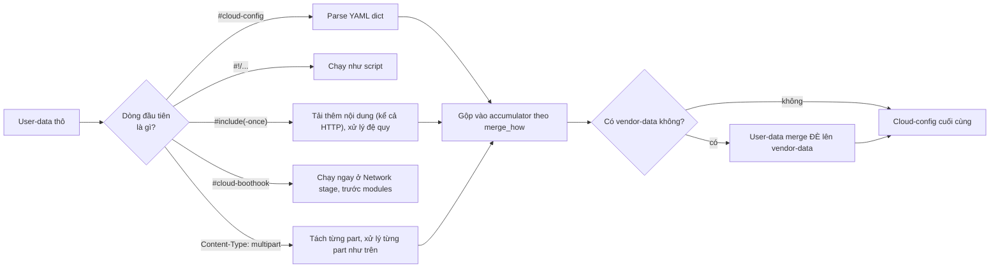

# cloud-init — User-data Formats & Merging

## What it does

> Hình dung user-data như thư gửi qua bưu điện: cái phong bì có thể là thư thường (`#cloud-config`), gói
> hàng (script thực thi), hộp chứa nhiều gói nhỏ bên trong (MIME archive), hoặc tờ giấy ghi "đi lấy ở địa
> chỉ khác" (`#include`). cloud-init đọc đúng 1 dòng đầu tiên để biết đang cầm loại phong bì nào, rồi xử lý
> đúng cách.

cloud-init nhận diện định dạng user-data qua **dòng đầu tiên** của nội dung, hỗ trợ nhiều format khác nhau
(cloud-config YAML, script thực thi, include file khác, archive nhiều phần...). Khi có **nhiều phần**
cloud-config cần gộp lại (do `#include` hoặc nhiều nguồn user-data/vendor-data), cloud-init dùng luật
**merging** để quyết dict/list/string chồng lên nhau ra sao.

## Why it exists

Một file YAML duy nhất không đủ linh hoạt: có lúc cần chạy script thuần thay vì khai YAML, có lúc cần tách
config thành nhiều file rồi include lại (dễ tái sử dụng), có lúc 2 nguồn (user-data của người launch VM +
vendor-data của cloud provider) cùng khai `runcmd` — cần luật rõ ràng để biết **lệnh nào mất, lệnh nào còn**
thay vì 1 bên ghi đè bên kia hoàn toàn trong im lặng.

## How it works

1. Nếu dòng đầu là `## template: jinja`, cloud-init render Jinja template **trước**, dùng
   `instance-data.json` làm biến — vd `{{ v1.cloud_name }}`, `{{ instance_id }}` — rồi mới parse tiếp theo
   format bên dưới.
2. `#include`/`#include-once` tải thêm nội dung (kể cả qua HTTP), xử lý **đệ quy** — file include có thể
   include tiếp file khác.
3. Mỗi phần cloud-config được **merge** vào 1 accumulator chung theo thứ tự xử lý; luật merge mặc định là
   `list()+dict()+str()` (không ghi đè, chỉ thêm) trừ khi phần đó tự khai `merge_how`/`#merge-type` khác đi.
4. Sau khi tất cả user-data đã merge xong, nếu có **vendor-data**, user-data cuối cùng sẽ được merge **đè
   lên** vendor-data — user luôn thắng.

### Ai thắng khi xung đột

Nguyên tắc chung: **user-data luôn thắng vendor-data**; trong nội bộ user-data, **phần xử lý sau quyết định
cách nó merge vào accumulator trước đó** (không phải phần trước quyết định).

| Bên A | Bên B | Kết quả | Im lặng hay báo lỗi? |
|---|---|---|---|
| User-supplied cloud-config | Vendor-data cloud-config (cùng key) | User-data thắng, merge đè lên vendor-data | Im lặng |
| `merge_how` dict option `recurse_dict` | — | Default `True` — dict con tự động merge đệ quy | — |
| `merge_how` dict option `recurse_list` | — | Default `False` — list bên trong dict **không** tự đệ quy merge trừ khi bật | Quên bật `recurse_list` khi cần merge sâu list lồng trong dict → list bị thay nguyên khối thay vì gộp |
| List merge `no_replace` *(default)* | List merge `replace` | `no_replace`: giữ nguyên list cũ, bỏ qua giá trị mới trùng; `replace`: list mới thay hẳn list cũ | Im lặng theo cả 2 chiều — cần đọc `merge_how` để biết đang ở chế độ nào |

## Các lựa chọn — User-data content format

| Lựa chọn | Header dòng đầu | Khi nào dùng | Bẫy |
|---|---|---|---|
| **Cloud-config** | `#cloud-config` | Mặc định cho hầu hết use case — khai báo YAML, map thẳng vào các module `cc_*` | YAML sai indent là lỗi phổ biến nhất; luôn validate bằng `cloud-init schema` trước khi gắn vào VM |
| **User-data script** | `#!/bin/sh` (hoặc shebang bất kỳ) | Cần logic phức tạp mà cloud-config không diễn tả được | Chạy 1 lần ở Final stage như rc.local — không có cơ chế merge với script khác, script sau không "gộp" vào script trước |
| **Include file** | `#include` | Tách config ra nhiều file để tái sử dụng | Xử lý đệ quy — include vòng lặp (A include B, B include A) có thể treo |
| **Include once** | `#include-once` | Giống `#include` nhưng chỉ tải **1 lần** dù rerun nhiều lần | Nhầm với `#include` thường — dùng sai loại cho file cần tải lại mỗi lần |
| **Cloud boothook** | `#cloud-boothook` | Script cần chạy **sớm** (ở Network stage, trước khi modules chạy), chạy **mỗi boot** | Chạy mỗi boot chứ không phải mỗi instance — dễ gây side-effect lặp nếu script không idempotent |
| **Cloud-config archive** | `#cloud-config-archive` | Gộp nhiều cloud-config nhỏ vào 1 file duy nhất, dạng YAML list | Ít dùng hơn MIME multipart; dễ nhầm cấu trúc với cloud-config thường |
| **Cloud-config JSONP** | `#cloud-config-jsonp` | Patch/thêm field vào 1 cloud-config đã có mà không viết lại cả YAML | Cú pháp JSON-patch, không phải YAML thường — dễ viết nhầm |
| **MIME multi-part** | `Content-Type: multipart/mixed` | Gộp nhiều format khác nhau (cloud-config + script + boothook) trong 1 payload, kiểm soát `merge_how` qua header `Merge-Type` | Soạn tay MIME dễ sai boundary; nên dùng tool sinh MIME (`write-mime-multipart`) thay vì viết tay |
| **Gzip** | *(nén trước khi base64, áp dụng cho mọi format trên)* | Payload lớn vượt giới hạn size của datasource (vd EC2 user-data giới hạn dung lượng) | Quên gzip khi payload vượt giới hạn → datasource cắt bớt nội dung, lỗi parse khó hiểu |
| **Jinja template** | `## template: jinja` (dòng đầu, trước cả header format khác) | Cần giá trị động theo từng instance (hostname theo region, v.v.) | Biến không tồn tại → `CI_MISSING_JINJA_VAR` thay vì lỗi dừng hẳn, dễ bị bỏ sót lúc review |

## Config gotchas

| Config | Default | Khuyến nghị | Vì sao |
|---|---|---|---|
| `vendor_data.enabled` | `true` | Giữ `true` trừ khi không tin provider | Tắt có thể mất config provider cần (driver, agent) — xem [[cloud-init#8. Security Considerations]] |
| `vendor_data.prefix` / `vendordata.excluded` | — | Dùng để chặn **1 phần cụ thể** của vendor-data (vd `text/part-handler`) thay vì tắt hết | Tắt hết vendor-data vì chỉ muốn chặn 1 part là quá tay, mất luôn phần hữu ích |
| `user.plain_text_passwd` / `chpasswd` dạng plaintext | — | Dùng `hashed_passwd` hoặc `ssh_authorized_keys`/`ssh_import_id` | Metadata service nhiều platform không xác thực caller trong VM — plaintext password lộ cho bất kỳ process nào đọc được endpoint |
| Đọc `instance-data-sensitive.json` | Chỉ root đọc được; non-root thấy `CI_MISSING_JINJA_VAR` hoặc giá trị redacted | Không chạy `cloud-init query --all` bằng non-root rồi thắc mắc thiếu field | Thiết kế có chủ đích để tránh lộ secret cho user thường trong VM |

## Hay nhầm lẫn

| Dễ nhầm | Thực tế | Hậu quả khi nhầm |
|---|---|---|
| `#include` vs `#include-once` | `#include` tải lại mỗi lần xử lý; `#include-once` chỉ tải đúng 1 lần | Dùng `#include` cho file cần giữ cố định → vô tình tải lại bản mới mỗi lần rerun, phá vỡ tính "đã chạy rồi" |
| `#cloud-config-archive` vs MIME multipart | Cả hai đều gộp nhiều phần, nhưng archive chỉ chứa cloud-config (YAML list), MIME multipart chứa được mọi loại format trộn lẫn | Cần trộn script + cloud-config mà chọn nhầm archive → không parse được phần script |
| `merge_how` áp cho dict (`recurse_dict` default `True`) vs cho list bên trong dict (`recurse_list` default `False`) | Hai cờ khác nhau, default khác nhau | Tưởng bật `recurse_dict` là đủ để merge sâu mọi thứ kể cả list lồng bên trong — thực ra list vẫn bị thay nguyên khối |

## Ops notes

- Validate trước khi gắn vào VM: `cloud-init schema -c ./my-config.yml --annotate` (hoặc `--system` để check
  config đang chạy thật trên máy).
- Xem toàn bộ instance-data đã crawl được: `cloud-init query --all` (cần root để thấy field sensitive).
- Liệt kê key có thể query: `cloud-init query --list-keys`.
- Test jinja format trước khi đưa vào user-data: `cloud-init query --format 'custom-{{instance_id}}.{{v1.cloud_name}}.com'`.

## Network

`#include`/`#include-once` có thể tải nội dung qua HTTP(S) — xem rủi ro ở Security notes bên dưới. Port cụ
thể theo datasource nằm ở [[cloud-init#7. Network — Port & Firewall Rules]].

## Security notes

- `#include` tải qua **HTTP thường** (không bắt buộc HTTPS) là nguy cơ MITM chèn user-data độc hại — luôn
  dùng HTTPS cho include URL nằm ngoài mạng tin cậy.
- Đừng để plaintext password/API key trong bất kỳ format nào (script, cloud-config, boothook) — log
  `/var/log/cloud-init-output.log` thường in lại toàn bộ output script, kể cả khi script có `echo` credential
  ra ngoài để debug.
- `instance-data-sensitive.json` chỉ root đọc được — đừng nới quyền file này để "tiện debug", nó chứa đúng
  những field mà thiết kế gốc muốn giấu user thường trong VM.

## Refs

- [[cloud-init]] — note gốc.
- [[cloud-init--boot-stages]] — boothook chạy ở Network stage, trước modules.
- [[cloud-init--datasources]] — vendor-data do datasource nào cấp.
- [User-data formats](https://docs.cloud-init.io/en/latest/explanation/format.html)
- [Merging cloud-config](https://docs.cloud-init.io/en/latest/reference/merging.html)
- [Vendor-data](https://docs.cloud-init.io/en/latest/explanation/vendordata.html)
- [Instance-data](https://docs.cloud-init.io/en/latest/explanation/instancedata.html)
