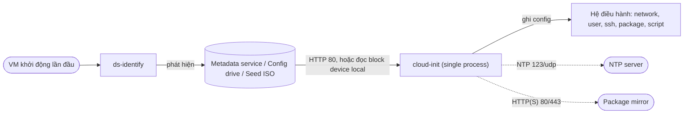
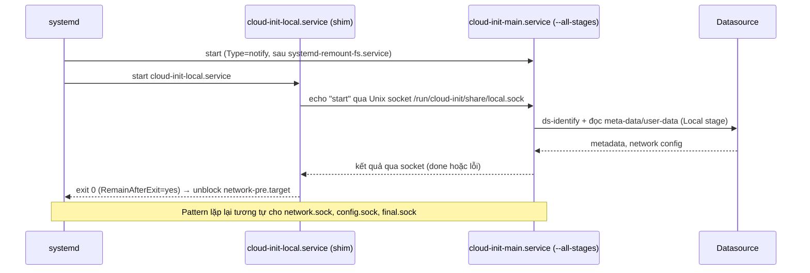

# cloud-init — Tool tự động cấu hình VM lúc boot lần đầu

> [!info] Phạm vi version
> Note áp dụng cho **cloud-init 26.2** (latest stable tại 2026-10-04, xác nhận qua
> [docs.cloud-init.io/en/latest](https://docs.cloud-init.io/en/latest/) và
> [GitHub releases canonical/cloud-init](https://github.com/canonical/cloud-init/releases)).
> Khác biệt ở version khác được đánh dấu inline: `(từ v24.3)`, `(trước v23.4)`.

> [!warning] Kiến trúc đổi khá nhiều từ v24.3
> Nếu bạn quen cloud-init đời cũ (4 process riêng, service tên `cloud-init.service`), đọc kỹ
> [[#10. Gotchas & Lessons Learned|phần Gotchas]] trước — tên service và cách debug đã đổi.

## 1. What — Nó là cái gì?

> Hình dung lúc check-in khách sạn: phòng nào cũng giống hệt nhau (cùng giường, cùng tivi — đây là
> "golden image"), nhưng lễ tân đưa cho mỗi khách một tờ hướng dẫn riêng (tên khách, mã wifi riêng,
> yêu cầu dọn phòng...) — khách tự đọc tờ đó và tự chỉnh phòng theo ý mình. cloud-init chính là ông
> khách tự giác đó, chạy ngay khi VM vừa "nhận phòng".

Cụ thể: cloud-init là tool chạy trong giai đoạn boot đầu tiên của VM/instance, đọc **meta-data** và
**user-data** do platform (cloud, hypervisor, hoặc file seed local) cung cấp, rồi tự áp dụng hostname,
network, user/SSH key, package, script... để biến một image chung thành một instance riêng biệt. Nó là
de-facto standard cho Linux/BSD trên gần như mọi cloud lớn (AWS, Azure, GCP, OpenStack, CloudStack...) và
cả bare-metal/KVM thủ công.

## 2. Why — Tại sao tồn tại / Vấn đề nó giải quyết?

Không có cloud-init thì sao? Bạn phải: build riêng một image cho từng mục đích (baked-in SSH key, baked-in
hostname), hoặc SSH vào sau khi boot để config tay — nhưng SSH vào bằng gì khi chưa có key nào được đặt
riêng cho VM đó? Thường thì người ta nhét chung 1 SSH key/password vào image gốc, thế là **mọi VM clone từ
image đó dùng chung 1 bí mật** — ai lộ 1 VM là lộ cả fleet.

cloud-init giải quyết đúng bài toán "cá nhân hoá" này: image build 1 lần, mỗi instance tự nhận config
riêng (SSH key riêng, hostname riêng, script riêng) ngay từ lúc boot đầu tiên, không cần ai đăng nhập tay.
Đây là thứ làm cho auto-scaling, golden image, immutable infrastructure chạy được ở quy mô lớn.

## 3. When — Dùng khi nào / KHÔNG dùng khi nào?

**Dùng khi:**
- Launch VM từ cloud image trên platform có cấp meta-data/user-data: AWS EC2, Azure, GCE, OpenStack,
  CloudStack, LXD, DigitalOcean, Oracle Cloud...
- Tự build lab bằng KVM/libvirt/VMware và muốn tự động hoá provisioning qua seed ISO (NoCloud).
- Build golden image dùng chung cho nhiều mục đích, cần cá nhân hoá lúc launch.

**KHÔNG dùng / cân nhắc thay thế khi:**
- Guest là **Windows** — cloud-init chỉ cho Linux/BSD; Windows dùng
  [cloudbase-init](https://cloudbase-init.readthedocs.io/) (project khác, config khác format).
- Cần quản lý config **liên tục sau khi đã chạy xong** (drift, re-apply định kỳ) — cloud-init chủ yếu chạy
  1 lần mỗi instance (xem `frequency` ở [[cloud-init--boot-stages]]); dùng Ansible/Puppet/Chef/SaltStack
  cho việc đó (cloud-init có thể *kích hoạt* chúng ở final stage, nhưng không thay thế).
- Container (Docker/Kubernetes pod) — dùng cơ chế init riêng của container runtime, cloud-init không chạy
  trong container namespace thông thường.

## 4. Where — Architecture & Deployment



Datasource có thể qua mạng (metadata service kiểu AWS/OpenStack/CloudStack) hoặc hoàn toàn local (ISO/volume
gắn vào VM — NoCloud, ConfigDrive). Chi tiết từng loại: [[cloud-init--datasources]].

### Mô hình triển khai

cloud-init không chạy dạng cluster/HA — mỗi VM chạy độc lập 1 bản. "Mô hình triển khai" ở đây là cách
datasource được **đưa tới** instance:

| Mô hình | Khi nào chọn | Số node tối thiểu | Không bảo vệ được |
|---|---|---|---|
| Metadata service qua mạng (EC2, Azure, GCE, OpenStack, CloudStack) | VM chạy trên cloud platform có sẵn metadata service | 1 (mỗi VM độc lập) | Mất kết nối metadata service lúc boot → cloud-init không tìm được datasource, instance boot "trần", không có SSH key |
| Local seed (NoCloud ISO/volume, ConfigDrive) | Lab, bare-metal, KVM/libvirt thủ công, môi trường air-gapped | 1 | Seed thiếu file bắt buộc (`meta-data` cần `instance-id`) → datasource fail, fallback về `None` |
| Hybrid (ConfigDrive cấp network info trước, sau đó tiếp tục dò EC2-style) | OpenStack khi không có metadata service, hoặc muốn chắc chắn có network info sớm | 1 | Vẫn phụ thuộc cấu trúc thư mục `openstack/`/`ec2/` đúng chuẩn |

- **Vị trí trong hệ thống:** chạy ngay sau kernel init, trước khi hệ thống login được — là cầu nối giữa
  "image chung" và "instance riêng".
- **Component chính:** `ds-identify` (phát hiện platform, chạy trong systemd generator) — chi tiết
  [[cloud-init--datasources]]; cloud-init main process (`--all-stages`) — chi tiết
  [[cloud-init--boot-stages]]; module `cc_*.py` (mỗi module xử lý 1 phần việc: user, ssh, network,
  package...) — chi tiết [[cloud-init--user-data-merging]]; renderer (ghi network config ra định dạng
  distro) — chi tiết [[cloud-init--network-config]].
- **Traffic/data flow:** Platform → (network hoặc local) → `ds-identify` chọn datasource → cloud-init đọc
  meta-data/user-data/vendor-data/network-config → áp dụng qua modules theo thứ tự stage → ghi state vào
  `/var/lib/cloud/instance`.
- **Dependency:** cần `/` mounted read-write sớm; cần network lên cho hầu hết datasource (trừ seed local
  thuần); cần NTP cho giờ đúng (ảnh hưởng validate cert/token ở script sau); cần package mirror nếu
  `package_update`/`package_upgrade` bật ở final stage.

## 5. How — Cơ chế hoạt động

Core concepts cần nắm:

- **Datasource** — "nơi phát data", được `ds-identify` dò ra lúc boot, mỗi platform một kiểu khác nhau.
  → [[cloud-init--datasources]]
- **Boot stages** (Detect → Local → Network → Config → Final) — khung xương quyết định module nào chạy
  lúc nào, network đã sẵn sàng hay chưa. → [[cloud-init--boot-stages]]
- **user-data / vendor-data / meta-data + merging** — ba nguồn data khác chủ, khác quyền, có thể trộn vào
  nhau theo luật riêng. → [[cloud-init--user-data-merging]]
- **Network config rendering** — cloud-init tự quyết network config rồi "dịch" ra định dạng của từng
  distro (netplan, sysconfig, ENI...). → [[cloud-init--network-config]]
- **Module & frequency** *(Tier 1)* — mỗi module `cc_*` nằm trong 1 trong 3 danh sách
  `cloud_init_modules`/`cloud_config_modules`/`cloud_final_modules` của `/etc/cloud/cloud.cfg`, và có
  `frequency` riêng: `once-per-instance` (default — chạy lại mỗi khi có instance-id mới), `always` (mỗi
  boot), `once` (đúng 1 lần, không reset dù clone sang VM khác). Đổi frequency tạm thời bằng
  `cloud-init single --name <module> --frequency always`.
- **CLI & status/debug** — cách hỏi cloud-init "mày xong chưa, có lỗi gì không". → [[cloud-init--cli-status-debug]]

### Ai thắng khi xung đột

Nguyên tắc chung: **network config không bao giờ đọc từ user-data** — chỉ datasource, system config, hoặc
kernel command line mới được quyền chỉnh network; **user-data luôn thắng vendor-data** khi cả hai cùng cấu
hình một key.

| Bên A | Bên B | Kết quả | Im lặng hay báo lỗi? |
|---|---|---|---|
| `network:` khai trong `#cloud-config` user-data | Network config từ datasource/system config | User-data **không có tác dụng gì** lên network | Im lặng — không có warning, user tưởng đã áp dụng |
| User-data cloud-config | Vendor-data cloud-config (cùng key) | User-data thắng, merge đè lên vendor-data | Im lặng |
| `manual_cache_clean: true` (trust mode) | instance-id mới từ datasource | cloud-init **vẫn coi là boot cũ**, không chạy lại per-instance config | Im lặng — rủi ro bảo mật, xem Gotchas |
| `merge_how` khai trong phần cloud-config đến sau | `merge_how` khai ở phần trước đó | Mỗi phần tự quyết merge_how cho chính nó lúc được gộp vào accumulator; không khai gì thì dùng mặc định `list()+dict()+str()` | Im lặng |



Từ **v24.3**, cloud-init không còn chạy 4 process Python riêng cho 4 stage nữa — chỉ 1 process duy nhất
(`cloud-init --all-stages`), các service `cloud-init-local/network/config/final.service` giờ chỉ là
"shim" rỗng nói chuyện qua Unix socket để giữ đúng thứ tự systemd. Lý do: đỡ tốn thời gian khởi động lại
Python interpreter 4 lần. Chi tiết timing/ordering từng stage: [[cloud-init--boot-stages]].

## 6. Key Config — Cấu hình cần nhớ

| Config | Default | Khuyến nghị | Vì sao |
|---|---|---|---|
| `disable_root` | `true` (hầu hết distro; `false` trên FreeBSD/Photon) | Giữ `true` | Root không login SSH trực tiếp được — tắt (`false`) là mở thẳng cửa root qua SSH, mất audit trail qua sudo |
| `ssh_pwauth` | "unchanged" — giữ nguyên default distro; set cứng `false` trên RHEL-family/Alpine/Amazon | `false` | Bật password auth qua SSH trên VM public IP là mời brute-force vào nhà chơi |
| `ssh_deletekeys` | `true` | Giữ `true` | Xoá SSH host key tĩnh có sẵn trong image gốc để mỗi instance tự sinh key riêng; tắt đi thì mọi VM từ cùng image dùng chung host key → MITM dễ |
| `manual_cache_clean` | `false` (chế độ `check`: so instance-id để nhận biết first boot) | Giữ `false` trừ khi hiểu rõ hệ quả | `true` (chế độ `trust`) khiến image capture từ VM đang chạy bị coi là "không phải first boot" ở VM con → SSH host key không rotate (xem Gotchas) |
| `package_update` / `package_upgrade` | `false` / `false` | `true`/`true` cho pipeline build image, `false` cho VM đã patch sẵn | Bật mà không khoá version → VM mới launch có thể dính bản vá breaking ngay lúc đó |
| `datasource_list` | tự dò qua `ds-identify` | Chỉ định rõ 1 datasource nếu `ds-identify` hay đoán nhầm hoặc muốn boot nhanh hơn | Dò tự động thử nhiều loại tốn thời gian; sai thứ tự có thể dò nhầm trên image multi-cloud |
| `vendor_data.enabled` | `true` | Giữ `true` trừ khi không tin cloud provider | Tắt vendor-data có thể làm mất config provider cần (driver, agent quan trọng) |
| `growpart.mode` | `auto` | Giữ `auto`, chỉ định cụ thể nếu disk ảo lạ (multipath...) | `auto` tự thử nhiều backend (`growpart`, `gpart`); disk lạ có thể cần backend chỉ định tay |
| `network: {config: disabled}` | không set (cloud-init tự render DHCP fallback) | `disabled` nếu bạn tự quản network bằng tool khác (Netplan tay, NetworkManager tay...) | Để cloud-init tự render mà không muốn → nó ghi đè config tay của bạn ở mỗi first boot |

## 7. Network — Port & Firewall Rules

cloud-init là **client**, không mở port để nghe — bảng dưới là những gì nó cần **gọi ra ngoài** để lấy
data và hoàn tất setup.

| Nguồn → Đích | Port/Proto | Mục đích | Default? | Triệu chứng khi bị chặn |
|---|---|---|---|---|
| VM → Instance Metadata Service (`169.254.169.254` kiểu EC2/OpenStack/Azure/GCE) | `80/tcp` | Lấy meta-data/user-data qua HTTP | có | `ds-identify.log` không detect được datasource; `cloud-init status --long` báo `disabled-by-generator` hoặc log có `DataSourceNotFoundException` |
| VM → CloudStack virtual router (`data-server.`) | `80/tcp` | Lấy user-data/meta-data qua `http://data-server./latest/...` | có | Log không resolve được `data-server.`, cloud-init fallback dò qua DHCP lease rồi default gateway |
| VM → CloudStack virtual router | `8080/tcp` | Password server — request `DomU_Request: send_my_password` | có, cố định trong code | Request timeout → user không login được bằng password set lúc tạo VM; xem [[cloud-init--datasources#Các lựa chọn — Datasource khi tự build/override]] |
| VM → NoCloud seed qua HTTP(S) (`datasource.NoCloud.seedfrom`) | `80/443 tcp` (theo URL cấu hình) | Tải `user-data`/`meta-data`/`network-config` từ seed server | tuỳ cấu hình | `ds-identify.log` báo không tải được seed, cloud-init rơi về datasource `None` |
| VM → ConfigDrive/NoCloud seed trên block device local | không qua mạng | Đọc trực tiếp ISO/volume gắn local | n/a | Thiếu file `meta-data`/`instance-id` → datasource fail, không log network nào cả |
| VM → NTP server | `123/udp` | Đồng bộ giờ hệ thống | có (module `ntp`, chrony/ntp mặc định) | Giờ lệch không báo lỗi ngay; về sau cert/token bị reject ngẫu nhiên ở script chạy sau |
| VM → package mirror | `80/443 tcp` | `package_update`/`package_upgrade`/cài gói ở final stage | có | Module `package_update_upgrade_install` fail, log apt/yum báo lỗi network |
| VM → endpoint `phone_home` | theo cấu hình (thường `443/tcp`) | Module `phone_home` POST kết quả cloud-init về | tắt mặc định | — |

^ports

**Kiểm tra nhanh khi nghi rule bị xoá:**

```bash
# TCP: "succeeded" = thông; "Connection refused" = thông mạng nhưng không có gì listen; timeout = bị firewall drop
nc -vz -w 3 169.254.169.254 80
nc -vz -w 3 <virtual-router-ip> 8080
```

> [!tip] Timeout vs refused
> `Connection timed out` gần như luôn là firewall/security group drop packet. `Connection refused` là
> mạng đã thông nhưng không có process listen (metadata service chết hoặc bind sai). UDP (NTP) không
> check tin cậy bằng `nc` — dùng `chronyc sources` hoặc `ntpq -p` ở application layer.

## 8. Security Considerations

### Attack surface

- **Metadata/user-data endpoint** (IMDS, ConfigDrive, NoCloud HTTP seed) — bất kỳ process nào trong VM
  (kể cả container share network namespace với host) đọc được endpoint này là đọc được toàn bộ user-data,
  password, SSH key của chính instance đó.
- **`/var/log/cloud-init.log` và `cloud-init-output.log`** — chứa output của `runcmd`/script; ai đọc được
  log là có thể thấy credential nếu script lỡ echo ra.
- **CloudStack password server** (port `8080/tcp` tới virtual router) — password gửi dạng plaintext qua
  HTTP nội bộ guest ↔ VR; ai sniff được mạng đó là có password.

### Misconfiguration gây breach

| Misconfiguration | Hậu quả |
|---|---|
| Đặt `plain_text_passwd` thay vì `hashed_passwd` trong module users/set_passwords | VM khác đọc được metadata service (nhiều platform không xác thực ai gọi) → lộ password dạng rõ |
| `manual_cache_clean: true` rồi capture image lúc đang "trust" làm template | SSH host key **không rotate** ở mọi VM con từ template đó → dùng chung 1 host key, MITM dễ |
| Tắt `vendor_data.enabled` mà không biết nó còn mang theo agent/driver bảo mật của provider | Mất bản vá hoặc agent giám sát mà provider trông cậy vào |
| `disable_root: false` trên image custom | Root login thẳng qua SSH, bỏ qua audit trail qua sudo |

### Hardening checklist tối thiểu

- [ ] Không bao giờ dùng `plain_text_passwd`; dùng `hashed_passwd` hoặc `ssh_authorized_keys`/`ssh_import_id` — vì metadata/password server thường không xác thực caller trong VM
- [ ] Giữ `disable_root: true` và `ssh_pwauth` theo default distro (thường `false`) — giảm bề mặt SSH brute-force
- [ ] `manual_cache_clean` chỉ bật khi hiểu rõ hệ quả; luôn `cloud-init clean --logs` trước khi capture image làm template — tránh SSH host key dùng chung
- [ ] Review `/var/log/cloud-init-output.log` trước khi forward vào hệ thống log tập trung — `runcmd` có thể in credential ra log
- [ ] Giới hạn ai truy cập được metadata endpoint/password server ở network layer (security group, VR firewall) — vì bản thân endpoint thường không xác thực
- [ ] Verify SSH host key in ra serial console lúc boot trước khi SSH lần đầu — chống MITM

## 9. Ops Runbook — Production Notes

> [!tip] Checklist hằng ngày & triage sự cố
> Phần này giải thích *vì sao*. Làm gì mỗi ngày và xử lý sự cố theo triệu chứng: [[cloud-init--Runbook]].

- **Health check:** `cloud-init status --wait` — block tới khi xong, exit code `0` = OK, `1` = crash, `2` =
  xong nhưng có recoverable error. Dùng `--long`/`--format json` để lấy `extended_status` chi tiết hơn field
  `status` thường. Chi tiết: [[cloud-init--cli-status-debug]].
- **Log quan trọng:** `/var/log/cloud-init.log` (toàn bộ log debug), `/var/log/cloud-init-output.log` (stdout/stderr
  của module và script), `/run/cloud-init/ds-identify.log` (quá trình dò datasource) — path này không đổi theo
  package/container miễn là cài qua package manager chuẩn của distro.
- **Metric cần alert:** cloud-init không expose metric endpoint sẵn. Gợi ý: alert khi exit code của
  `cloud-init status` ≠ 0/2 sau khi instance đã "running" quá N phút, hoặc dùng module `phone_home` để tự
  báo kết quả về hệ thống giám sát.
- **Restart/rollback:** không nên re-run toàn bộ tuỳ tiện — nhiều module **không idempotent**
  (`users_groups` tạo lại user có thể lỗi nếu đã tồn tại). Muốn test lại 1 module: `cloud-init single --name
  <module> --frequency always`. Muốn reset hẳn về trạng thái "chưa từng chạy": `cloud-init clean --logs --reboot`.
- **Backup/restore:** không áp dụng theo nghĩa service-level (cloud-init chạy per-instance, không giữ state
  lâu dài ngoài `/var/lib/cloud`), nhưng **file `/etc/cloud/cloud.cfg.d/*.cfg` trong golden image** cần nằm
  trong pipeline build/version-control image.
- **Upgrade:** qua package manager của distro như mọi package khác. Từ **v24.3**, kiến trúc đổi sang
  single-process — nếu có script/monitoring hardcode tên service cũ, phải sửa (xem Gotchas).

## 10. Gotchas & Lessons Learned

### Hay nhầm lẫn

| Dễ nhầm | Thực tế | Hậu quả khi nhầm |
|---|---|---|
| user-data vs vendor-data vs meta-data | user-data = người launch VM cấp; vendor-data = cloud provider cấp sẵn; meta-data = thông tin platform *mô tả* instance (machine-id, hostname...), không phải nơi để nhét config | Tưởng vendor-data là chỗ mình chỉnh, sửa nhầm chỗ hoặc không hiểu tại sao config của mình bị provider "ghi đè" |
| cloud-init vs cloudbase-init | cloud-init chỉ cho Linux/BSD; Windows dùng cloudbase-init, project hoàn toàn khác, config khác format | Tìm log `/var/log/cloud-init.log` trên Windows VM là vô ích |
| `cloud-init.service` *(tên cũ, trước v24.3)* vs `cloud-init-network.service` *(từ v24.3)* | Đổi tên khi chuyển sang kiến trúc single-process | Script/monitoring cũ check `systemctl status cloud-init.service` báo "unit not found" từ v24.3 trở đi |
| `status` field vs `extended_status` field trong `cloud-init status --long` | `extended_status` chính xác và đầy đủ hơn, phân biệt được lỗi recoverable | Script tự động chỉ đọc `status` có thể bỏ sót trạng thái lỗi |

### Bẫy vận hành

#### Image clone dùng chung SSH host key vì manual_cache_clean: true

- **Triệu chứng:** Nhiều VM clone từ cùng 1 image báo **cùng fingerprint SSH host key**; SSH client cảnh
  báo "host key changed" bất thường khi đổi qua lại giữa các VM.
- **Nguyên nhân:** `manual_cache_clean: true` (chế độ `trust`) khiến cloud-init không coi VM mới là "first
  boot" khi cache cũ còn trong image, nên bỏ qua việc rotate SSH host key và áp lại user-data mới. Capture
  image lúc đang ở trust mode mà quên clean cache.
- **Cách tránh / xử lý:** Luôn `cloud-init clean --logs` trước khi capture bất kỳ image nào làm template,
  kể cả khi đang dùng `manual_cache_clean: true`. Xem thêm [[cloud-init--boot-stages#First boot determination]].
- **Nguồn:** [First boot determination](https://docs.cloud-init.io/en/latest/explanation/first_boot.html), [Launchpad bug #1879530](https://bugs.launchpad.net/ubuntu/+source/cloud-init/+bug/1879530).

#### Tên systemd unit đổi từ v24.3 (single-process optimization)

- **Triệu chứng:** `systemctl status cloud-init.service` báo `Unit cloud-init.service could not be found`
  trên bản ≥24.3.
- **Nguyên nhân:** cloud-init chuyển từ 4 process Python riêng sang 1 process `cloud-init-main.service`
  chạy `--all-stages`; các service stage cũ giờ chỉ là shim đồng bộ qua Unix socket. `cloud-init.service` đổi
  tên thành `cloud-init-network.service`.
- **Cách tránh / xử lý:** Dùng `cloud-init.target`/`cloud-config.target` để order service khác theo, đừng
  hardcode tên service stage cụ thể.
- **Nguồn:** [Breaking changes — 24.3](https://docs.cloud-init.io/en/latest/reference/breaking_changes.html).

#### Network config đặt trong user-data bị bỏ qua lặng lẽ

- **Triệu chứng:** Khai `network:` trong `#cloud-config` user-data, nhưng VM vẫn lấy IP theo DHCP fallback
  hoặc theo datasource, không theo ý người dùng — không có warning gì cả.
- **Nguyên nhân:** "User-data cannot change an instance's network configuration" — chỉ datasource, system
  config (`/etc/cloud/cloud.cfg.d/*`), hoặc kernel command line (`ip=`, `network-config=`) mới có quyền
  chỉnh network.
- **Cách tránh / xử lý:** Đặt network config vào file `network-config` của seed (NoCloud/ConfigDrive) hoặc
  `/etc/cloud/cloud.cfg.d/*.cfg`, không phải trong user-data `#cloud-config` thường. Chi tiết:
  [[cloud-init--network-config]].
- **Nguồn:** [Network configuration](https://docs.cloud-init.io/en/latest/reference/network-config.html).

#### CVE-2024-11584 — hotplug socket world-writable

- **Triệu chứng:** Unprivileged user trong VM có thể tự trigger lệnh hotplug-hook.
- **Nguyên nhân:** `cloud-init-hotplugd.socket` có `SocketMode` mặc định `0666` (world-writable) trên bản
  **trước v25.1.3**, dùng cho FIFO `/run/cloud-init/hook-hotplug-cmd`.
- **Cách tránh / xử lý:** Upgrade lên ≥25.1.3 (hoặc bản distro đã backport fix).
- **Nguồn:** [CVE-2024-11584](https://ubuntu.com/security/CVE-2024-11584).

### Lesson learned thực tế

> [!todo] Bổ sung khi có sự cố hoặc kinh nghiệm thực tế
> Format: `YYYY-MM-DD — <chuyện gì xảy ra> — <impact> — <root cause> — <bài học>` + link `[[incident note]]` nếu có.

## 11. Resources

- **Official docs (26.2):** [docs.cloud-init.io/en/latest](https://docs.cloud-init.io/en/latest/)
- **Release notes / breaking changes:** [reference/breaking_changes.html](https://docs.cloud-init.io/en/latest/reference/breaking_changes.html), [GitHub releases](https://github.com/canonical/cloud-init/releases)
- **Security advisories:** [ubuntu.com/security — cloud-init](https://ubuntu.com/security/CVE-2024-11584)
- **Performance refactor announcement (v24.3):** [Ubuntu Discourse — Single Process optimization](https://discourse.ubuntu.com/t/announcement-cloud-init-perfomance-optimization-single-process/47505)
- **Note liên quan:** [[cloud-init--boot-stages]] — thứ tự boot & systemd unit chi tiết. [[cloud-init--datasources]] — từng loại datasource. [[cloud-init--network-config]] — network config v1/v2 & renderer. [[cloud-init--user-data-merging]] — format user-data & luật merge. [[cloud-init--cli-status-debug]] — CLI, status, debug.

---

## Glossary

| Term | Nghĩa ngắn gọn |
|---|---|
| **Datasource** | Nguồn cấp meta-data/user-data cho cloud-init, mỗi platform một loại. → [[cloud-init--datasources]] |
| **ds-identify** | Script/binary chạy sớm nhất, dò xem instance đang chạy trên platform nào. |
| **meta-data** | Thông tin platform *mô tả* instance (instance-id, hostname, network info...), không phải config do người dùng viết. |
| **user-data** | Config do người launch VM cung cấp — định dạng phổ biến nhất là `#cloud-config`. |
| **vendor-data** | Config do cloud provider cấp sẵn, user-data luôn thắng khi trùng key. |
| **cloud-config module (`cc_*`)** | Đơn vị xử lý 1 phần việc cụ thể (user, ssh, network, package...). → [[cloud-init--user-data-merging]] |
| **frequency** | Tần suất chạy của 1 module: `once-per-instance`, `always`, `once`. |
| **Boot stage** | 1 trong 5 giai đoạn boot: Detect, Local, Network, Config, Final. → [[cloud-init--boot-stages]] |
