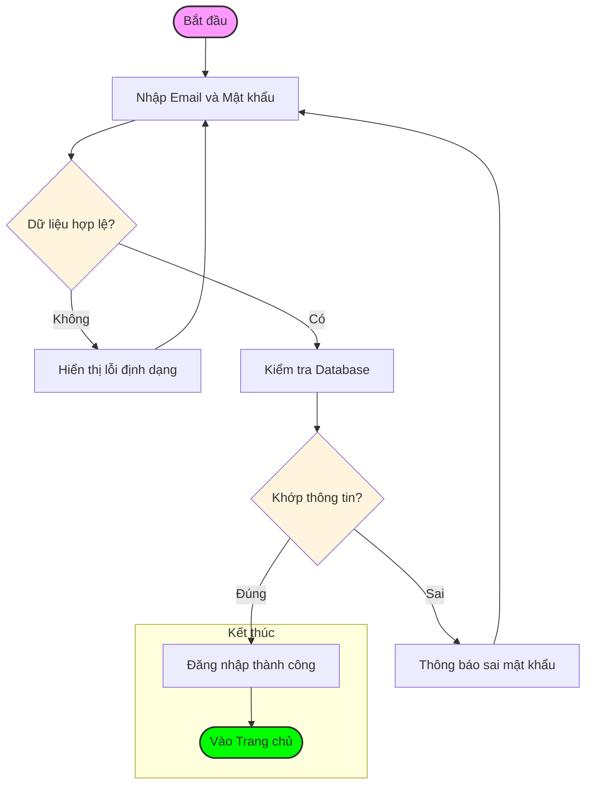
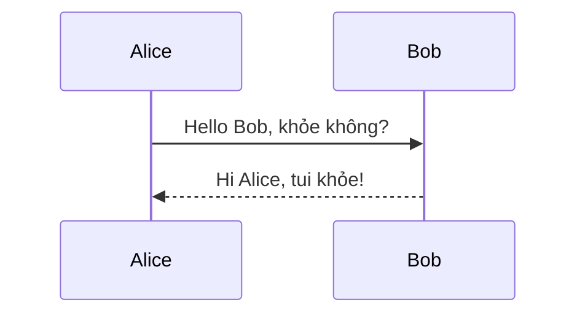
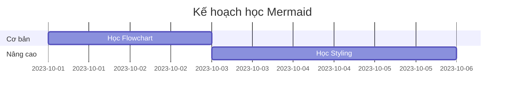

## About Mermaid
**Mermaid lets you create diagrams and visualizations using text and code.**

It is a JavaScript based diagramming and charting tool that renders Markdown-inspired text definitions to create and modify diagrams dynamically.
## Principle

```ascii
Diagram type (Flowcharts, Sequence, Gantt,..) -> Node -> Connect node 
```

## Chart in Mermaid
### 1. Flowcharts
Đây là loại phổ biến nhất. Cấu trúc bắt đầu bằng `graph` hoặc `flowchart` kèm theo hướng đổ của sơ đồ.
**Hướng sơ đồ:**
- `TB` hoặc `TD`: Top to Bottom (Trên xuống dưới).
- `LR`: Left to Right (Trái sang phải).

| Cú pháp       | Kết quả hình dạng               |
| :------------ | :------------------------------ |
| A[Nội dung]   | Hình chữ nhật (mặc định)        |
| B(Nội dung)   | Hình chữ nhật bo góc            |
| C{Nội dung}   | Hình thoi (Quyết định/Decision) |
| D((Nội dung)) | Hình tròn                       |
**Kiểu mũi tên:**
- `-->`: Mũi tên nhọn.
- `---`: Đường thẳng không mũi tên.
- `-- Chữ -->`: Mũi tên có kèm mô tả.
- `==>`: Mũi tên đậm.

```editor
flowchart TD
    %% Định nghĩa các bước
    A([Bắt đầu]) --> B[Nhập Email và Mật khẩu]
    B --> C{Dữ liệu hợp lệ?}

    %% Nhánh sai
    C -- Không --> D[Hiển thị lỗi định dạng]
    D --> B

    %% Nhánh đúng
    C -- Có --> E[Kiểm tra Database]
    E --> F{Khớp thông tin?}

    %% Kết quả kiểm tra DB
    F -- Sai --> G[Thông báo sai mật khẩu]
    G --> B
    F -- Đúng --> H[Đăng nhập thành công]

    %% Gom nhóm một phần quy trình
    subgraph Kết thúc
        H --> I([Vào Trang chủ])
    end

    %% Thêm màu sắc đơn giản
    style A fill:#f9f,stroke:#333,stroke-width:2px
    style I fill:#00ff00,stroke:#333,stroke-width:2px
    style C fill:#fff4dd
    style F fill:#fff4dd
```

**Kết quả**


### 2. Sequence Diagrams 
Dùng để mô tả tương tác giữa các đối tượng theo thời gian.
- **Từ khóa:** `sequenceDiagram`.
- **Thành phần:** `participant` (đối tượng).
- **Kiểu mũi tên:**
    - `->>` : Mũi tên nét liền (gửi tin nhắn).
    - `-->>`: Mũi tên nét đứt (trả lời/reply).

```editor
sequenceDiagram
    Alice->>Bob: Hello Bob, khỏe không?
    Bob-->>Alice: Hi Alice, tui khỏe!
```

**Kết quả**

### 3. Gantt Charts
Dùng trong quản lý dự án.
- **Từ khóa:** `gantt`.
- **Cấu trúc:** Chia theo `section`, sau đó là tên task, trạng thái, và thời gian.
```editor
gantt
    title Kế hoạch học Mermaid
    section Cơ bản
    Học Flowchart :a1, 2023-10-01, 2d
    section Nâng cao
    Học Styling   :after a1, 3d
```
**Kết quả**


### 4. Entity Relationship - ER Diagram (Sơ đồ thực thể)
Dùng để thiết kế Database.
- **Từ khóa:** `erDiagram`.
- **Quan hệ:** * `||--o{` : Một - Nhiều.
    - `|o--o|` : Một - Một (có thể rỗng).