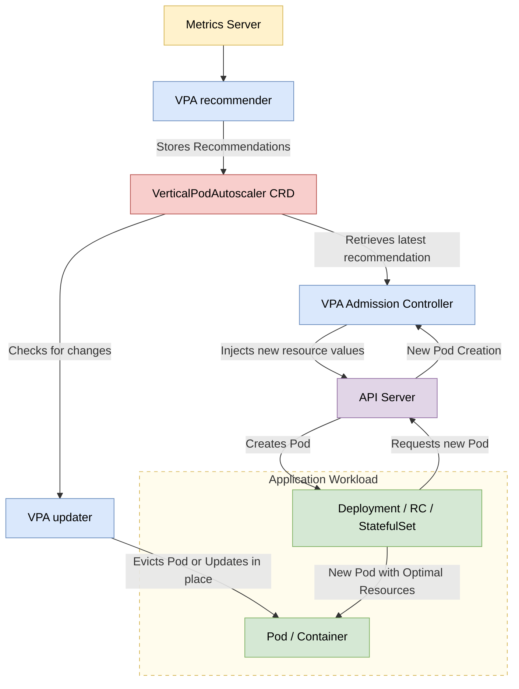

In Kubernetes, a `VerticalPodAutoscaler` automatically updates a workload management resource (such as a **Deployment or StatefulSet**), with the aim of automatically adjusting infrastructure resource requests and limits to match actual usage.

The VPA consists of three main components:
- The _recommender_, which analyzes resource usage and provides recommendations.
- The _updater_, that Pod resource requests either by evicting Pods or modifying them in place.
- And the VPA _admission controller_ web hook, which applies resource recommendations to new or recreated Pods.


## Update Modes - Chọn Cách VPA Hoạt Động

|Mode|Behavior|Use Case|Risk Level|
|---|---|---|---|
|**Off**|Chỉ tính toán, ko apply gì|Testing/monitoring|✅ Zero|
|**Initial**|Chỉ set lúc pod **mới tạo**|StatefulSet, DB pods|⚠️ Low|
|**Recreate**|Evict pod → tạo lại với resource mới|Stateless apps|🔥 Medium|
|**Auto**|Tự động update (chưa stable)|Experimental|💥 High|
**Lưu ý:**

- `Recreate` = downtime (pod bị kill)
- `Initial` = safe nhất cho production
- `Off` = dùng để xem recommendation trước khi apply

## Resource Policies - Kiểm Soát VPA

Giới hạn VPA khỏi đề xuất giá trị quá cao/thấp

```yaml
apiVersion: autoscaling.k8s.io/v1
kind: VerticalPodAutoscaler
metadata:
  name: my-app-vpa
spec:
  targetRef:
    apiVersion: "apps/v1"
    kind: Deployment
    name: my-app
  updatePolicy:
    updateMode: "Recreate"  # Chọn mode ở đây
  resourcePolicy:
    containerPolicies:
    - containerName: '*'  # Apply cho tất cả containers
      minAllowed:
        cpu: 100m
        memory: 128Mi
      maxAllowed:
        cpu: 2
        memory: 2Gi
      controlledResources: ["cpu", "memory"]  # VPA quản gì
      mode: Auto  # Auto/Off cho từng resource
```
### Resource Policy Cheat Sheet

|Field|Ý Nghĩa|Example|
|---|---|---|
|`minAllowed`|Giá trị min VPA được đề xuất|`cpu: 100m`|
|`maxAllowed`|Giá trị max VPA được đề xuất|`memory: 4Gi`|
|`controlledResources`|VPA quản CPU, memory, hay cả 2?|`["cpu"]`|
|`mode`|Auto (VPA control) / Off (ignore)|`Auto`|
|`containerName`|Target container cụ thể hoặc `*`|`nginx`|
## LimitRange - Namespace-Level Constraints
```yaml
apiVersion: v1
kind: LimitRange
metadata:
  name: mem-cpu-limit
  namespace: production
spec:
  limits:
  - max:
      cpu: "4"
      memory: "8Gi"
    min:
      cpu: "50m"
      memory: "64Mi"
    default:           # Nếu pod ko khai báo limit
      cpu: "500m"
      memory: "512Mi"
    defaultRequest:    # Nếu pod ko khai báo request
      cpu: "200m"
      memory: "256Mi"
    type: Container
  - max:               # Pod-level limit (tổng tất cả containers)
      cpu: "8"
      memory: "16Gi"
    type: Pod
```
## LimitRange vs VPA Priority

| Scenario                       | Winner         | Note                             |     |
| ------------------------------ | -------------- | -------------------------------- | --- |
| VPA đề xuất > LimitRange `max` | **LimitRange** | VPA bị cap lại                   |     |
| VPA đề xuất < LimitRange `min` | **LimitRange** | VPA bị raise lên                 |     |
| Không có LimitRange            | **VPA**        | VPA tự do trong `resourcePolicy` |     |

## ⚡ VPA vs HPA - Khi Nào Dùng Gì?

| Metric            | VPA                           | HPA                             |     |
| ----------------- | ----------------------------- | ------------------------------- | --- |
| **Scale gì?**     | Resource (CPU/mem)            | Số lượng pods                   |     |
| **Use case**      | Memory leak, CPU spike        | Traffic surge                   |     |
| **Downtime?**     | ✅ Có (nếu `Recreate`)         | ❌ Không                         |     |
| **Kết hợp được?** | ⚠️ Conflict nếu dùng cùng CPU | ✅ HPA scale pods, VPA scale mem |     |

> [!note]
> **Best practice** 
> - HPA based on custom metrics (RPS, queue length)
> - VPA chỉ quản memory
> - Tránh cả 2 cùng scale CPU

## 🔥 Common Pitfalls
| Issue                | Why                                       | Fix                                          |     |
| -------------------- | ----------------------------------------- | -------------------------------------------- | --- |
| Pod liên tục restart | VPA evict quá thường xuyên                | Dùng `Initial` mode                          |     |
| VPA không apply      | LimitRange chặn                           | Check namespace LimitRange                   |     |
| OOM kill vẫn xảy ra  | VPA chỉ set **request**, ko set **limit** | Set limit manually hoặc dùng `LimitRange`    |     |
| Conflict với HPA     | Cả 2 scale CPU                            | HPA dùng custom metric, VPA chỉ scale memory |     |