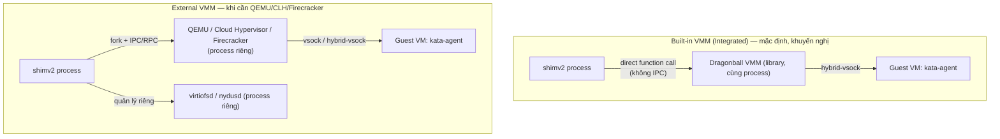

# Kata — Architecture (runtime-rs, Kata 4.0+)
Tier: 2
Parent: [[kata-containers]]
Related: [[kata--hypervisors]], [[kata--configuration]], [[kata--troubleshooting]]
Tags: #kata #architecture #rust

## What it does

`containerd-shim-kata-v2` (implement bằng Rust từ Kata 4.0, gọi tắt `runtime-rs`) là process nhận lệnh từ containerd/CRI-O (qua containerd shim v2 protocol) và chịu trách nhiệm: tạo/huỷ sandbox (VM), tạo/huỷ container bên trong sandbox, quản lý network/storage/cgroup, và forward stdin/stdout/exec tới `kata-agent` chạy trong guest.

## Why it exists

Kiến trúc cũ (Go runtime, "Kata 2.x") dùng model đa tiến trình + IPC giữa runtime và VMM — mỗi container tốn thêm nhiều OS thread (Reaper, Listener, Handler cho ttRPC + 3 I/O thread/container), tốn RAM ở mật độ cao, và có failure mode phức tạp khi 1 trong các process con crash không đồng bộ với process khác ("split-brain"). runtime-rs được viết lại bằng Rust + Tokio (async) để: gộp toàn bộ vào 1 process (khi dùng VMM built-in), giảm site diện tấn công qua bớt IPC, và tận dụng memory-safety của Rust để giảm class lỗi buffer-overflow/use-after-free trong chính runtime.

## How it works (flow/diagram)

**Hai chế độ vận hành VMM** (chọn qua config, không phải build-time):



- **Built-in (Dragonball)**: shim và VMM **là cùng 1 process** → không context-switch, không lỗi đồng bộ giữa 2 lifecycle. Đánh đổi: chỉ hỗ trợ Dragonball (không GPU, không TDX/SEV-SNP tại thời điểm viết).
- **External**: shim `fork()` ra VMM, giao tiếp qua RPC/vsock. Cần khi: cần GPU passthrough (chỉ QEMU hỗ trợ tốt NVIDIA GPU), cần confidential computing (TDX/SEV-SNP — chỉ QEMU), hoặc cần Firecracker (jailer, minimal attack surface, dùng cho multi-tenant nghiêm ngặt kiểu AWS Lambda gốc).

**Layered architecture nội bộ** (theo docs chính thức `architecture_4.0/architecture.md`):

```
Layer 1 — Service & Orchestration: Task Service / Image Service / Message Dispatcher
Layer 2 — Management & Handler: Sandbox Manager, Container Manager,
          Container Abstractions (LinuxContainer / VirtContainer[default] / WasmContainer[experimental])
Layer 3 — Infrastructure Abstraction: Hypervisor Interface (Qemu/CLH/Firecracker/Dragonball)
          + Resource Manager (Sharedfs/Network/Rootfs/Volume/Cgroup)
Layer 4 — Built-in Dragonball VMM (chỉ có khi dùng built-in mode)
```

Điểm quan trọng để hiểu debug sau này: **Message Dispatcher** là nơi mọi request containerd đi qua trước khi tới đúng Sandbox/Container Manager — nếu shim "treo" mà không log gì, nghi ngờ đầu tiên là dispatcher hoặc kênh vsock, không phải bản thân container.

**Async I/O model**: sync runtime (Go) tốn `4 + 12*M` OS thread (M = số container); async runtime (Rust/Tokio) chỉ tốn `2 + N` (N = số worker thread cấu hình, không phụ thuộc M). Đây là lý do chính runtime-rs khuyến nghị cho mật độ pod cao trên 1 node.

## Config gotchas

- Chọn built-in vs external không phải bằng flag riêng mà bằng việc bạn trỏ `RuntimeClass` tới config nào (`configuration-dragonball.toml` = built-in; `configuration-qemu-runtime-rs.toml`, `configuration-clh-runtime-rs.toml`, `configuration-rs-fc.toml` = external).
- `runtime-rs` dùng cơ chế chọn component qua `[runtime] name / hypervisor_name / agent_name` trong **cùng 1 file config** — khác hẳn Go runtime (chọn hypervisor ngầm định qua việc có bảng `[hypervisor.<name>]` nào tồn tại). Đừng áp dụng thói quen sửa config kiểu Go runtime sang runtime-rs.
- `keep_abnormal = true` (`[runtime]`, runtime-rs only) hữu ích khi debug: giữ nguyên sandbox khi health-check fail thay vì tự cleanup — bật tạm khi cần soi lỗi race condition khó tái hiện, nhớ tắt lại sau vì sẽ để rác sandbox chết trên node.

## Security notes

- FAQ chính thức của dự án khẳng định: gộp shim+VMM vào 1 process (built-in mode) **không làm giảm ranh giới bảo mật** — ranh giới vẫn là hypervisor/hardware virtualization, việc gộp chỉ giảm attack surface do bớt IPC phức tạp, không đổi mô hình threat.
- `WasmContainer`/`LinuxContainer` handler được ghi rõ là **experimental** — không nên dùng cho production tại thời điểm viết (chỉ `VirtContainer`/VM-based là production-ready).

## Refs

- Kiến trúc đầy đủ (mermaid diagram gốc, FAQ upcall/ACPI): https://github.com/kata-containers/kata-containers/blob/main/docs/design/architecture_4.0/architecture.md
- `runtime-rs` README (crate layout, cách build): https://github.com/kata-containers/kata-containers/blob/main/src/runtime-rs/README.md
