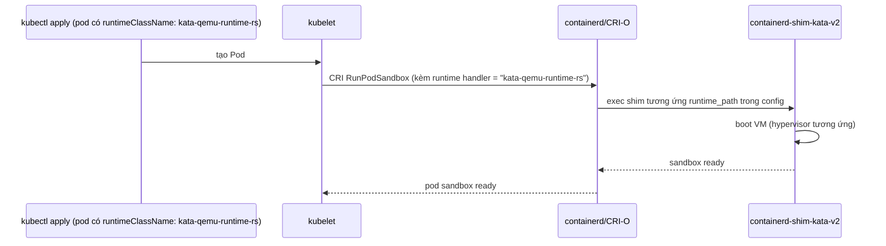

# Kata — Kubernetes Integration (RuntimeClass, kata-deploy)
Tier: 2
Parent: [[kata-containers]]
Related: [[kata--configuration]], [[kata--security-policy]], [[kata--troubleshooting]]
Tags: #kata #kubernetes #runtimeclass #helm

## What it does

Cách Kata "gắn" vào 1 cụm Kubernetes: cài binary + config lên từng node, khai báo `RuntimeClass` để pod có thể opt-in dùng Kata thay vì `runc` mặc định.

## Why it exists

Kubernetes cần 1 cách để chạy **nhiều runtime khác nhau song song trên cùng cluster/node** — không phải pod nào cũng cần cách ly VM (overhead), nên `RuntimeClass` (K8s ≥ v1.12, hết alpha từ v1.14, CRI v1 + RuntimeClass GA từ v1.22) cho phép chọn runtime **per-pod** qua `spec.runtimeClassName`, không cần đổi runtime mặc định toàn cluster.

## How it works (flow/diagram)

**Cài đặt khuyến nghị: `kata-deploy` Helm chart** — tự động: đẩy binary + config lên node, sửa containerd/CRI-O config để đăng ký shim, tạo các object `RuntimeClass` tương ứng (1 RuntimeClass / 1 shim đã enable).

**2 deployment mode khi cài (kata-deploy Helm chart)**:
- `daemonset` (legacy): 1 DaemonSet **chạy liên tục, privileged**, cài Kata lên mọi node match, tự revert khi bị xoá.
- `job` (mặc định hiện tại): **không có component nào chạy liên tục**. 1 Job dispatcher (không privileged, không cần API token trên node) tạo Job cài đặt riêng cho từng node (init container pipeline: `host-check → artifacts → cri`), Job tự thoát sau khi cài xong. Khi `helm uninstall`, chạy pipeline ngược lại (`revert-cri → remove-artifacts`).
  - Điểm bảo mật quan trọng: ở mode `job`, **Job cài đặt trên node không mount ServiceAccount token nào** (`automountServiceAccountToken: false`) — dù chạy privileged trên host, nếu bị compromise cũng không đọc được credential API server. Toàn bộ việc gọi API server dồn về dispatcher (chạy unprivileged, `runAsNonRoot`, drop toàn bộ capability, read-only rootfs).
  - `deploymentMode` **immutable trong vòng đời 1 Helm release** — muốn đổi từ `daemonset` sang `job` phải `helm uninstall` rồi cài lại, không thể `helm upgrade` đổi giữa chừng.

## Config gotchas

- Prerequisite containerd: khuyến nghị **≥ v2.1.x**; containerd v1 có thể chạy được nhưng **một số tính năng Kata sẽ không hoạt động đúng** vì thiếu drop-in config merging (`/etc/containerd/config.d/`) chỉ có từ containerd v2.
- Kubernetes tối thiểu khuyến nghị: **v1.22** (bản đầu tiên CRI v1 + RuntimeClass hết alpha).
- `defaultShim` (giá trị mặc định khi tạo RuntimeClass "default" tự động) từ Kata 4.0 trỏ tới `qemu-runtime-rs` trên mọi kiến trúc có build runtime-rs (x86_64, aarch64, s390x, ppc64le) — nếu bạn cần Go runtime, phải **chọn tường minh** RuntimeClass `kata-qemu` (không phải mặc định nữa).
- Muốn debug shim: có thể tạo hẳn 1 RuntimeClass riêng trỏ tới script `containerd-shim-katadbg-v2` (wrapper chạy shim qua `dlv` debugger) — tách biệt hoàn toàn với RuntimeClass production, không ảnh hưởng pod khác.
- Test nhanh không qua K8s: dùng `crictl` trực tiếp (`crictl runp -r kata sandbox.json`) — hữu ích khi nghi ngờ lỗi nằm ở tầng kubelet/K8s API chứ không phải bản thân Kata. **Lưu ý: `crictl` chỉ dùng để debug, không chạy production workload qua nó.**

## Security notes

- `privileged_without_host_devices = true` phải được set trong runtime config của containerd/CRI-O cho **mỗi runtime class Kata** — `kata-deploy` tự làm việc này; nếu tự viết containerd config tay (không qua kata-deploy) rất dễ quên field này.
- RBAC của `kata-deploy` (mode `job`): dispatcher có quyền `nodes: list/get/patch`, `pods: get`, `cronjobs: get/delete` (chỉ khi bật `job.reconcile`); post-delete hook có quyền xoá ClusterRole/ClusterRoleBinding/Role/RoleBinding/ServiceAccount — cần biết để audit đúng khi security review cluster.

## Refs

- https://github.com/kata-containers/kata-containers/blob/main/docs/how-to/how-to-use-k8s-with-containerd-and-kata.md
- https://github.com/kata-containers/kata-containers/blob/main/docs/how-to/how-to-use-k8s-with-crio-and-kata.md
- https://github.com/kata-containers/kata-containers/blob/main/docs/helm-configuration.md (deployment modes, node selector, RBAC chi tiết)
- https://github.com/kata-containers/kata-containers/blob/main/docs/how-to/run-kata-with-crictl.md
- https://kubernetes.io/docs/concepts/containers/runtime-class/
