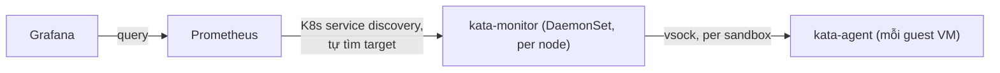

# Kata — Monitoring (kata-monitor, Prometheus, Grafana)
Tier: 2
Parent: [[kata-containers]]
Related: [[kata--troubleshooting]], [[kata--k8s-integration]]
Tags: #kata #monitoring #prometheus #grafana

## What it does

`kata-monitor` là daemon riêng (đóng gói image container, publish cùng mỗi release Kata) chạy song song trên node, expose metric của `kata-agent`/sandbox theo format Prometheus.

## Why it exists

Metric container thông thường (cAdvisor/kubelet) không thấy được bên trong guest VM của Kata (khác PID/network namespace hoàn toàn) — cần 1 daemon riêng biết cách nói chuyện qua vsock với từng sandbox để lấy metric mức guest/agent.

## How it works (flow/diagram)



Triển khai mẫu (chính thức, chỉ để **evaluation**, không production nguyên bản):
```bash
kubectl apply -f https://raw.githubusercontent.com/kata-containers/kata-containers/main/docs/how-to/data/prometheus.yml
kubectl apply -f https://raw.githubusercontent.com/kata-containers/kata-containers/main/docs/how-to/data/kata-monitor-daemonset.yml
kubectl apply -f https://raw.githubusercontent.com/kata-containers/kata-containers/main/docs/how-to/data/grafana.yml
```
- `kata-monitor` DaemonSet chạy trong namespace `kata-system`.
- Prometheus dùng Kubernetes service discovery — tự tìm `kata-monitor` làm target, không cần khai báo tay endpoint (xem `http://<hostIP>:30909/service-discovery` → mục `kubernetes-pods`).
- Grafana (namespace `prometheus`, NodePort `30000`) — dashboard mẫu import qua `data/dashboard.json`.

## Config gotchas

- Manifest mẫu chạy `kata-monitor` **qua plain HTTP không TLS** mặc định — phải tự bật TLS theo comment trong manifest + tự tạo Secret `kata-monitor-certs` nếu triển khai thật.
- 2 image khác nhau, dễ nhầm khi lên production:
  - `quay.io/kata-containers/kata-monitor:<version>` (mirror `ghcr.io`) — image **release chính thức**, nên pin version cụ thể khớp với version Kata đang chạy trên node (ví dụ `3.32.0`).
  - `quay.io/kata-containers/kata-monitor-ci:latest` — build từ mọi commit lên `main`, **chỉ để test**, không dùng production.
  - Manifest mẫu mặc định dùng tag `:latest` của image release — **phải tự pin version** trước khi áp dụng cho production, tránh bị auto-update ngoài ý muốn khi image `latest` đổi.
- `kata-monitor` là image riêng biệt (không bundle sẵn trong `kata-static` tarball) — được publish chính thức bắt đầu từ Kata 3.32.0; nếu node đang chạy version cũ hơn, không có image `kata-monitor` tương ứng để pin đúng version.

## Security notes

- NodePort mặc định (`30909` Prometheus, `30000` Grafana) mở trực tiếp trên mọi node — chỉ phù hợp môi trường test/lab; production nên đổi sang `ClusterIP` + Ingress/LoadBalancer có auth, theo đúng gợi ý trong chính tài liệu Kata.
- Grafana mẫu dùng credential mặc định `admin/admin` (Grafana 7.0.5 tại thời điểm viết docs gốc) — **bắt buộc đổi** trước khi expose ra ngoài mạng nội bộ tin cậy.

## Refs

- https://github.com/kata-containers/kata-containers/blob/main/docs/how-to/how-to-set-prometheus-in-k8s.md
- `kata-monitor` TLS setup: https://github.com/kata-containers/kata-containers/blob/main/src/runtime/cmd/kata-monitor/README.md#tls
