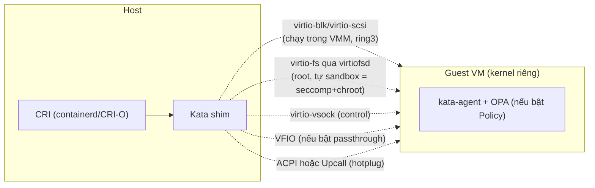
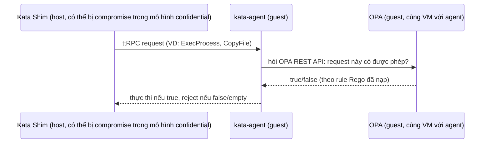

# Kata — Threat Model, Privileged Pods & Agent Policy (OPA)
Tier: 2
Parent: [[kata-containers]]
Related: [[kata--configuration]], [[kata--hypervisors]], [[kata--k8s-integration]]
Tags: #kata #security #threat-model #opa #cks

## What it does

Ba cơ chế bảo mật riêng biệt của Kata cần phân biệt rõ: (1) ranh giới VM/hypervisor (mặc định, luôn có), (2) cấu hình `privileged_without_host_devices` (chặn 1 hành vi nguy hiểm cụ thể của privileged pod), (3) Agent Policy — cơ chế **tuỳ chọn** dùng OPA/Rego để guest tự kiểm tra từng request từ shim.

## Why it exists

Mục tiêu bảo mật chính thức của Kata (trích threat model): **ngăn 1 workload/user độc hại trong container chiếm quyền, đọc thông tin, hoặc can thiệp vào host infrastructure hoặc phần còn lại của cluster**. Traditional container (`runc`) chỉ dựa vào namespace/cgroup/capability/seccomp/SELinux — tất cả đều là cơ chế **trong cùng 1 kernel**, nên 1 kernel exploit là đủ để xuyên qua toàn bộ các lớp đó. Kata thêm 1 ranh giới **khác loại hoàn toàn** (hardware virtualization) ở phía dưới các lớp đó.

## How it works (flow/diagram)

### Ranh giới bảo mật theo từng loại device (từ threat model chính thức)



Rủi ro theo từng loại (tóm tắt threat model chính thức, đầy đủ hơn ở link Refs):
- **KVM/QEMU dùng chung kernel host** giữa mọi VM trên node → 1 lỗ hổng kernel host vẫn có thể ảnh hưởng **toàn bộ VM trên node đó** (Kata không giải quyết được rủi ro "shared host kernel", chỉ nâng độ khó khai thác so với runc thuần).
- **`vhost` (kernel-space backend)** rủi ro cao hơn **`vhost-user`/VMM userspace** vì code chạy trong kernel-space nếu bị exploit.
- **`virtiofsd` chạy as root** theo thiết kế — tự bảo vệ bằng cách chuyển vào 1 mount namespace mới với shared dir làm root (chống path traversal ra ngoài) + seccomp (chặn `ptrace` và các vector khác).
- **VFIO**: rủi ro DMA attack, device isolation failure, firmware vulnerability, escalation of privilege nếu IOMMU group không cô lập đúng.
- **ACPI hotplug**: có thể bị lợi dụng cho VM escape tinh vi hoặc resource-starvation attack (ép VM vào low-power state). Dragonball tránh hoàn toàn cơ chế ACPI, dùng **Upcall** (kênh vsock riêng, driver phía guest kernel + client thread phía VMM) — giảm bề mặt tấn công liên quan ACPI nhưng đổi lại phụ thuộc vào chính Upcall driver.

### Privileged Pods trong Kata — khác hẳn runc

Mặc định OCI/runc: privileged container = pass toàn bộ host device + capability vào container. Trong Kata: **capability nâng cao chỉ có hiệu lực trong guest VM**, hành vi "pass toàn bộ host device" **không được hỗ trợ và phải bị tắt tường minh**:

```toml
# containerd config.toml
[plugins.cri.containerd.runtimes.kata]
  runtime_type = "io.containerd.kata.v2"
  privileged_without_host_devices = true    # BẮT BUỘC cho Kata
```
```toml
# CRI-O
[crio.runtime.runtimes.kata-shim2]
  runtime_path = "/usr/local/bin/containerd-shim-kata-v2"
  runtime_type = "vm"
  privileged_without_host_devices = true    # BẮT BUỘC cho Kata
```
`kata-deploy` tự cấu hình đúng field này — chỉ cần tự nhớ nếu bạn viết containerd/CRI-O config bằng tay (không qua kata-deploy).

### Agent Policy (OPA/Rego) — lớp bảo vệ tuỳ chọn, chủ yếu cho Confidential Containers



Điểm mấu chốt: Policy giúp ích nhiều nhất khi **Shim và Agent có mức độ tin cậy khác nhau** (confidential containers — host/hypervisor operator không được tin tưởng hoàn toàn). Với container **không confidential**, host vẫn có thể sửa Policy hoặc thay hẳn Agent để vô hiệu hoá — nên Policy ở đây chỉ là "defense in depth" (ví dụ chặn 1 số hành vi cơ bản), không phải ranh giới bảo mật cứng.

**Cách cung cấp Policy**: (1) build sẵn vào guest rootfs (`AGENT_POLICY=yes` lúc build, symlink `/etc/kata-opa/default-policy.rego`), hoặc (2) gửi qua annotation `io.katacontainers.config.hypervisor.cc_init_data` (base64+gzip). **Policy mặc định (`allow-all.rego`) cho phép TẤT CẢ request** — nếu không tự build/nạp policy riêng, coi như tính năng này **không hoạt động** dù binary có hỗ trợ.

## Config gotchas

- Agent Policy **phải build vào rootfs** với flag `AGENT_POLICY=yes` — không phải config bật/tắt runtime thông thường. Nếu image guest bạn đang dùng không build với flag này, mọi annotation Policy sẽ vô nghĩa.
- `genpolicy` (tool tự sinh Policy từ YAML K8s) — output **phải review tay** trước khi dùng, và cần set rõ `runAsUser`/`runAsGroup`/`fsGroup` trong pod spec khi dùng cùng nydus guest-pull, nếu không policy tự sinh có thể **reject** container hợp lệ vì UID/GID không khớp kỳ vọng.

## Security notes

- Checklist review nhanh khi audit 1 cluster đã có Kata:
  1. `privileged_without_host_devices = true` có được set cho mọi Kata runtime class không?
  2. `enable_annotations` trong configuration.toml có whitelist đúng, tối thiểu không? Có annotation nào dạng path binary (`path`, `jailer_path`, `virtio_fs_daemon`...) được bật mà thiếu `valid_*_paths` tương ứng không?
  3. Có đang dùng VFIO passthrough không — nếu có, IOMMU group trên host đã cô lập đúng thiết bị chưa?
  4. Nếu là confidential containers (TDX/SEV-SNP) — Agent Policy đã được nạp và review, không dùng default allow-all?
  5. Debug console (`debug_console_enabled`) có đang bật ở production không (nên tắt)?

## Refs

- https://github.com/kata-containers/kata-containers/blob/main/docs/threat-model/threat-model.md (đầy đủ nhất, có threat-model-boundaries.svg)
- https://github.com/kata-containers/kata-containers/blob/main/docs/how-to/privileged.md
- https://github.com/kata-containers/kata-containers/blob/main/docs/how-to/how-to-use-the-kata-agent-policy.md
- https://confidentialcontainers.org/docs/ (dự án xây trên nền Kata, dùng Agent Policy làm nền tảng)
